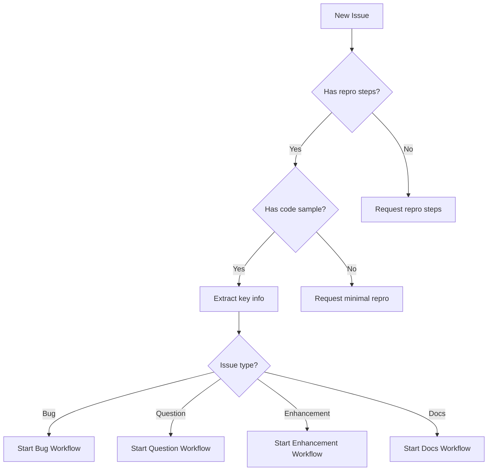

# Copilot Agent Issue Triage & Resolution Plan
## Azure Cosmos DB .NET SDK (azure-cosmos-dotnet-v3)

---

## Quick Start Prompt

**Copy-paste this prompt to start the Copilot agent workflow:**

```
Follow the Copilot Agent Issue Triage Plan in .github/copilot-agent-plan.md

Guide step-by-step on any required setups and then investigate issues 
with label "customer-reported".

gh issue list --repo Azure/azure-cosmos-dotnet-v3 --label "customer-reported" --state open --limit 5
```

**For a specific issue:**
```
Follow the Copilot Agent Issue Triage Plan in .github/copilot-agent-plan.md

Guide step-by-step on any required setups and then investigate issue #XXXX.
```

**What the agent will do:**
1. Verify environment setup (gh CLI, .NET SDK, emulator)
2. Fix any setup issues (SAML auth, missing tools)
3. Fetch and triage the issue(s)
4. Investigate root cause
5. Implement fix with tests
6. Run Copilot code-review
7. Create PR and monitor CI
8. Mark ready when CI passes
9. **Capture learnings** → update agent plan with reusable patterns

---

## 0. Environment Setup (MCP Servers)

**Before using this plan, ensure the following MCP servers are configured.**

### 0.1 Required MCP Servers & API Access

| Tool | Purpose | Required | Setup |
|------|---------|----------|-------|
| **GitHub MCP Server** | Issues, PRs, code search, actions | ✅ Yes | Section 0.2 |
| **Azure DevOps PAT** | CI builds, logs, pipeline status | ✅ Yes | Section 0.3.1 |
| **Azure DevOps MCP** | Alternative to PAT (retry jobs) | Optional | Section 0.3.2 |
| **Cosmos LiveSite MCP** | LiveSite diagnostics, account info | Optional | Section 0.1.1 |
| **Bluebird Engineering Copilot** | Code graph, semantic search | Optional | Section 0.4 |

### 0.1.1 Cosmos LiveSite MCP Server

**Purpose:** Access Cosmos DB LiveSite diagnostics for investigating customer issues.

**Prerequisites:**
1. Clone the CosmosDBLivesite repo
2. Set up Python virtual environment
3. Azure CLI login (`az login`)

**Setup Instructions:**
```powershell
# 1. Clone the repo (if not already)
cd e:\src
git clone <CosmosDBLivesite-repo-url> CosmosDBLivesite

# 2. Create Python virtual environment
cd e:\src\CosmosDBLivesite\Livesite
python -m venv .venv
.\.venv\Scripts\activate
pip install -r requirements.txt

# 3. Azure login (required for Kusto access)
az login
# Select appropriate subscription (e.g., CosmosDB-SDK-Dev)
```

**MCP Config** (add to `~/.copilot/mcp-config.json`):
```json
{
  "cosmos-livesite": {
    "type": "stdio",
    "command": "e:\\src\\CosmosDBLivesite\\Livesite\\.venv\\Scripts\\python.exe",
    "args": [
      "-m",
      "src.mcp_server.server"
    ],
    "tools": ["*"],
    "env": {
      "MCP_ENV": "dev",
      "LIVESITE_TENANT": "cosmosdb",
      "PYTHONPATH": "e:\\src\\CosmosDBLivesite\\Livesite"
    }
  }
}
```

```yaml
cosmos_livesite_mcp:
  capabilities:
    - "Account diagnostics"
    - "NSP (Network Security Perimeter) status"
    - "Regional endpoint information"
    - "Service-side configuration"
    - "Run Kusto queries against Support database"
    
  use_cases:
    - "Investigate connectivity issues"
    - "Check if account has NSP enabled"
    - "Verify regional endpoint configuration"
    - "Customer-reported service issues"
    
  when_to_use:
    - "Issue involves network/connectivity problems"
    - "Need to verify account configuration"
    - "Debugging 'eastusstg' or similar endpoint issues"
    
  requires:
    - "az login (Azure CLI authentication)"
    - "Python 3.x with virtual environment"
```

### 0.2 GitHub MCP Server

### 0.2 GitHub Access (SAML-Protected Repos)

**⚠️ IMPORTANT: Azure org repos require SAML SSO - GitHub MCP Server is BLOCKED.**

```yaml
github_access:
  saml_protected_orgs:
    - "Azure"
    - "microsoft"
    note: "MCP server tokens don't have SAML authorization"
    
  what_works:
    gh_cli:
      status: "✅ WORKS"
      reason: "Browser OAuth completes SAML SSO"
      auth: "gh auth login --web"
      use_for:
        - "Create/list/view issues"
        - "Create/list/view PRs"
        - "Check PR status"
        - "All GitHub operations"
      examples:
        - "gh issue list --repo Azure/azure-cosmos-dotnet-v3"
        - "gh pr create --draft --title '...'"
        - "gh pr checks 5583"
        
    web_fetch:
      status: "✅ WORKS (fallback)"
      reason: "Scrapes public web pages"
      use_for: "Reading issue/PR content when gh fails"
      example: "web_fetch https://github.com/Azure/azure-cosmos-dotnet-v3/issues/5547"
      
  what_does_not_work:
    github_mcp_server:
      status: "❌ BLOCKED by SAML"
      error: "Resource protected by organization SAML enforcement"
      reason: "MCP OAuth token not SAML-authorized"
      tools_affected:
        - "github-mcp-server-list_issues"
        - "github-mcp-server-issue_read"
        - "github-mcp-server-pull_request_read"
        - "All github-mcp-server-* tools for Azure org"
        
  recommended_approach:
    primary: "Use gh CLI for all GitHub operations"
    fallback: "Use web_fetch to scrape issue content"
    avoid: "Don't rely on GitHub MCP Server for Azure org repos"
```

**Azure CLI Installation & Setup:**

```powershell
# 1. Install Azure CLI (Windows)
winget install Microsoft.AzureCLI --accept-source-agreements --accept-package-agreements

# Alternative installers:
# - macOS: brew install azure-cli
# - Linux: curl -sL https://aka.ms/InstallAzureCLIDeb | sudo bash

# 2. Authenticate (opens browser)
az login

# 3. Select subscription when prompted
# For Cosmos DB SDK work, select: CosmosDB-SDK-Dev

# 4. Verify authentication
az account show --query "{name:name, id:id}" -o table

# 5. Set specific subscription if needed
az account set --subscription "CosmosDB-SDK-Dev"
```

```yaml
azure_cli_usage:
  kusto_queries:
    description: "Run Kusto queries against Support database"
    example: |
      az kusto query --cluster "https://cdbsupport.kusto.windows.net" \
        --database "Support" \
        --query "MgmtGlobalDatabaseAccountTrace | where GlobalDatabaseAccount contains 'account-name' | take 10"
        
  cosmos_account_info:
    description: "Get Cosmos DB account information"
    example: |
      az cosmosdb show --name <account-name> --resource-group <rg-name>
      
  recommended_subscriptions:
    - "CosmosDB-SDK-Dev" # For SDK development
    - "Cosmos DB Backend Testing" # For backend testing
```

**gh CLI Installation & Setup:**

```powershell
# 1. Install gh CLI (Windows)
winget install --id GitHub.cli

# Alternative installers:
# - macOS: brew install gh
# - Linux: https://github.com/cli/cli/blob/trunk/docs/install_linux.md

# 2. Authenticate (opens browser for SAML SSO)
gh auth login --web

# 3. Select options when prompted:
#    - GitHub.com (not Enterprise)
#    - HTTPS
#    - Authenticate with browser

# 4. Complete SAML SSO in browser
#    - Login to GitHub
#    - Authorize for Azure org (SAML)

# 5. Verify authentication
gh auth status
# Expected: ✓ Logged in to github.com account {username}

# 6. Test access to Azure org (with auto-fix)
gh issue list --repo Azure/azure-cosmos-dotnet-v3 --limit 1
# If SAML error occurs, run steps 7-8

# 7. Force logout (if SAML error)
gh auth logout

# 8. Re-login with SAML authorization
gh auth login --web
# → Complete browser auth AND authorize Azure org

# 9. Verify fixed
gh issue list --repo Azure/azure-cosmos-dotnet-v3 --limit 1
```

**Auto-Fix Script (Copy-Paste):**
```powershell
# Test and auto-fix SAML issues
$result = gh issue list --repo Azure/azure-cosmos-dotnet-v3 --limit 1 2>&1
if ($result -match "SAML") {
    Write-Host "SAML error detected. Re-authenticating..."
    gh auth logout
    gh auth login --web
    Write-Host "Please authorize Azure org in browser, then press Enter..."
    Read-Host
    gh issue list --repo Azure/azure-cosmos-dotnet-v3 --limit 1
} else {
    Write-Host "✅ gh CLI working: $result"
}
```

**Required Scopes:**
```yaml
gh_token_scopes:
  required:
    - "repo"      # Full repository access
    - "read:org"  # Read org membership (for SAML)
  optional:
    - "workflow"  # GitHub Actions
    - "gist"      # Gists
```

**Troubleshooting SAML Errors:**

```yaml
saml_troubleshooting:
  error: "Resource protected by organization SAML enforcement"
  cause: "Token not authorized for Azure org via SAML SSO"
  
  fix_steps:
    step_1:
      description: "Logout and re-authenticate with SAML"
      commands: |
        gh auth logout
        gh auth login --web
        
    step_2:
      description: "During browser auth, authorize for Azure org"
      note: "After GitHub login, you'll see 'Authorize for: Azure' - click it"
      
    step_3:
      description: "If no SAML prompt appears, manually authorize"
      url: "https://github.com/settings/tokens"
      steps:
        - "Go to https://github.com/settings/tokens"
        - "Find the 'gh' token (or GitHub CLI)"
        - "Click 'Configure SSO' dropdown"
        - "Click 'Authorize' next to 'Azure' org"
        - "Complete SAML login"
        
    step_4:
      description: "Verify authorization"
      command: "gh issue list --repo Azure/azure-cosmos-dotnet-v3 --limit 1"
      
  alternative_manual_sso:
    url: "https://github.com/orgs/Azure/sso"
    steps:
      - "Visit https://github.com/orgs/Azure/sso"
      - "Complete SAML authentication"
      - "Return and retry gh command"
```

**Quick Fix (Copy-Paste):**
```powershell
# Re-authenticate with SAML
gh auth logout
gh auth login --web
# → Complete browser auth AND click "Authorize" for Azure org

# OR manually authorize existing token:
# 1. Go to: https://github.com/settings/tokens
# 2. Find GitHub CLI token → Configure SSO → Authorize Azure
```

**Quick Reference:**
```powershell
# ✅ This works (gh CLI)
gh issue view 5547 --repo Azure/azure-cosmos-dotnet-v3
gh pr create --draft --title "Fix: ..."
gh pr checks 5583

# ❌ This fails (MCP Server)
# github-mcp-server-list_issues → SAML error
```

### 0.3 Azure DevOps Access (PAT or MCP)

**Required for CI build logs, retry failed jobs, pipeline management.**

#### 0.3.1 Option 1: Personal Access Token (PAT) - Recommended

**Simplest setup - works immediately without additional tools.**

```yaml
azure_devops_pat:
  purpose: "Direct REST API access to Azure DevOps"
  advantage: "No MCP server needed, works with PowerShell/curl"
  
  setup:
    step_1: "Create PAT at https://dev.azure.com/{org}/_usersSettings/tokens"
    step_2: "Select scope: Build (Read) - minimum required"
    step_3: "Store PAT securely (environment variable, never in code)"
    
  environment_variable:
    name: "ADO_PAT"
    set_windows: '$env:ADO_PAT = "your-pat-here"'
    set_unix: 'export ADO_PAT="your-pat-here"'
    
  organization: "cosmos-db-sdk-public"
  project: "cosmos-db-sdk-public"
  api_base: "https://dev.azure.com/cosmos-db-sdk-public/cosmos-db-sdk-public/_apis"
```

**Verify PAT Setup:**

```powershell
# Test PAT is working
$headers = @{ Authorization = "Basic " + [Convert]::ToBase64String([Text.Encoding]::ASCII.GetBytes(":$env:ADO_PAT")) }
Invoke-RestMethod -Uri "https://dev.azure.com/cosmos-db-sdk-public/cosmos-db-sdk-public/_apis/build/builds?api-version=7.0&`$top=1" -Headers $headers

# Expected: JSON response with build info (not HTML or 401 error)
```

**Common API Calls:**

```powershell
$headers = @{ Authorization = "Basic " + [Convert]::ToBase64String([Text.Encoding]::ASCII.GetBytes(":$env:ADO_PAT")) }
$org = "cosmos-db-sdk-public"
$project = "cosmos-db-sdk-public"

# Get build status
$buildId = 59172  # From PR checks URL
$build = Invoke-RestMethod -Uri "https://dev.azure.com/$org/$project/_apis/build/builds/$buildId?api-version=7.0" -Headers $headers
$build.status  # "completed", "inProgress", etc.
$build.result  # "succeeded", "failed", etc.

# Get build timeline (all stages/jobs with status)
$timeline = Invoke-RestMethod -Uri "https://dev.azure.com/$org/$project/_apis/build/builds/$buildId/timeline?api-version=7.0" -Headers $headers

# Find failed tasks
$failed = $timeline.records | Where-Object { $_.result -eq "failed" }
$failed | Select-Object name, result, @{N='logId';E={$_.log.id}}

# Get log content for failed task
$logId = $failed[0].log.id
$log = Invoke-RestMethod -Uri "https://dev.azure.com/$org/$project/_apis/build/builds/$buildId/logs/$logId?api-version=7.0" -Headers $headers
$log | Select-String -Pattern "error|fail|assert" -Context 2,2
```

#### 0.3.2 Option 2: Azure DevOps MCP Server

**Alternative if MCP infrastructure is preferred.**

```yaml
azure_devops_mcp_server:
  package: "@azure-devops/mcp"
  publisher: "Microsoft"
  repository: "https://github.com/microsoft/azure-devops-mcp"
  docs: "https://learn.microsoft.com/en-us/azure/devops/mcp-server/mcp-server-overview"
  
  capabilities:
    pipelines:
      - mcp_ado_pipelines_get_builds          # List builds
      - mcp_ado_pipelines_get_build_status    # Get build status
      - mcp_ado_pipelines_get_build_log       # Get build logs
      - mcp_ado_pipelines_run_pipeline        # Start new pipeline run
      - mcp_ado_pipelines_update_build_stage  # ⭐ RETRY FAILED JOBS
    work_items:
      - mcp_ado_wit_get_work_item
      - mcp_ado_wit_create_work_item
      - mcp_ado_wit_my_work_items
    repositories:
      - mcp_ado_repo_list_pull_requests_by_repo_or_project
      - mcp_ado_repo_get_pull_request_by_id
```

**Installation:**

```bash
# Option 1: VS Code One-Click Install
# Visit: https://insiders.vscode.dev/redirect/mcp/install?name=ado&config=...

# Option 2: Manual Setup
# Create .vscode/mcp.json in your project:
```

```json
{
  "inputs": [
    {
      "id": "ado_org",
      "type": "promptString",
      "description": "Azure DevOps organization name (e.g. 'cosmos-db-sdk-public')"
    }
  ],
  "servers": {
    "ado": {
      "type": "stdio",
      "command": "npx",
      "args": ["-y", "@azure-devops/mcp", "${input:ado_org}"]
    }
  }
}
```

**Authentication:**
- First use will open browser for Microsoft account login
- Requires Azure DevOps organization access

**Key Tool: Retry Failed Jobs**
```yaml
mcp_ado_pipelines_update_build_stage:
  purpose: "Retry failed stages without re-running entire build"
  parameters:
    project: "cosmos-db-sdk-public"
    buildId: 59156
    stageRefName: "Preview_Tests_Release"  # Stage reference name
    state: "retry"  # Options: retry, cancel
  
  advantage: "Faster than requeuing entire build"
```

### 0.4 Bluebird Engineering Copilot (Optional)

**For advanced code graph and semantic search.**

```yaml
bluebird_engineering_copilot:
  capabilities:
    - do_vector_search: "Semantic code search"
    - do_fulltext_search: "Keyword code search"
    - get_source_code: "Retrieve source files"
    - get_hierarchical_summary: "Code overview"
    - get_callers, get_callees: "Call graph analysis"
    
  usage:
    step_1: "Call engineering_copilot for instructions"
    step_2: "Call dynamic_tool_invoker with specific tool"
    
  note: "Useful for deep code analysis, may timeout on large queries"
```

### 0.5 Quick Setup Script (Windows PowerShell)

```powershell
# 1. Install GitHub CLI
winget install --id GitHub.cli

# 2. Authenticate GitHub CLI
gh auth login --web

# 3. Install Node.js (for Azure DevOps MCP)
winget install --id OpenJS.NodeJS

# 4. Test Azure DevOps MCP (first run opens browser for auth)
npx @azure-devops/mcp cosmos-db-sdk-public --help
```

### 0.6 Verification Checklist

```markdown
## Environment Setup Verification

### GitHub MCP Server
- [ ] `gh auth status` shows logged in
- [ ] Can fetch issues: `gh issue list --repo Azure/azure-cosmos-dotnet-v3`

### Azure DevOps MCP Server
- [ ] Node.js 18+ installed: `node --version`
- [ ] MCP server responds: `npx @azure-devops/mcp cosmos-db-sdk-public --help`
- [ ] Browser auth completed (first MCP tool call opens login)

### Local Tools
- [ ] .NET SDK installed: `dotnet --version`
- [ ] Git configured: `git config user.name`
- [ ] Repository cloned: `E:\src\v33` or similar

### Cosmos DB Emulator
- [ ] Emulator installed: Check "Azure Cosmos DB Emulator" in Start menu
- [ ] Emulator running: `https://localhost:8081/_explorer/index.html` accessible
```

### 0.7 New Machine Quick Start

**To test these instructions on a new machine with a new issue:**

```yaml
new_machine_setup:
  time_estimate: "15-20 minutes"
  
  step_1_prerequisites:
    commands: |
      # Install required tools (Windows)
      winget install Microsoft.DotNet.SDK.8
      winget install Git.Git
      winget install GitHub.cli
      winget install OpenJS.NodeJS
      winget install Microsoft.Azure.CosmosEmulator
      
  step_2_clone_repo:
    commands: |
      # Clone repository
      git clone https://github.com/Azure/azure-cosmos-dotnet-v3.git
      cd azure-cosmos-dotnet-v3
      
      # Build to verify setup
      dotnet build Microsoft.Azure.Cosmos.sln -c Release
      
  step_3_authenticate:
    commands: |
      # GitHub CLI
      gh auth login --web
      
      # Verify
      gh auth status
      
  step_4_start_emulator:
    commands: |
      # Start Cosmos DB Emulator
      Start-Process "C:\Program Files\Azure Cosmos DB Emulator\CosmosDB.Emulator.exe"
      
      # Wait 30 seconds, then verify
      Start-Sleep -Seconds 30
      Invoke-WebRequest -Uri "https://localhost:8081/" -UseBasicParsing
      
  step_5_test_with_issue:
    description: "Give Copilot an issue to work on"
    example_prompt: |
      "Investigate and fix issue #XXXX following the plan in 
       .github/copilot-agent-plan.md"
```

**Test Workflow with a Real Issue:**

```yaml
testing_the_plan:
  step_1_select_issue:
    options:
      - "Pick an open bug from: gh issue list --label bug --state open"
      - "Use a known test issue (if available)"
      - "Create a test issue with a known problem"
      
  step_2_invoke_copilot:
    prompt_template: |
      Follow the Copilot Agent Issue Triage Plan in .github/copilot-agent-plan.md
      
      Investigate issue #{issue_number}: {issue_title}
      
      Steps:
      1. Fetch and analyze the issue
      2. Search codebase for related code
      3. Identify root cause
      4. Create reproduction test
      5. Implement fix
      6. Run local tests (unit + emulator)
      7. Create draft PR
      8. Monitor CI until GREEN
      
  step_3_verify_workflow:
    checklist:
      - "[ ] Issue fetched successfully (or via web_fetch fallback)"
      - "[ ] Root cause identified"
      - "[ ] Local tests pass"
      - "[ ] PR created with correct format"
      - "[ ] CI monitoring initiated"
      
  step_4_validate_results:
    success_criteria:
      - "PR created following naming convention"
      - "PR title matches lint format"
      - "Local emulator tests pass"
      - "CI gates monitored"
```

**Minimal Test (5 minutes):**

```powershell
# Quick verification that setup works
# Run from repository root

# 1. Verify build
dotnet build Microsoft.Azure.Cosmos.sln -c Release

# 2. Run unit tests (no emulator needed, no external dependencies)
dotnet test .\Microsoft.Azure.Cosmos\tests\Microsoft.Azure.Cosmos.Tests -c Release --no-restore

# 3. Verify GitHub CLI
gh issue list --repo Azure/azure-cosmos-dotnet-v3 --limit 5

# 4. Verify git
git status

# If all pass, environment is ready for Copilot agent workflow
Write-Host "✅ Environment ready!"
```

**Troubleshooting Common Issues:**

```yaml
troubleshooting:
  build_fails:
    symptom: "dotnet build fails"
    causes:
      - "Missing .NET SDK": "winget install Microsoft.DotNet.SDK.8"
      - "Wrong SDK version": "Check global.json for required version"
      - "Missing workloads": "dotnet workload restore"
      
  gh_auth_fails:
    symptom: "gh: not authenticated"
    fix: "gh auth login --web"
    
  emulator_not_starting:
    symptom: "Connection refused on localhost:8081"
    causes:
      - "Emulator not installed": "winget install Microsoft.Azure.CosmosEmulator"
      - "Port conflict": "Check if another process uses 8081"
      - "Needs admin": "Run emulator as administrator"
      
  github_api_403:
    symptom: "SAML authentication required"
    fix: "Use web_fetch to scrape issue page directly (see Section 3 Phase 0)"
    
  azure_devops_auth:
    symptom: "MCP server auth fails"
    fix: "First MCP call opens browser - complete Microsoft login"
```

---

## 1. Executive Summary

This plan defines a comprehensive workflow for Copilot agents to handle GitHub issues for the Azure Cosmos DB .NET SDK repository. The agent will:
- Triage all issue types (bugs, features, questions, documentation)
- Reproduce issues against the Cosmos DB emulator (when applicable)
- Leverage Bluebird code graph tools for deep code analysis
- Create linked investigation issues with structured findings
- Auto-assign to human reviewers based on labels/area
- Propose workarounds and draft PRs when appropriate

---

## 1.0 Core Principles: No Shortcuts, Evidence Required

> ⚠️ **CRITICAL: These principles are non-negotiable and apply to ALL steps in this plan.**

### 1.0.1 No Shortcuts Policy

```yaml
no_shortcuts_policy:
  principle: "Every step in the workflow MUST be executed explicitly"
  
  rules:
    - "Do NOT skip steps even if outcome seems obvious"
    - "Do NOT assume a step succeeded without verification"
    - "Do NOT combine steps to save time at the cost of rigor"
    - "Do NOT mark checklist items complete without actually doing them"
    - "Do NOT proceed to next phase until current phase is verified"
    
  examples_of_violations:
    - "Assuming tests pass without running them"
    - "Skipping local build because 'it should work'"
    - "Not posting issue comment because 'PR is self-explanatory'"
    - "Marking 'root cause identified' without code path trace"
    - "Skipping reproduction because 'issue description is clear'"
    
  enforcement:
    - "Each step must produce observable output"
    - "Session plan must track completion with evidence"
    - "Reviewers can request proof of any claimed step"
```

### 1.0.2 Evidence-Based Verification

```yaml
evidence_required_policy:
  principle: "Every outcome/output requires PROOF, not assumptions"
  
  what_counts_as_proof:
    build_succeeded:
      required: "Actual build output showing 'Build succeeded' or exit code 0"
      not_acceptable: "I ran the build" (without output)
      
    tests_passed:
      required: "Test output showing pass count: 'Passed: X, Failed: 0'"
      not_acceptable: "Tests should pass" or "I ran the tests"
      
    root_cause_identified:
      required: "Code path with file:line references showing exactly where bug occurs"
      not_acceptable: "The issue is in the LINQ translator"
      
    fix_works:
      required: "Before/after output demonstrating the fix"
      not_acceptable: "The fix addresses the issue"
      
    ci_passed:
      required: "CI status showing 'COMPLETED: X/X' with all green"
      not_acceptable: "CI is running" or "CI should pass"
      
    issue_updated:
      required: "GitHub comment URL as confirmation"
      not_acceptable: "I posted a comment"
      
  verification_format:
    pattern: |
      **Step:** {step_name}
      **Evidence:** {actual_output_or_url}
      **Status:** ✅ Verified
      
  session_plan_tracking:
    format: |
      - [x] Build succeeded (exit code 0, 0 errors)
      - [x] Tests passed (13/13 LINQ, 12/12 BuiltinFunction)
      - [x] PR created (https://github.com/.../pull/5585)
      - [x] Comment posted (https://github.com/.../issues/5518#comment-123)
```

### 1.0.3 Mandatory Checkpoints

```yaml
mandatory_checkpoints:
  before_creating_pr:
    - "Local build MUST succeed with captured output"
    - "Local tests MUST pass with captured output"
    - "Root cause MUST be documented with code path"
    - "Fix MUST be verified with before/after evidence"
    
  before_marking_pr_ready:
    - "ALL CI gates MUST show COMPLETED status"
    - "PR description MUST follow full template"
    - "Issue comment MUST be posted with investigation summary"
    
  before_claiming_issue_resolved:
    - "PR MUST be merged (not just created)"
    - "Or customer MUST confirm workaround works"
    - "Or issue MUST be closed with documented reason"
    
  checkpoint_failure_response:
    action: "STOP and address the failure"
    do_not: "Proceed hoping it will resolve itself"
    document: "Record what failed and remediation steps"
```

### 1.0.4 Anti-Patterns to Avoid

```yaml
anti_patterns:
  assumption_based_claims:
    bad: "The fix should work because the logic is correct"
    good: "The fix works - test output shows 13/13 passed"
    
  implicit_verification:
    bad: "I updated the PR" 
    good: "PR updated: https://github.com/.../pull/5585"
    
  skipped_local_validation:
    bad: "Pushing to CI to validate"
    good: "Local build: ✅, Local tests: 13/13 ✅, Emulator tests: 45/45 ✅, now pushing to CI"
    
  incomplete_documentation:
    bad: "Fixed the LINQ issue"
    good: "Fixed: BuiltinFunctionVisitor.cs:108 - added IsMemoryExtensionsMethod() check"
    
  optimistic_status:
    bad: "CI running, should pass"
    good: "CI status: 7/33 completed, monitoring for failures"
    
  partial_test_validation:
    bad: "Unit tests pass, emulator tests will run in CI"
    good: "Unit tests: 13/13 ✅, Emulator tests: 45/45 ✅, all local validation complete"
```

### 1.0.5 Mandatory Local Test Validation Before Push

> ⛔ **CRITICAL: Every commit/change MUST have ALL tests validated locally BEFORE push.**

```yaml
local_test_validation_policy:
  principle: "No push without complete local test validation"
  
  required_before_every_push:
    step_1_build:
      command: "dotnet build Microsoft.Azure.Cosmos.sln -c Release"
      required: true
      evidence: "Build succeeded. 0 Warning(s) 0 Error(s)"
      
    step_2_unit_tests:
      command: "dotnet test Microsoft.Azure.Cosmos/tests/Microsoft.Azure.Cosmos.Tests -c Release"
      required: true
      evidence: "Passed! - Failed: 0, Passed: X"
      time: "~2-5 minutes"
      
    step_3_emulator_tests:
      command: "dotnet test Microsoft.Azure.Cosmos/tests/Microsoft.Azure.Cosmos.EmulatorTests -c Release"
      required: true
      evidence: "Passed! - Failed: 0, Passed: X"
      time: "~15-30 minutes"
      prerequisite: "Cosmos DB Emulator running with admin rights"
      
  emulator_setup:
    start_command: "Start-Process 'C:\\Program Files\\Azure Cosmos DB Emulator\\CosmosDB.Emulator.exe' -Verb RunAs"
    verify_running: "Get-Process -Name 'CosmosDB.Emulator' -ErrorAction SilentlyContinue"
    wait_for_ready: "Invoke-WebRequest -Uri 'https://localhost:8081/_explorer/emulator.pem' -UseBasicParsing"
    note: "Emulator requires admin elevation - run PowerShell as Administrator"
    
  no_exceptions:
    - "CI is NOT a substitute for local validation"
    - "Emulator tests are NOT optional"
    - "Time constraints do NOT justify skipping tests"
    - "Previous passing CI does NOT validate new changes"
    
  blocking_push_scenarios:
    - "Emulator not installed → Install emulator first"
    - "Emulator not running → Start emulator with admin rights"
    - "Emulator tests fail → Fix failures before push"
    - "Unit tests fail → Fix failures before push"
    - "Build fails → Fix build before push"
    
  evidence_format:
    template: |
      ## Local Validation (Before Push)
      
      **Build:**
      ```
      Build succeeded.
          0 Warning(s)
          0 Error(s)
      Time Elapsed 00:00:XX.XX
      ```
      
      **Unit Tests:**
      ```
      Passed! - Failed: 0, Passed: XX, Skipped: X, Total: XX
      ```
      
      **Emulator Tests:**
      ```
      Passed! - Failed: 0, Passed: XX, Skipped: X, Total: XX
      ```
      
  workflow:
    1: "Make code changes"
    2: "Run build locally → capture output"
    3: "Run unit tests locally → capture output"
    4: "Start emulator (admin required)"
    5: "Run emulator tests locally → capture output"
    6: "All pass? → git commit and push"
    7: "Any fail? → Fix and repeat from step 2"
```

### 1.0.6 Emulator Test Commands (From Pipeline YAML)

> ⚠️ **CRITICAL: Use EXACTLY the same arguments as the CI pipeline (templates/build-test.yml)**

```yaml
pipeline_test_arguments:
  source: "templates/build-test.yml"
  
  # Pipeline 1: Client Telemetry, Query, ChangeFeed, ReadFeed, Batch
  emulator_pipeline_1:
    name: "Client Telemetry, Query, ChangeFeed, ReadFeed, Batch"
    filter: '--filter "TestCategory!=Flaky & TestCategory!=Quarantine & TestCategory!=Functional & TestCategory!=ClientTelemetryRelease & TestCategory !=ThinClient & TestCategory!=LongRunning & TestCategory!=MultiRegion & TestCategory!=MultiMaster & (TestCategory=ClientTelemetryEmulator|TestCategory=Query|TestCategory=ReadFeed|TestCategory=Batch|TestCategory=ChangeFeed) & TestCategory!=Ignore"'
    command: |
      dotnet test Microsoft.Azure.Cosmos/tests/Microsoft.Azure.Cosmos.EmulatorTests/*.csproj --filter "TestCategory!=Flaky & TestCategory!=Quarantine & TestCategory!=Functional & TestCategory!=ClientTelemetryRelease & TestCategory !=ThinClient & TestCategory!=LongRunning & TestCategory!=MultiRegion & TestCategory!=MultiMaster & (TestCategory=ClientTelemetryEmulator|TestCategory=Query|TestCategory=ReadFeed|TestCategory=Batch|TestCategory=ChangeFeed) & TestCategory!=Ignore" --verbosity normal --configuration Release /p:OS=Windows
    env:
      AZURE_COSMOS_NON_STREAMING_ORDER_BY_FLAG_DISABLED: "true"
      
  # Pipeline 2: Others (everything not in Pipeline 1)
  emulator_pipeline_2:
    name: "Others"
    filter: '--filter "TestCategory!=Flaky & TestCategory!=Quarantine & TestCategory!=Functional & TestCategory!=ClientTelemetryRelease & TestCategory !=ThinClient & TestCategory!=ClientTelemetryEmulator & TestCategory!=Query & TestCategory!=ReadFeed & TestCategory!=Batch & TestCategory!=ChangeFeed & TestCategory!=LongRunning & TestCategory!=MultiRegion & TestCategory!=MultiMaster & TestCategory!=Ignore"'
    command: |
      dotnet test Microsoft.Azure.Cosmos/tests/Microsoft.Azure.Cosmos.EmulatorTests/*.csproj --filter "TestCategory!=Flaky & TestCategory!=Quarantine & TestCategory!=Functional & TestCategory!=ClientTelemetryRelease & TestCategory !=ThinClient & TestCategory!=ClientTelemetryEmulator & TestCategory!=Query & TestCategory!=ReadFeed & TestCategory!=Batch & TestCategory!=ChangeFeed & TestCategory!=LongRunning & TestCategory!=MultiRegion & TestCategory!=MultiMaster & TestCategory!=Ignore" --verbosity normal --configuration Release /p:OS=Windows
    env:
      AZURE_COSMOS_NON_STREAMING_ORDER_BY_FLAG_DISABLED: "true"
      
  # Pipeline 3: MultiRegion (requires connection string)
  emulator_pipeline_3:
    name: "MultiRegion"
    filter: '--filter "TestCategory=MultiRegion"'
    command: |
      dotnet test Microsoft.Azure.Cosmos/tests/Microsoft.Azure.Cosmos.EmulatorTests/*.csproj --filter "TestCategory=MultiRegion" --verbosity normal --configuration Release /p:OS=Windows
    requires: "COSMOSDB_MULTI_REGION connection string"
    local_skip: true  # Skip locally unless you have multi-region setup
    
  # Pipeline 4: MultiMaster (requires connection string)  
  emulator_pipeline_4:
    name: "MultiMaster"
    filter: '--filter "TestCategory=MultiMaster"'
    command: |
      dotnet test Microsoft.Azure.Cosmos/tests/Microsoft.Azure.Cosmos.EmulatorTests/*.csproj --filter "TestCategory=MultiMaster" --verbosity normal --configuration Release /p:OS=Windows
    requires: "COSMOSDB_MULTI_REGION connection string (multi-master)"
    local_skip: true  # Skip locally unless you have multi-master setup

local_test_commands:
  description: "Run these commands EXACTLY as shown for local validation"
  
  unit_tests:
    command: |
      dotnet test Microsoft.Azure.Cosmos/tests/Microsoft.Azure.Cosmos.Tests/*.csproj --configuration Release /p:OS=Windows --verbosity normal
      
  emulator_tests_pipeline_1:
    name: "Emulator Tests - Query, ChangeFeed, ReadFeed, Batch"
    command: |
      $env:AZURE_COSMOS_NON_STREAMING_ORDER_BY_FLAG_DISABLED = "true"
      dotnet test Microsoft.Azure.Cosmos/tests/Microsoft.Azure.Cosmos.EmulatorTests/*.csproj --filter "TestCategory!=Flaky & TestCategory!=Quarantine & TestCategory!=Functional & TestCategory!=ClientTelemetryRelease & TestCategory !=ThinClient & TestCategory!=LongRunning & TestCategory!=MultiRegion & TestCategory!=MultiMaster & (TestCategory=ClientTelemetryEmulator|TestCategory=Query|TestCategory=ReadFeed|TestCategory=Batch|TestCategory=ChangeFeed) & TestCategory!=Ignore" --verbosity normal --configuration Release /p:OS=Windows
    time: "~20-30 minutes"
    
  emulator_tests_pipeline_2:
    name: "Emulator Tests - Others"
    command: |
      $env:AZURE_COSMOS_NON_STREAMING_ORDER_BY_FLAG_DISABLED = "true"
      dotnet test Microsoft.Azure.Cosmos/tests/Microsoft.Azure.Cosmos.EmulatorTests/*.csproj --filter "TestCategory!=Flaky & TestCategory!=Quarantine & TestCategory!=Functional & TestCategory!=ClientTelemetryRelease & TestCategory !=ThinClient & TestCategory!=ClientTelemetryEmulator & TestCategory!=Query & TestCategory!=ReadFeed & TestCategory!=Batch & TestCategory!=ChangeFeed & TestCategory!=LongRunning & TestCategory!=MultiRegion & TestCategory!=MultiMaster & TestCategory!=Ignore" --verbosity normal --configuration Release /p:OS=Windows
    time: "~20-30 minutes"

  full_local_validation_script:
    description: "Complete local validation script matching CI"
    script: |
      # Set environment variable (same as CI)
      $env:AZURE_COSMOS_NON_STREAMING_ORDER_BY_FLAG_DISABLED = "true"
      
      # 1. Unit Tests
      Write-Host "=== Running Unit Tests ===" -ForegroundColor Cyan
      dotnet test Microsoft.Azure.Cosmos/tests/Microsoft.Azure.Cosmos.Tests/*.csproj --configuration Release /p:OS=Windows --verbosity normal
      if ($LASTEXITCODE -ne 0) { Write-Host "❌ Unit tests failed" -ForegroundColor Red; exit 1 }
      
      # 2. Emulator Tests - Pipeline 1 (Query, ChangeFeed, ReadFeed, Batch)
      Write-Host "=== Running Emulator Tests (Pipeline 1) ===" -ForegroundColor Cyan
      dotnet test Microsoft.Azure.Cosmos/tests/Microsoft.Azure.Cosmos.EmulatorTests/*.csproj --filter "TestCategory!=Flaky & TestCategory!=Quarantine & TestCategory!=Functional & TestCategory!=ClientTelemetryRelease & TestCategory !=ThinClient & TestCategory!=LongRunning & TestCategory!=MultiRegion & TestCategory!=MultiMaster & (TestCategory=ClientTelemetryEmulator|TestCategory=Query|TestCategory=ReadFeed|TestCategory=Batch|TestCategory=ChangeFeed) & TestCategory!=Ignore" --verbosity normal --configuration Release /p:OS=Windows
      if ($LASTEXITCODE -ne 0) { Write-Host "❌ Emulator tests (Pipeline 1) failed" -ForegroundColor Red; exit 1 }
      
      # 3. Emulator Tests - Pipeline 2 (Others)
      Write-Host "=== Running Emulator Tests (Pipeline 2) ===" -ForegroundColor Cyan
      dotnet test Microsoft.Azure.Cosmos/tests/Microsoft.Azure.Cosmos.EmulatorTests/*.csproj --filter "TestCategory!=Flaky & TestCategory!=Quarantine & TestCategory!=Functional & TestCategory!=ClientTelemetryRelease & TestCategory !=ThinClient & TestCategory!=ClientTelemetryEmulator & TestCategory!=Query & TestCategory!=ReadFeed & TestCategory!=Batch & TestCategory!=ChangeFeed & TestCategory!=LongRunning & TestCategory!=MultiRegion & TestCategory!=MultiMaster & TestCategory!=Ignore" --verbosity normal --configuration Release /p:OS=Windows
      if ($LASTEXITCODE -ne 0) { Write-Host "❌ Emulator tests (Pipeline 2) failed" -ForegroundColor Red; exit 1 }
      
      Write-Host "✅ All local tests passed!" -ForegroundColor Green
```

### 1.0.7 Emulator Environment Setup

```yaml
emulator_environment:
  installation:
    download: "https://aka.ms/cosmosdb-emulator"
    path: "C:\\Program Files\\Azure Cosmos DB Emulator\\CosmosDB.Emulator.exe"
    
  starting_emulator:
    powershell_admin: |
      # Must run PowerShell as Administrator
      Start-Process "C:\Program Files\Azure Cosmos DB Emulator\CosmosDB.Emulator.exe" -Verb RunAs
      
      # Wait for emulator to be ready
      $maxWait = 120  # seconds
      $waited = 0
      while ($waited -lt $maxWait) {
          try {
              $response = Invoke-WebRequest -Uri "https://localhost:8081/_explorer/emulator.pem" -UseBasicParsing -ErrorAction Stop
              Write-Host "✅ Emulator is ready"
              break
          } catch {
              Write-Host "Waiting for emulator... ($waited s)"
              Start-Sleep -Seconds 5
              $waited += 5
          }
      }
      
  troubleshooting:
    elevation_error:
      symptom: "The requested operation requires elevation"
      solution: "Run PowerShell as Administrator"
      
    port_in_use:
      symptom: "Port 8081 already in use"
      solution: "Stop existing emulator: Stop-Process -Name CosmosDB.Emulator"
      
    ssl_error:
      symptom: "SSL certificate error"
      solution: "Import emulator certificate or use -SkipCertificateCheck"
```

---

## 1.1 Model Configuration

**Primary Model: Claude Opus 4.5** (`claude-opus-4.5`)

Use Claude Opus for all investigation and analysis tasks due to its superior reasoning capabilities for complex debugging scenarios.

```yaml
model_configuration:
  primary_model: "claude-opus-4.5"
  
  task_model_mapping:
    # Deep analysis tasks - use Opus
    issue_triage: "claude-opus-4.5"
    root_cause_analysis: "claude-opus-4.5"
    code_investigation: "claude-opus-4.5"
    pr_review: "claude-opus-4.5"
    documentation_writing: "claude-opus-4.5"
    
    # Quick tasks - can use faster models if needed
    simple_queries: "claude-opus-4.5"  # Keep Opus for consistency
    file_search: "claude-opus-4.5"
    
agent_invocation:
  explore_agent:
    model: "claude-opus-4.5"
    use_for: "Codebase exploration and understanding"
    
  task_agent:
    model: "claude-opus-4.5"
    use_for: "Build, test, reproduction execution"
    
  general_purpose_agent:
    model: "claude-opus-4.5"
    use_for: "Complex multi-step investigations"
    
  code_review_agent:
    model: "claude-opus-4.5"
    use_for: "PR and code change review"
```

**Why Claude Opus:**
- Superior reasoning for complex debugging scenarios
- Better at understanding nuanced code behavior
- More accurate root cause analysis
- Higher quality documentation generation
- Better at synthesizing information from multiple sources

---

## 2. Issue Intake & Classification

### 2.1 Issue Triggers
```yaml
triggers:
  - new_issue_created
  - issue_labeled: ["needs-triage", "bug", "question"]
  - issue_commented: ["@copilot investigate", "@copilot help"]
```

### 2.2 Classification Matrix

| Issue Type | Reproduction Required | Code Analysis Depth | Output |
|------------|----------------------|---------------------|--------|
| **Bug - Crash/Exception** | Yes - Full repro | Deep (call graph, stack trace mapping) | Investigation issue + Draft PR |
| **Bug - Performance** | Yes - Benchmark | Medium (hot path analysis) | Investigation issue + Perf report |
| **Bug - Data Corruption** | Yes - Careful repro | Deep (serialization path) | Investigation issue + CRITICAL label |
| **Question - How-to** | No | Light (find examples) | Comment with answer |
| **Question - Behavior** | Maybe | Medium (find relevant code) | Investigation issue if complex |
| **Enhancement** | No | Medium (impact analysis) | Feasibility comment |
| **Documentation** | No | Light | Draft PR |

### 2.3 Standard Labels to Apply
```yaml
labels:
  type:
    - bug
    - enhancement  
    - question
    - documentation
  area:
    - Batch
    - Query
    - ChangeFeed
    - DirectMode
    - GatewayMode
    - Serialization
    - Encryption
    - Diagnostics
    - Retry
    - PartitionKey
  priority:
    - P0-critical
    - P1-high
    - P2-medium
    - P3-low
  status:
    - needs-triage
    - investigating
    - needs-repro
    - has-workaround
    - ready-for-pr
```

---

## 3. Triage Workflow

### Phase 0: Issue Retrieval

**Handle GitHub API limitations (SAML enforcement for Azure org):**

```yaml
issue_retrieval:
  primary_method:
    tool: "github-mcp-server-issue_read"
    params:
      method: "get"
      owner: "Azure"
      repo: "azure-cosmos-dotnet-v3"
      issue_number: "{number}"
    
  fallback_on_saml_error:
    trigger: "403 error with 'Resource protected by organization SAML enforcement'"
    tool: "web_fetch"
    url: "https://github.com/Azure/azure-cosmos-dotnet-v3/issues/{number}"
    note: "Scrapes issue page directly, bypasses API authentication"
    
  error_handling:
    saml_error:
      message: "GitHub API blocked by SAML - using web fallback"
      action: "Switch to web_fetch automatically"
    not_found:
      message: "Issue #{number} not found"
      action: "Ask user to verify issue number"
```

### Phase 1: Initial Assessment (< 5 minutes)



#### Information Extraction Checklist
```markdown
- [ ] SDK Version (from issue or code)
- [ ] .NET Version (runtime)
- [ ] Connection Mode (Direct/Gateway)
- [ ] Operation Type (CRUD, Query, Batch, ChangeFeed)
- [ ] Error Message / Exception Type
- [ ] Stack Trace (if available)
- [ ] Cosmos DB Account Type (Serverless/Provisioned)
- [ ] Partition Key configuration
- [ ] Custom serializer in use?
- [ ] Retry policy configuration
```

### Phase 1.5: Confirmation Gate ⚠️

**Before proceeding with investigation, present findings to user and ask for confirmation:**

```markdown
## Investigation Scope Confirmation

I've analyzed issue #{number} and gathered the following initial context:

**Issue Summary:**
- Type: {bug/question/enhancement/docs}
- Area: {Batch/Query/ChangeFeed/etc}
- Reported SDK Version: {version}
- Priority Assessment: {P0-P3}

**Proposed Investigation Plan:**
1. Historical search: GitHub issues, PRs, StackOverflow, changelog
2. Code analysis: {specific areas to investigate}
3. Reproduction: Test against {reported version}, {latest SDK}, {master branch}

**Estimated Time:** {X minutes}

**Proceed with investigation?**
- [ ] Yes, proceed as planned
- [ ] Yes, but modify scope: {specify}
- [ ] No, need more information first
- [ ] Skip reproduction (analysis only)
```

> ⚠️ **MANDATORY**: Always wait for user confirmation before starting resource-intensive investigation or reproduction steps.

---

### Phase 2: Historical Analysis (< 10 minutes)

#### 2a. Search for Related Issues (GitHub)
```
Tools to use:
- github-mcp-server-search_issues: Find similar past issues
- github-mcp-server-list_pull_requests: Find related fixes
- git log --grep: Search commit history
```

**Search patterns:**
```bash
# Search by exception type
github search issues: "CosmosException" + "<specific error code>"

# Search by operation
github search issues: "TransactionalBatch" + "timeout"

# Search changelog
grep -i "<keyword>" changelog.md
```

#### 2b. Search External Public References

**StackOverflow Search:**
```yaml
tool: web_search
queries:
  - "azure-cosmosdb {error message} site:stackoverflow.com"
  - "Microsoft.Azure.Cosmos {operation} {issue keyword} site:stackoverflow.com"
  - "{exception type} cosmos db .net sdk site:stackoverflow.com"
```

**Other Trusted Sources:**
```yaml
trusted_sources:
  - stackoverflow.com (tag: azure-cosmosdb)
  - docs.microsoft.com/azure/cosmos-db
  - devblogs.microsoft.com/cosmosdb
  - github.com/Azure/azure-cosmos-dotnet-v3/discussions
  - techcommunity.microsoft.com (Cosmos DB tag)
  
search_tool: web_search
query_template: "{issue keywords} {error/behavior} site:{source}"
```

**What to Extract from External Sources:**
- Known workarounds from community
- Similar issue patterns and resolutions
- Version-specific behavior changes
- Configuration recommendations
- Performance tuning tips

#### 2c. Check Changelog for Related Fixes
```yaml
search_in:
  - changelog.md
  - PULL_REQUEST_TEMPLATE.md (for PR patterns)
  - docs/releaseNotes/*.md
```

#### 2d. Search Commit History
```bash
git log --all --oneline --grep="<issue keywords>" -- <relevant paths>
git log --all --oneline -S "<code pattern>"  # Search for code changes
```

### Phase 3: Code Analysis

#### Phase 2.5: Expectations Validation ⚠️

**Before diving into code analysis, validate that the reported expectations are correct.**

```yaml
expectations_validation:
  purpose: "Verify the user's expected behavior is actually correct"
  importance: "Users sometimes report 'bugs' that are actually expected behavior"
  
  validation_sources:
    official_documentation:
      - docs.microsoft.com/azure/cosmos-db
      - Azure SDK for .NET documentation
      - API reference documentation
      - Cosmos DB REST API specifications
      
    code_documentation:
      - XML doc comments in source code
      - README files in relevant folders
      - Inline code comments explaining behavior
      - Test files (show expected behavior)
      
    sdk_samples:
      - Microsoft.Azure.Cosmos.Samples/
      - Official Azure SDK samples repo
      - Code snippets in documentation
      
    cosmos_db_specifications:
      - SQL query language reference
      - Consistency level behaviors
      - Partitioning rules
      - Request unit (RU) calculations
```

**Validation Checklist:**
```markdown
## Pre-Investigation Checks

Before investigating further, verify:

### 0. Is there already an open PR for this issue?
- [ ] Check linked PRs: `gh pr list --search "fixes #XXXX" --state open`
- [ ] Check issue comments for PR references
- [ ] If PR exists: Review PR instead of duplicating work
- [ ] If PR exists but stale: Consider taking over or commenting

### 1. Is the expected behavior documented?
- [ ] Checked official Microsoft Docs for the feature
- [ ] Reviewed API reference documentation
- [ ] Found relevant SDK samples

### 2. Does the code documentation support the expectation?
- [ ] Reviewed XML doc comments on relevant methods
- [ ] Checked for documented limitations or known behaviors
- [ ] Reviewed test files for expected behavior patterns

### 3. Is this a documented limitation?
- [ ] Searched docs for "limitations" or "not supported"
- [ ] Checked Cosmos DB SQL reference for supported operations
- [ ] Reviewed changelog for intentional behavior changes

### 4. Validation Result
- [ ] **CONFIRMED**: User expectation is correct (proceed with bug fix)
- [ ] **INCORRECT**: User expectation doesn't match documented behavior (educate user)
- [ ] **UNCLEAR**: Documentation is ambiguous or missing (may need docs improvement)
- [ ] **UNDOCUMENTED**: Feature behavior is not documented (investigate actual behavior)
```

**Validation Workflow:**
```yaml
validation_workflow:
  step_1_check_docs:
    tool: web_fetch
    urls:
      - "https://docs.microsoft.com/azure/cosmos-db/{feature}"
      - "https://docs.microsoft.com/dotnet/api/microsoft.azure.cosmos.{class}"
    extract:
      - Expected behavior description
      - Supported operations
      - Known limitations
      
  step_2_check_code_docs:
    tools:
      - grep: "/// <summary>" in relevant files
      - view: XML doc comments on methods
    extract:
      - Method documentation
      - Parameter constraints
      - Return value expectations
      - Exception conditions
      
  step_3_check_samples:
    tools:
      - glob: "Microsoft.Azure.Cosmos.Samples/**/*.cs"
      - grep: "{feature keyword}" in samples
    extract:
      - Recommended usage patterns
      - Working code examples
      
  step_4_check_tests:
    tools:
      - glob: "**/tests/**/*{feature}*.cs"
      - view: Test methods showing expected behavior
    extract:
      - Assertions showing expected outcomes
      - Edge cases handled
      - Known limitations tested
```

**Example Validation Outcomes:**

| Scenario | User Expectation | Documentation Says | Action |
|----------|------------------|-------------------|--------|
| Dictionary LINQ | `.Any()` should work | Not documented for Dictionary | Investigate, likely needs fix |
| Null partition key | Should auto-generate | Docs say must provide value | Educate user |
| Cross-partition query | Should be fast | Docs warn about RU cost | Educate user |
| Retry on 429 | Should auto-retry | Docs confirm auto-retry | Investigate why not working |

**Documentation Sources to Check:**

```yaml
microsoft_docs:
  cosmos_db_overview: "https://docs.microsoft.com/azure/cosmos-db/"
  sql_query_reference: "https://docs.microsoft.com/azure/cosmos-db/sql/sql-query-getting-started"
  linq_support: "https://docs.microsoft.com/azure/cosmos-db/sql/sql-query-linq-to-sql"
  partitioning: "https://docs.microsoft.com/azure/cosmos-db/partitioning-overview"
  consistency_levels: "https://docs.microsoft.com/azure/cosmos-db/consistency-levels"
  
sdk_api_reference:
  cosmos_client: "https://docs.microsoft.com/dotnet/api/microsoft.azure.cosmos.cosmosclient"
  container: "https://docs.microsoft.com/dotnet/api/microsoft.azure.cosmos.container"
  query: "https://docs.microsoft.com/dotnet/api/microsoft.azure.cosmos.feediterator"
  
code_documentation:
  xml_docs: "Search for /// comments in source files"
  readme_files: "Check README.md in relevant directories"
  inline_comments: "Look for // comments explaining behavior"
```

---

#### 3a. Combined Analysis Approach: Local + Bluebird

**Use BOTH local tools and Bluebird for comprehensive analysis:**

```yaml
analysis_strategy:
  local_tools_for:
    - Quick exact-match searches (grep)
    - File discovery (glob)
    - Reading specific known files (view)
    - String literal searches
    - Configuration file analysis
    
  bluebird_tools_for:
    - Semantic/conceptual searches
    - Call graph traversal
    - Inheritance hierarchy
    - Code summaries and understanding
    - Complex relationship queries
```

**Local Tools Workflow:**
```bash
# Find files related to issue area
glob: "**/*{keyword}*.cs"

# Search for error messages, constants
grep: pattern="{error code}" glob="*.cs" -n

# Search for specific patterns
grep: pattern="throw.*{ExceptionType}" glob="*.cs" -C 3

# Find configuration/constants
grep: pattern="{config key}" path="src/" -n
```

**Bluebird Tools Workflow:**
```yaml
analysis_workflow:
  1_locate:
    tool: do_vector_search
    input:
      similarity_search_text: "<hypothetical code that would cause this issue>"
      search_index: "Function" | "Class" | "General"
      top_k: 10
  
  2_understand:
    tool: get_hierarchical_summary
    input:
      node_name: "<identified class/function>"
      node_type: "Class" | "Function"
  
  3_trace_calls:
    tool: get_function_calling_functions
    input:
      function_name: "<suspected function>"
    # Follow call chain to find root cause
  
  4_get_code:
    tool: get_source_code
    input:
      node_name: "<identified node>"
      node_type: "Function"
```

**Combined Analysis Example:**
```yaml
investigation_flow:
  step_1:
    description: "Quick local search for error/keyword"
    tool: grep
    purpose: "Fast initial scan"
    
  step_2:
    description: "Semantic search for related functionality"
    tool: bluebird.do_vector_search
    purpose: "Find conceptually related code"
    
  step_3:
    description: "Read specific files found"
    tool: view
    purpose: "Examine exact code"
    
  step_4:
    description: "Trace call relationships"
    tool: bluebird.get_function_calling_functions
    purpose: "Understand code flow"
    
  step_5:
    description: "Cross-reference with tests"
    tool: grep + glob
    purpose: "Find existing test coverage"
```

#### 3b. Analysis by Issue Type

**For Exceptions/Crashes:**
```yaml
steps:
  - Parse stack trace to identify top frame in SDK code
  - Use get_function_calling_functions to trace call path
  - Use get_function_called_functions to understand what failed
  - Identify error handling paths with grep for "throw" patterns
  - Check if retry logic should have caught this
```

**For Performance Issues:**
```yaml
steps:
  - Identify hot path using operation type
  - Check serialization path (CosmosSerializerCore)
  - Check connection/retry configuration
  - Look for blocking calls (sync over async)
  - Analyze diagnostics output if provided
```

**For Data/Serialization Issues:**
```yaml
steps:
  - Identify serializer in use
  - Trace serialization path (ToStream/FromStream)
  - Check partition key extraction logic
  - Verify JSON path handling
  - Check for custom serializer conflicts
```

---

## 4. Reproduction Workflow

### 4.1 Multi-Version Reproduction Strategy

**Test against THREE versions to determine fix status:**

```yaml
reproduction_versions:
  1_reported_version:
    description: "Version from issue report"
    purpose: "Confirm issue exists as reported"
    source: "NuGet package"
    
  2_latest_stable:
    description: "Latest released SDK version"
    purpose: "Check if already fixed in release"
    source: "NuGet package (latest)"
    
  3_master_branch:
    description: "Current master/main branch"
    purpose: "Check if fix exists but not released"
    source: "Local build from master"
```

**Version Matrix Test Results:**

| Version | Result | Implication |
|---------|--------|-------------|
| Reported ✅ / Latest ✅ / Master ✅ | Issue persists | Needs fix |
| Reported ✅ / Latest ❌ / Master ❌ | Fixed in release | Recommend upgrade |
| Reported ✅ / Latest ✅ / Master ❌ | Fixed, not released | Mention upcoming fix |
| Reported ❌ / Latest ❌ / Master ❌ | Cannot reproduce | Request more info |

### 4.2 Environment Setup

```yaml
prerequisites:
  - Cosmos DB Emulator (Windows) or Linux emulator
  - .NET SDK matching issue reporter's version
  - Connection modes: Direct + Gateway
  
emulator_setup:
  script: templates/emulator-setup.yml
  connection_string: "AccountEndpoint=https://localhost:8081/;AccountKey=C2y6yDjf5/R+ob0N8A7Cgv30VRDJIWEHLM+4QDU5DE2nQ9nDuVTqobD4b8mGGyPMbIZnqyMsEcaGQy67XIw/Jw=="
  
version_setup:
  reported_version:
    command: |
      # Create temp project with specific version
      dotnet new console -o IssueRepro_{number}_v{reported}
      cd IssueRepro_{number}_v{reported}
      dotnet add package Microsoft.Azure.Cosmos --version {reported_version}
      
  latest_version:
    command: |
      dotnet new console -o IssueRepro_{number}_latest
      cd IssueRepro_{number}_latest
      dotnet add package Microsoft.Azure.Cosmos  # Gets latest
      
  master_branch:
    command: |
      # Build from local master
      git checkout master
      git pull origin master
      dotnet build Microsoft.Azure.Cosmos.sln -c Release
      # Reference local build in test project
```

### 4.3 Reproduction Decision Matrix

| Condition | Action |
|-----------|--------|
| Clear repro steps + code sample | Attempt full reproduction on all 3 versions |
| Partial repro steps | Create minimal test, request clarification |
| No repro steps, clear error | Attempt based on error pattern |
| Intermittent issue | Create stress test, log diagnostics |
| Environment-specific | Document, request more details |

### 4.4 Reproduction Test Template

```csharp
// File: tests/IssueRepro/Issue_{number}_Tests.cs

/// <summary>
/// Reproduction tests for GitHub Issue #{number}
/// Run against: Reported version, Latest stable, Master branch
/// </summary>
[TestClass]
public class Issue_{number}_Tests
{
    private CosmosClient _client;
    private Container _container;
    
    // Capture which version is being tested
    private static readonly string SdkVersion = typeof(CosmosClient).Assembly
        .GetCustomAttribute<AssemblyInformationalVersionAttribute>()?.InformationalVersion;

    [TestInitialize]
    public async Task Setup()
    {
        Console.WriteLine($"Testing with SDK Version: {SdkVersion}");
        
        // Setup based on issue details
        _client = new CosmosClient(
            connectionString: EmulatorConnectionString,
            clientOptions: new CosmosClientOptions
            {
                ConnectionMode = ConnectionMode.{Direct|Gateway},
                // Add any specific options from issue
            });
        
        var database = await _client.CreateDatabaseIfNotExistsAsync("IssueReproDb");
        _container = await database.Database.CreateContainerIfNotExistsAsync(
            new ContainerProperties("IssueReproContainer", "/pk"));
    }

    [TestMethod]
    [Description("Reproduction for GitHub Issue #{number}: {title}")]
    public async Task Reproduce_Issue_{number}_GatewayMode()
    {
        // Test in Gateway mode
    }
    
    [TestMethod]
    [Description("Reproduction for GitHub Issue #{number}: {title}")]
    public async Task Reproduce_Issue_{number}_DirectMode()
    {
        // Test in Direct mode
    }

    [TestCleanup]
    public async Task Cleanup()
    {
        await _client.GetDatabase("IssueReproDb").DeleteAsync();
        _client.Dispose();
    }
}
```

### 4.5 Running Multi-Version Reproductions

```yaml
test_execution:
  reported_version:
    setup: |
      cd IssueRepro_{number}_v{reported}
      dotnet restore
    gateway:
      command: dotnet test --filter "Issue_{number}" -- CosmosDB:ConnectionMode=Gateway
    direct:
      command: dotnet test --filter "Issue_{number}" -- CosmosDB:ConnectionMode=Direct
    record: "version={reported}, gateway={pass/fail}, direct={pass/fail}"
      
  latest_version:
    setup: |
      cd IssueRepro_{number}_latest
      dotnet restore
    gateway:
      command: dotnet test --filter "Issue_{number}" -- CosmosDB:ConnectionMode=Gateway
    direct:
      command: dotnet test --filter "Issue_{number}" -- CosmosDB:ConnectionMode=Direct
    record: "version=latest, gateway={pass/fail}, direct={pass/fail}"
      
  master_branch:
    setup: |
      # Ensure master is built
      dotnet build Microsoft.Azure.Cosmos.sln -c Release
    gateway:
      command: dotnet test --filter "Issue_{number}" -- CosmosDB:ConnectionMode=Gateway
    direct:
      command: dotnet test --filter "Issue_{number}" -- CosmosDB:ConnectionMode=Direct
    record: "version=master, gateway={pass/fail}, direct={pass/fail}"
  
capture:
  - CosmosDiagnostics output
  - Exception details
  - Request/response traces
  - Timeline of operations
  - SDK version in output
```

### 4.6 Reproduction Results Summary Template

```markdown
## Reproduction Results

| Version | Gateway Mode | Direct Mode | Notes |
|---------|--------------|-------------|-------|
| {reported_version} | ✅ Reproduced / ❌ Not Reproduced | ✅ / ❌ | {notes} |
| {latest_version} | ✅ / ❌ | ✅ / ❌ | {notes} |
| master ({commit_sha}) | ✅ / ❌ | ✅ / ❌ | {notes} |

**Conclusion:** 
- [ ] Issue persists in all versions → Needs fix
- [ ] Fixed in latest release → Recommend upgrade to {version}
- [ ] Fixed in master, not released → Will be available in next release
- [ ] Cannot reproduce → Need more information
```

### 4.7 Performance Issue Validation via Benchmarks

For performance-related issues, use BenchmarkDotNet to validate and measure impact.

#### When to Run Benchmarks
```yaml
benchmark_triggers:
  - Issue mentions: "slow", "performance", "latency", "throughput", "RU", "timeout"
  - Issue type: "Bug - Performance"
  - Suspected hot path changes
  - Before/after fix validation
```

#### Benchmark Project Setup

```csharp
// File: tests/IssueRepro/Benchmarks/Issue_{number}_Benchmark.cs

using BenchmarkDotNet.Attributes;
using BenchmarkDotNet.Running;
using Microsoft.Azure.Cosmos;

[MemoryDiagnoser]
[RankColumn]
[MinColumn, MaxColumn, MeanColumn, MedianColumn]
public class Issue_{number}_Benchmark
{
    private CosmosClient _client;
    private Container _container;
    
    [Params("Gateway", "Direct")]
    public string ConnectionMode { get; set; }
    
    [Params("3.35.0", "Latest", "Master")]  // Versions to compare
    public string SdkVersion { get; set; }

    [GlobalSetup]
    public async Task Setup()
    {
        var options = new CosmosClientOptions
        {
            ConnectionMode = ConnectionMode == "Direct" 
                ? Microsoft.Azure.Cosmos.ConnectionMode.Direct 
                : Microsoft.Azure.Cosmos.ConnectionMode.Gateway
        };
        
        _client = new CosmosClient(EmulatorConnectionString, options);
        var db = await _client.CreateDatabaseIfNotExistsAsync("BenchmarkDb");
        _container = await db.Database.CreateContainerIfNotExistsAsync(
            new ContainerProperties("BenchmarkContainer", "/pk"));
        
        // Warm up
        await WarmupAsync();
    }

    [GlobalCleanup]
    public async Task Cleanup()
    {
        await _client.GetDatabase("BenchmarkDb").DeleteAsync();
        _client.Dispose();
    }

    [Benchmark(Baseline = true)]
    public async Task Baseline_Operation()
    {
        // Baseline operation for comparison
    }

    [Benchmark]
    public async Task Issue_{number}_Scenario()
    {
        // The specific operation reported as slow
    }
    
    private async Task WarmupAsync()
    {
        // Warmup to stabilize connections
        for (int i = 0; i < 10; i++)
        {
            await _container.ReadContainerAsync();
        }
    }
}

// Runner
public class Program
{
    public static void Main(string[] args)
    {
        var summary = BenchmarkRunner.Run<Issue_{number}_Benchmark>();
    }
}
```

#### Benchmark Execution

```yaml
benchmark_workflow:
  setup:
    - Install BenchmarkDotNet: dotnet add package BenchmarkDotNet
    - Ensure Release build: dotnet build -c Release
    - Start emulator with consistent state
    
  execution:
    command: dotnet run -c Release --project Benchmarks/Issue_{number}_Benchmark.csproj
    
  compare_versions:
    # Run same benchmark against different SDK versions
    reported_version:
      command: dotnet run -c Release -- --filter "*" --artifacts ./results/v{reported}
    latest_version:
      command: dotnet run -c Release -- --filter "*" --artifacts ./results/latest
    master_branch:
      command: dotnet run -c Release -- --filter "*" --artifacts ./results/master
```

#### Benchmark Metrics to Capture

```yaml
metrics:
  latency:
    - Mean (ms)
    - Median (ms)
    - P95 (ms)
    - P99 (ms)
    - Min/Max (ms)
    
  throughput:
    - Operations/second
    - RU/s consumed
    
  memory:
    - Allocated bytes
    - Gen0/Gen1/Gen2 collections
    
  comparison:
    - Ratio vs baseline
    - Ratio vs previous version
```

#### Benchmark Results Template

```markdown
## Performance Benchmark Results

**Issue:** #{number} - {title}
**Scenario:** {description of operation benchmarked}
**Environment:** {CPU, RAM, OS, Emulator version}

### Latency Comparison

| Version | Connection | Mean | Median | P95 | P99 | Allocated |
|---------|------------|------|--------|-----|-----|-----------|
| {reported} | Gateway | {ms} | {ms} | {ms} | {ms} | {KB} |
| {reported} | Direct | {ms} | {ms} | {ms} | {ms} | {KB} |
| {latest} | Gateway | {ms} | {ms} | {ms} | {ms} | {KB} |
| {latest} | Direct | {ms} | {ms} | {ms} | {ms} | {KB} |
| master | Gateway | {ms} | {ms} | {ms} | {ms} | {KB} |
| master | Direct | {ms} | {ms} | {ms} | {ms} | {KB} |

### Throughput Comparison

| Version | Connection | Ops/sec | RU/s | RU/op |
|---------|------------|---------|------|-------|
| ... | ... | ... | ... | ... |

### Analysis

**Regression Detected:** Yes/No
**Regression Severity:** {X}% slower than baseline
**Root Cause Hypothesis:** {explanation}

### Benchmark Artifacts
- Full BenchmarkDotNet report: [link to artifacts]
- Flame graph (if applicable): [link]
```

#### Performance Acceptance Criteria

```yaml
acceptance_criteria:
  no_regression:
    latency_increase: "< 5% vs baseline"
    memory_increase: "< 10% vs baseline"
    throughput_decrease: "< 5% vs baseline"
    
  fix_validation:
    must_show: "Measurable improvement in reported scenario"
    no_side_effects: "No regression in other operations"
    
  documentation:
    required: "Before/after benchmark comparison in PR"
```

### 4.8.1 Local Testing Strategy (Emulator-First)

**⚠️ CRITICAL: Run maximum tests locally BEFORE pushing to CI.**

Most tests can run locally with the Cosmos DB Emulator. Only a few tests require Azure secrets.

```yaml
local_testing_strategy:
  principle: "Validate locally first, CI is final verification"
  
  test_categories_by_locality:
    fully_local:
      unit_tests:
        path: "Microsoft.Azure.Cosmos.Tests"
        command: "dotnet test"
        secrets_required: false
        external_dependencies: false
        note: "Pure unit tests - no emulator, no network, no secrets"
        run: "ALWAYS before push"
        
      emulator_tests:
        path: "Microsoft.Azure.Cosmos.EmulatorTests"
        command: "dotnet test"
        secrets_required: false
        prerequisite: "Cosmos DB Emulator running"
        run: "ALWAYS before push"
        categories:
          - "Query tests"
          - "CRUD operations"
          - "ChangeFeed tests"
          - "Batch operations"
          - "LINQ tests"
          
      encryption_tests:
        path: "Microsoft.Azure.Cosmos.Encryption.Tests"
        command: "dotnet test"
        secrets_required: false
        run: "If encryption code changed"
        
    requires_secrets:
      multi_region_tests:
        category: "MultiRegion"
        secret: "COSMOSDB_MULTI_REGION"
        run: "CI only (or with personal Azure account)"
        
      live_account_tests:
        category: "LiveTest"
        secret: "COSMOSDB_ACCOUNT_*"
        run: "CI only"
        
  emulator_setup:
    windows:
      install: |
        # Download from Azure portal or use winget
        winget install Microsoft.Azure.CosmosEmulator
        
      start: |
        # Start emulator
        & "C:\Program Files\Azure Cosmos DB Emulator\CosmosDB.Emulator.exe"
        
      verify: |
        # Check emulator is running
        Invoke-WebRequest -Uri "https://localhost:8081/_explorer/emulator.pem" -UseBasicParsing
        
      connection_string: "AccountEndpoint=https://localhost:8081/;AccountKey=C2y6yDjf5/R+ob0N8A7Cgv30VRDJIWEHLM+4QDU5DE2nQ9nDuVTqobD4b8mGGyPMbIZnqyMsEcaGQy67XIw/Jw=="
      
  recommended_workflow:
    before_any_push:
      step_1:
        name: "Start emulator"
        command: "Start-Process 'C:\\Program Files\\Azure Cosmos DB Emulator\\CosmosDB.Emulator.exe'"
        wait: "30 seconds for startup"
        
      step_2:
        name: "Run unit tests"
        command: "dotnet test Microsoft.Azure.Cosmos.Tests -c Release"
        expected: "All pass"
        time: "~2 minutes"
        note: "No emulator needed - pure unit tests"
        
      step_3:
        name: "Run emulator tests (Pipeline 1 - Query, ReadFeed, Batch, ChangeFeed)"
        command: |
          dotnet test Microsoft.Azure.Cosmos/tests/Microsoft.Azure.Cosmos.EmulatorTests -c Release --filter "TestCategory!=Flaky & TestCategory!=Quarantine & TestCategory!=Functional & TestCategory!=ClientTelemetryRelease & TestCategory!=ThinClient & TestCategory!=LongRunning & TestCategory!=MultiRegion & TestCategory!=MultiMaster & (TestCategory=ClientTelemetryEmulator|TestCategory=Query|TestCategory=ReadFeed|TestCategory=Batch|TestCategory=ChangeFeed) & TestCategory!=Ignore" --verbosity normal
        expected: "All pass"
        time: "~10-15 minutes"
        source: "templates/build-test.yml:EmulatorPipeline1Arguments"
        
      step_4:
        name: "Run emulator tests (Pipeline 2 - Others)"
        command: |
          dotnet test Microsoft.Azure.Cosmos/tests/Microsoft.Azure.Cosmos.EmulatorTests -c Release --filter "TestCategory!=Flaky & TestCategory!=Quarantine & TestCategory!=Functional & TestCategory!=ClientTelemetryRelease & TestCategory!=ThinClient & TestCategory!=ClientTelemetryEmulator & TestCategory!=Query & TestCategory!=ReadFeed & TestCategory!=Batch & TestCategory!=ChangeFeed & TestCategory!=LongRunning & TestCategory!=MultiRegion & TestCategory!=MultiMaster & TestCategory!=Ignore" --verbosity normal
        expected: "All pass"
        time: "~10-15 minutes"
        source: "templates/build-test.yml:EmulatorPipeline2Arguments"
        note: "MultiRegion and MultiMaster tests require Azure secrets - CI only"
        
      step_5:
        name: "Run specific area tests"
        example: "dotnet test --filter \"FullyQualifiedName~Linq\" -c Release"
        when: "For targeted validation of specific area"
        
      step_6:
        name: "Push to CI"
        action: "git push"
        note: "CI runs secrets-required tests (MultiRegion, MultiMaster)"
        
  # These are the EXACT filter arguments used in CI pipelines (templates/build-test.yml)
  # Use these to ensure local runs match CI behavior
  ci_exact_arguments:
    source_file: "templates/build-test.yml"
    
    emulator_pipeline_1:
      name: "Query, ChangeFeed, ReadFeed, Batch"
      filter: '--filter "TestCategory!=Flaky & TestCategory!=Quarantine & TestCategory!=Functional & TestCategory!=ClientTelemetryRelease & TestCategory!=ThinClient & TestCategory!=LongRunning & TestCategory!=MultiRegion & TestCategory!=MultiMaster & (TestCategory=ClientTelemetryEmulator|TestCategory=Query|TestCategory=ReadFeed|TestCategory=Batch|TestCategory=ChangeFeed) & TestCategory!=Ignore" --verbosity normal'
      
    emulator_pipeline_2:
      name: "Others (excluding Pipeline 1 categories)"
      filter: '--filter "TestCategory!=Flaky & TestCategory!=Quarantine & TestCategory!=Functional & TestCategory!=ClientTelemetryRelease & TestCategory!=ThinClient & TestCategory!=ClientTelemetryEmulator & TestCategory!=Query & TestCategory!=ReadFeed & TestCategory!=Batch & TestCategory!=ChangeFeed & TestCategory!=LongRunning & TestCategory!=MultiRegion & TestCategory!=MultiMaster & TestCategory!=Ignore" --verbosity normal'
      
    emulator_pipeline_3:
      name: "MultiRegion"
      filter: '--filter "TestCategory=MultiRegion" --verbosity normal'
      note: "Requires COSMOSDB_MULTI_REGION secret - CI only"
      
    emulator_pipeline_4:
      name: "MultiMaster"
      filter: '--filter "TestCategory=MultiMaster" --verbosity normal'
      note: "Requires secrets - CI only"
      
    flaky_tests:
      filter: '--filter "TestCategory=Flaky" --verbosity normal'
      note: "Run separately, allowed to fail"
        
  test_coverage_by_environment:
    local_no_dependencies:
      project: "Microsoft.Azure.Cosmos.Tests"
      coverage: "Unit tests - no external dependencies"
      includes:
        - "All unit tests"
        - "Mocked integration tests"
        - "Serialization tests"
        - "Type system tests"
        - "LINQ translation tests"
      requires: "Nothing - just .NET SDK"
      time: "~2 minutes"
      
    local_with_emulator:
      project: "Microsoft.Azure.Cosmos.EmulatorTests"
      coverage: "Integration tests with real Cosmos operations"
      includes:
        - "CRUD operations"
        - "Query execution"
        - "ChangeFeed tests"
        - "Batch tests"
        - "Encryption tests"
      requires: "Cosmos DB Emulator running"
      time: "~15-30 minutes"
        
    ci_only:
      coverage: "~15% of all tests"
      includes:
        - "Multi-region replication"
        - "Live account integration"
        - "Cross-region failover"
        - "Production endpoint tests"
      requires: "Azure secrets"
        
  efficiency_gains:
    unit_tests_only: "Catch most logic errors in ~2 minutes (no setup)"
    with_emulator: "Catch integration issues in ~20 minutes"
    ci_feedback: "Avoid 60-90 minute CI wait for simple errors"
    iteration_speed: "Fix → unit test → fix → emulator test → push"
```

**Quick Local Test Commands:**

```powershell
# Start emulator (if not running)
Start-Process "C:\Program Files\Azure Cosmos DB Emulator\CosmosDB.Emulator.exe"

# Run all unit tests (~2 min)
dotnet test .\Microsoft.Azure.Cosmos\tests\Microsoft.Azure.Cosmos.Tests -c Release

# Run emulator tests (~20 min)
dotnet test .\Microsoft.Azure.Cosmos\tests\Microsoft.Azure.Cosmos.EmulatorTests -c Release

# Run specific test category
dotnet test --filter "TestCategory=Query" -c Release

# Run tests matching name pattern
dotnet test --filter "FullyQualifiedName~Dictionary" -c Release

# Run single test
dotnet test --filter "FullyQualifiedName=Microsoft.Azure.Cosmos.Tests.Linq.LinqDictionaryQueryTests.TestIsDictionaryExtension" -c Release
```

### 4.8 Regression Testing Requirement

**Before any fix is considered complete, ALL existing tests must pass - both locally AND on remote CI.**

```yaml
regression_testing:
  required: true
  
  local_validation:
    description: "Quick local checks before PR"
    workflow:
      step_1:
        description: "Run full test suite before making changes"
        command: dotnet test Microsoft.Azure.Cosmos.sln --no-build -c Release
        purpose: "Establish baseline - all tests must pass"
        
      step_2:
        description: "Run full test suite after making changes"
        command: dotnet test Microsoft.Azure.Cosmos.sln --no-build -c Release
        purpose: "Verify no regressions introduced"
        
      step_3:
        description: "Compare test results"
        criteria:
          - No previously passing tests should fail
          - New tests should pass
          - No increase in skipped tests
          
  remote_ci_validation:
    description: "Full CI gate validation (REQUIRED)"
    reference: "See Section 7.4 for full CI workflow"
    gates_that_must_pass:
      - static-tools (code analysis)
      - nuget-pack (package build)
      - build-test (unit + integration tests)
      - build-samples (sample compilation)
      - build-benchmark (benchmark build)
      - build-preview (preview builds)
      - build-internal (internal builds)
      - build-thinclient (thin client builds)
    note: "Local tests may pass but remote CI catches additional issues"
        
  test_categories:
    unit_tests:
      path: "Microsoft.Azure.Cosmos/tests/Microsoft.Azure.Cosmos.Tests"
      command: "dotnet test"
      required: true
      local: true
      external_dependencies: false
      note: "No emulator, no network, no secrets - pure unit tests"
      remote: true
      
    emulator_tests:
      path: "Microsoft.Azure.Cosmos/tests/Microsoft.Azure.Cosmos.EmulatorTests"
      command: dotnet test
      required: "when emulator available"
      local: "if emulator installed"
      remote: true  # CI has automated emulator setup
      
    multi_region_tests:
      path: "Microsoft.Azure.Cosmos/tests/Microsoft.Azure.Cosmos.EmulatorTests"
      filter: "TestCategory=MultiRegion"
      required: "for cross-region changes"
      local: false  # Requires Azure resources
      remote: true  # Uses COSMOSDB_MULTI_REGION secret
      
    performance_tests:
      path: "Microsoft.Azure.Cosmos/tests/Microsoft.Azure.Cosmos.Performance.Tests"
      command: dotnet run -c Release
      required: "for performance-related changes"
      local: true
      remote: true

  failure_handling:
    if_baseline_fails:
      - Document which tests were already failing
      - Do not include those in regression comparison
      - Note pre-existing failures in investigation issue
      
    if_new_failures:
      - Stop and investigate
      - Do not proceed with PR until resolved
      - Document root cause of regression
      
    if_ci_only_failure:
      - Get logs using github-mcp-server-get_job_logs
      - Check if failure is infrastructure (emulator, network)
      - Check if failure is environment-specific
      - May need to re-run pipeline for transient failures

  pr_checklist:
    - "[ ] Build succeeds: dotnet build -c Release"
    - "[ ] Unit tests pass locally (SHOW OUTPUT)"
    - "[ ] Emulator tests pass locally (if applicable, SHOW OUTPUT)"
    - "[ ] No regression in existing tests"
    - "[ ] New tests added for the fix"
    - "[ ] **PROOF OF LOCAL TESTS SHOWN** (see Section 7.4.3)"
    - "[ ] PR created and CI triggered"
    - "[ ] ALL remote CI gates pass (Section 7.4)"
    - "[ ] CI failures investigated and resolved"
```

---

When creating a linked investigation issue:

```markdown
# Investigation: #{original_issue_number} - {title}

## Original Issue
Linked to: #{original_issue_number}
Reporter: @{username}
Created: {date}

## Issue Summary
{2-3 sentence summary of the reported problem}

## Environment Details
| Property | Value |
|----------|-------|
| SDK Version | {version} |
| .NET Version | {version} |
| Connection Mode | {Direct/Gateway} |
| Operation Type | {CRUD/Query/Batch/etc} |
| Account Type | {Serverless/Provisioned} |

## Reproduction Status
- [ ] Reproduced with reported SDK version ({version})
- [ ] Reproduced with latest SDK version ({version})
- [ ] Reproduced with master branch ({commit_sha})
- [ ] Reproduced in Gateway mode
- [ ] Reproduced in Direct mode
- [ ] Unable to reproduce
- [ ] Needs more information

### Version Matrix Results

| Version | Gateway | Direct | Build | Notes |
|---------|---------|--------|-------|-------|
| {reported_version} | ✅/❌ | ✅/❌ | ✅ | {notes} |
| {latest_version} | ✅/❌ | ✅/❌ | ✅ | {notes} |
| master ({short_sha}) | ✅/❌ | ✅/❌ | ✅ | {notes} |

### Reproduction Steps Attempted
```
{steps taken}
```

### Reproduction Results
```
{output/logs}
```

## Code Analysis

### Suspected Code Path
```
{file}:{line} - {function_name}
  └─> {file}:{line} - {called_function}
      └─> {file}:{line} - {root_cause_location}
```

### Relevant Code Sections
```csharp
// {file}:{start_line}-{end_line}
{code snippet}
```

### Root Cause Analysis
{detailed explanation of what's happening and why}

## Historical Context

### Related StackOverflow / External References
- [{title}]({url}) - {relevance summary}
- [{title}]({url}) - {relevance summary}

### Related Issues
- #{issue_number} - {title} ({status})
- #{issue_number} - {title} ({status})

### Related PRs/Fixes
- PR #{pr_number} - {title} (merged {date})

### Changelog References
- Version {x.y.z}: {relevant changelog entry}

## Workaround
{If available, provide a workaround}

```csharp
// Workaround code example
```

## Proposed Fix

### Option 1: {approach name}
**Pros:** 
**Cons:** 
**Risk:** Low/Medium/High
**Effort:** Small/Medium/Large

```csharp
// Proposed code change
```

### Option 2: {alternative approach}
...

## Recommended Action
- [ ] Needs more investigation
- [ ] Ready for PR (recommend Option {n})
- [ ] Won't fix (reason: {reason})
- [ ] Duplicate of #{issue_number}

## Reviewer Assignment
Based on area labels, assign to: @{reviewer}

/cc @{relevant_team_members}
```

---

## 5. Investigation Issue Creation

> **Note:** Section 5 covers creating investigation issues for complex bugs that require detailed tracking. The investigation issue template is detailed in Section 4's "Investigation Issue Template" subsection.

### 5.1 When to Create Investigation Issue

```yaml
create_investigation_issue_when:
  - Root cause requires deep analysis (> 30 min)
  - Multiple code paths involved
  - Reproduction is complex or intermittent
  - Fix requires design discussion
  - Historical context needs documentation

skip_investigation_issue_when:
  - Simple bug with obvious fix
  - Question that can be answered directly
  - Documentation-only change
  - Already has linked investigation issue
```

### 5.2 Investigation Issue Linking

```yaml
linking_strategy:
  original_issue:
    add_comment: "🔍 Investigation started - see #{investigation_issue_number}"
    add_label: "investigating"
    
  investigation_issue:
    title: "Investigation: #{original_number} - {title}"
    link_to_original: "Linked to: #{original_number}"
    add_labels: ["investigation", "{area}"]
```

---

## 6. Workaround Identification

### 6.1 Common Workaround Patterns

| Issue Pattern | Potential Workaround |
|--------------|---------------------|
| Timeout in Direct mode | Switch to Gateway mode temporarily |
| Serialization failure | Use custom serializer with explicit handling |
| Retry exhaustion | Increase MaxRetryAttempts, add jitter |
| Partition key error | Explicit partition key in request options |
| Bulk throttling | Reduce batch size, implement backoff |
| Connection issues | Configure IdleTcpConnectionTimeout |
| Memory pressure | Enable streaming APIs, dispose properly |

### 6.2 Workaround Documentation Template

```markdown
## Temporary Workaround

**Applies to:** SDK versions {range}
**Issue:** {brief description}

### Option 1: Configuration Change
```csharp
var options = new CosmosClientOptions
{
    // Workaround configuration
};
```

### Option 2: Code Pattern
```csharp
// Workaround code pattern
```

### Limitations
- {limitation 1}
- {limitation 2}

### When Fix is Available
This workaround can be removed when upgrading to SDK version {x.y.z} or later.
```

---

## 7. PR Creation Workflow

### 7.1 Branch Naming Convention

**Format:** `users/<username>/copilot-<issue-number>-<feature-description>`

```yaml
branch_naming:
  pattern: "users/{username}/{type}-{description}"
  
  types:
    - fix      # Bug fixes
    - feature  # New features
    - perf     # Performance improvements
    - docs     # Documentation changes
    - refactor # Code refactoring
    
  examples:
    - "users/kirankk/copilot-5547-fix-linq-dictionary-objecttoarray"
    - "users/kirankk/copilot-1234-feature-bulk-retry"
    - "users/johndoe/copilot-5678-perf-batch-throughput"
    - "users/janedoe/copilot-9999-docs-linq-dictionary"
    
  rules:
    - Use lowercase
    - Use hyphens (not underscores) as separators
    - Always include `copilot-` prefix for Copilot-authored branches
    - Always include issue number after `copilot-`
    - Keep feature description concise but descriptive
    - Username should match GitHub handle
```

### 7.2 PR Eligibility Criteria

```yaml
create_pr_when:
  - Root cause identified AND
  - Fix verified in reproduction tests AND
  - No breaking changes OR approved breaking change AND
  - Follows existing code patterns AND
  - Human reviewer identified

do_not_create_pr_when:
  - Requires design discussion
  - Breaking change without approval
  - Unclear requirements
  - Complex cross-cutting change
  - Security-sensitive fix (escalate instead)
```

### 7.3 PR Template

**PR must include full investigation details, not just a summary.**

```markdown
# {Fix type}: {Brief description}

## Description
Fixes #{issue_number}

> 🤖 **This PR was authored by GitHub Copilot** as part of an automated issue triage and resolution workflow.

{Detailed description of the problem and the fix}

---

## Issue Summary
| Property | Value |
|----------|-------|
| Issue | #{issue_number} |
| Area | {Query/Batch/ChangeFeed/etc} |
| SDK Version (reported) | {version} |
| Severity | {P0-P3} |

---

## Root Cause Analysis

### Code Path
```
{file1}:{line} - {function_name}
  └─> {file2}:{line} - {called_function}
      └─> {file3}:{line} - {root_cause_location}
```

### Root Cause
{Detailed explanation of why the bug existed, including:
- What the code was doing incorrectly
- Why this caused the reported behavior
- Any historical context (was this always broken, or a regression?)}

---

## Changes Made

### Files Modified
| File | Change |
|------|--------|
| `{file1}` | {description of change} |
| `{file2}` | {description of change} |

### Code Changes
{Brief description of each change and why it fixes the issue}

---

## Generated Output (Before/After)

**Before (incorrect):**
```
{output/SQL/JSON showing the bug}
```

**After (correct):**
```
{output/SQL/JSON showing correct behavior}
```

---

## Workaround (For Users Not Yet Upgraded)

{If a workaround exists, document it here so users can unblock themselves}

```csharp
// Workaround code example
```

---

## Testing

### Test Results
| Test Suite | Total | Passed | Failed |
|------------|-------|--------|--------|
| {test_suite_1} | {n} | {n} | {n} |
| {test_suite_2} | {n} | {n} | {n} |
| Build | - | ✅ | - |

### New Tests Added
- `{TestClass}.{TestMethod}` - {description}

### Reproduction Test
```csharp
// Test that reproduces the original issue and verifies the fix
[TestMethod]
public void Issue_{number}_Reproduction()
{
    // Arrange - setup that triggers the bug
    // Act - operation that was failing
    // Assert - verify correct behavior
}
```

---

## Breaking Changes
{None | Description of breaking changes and migration guide}

---

## External References
- StackOverflow: {link if applicable}
- Microsoft Docs: {link if applicable}
- Related Issues: #{related_issue_numbers}

---

## Checklist
- [ ] Code follows project conventions
- [ ] Self-review completed
- [ ] Comments added for complex logic
- [ ] Documentation updated (if applicable)
- [ ] New tests added for the fix
- [ ] All existing tests pass
- [ ] Remote CI gates pass (Section 7.4)

---

*Generated by GitHub Copilot CLI Agent*
```

### 7.3.1 PR Reference Guidelines

**Always include proper references between PRs and Issues:**

```yaml
pr_references:
  in_pr_description:
    required:
      - "Fixes #{issue_number}" (auto-closes issue on merge)
      - Issue summary table with link
    optional:
      - Related issues: "Related to #{number}"
      - Depends on: "Depends on #{pr_number}"
      
  in_issue_comments:
    when_pr_created: |
      Add comment to original issue:
      "🤖 **Copilot Investigation Complete**
      
      **PR:** #{pr_number} - {pr_title}
      **Branch:** `{branch_name}`
      **Status:** Awaiting CI validation
      
      See PR for full root cause analysis and fix details."
      
  in_investigation_issue:
    if_created: |
      Update with PR link:
      "### PR Reference
      **PR:** #{pr_number} - {pr_title}
      **Branch:** `{branch_name}`
      **CI Status:** {Pending/Passing/Failing}"

branch_to_pr_url:
  pattern: "https://github.com/{owner}/{repo}/pull/new/{branch_name}"
  example: "https://github.com/Azure/azure-cosmos-dotnet-v3/pull/new/users/kirankk/copilot-5547-fix-linq-dictionary"
```

### 7.4 Reviewer Assignment Matrix

| Area Label | Primary Reviewer | Backup |
|------------|-----------------|--------|
| Batch | @batch-owners | @sdk-team |
| Query | @query-owners | @sdk-team |
| ChangeFeed | @changefeed-owners | @sdk-team |
| DirectMode | @transport-owners | @sdk-team |
| Serialization | @serialization-owners | @sdk-team |
| Encryption | @encryption-owners | @security-team |

### 7.4 Remote CI Validation (Azure Pipelines Gates)

**Critical: Local tests are not sufficient. All fixes must pass the full Azure Pipelines CI gates.**

#### 7.4.1 CI Pipeline Structure

The repository uses Azure Pipelines with multiple gate templates defined in `azure-pipelines.yml`:

```yaml
ci_gates:
  # All gates must pass before PR can be merged
  
  static_tools:
    template: templates/static-tools.yml
    checks:
      - Code analysis
      - Style compliance
      - Security scanning
      
  nuget_pack:
    template: templates/nuget-pack.yml
    checks:
      - Package builds successfully
      - No packaging errors
      
  build_test:
    template: templates/build-test.yml
    checks:
      - Unit tests (Release config)
      - Integration tests
      - Multi-region tests (if applicable)
    filter: "TestCategory!=Flaky & TestCategory!=Quarantine & TestCategory!=Functional & TestCategory!=Ignore"
    
  build_samples:
    template: templates/build-samples.yml
    checks:
      - All samples compile
      - Samples reference correct SDK version
      
  build_benchmark:
    template: templates/build-benchmark.yml
    checks:
      - Benchmark project builds
      - No performance regression detected
      
  build_preview:
    template: templates/build-preview.yml
    checks:
      - Preview features compile
      - PREVIEW define constant works
      
  build_internal:
    template: templates/build-internal.yml
    checks:
      - Internal builds succeed
      
  build_thinclient:
    template: templates/build-thinclient.yml
    checks:
      - Thin client variant builds
```

#### 7.4.2 Local vs Remote CI Comparison

| Validation Type | Local Testing | Remote CI (Azure Pipelines) |
|----------------|---------------|----------------------------|
| **Unit Tests** | ✅ Can run | ✅ Full matrix |
| **Emulator Tests** | ⚠️ Requires local emulator | ✅ Automated emulator setup |
| **Multi-Region Tests** | ❌ No access | ✅ Uses COSMOSDB_MULTI_REGION |
| **Multi-Master Tests** | ❌ No access | ✅ Uses COSMOSDB_MULTIMASTER |
| **Static Analysis** | ⚠️ Manual | ✅ Automated |
| **Package Validation** | ⚠️ Manual | ✅ NuGet pack verification |
| **Cross-Platform** | ⚠️ Single OS | ✅ Windows matrix |
| **Performance Gates** | ⚠️ Variable hardware | ✅ Consistent CI agents |

#### 7.4.3 Pre-PR Validation Workflow

```yaml
validation_workflow:
  phase_1_local:
    description: "Local validation with PROOF before creating PR"
    
    build_configurations:
      default:
        command: "dotnet build Microsoft.Azure.Cosmos.sln -c Release"
        defines: "(none)"
        required: true
        
      preview:
        command: "dotnet build Microsoft.Azure.Cosmos.sln -c Release /p:IsPreview=true"
        defines: "PREVIEW;ENCRYPTIONPREVIEW"
        required: true
        note: "Tests preview-only APIs and code paths"
        
    test_configurations:
      default:
        build: "dotnet build -c Release"
        test: "dotnet test -c Release --no-build"
        required: true
        
      preview:
        build: "dotnet build -c Release /p:IsPreview=true"
        test: "dotnet test -c Release --no-build"
        required: true
        note: "Must pass with PREVIEW defined"
    
    steps:
      - name: "Build solution (default)"
        command: "dotnet build Microsoft.Azure.Cosmos.sln -c Release"
        required: true
        
      - name: "Run unit tests (default)"
        command: "dotnet test Microsoft.Azure.Cosmos/tests/Microsoft.Azure.Cosmos.Tests -c Release --no-build"
        required: true
        
      - name: "Build solution (PREVIEW)"
        command: "dotnet build Microsoft.Azure.Cosmos.sln -c Release /p:IsPreview=true"
        required: true
        
      - name: "Run unit tests (PREVIEW)"
        command: "dotnet test Microsoft.Azure.Cosmos/tests/Microsoft.Azure.Cosmos.Tests -c Release --no-build"
        required: true
        note: "Tests run against PREVIEW build"
        
      - name: "Run emulator tests"
        command: "dotnet test Microsoft.Azure.Cosmos/tests/Microsoft.Azure.Cosmos.EmulatorTests -c Release"
        required: true
        note: "Requires Cosmos DB emulator running locally"
        
    proof_required:
      description: "⚠️ MUST show test output for BOTH configurations before creating PR"
      format: |
        ## Local Test Results
        
        ### Unit Tests (Default)
        ```
        Passed: XXX
        Failed: 0
        Skipped: X
        ```
        
        ### Unit Tests (PREVIEW)
        ```
        Passed: XXX
        Failed: 0
        Skipped: X
        ```
        
        ### Emulator Tests
        ```
        Passed: XXX
        Failed: 0
        Skipped: X
        ```
        
        ### Emulator Tests (if run)
        ```
        Passed: XXX
        Failed: 0
        ```
        
      gate: "DO NOT create PR if any tests fail in ANY configuration"
      
  phase_2_code_review:
    prerequisite: "phase_1_local MUST pass"
    description: "Run Copilot code review BEFORE creating PR"
    
    purpose: |
      Catch issues before human reviewers see them:
      - Bugs and logic errors
      - Security vulnerabilities  
      - Missing error handling
      - Performance issues
      
    steps:
      - name: "Run Copilot code-review agent"
        agent: "code-review"
        scope: "Staged/uncommitted changes"
        prompt: |
          Review the changes for this fix. Focus on:
          - Correctness of the fix
          - Edge cases not handled
          - Security implications
          - Performance impact
          
      - name: "Address findings"
        action: |
          For each issue found:
          1. Evaluate if it's valid
          2. Fix valid issues locally
          3. Re-run local tests
          4. Re-run code review until clean
          
    gate: "DO NOT create PR until code review passes with no high-signal issues"
    
    acceptable_to_ignore:
      - "Style/formatting suggestions (StyleCop handles this)"
      - "Minor refactoring suggestions"
      - "Documentation improvements (unless critical)"
      
    must_address:
      - "Bugs or logic errors"
      - "Security vulnerabilities"
      - "Null reference risks"
      - "Resource leaks"
      - "Missing error handling"
        
  phase_3_create_pr:
    prerequisite: "phase_1_local AND phase_2_code_review MUST pass"
    description: "Create PR to trigger remote CI"
    steps:
      - name: "Create feature branch"
        naming_convention: "users/<username>/copilot-<issue-number>-<feature>"
        examples:
          - "users/kirankk/copilot-5547-fix-linq-dictionary"
          - "users/johndoe/copilot-1234-perf-batch-throughput"
        command: |
          git checkout -b users/{username}/copilot-{number}-{short-description}
          git add .
          git commit -m "Fix #{number}: {description}"
          git push origin users/{username}/copilot-{number}-{short-description}
          
      - name: "Create Draft PR"
        purpose: "Triggers CI without requesting review"
        template: |
          gh pr create --draft \
            --title "Fix #{number}: {title}" \
            --body "$(cat pr_body.md)"
            
  phase_4_ci_monitoring:
    description: "Monitor CI pipeline execution"
    steps:
      - name: "Check pipeline status"
        tool: github-mcp-server-actions_list
        params:
          method: list_workflow_runs
          workflow_runs_filter:
            branch: "users/{username}/fix-issue-{number}"
            status: "in_progress"
            
      - name: "Get failed job logs"
        tool: github-mcp-server-get_job_logs
        params:
          failed_only: true
          return_content: true
          tail_lines: 500
          
  phase_5_fix_ci_failures:
    description: "Iterate until CI passes"
    loop:
      - Analyze failure logs
      - Identify root cause of CI failure
      - Fix locally
      - "**FULL LOCAL VALIDATION BEFORE PUSH** (see 7.4.4.1)"
      - Push fix
      - Wait for CI re-run
    exit_condition: "All CI gates green"
```

#### 7.4.4 CI Failure Triage

**⚠️ CRITICAL: After fixing any CI failure, FULL local validation is required BEFORE pushing.**

```yaml
pre_push_validation:
  principle: "Never push a fix without verifying it locally first"
  
  required_before_every_push:
    step_1_build:
      command: "dotnet build Microsoft.Azure.Cosmos.sln -c Release"
      must_show: "Build succeeded, 0 errors"
      
    step_2_unit_tests:
      command: "dotnet test Microsoft.Azure.Cosmos/tests/Microsoft.Azure.Cosmos.Tests -c Release --no-build"
      or_targeted: "dotnet test ... --filter 'FullyQualifiedName~{area}'"
      must_show: "Passed: X, Failed: 0"
      
    step_3_affected_tests:
      description: "Run tests in the area you changed"
      examples:
        linq_change: "--filter 'FullyQualifiedName~Linq'"
        query_change: "--filter 'TestCategory=Query'"
        
  baseline_test_failures:
    symptom: "Please run UpdateContracts.ps1 to update the baselines"
    
    fix_workflow:
      step_1: "Run the specific failing test to generate new baseline"
      step_2: "Copy output to baseline file"
      step_3: "**RE-RUN THE TEST to verify baseline is correct**"
      step_4: "Run related tests to verify no regressions"
      step_5: "ONLY THEN commit and push"
      
    common_mistake: "Pushing baseline update without re-running tests"
    why_bad: "Baseline may be incomplete or test may still fail"
    
    correct_sequence: |
      # 1. Run failing test (generates output)
      dotnet test ... --filter "FullyQualifiedName~{FailingTest}"
      
      # 2. Copy output to baseline
      Copy-Item -Path "{output_path}" -Destination "{baseline_path}"
      
      # 3. RE-RUN to verify (MUST PASS)
      dotnet test ... --filter "FullyQualifiedName~{FailingTest}" --no-build
      
      # 4. Run related tests
      dotnet test ... --filter "FullyQualifiedName~{Area}" --no-build
      
      # 5. NOW commit and push
      git add {baseline_file}
      git commit -m "..."
      git push

common_ci_failures:
  build_failure:
    symptoms:
      - "error CS####"
      - "Build FAILED"
    actions:
      - Check if failure is in changed files
      - Verify all project references
      - Check for missing using statements
      
  test_failure:
    symptoms:
      - "Failed: X, Passed: Y"
      - "Assert.Xxx failed"
    actions:
      - Get failed test names from logs
      - Check if test was passing before changes
      - Reproduce failure locally if possible
      - Check for flaky test (retry)
      
  emulator_failure:
    symptoms:
      - "Connection refused"
      - "ServiceUnavailable"
      - "Emulator not started"
    actions:
      - Check templates/emulator-setup.yml for setup steps
      - This is likely infrastructure, not code issue
      - May need to re-run pipeline
      
  timeout_failure:
    symptoms:
      - "Job cancelled"
      - "Exceeded timeout"
    actions:
      - Check if test has infinite loop
      - Check for deadlock in async code
      - May need to increase timeout or fix perf
      
  multi_region_failure:
    symptoms:
      - "COSMOSDB_MULTI_REGION"
      - "Endpoint not found"
    actions:
      - This requires actual Azure resources
      - Cannot reproduce locally
      - Check if failure is in multi-region specific code
```

#### 7.4.5 CI Gate Checklist for PR

```markdown
## CI Validation Checklist

### Local Validation (Required before PR)
- [ ] `dotnet build Microsoft.Azure.Cosmos.sln -c Release` passes
- [ ] Unit tests pass with CI filter
- [ ] No new compiler warnings

### Remote CI Gates (Must pass before merge)
- [ ] **static-tools** - Code analysis clean
- [ ] **nuget-pack** - Package builds successfully
- [ ] **build-test** - All tests pass
  - [ ] Unit tests
  - [ ] Integration tests
  - [ ] Multi-region tests (if applicable)
- [ ] **build-samples** - Samples compile
- [ ] **build-benchmark** - Benchmarks build
- [ ] **build-preview** - Preview builds work
- [ ] **build-internal** - Internal builds work
- [ ] **build-thinclient** - Thin client builds

### CI Failure Resolution
- [ ] All CI failures investigated
- [ ] No failures related to this change
- [ ] Any infrastructure failures documented

### Final Status
- [ ] All CI gates GREEN
- [ ] PR ready for review (not draft)
```

#### 7.4.6 Monitoring Tools

```yaml
ci_monitoring_tools:
  list_workflows:
    tool: github-mcp-server-actions_list
    method: list_workflows
    purpose: "See all CI workflows in repo"
    
  list_runs:
    tool: github-mcp-server-actions_list
    method: list_workflow_runs
    purpose: "Check status of PR's CI runs"
    filter_by:
      - branch
      - status (queued, in_progress, completed)
      - event (pull_request)
      
  get_run_details:
    tool: github-mcp-server-actions_get
    method: get_workflow_run
    purpose: "Get details of specific CI run"
    
  list_jobs:
    tool: github-mcp-server-actions_list
    method: list_workflow_jobs
    purpose: "See individual jobs in a run"
    
  get_logs:
    tool: github-mcp-server-get_job_logs
    purpose: "Get failure logs for debugging"
    params:
      failed_only: true
      return_content: true
      tail_lines: 500
```

#### 7.4.7 Accessing Azure DevOps CI Logs

**Use Azure DevOps REST API with PAT (see Section 0.3.1 for setup).**

```yaml
azure_devops_log_access:
  primary_method: "REST API with PAT"
  setup_reference: "Section 0.3.1"
  
  quick_workflow:
    step_1: "Ensure ADO_PAT environment variable is set"
    step_2: "Get build ID from PR checks URL"
    step_3: "Fetch timeline to find failed task"
    step_4: "Fetch log content for failed task"
    
  fallback_options:
    - "Reproduce locally with same CI filter (Section 4.8.1)"
    - "Ask user to check ADO directly"
```

**Quick Reference - Get Failed CI Logs:**

```powershell
# Requires: $env:ADO_PAT set (see Section 0.3.1)
$headers = @{ Authorization = "Basic " + [Convert]::ToBase64String([Text.Encoding]::ASCII.GetBytes(":$env:ADO_PAT")) }
$buildId = 59172  # From PR checks URL

# Get failed tasks
$timeline = Invoke-RestMethod -Uri "https://dev.azure.com/cosmos-db-sdk-public/cosmos-db-sdk-public/_apis/build/builds/$buildId/timeline?api-version=7.0" -Headers $headers
$failed = $timeline.records | Where-Object { $_.result -eq "failed" }
$failed | Select-Object name, @{N='logId';E={$_.log.id}}

# Get log content
$logId = $failed[0].log.id
Invoke-RestMethod -Uri "https://dev.azure.com/cosmos-db-sdk-public/cosmos-db-sdk-public/_apis/build/builds/$buildId/logs/$logId?api-version=7.0" -Headers $headers
```

**If PAT Not Available - Reproduce Locally:**

```bash
# 1. Get failed stage name from: gh pr checks {pr_number}
# 2. Map stage to filter (templates/build-test.yml)
# 3. Run locally:
dotnet test Microsoft.Azure.Cosmos/tests/Microsoft.Azure.Cosmos.EmulatorTests -c Release \
  --filter "{same_filter_as_ci}" --verbosity detailed
```

---

## 8. Agent Capabilities & Tools

### 8.1 Model Selection

**All agents use Claude Opus 4.5** for maximum reasoning quality:

```yaml
task_tool_invocation:
  explore_agent:
    agent_type: "explore"
    model: "claude-opus-4.5"
    
  task_agent:
    agent_type: "task"
    model: "claude-opus-4.5"
    
  general_purpose_agent:
    agent_type: "general-purpose"
    model: "claude-opus-4.5"
    
  code_review_agent:
    agent_type: "code-review"
    model: "claude-opus-4.5"
```

### 8.2 MCP Tools Available

```yaml
github_mcp_server:
  - search_issues: Find related issues
  - search_pull_requests: Find related PRs
  - list_issues: Browse open issues
  - issue_read: Get issue details
  - pull_request_read: Get PR details
  - get_commit: View commit details
  - get_file_contents: Read files from repo
  - get_job_logs: Check CI failures

bluebird_engineering_copilot:
  - do_vector_search: Semantic code search
  - do_fulltext_search: Keyword code search
  - get_source_code: Retrieve source
  - get_hierarchical_summary: Get code overview
  - get_function_calling_functions: Find callers
  - get_function_called_functions: Find callees
  - get_class_or_struct_parent_types: Inheritance
  - get_class_or_struct_member_functions: Methods
```

### 8.3 Local Tools

```yaml
file_operations:
  - view: Read files
  - edit: Modify files
  - create: Create new files
  - grep: Search content
  - glob: Find files

shell_operations:
  - powershell: Run commands
  - dotnet build: Build solution
  - dotnet test: Run tests
  - git: Version control
```

---

## 9. Workflow State Machine

```
┌─────────────┐
│  NEW_ISSUE  │
└──────┬──────┘
       │
       ▼
┌─────────────────┐     ┌──────────────────┐
│  NEEDS_TRIAGE   │────▶│  NEEDS_INFO      │
└────────┬────────┘     └────────┬─────────┘
         │                       │
         │ ◀─────────────────────┘
         ▼
┌─────────────────┐
│  INVESTIGATING  │
└────────┬────────┘
         │
    ┌────┴────┐
    ▼         ▼
┌────────┐ ┌─────────────┐
│ REPRO  │ │ CANNOT_REPRO│
└───┬────┘ └──────┬──────┘
    │             │
    ▼             ▼
┌─────────────────────────┐
│  ANALYSIS_COMPLETE      │
└───────────┬─────────────┘
            │
    ┌───────┼───────┬──────────┐
    ▼       ▼       ▼          ▼
┌──────┐ ┌──────┐ ┌────────┐ ┌──────────┐
│ PR   │ │WONT  │ │NEEDS   │ │DUPLICATE │
│READY │ │FIX   │ │DESIGN  │ │          │
└──┬───┘ └──────┘ └────────┘ └──────────┘
   │
   ▼
┌─────────────────┐
│  PR_CREATED     │
└────────┬────────┘
         │
         ▼
┌─────────────────┐
│  UNDER_REVIEW   │
└────────┬────────┘
         │
         ▼
┌─────────────────┐
│  MERGED/CLOSED  │
└─────────────────┘
```

---

## 10. Quality Checklist

### Before Creating Investigation Issue
- [ ] Issue fully understood
- [ ] Historical search completed
- [ ] Code path identified
- [ ] Reproduction attempted (if applicable)
- [ ] Root cause hypothesis formed

### Before Proposing Workaround
- [ ] Workaround verified to work
- [ ] Side effects documented
- [ ] Limitations clearly stated
- [ ] Code example provided

### Before Creating PR
- [ ] Fix verified in tests
- [ ] No regression introduced
- [ ] Code follows conventions
- [ ] Documentation updated
- [ ] Reviewer assigned

---

## 11. Escalation Criteria

Escalate to human immediately when:
- Security vulnerability suspected
- Data loss/corruption confirmed
- Breaking change required
- Cross-team coordination needed
- Legal/compliance implications
- Customer escalation mentioned
- P0 priority issue

---

## 12. Post-Resolution Follow-up

### 12.1 After PR Merge

```yaml
post_merge_actions:
  update_original_issue:
    add_comment: |
      ✅ **Fix merged in PR #{pr_number}**
      
      The fix will be available in the next SDK release.
      Version: {expected_version} (estimated)
      
      Workaround (until release): {workaround_if_any}
    
  update_investigation_issue:
    if_exists: "Close with reference to merged PR"
    
  changelog:
    check: "Verify fix is mentioned in changelog.md"
```

### 12.2 Customer Communication

```yaml
communication_template:
  fix_available: |
    @{reporter} - Good news! This issue has been fixed in PR #{pr_number}.
    
    **When available:** Next SDK release ({version})
    **Workaround:** {workaround_description}
    
    Please let us know if you have any questions.
```

---

## 13. Documentation Improvement Workflow

### 13.1 Microsoft Docs Feedback Loop

When investigating issues, identify documentation gaps that contributed to the issue and suggest improvements.

#### Triggers for Docs Suggestions
```yaml
suggest_docs_update_when:
  - Issue caused by misunderstanding documented behavior
  - Common question pattern (3+ similar issues)
  - Undocumented edge case discovered
  - Error message not explained in docs
  - Missing code sample for common scenario
  - Outdated information found
  - Missing migration guidance between versions
```

#### Microsoft Docs Feedback Template

```markdown
## Documentation Improvement Suggestion

**Source Issue:** #{issue_number}
**Docs Page:** https://docs.microsoft.com/azure/cosmos-db/{page}
**Severity:** High/Medium/Low

### Current State
{What the docs currently say or don't say}

### Problem
{How this caused confusion or the reported issue}

### Suggested Improvement
{Specific text/code to add or change}

### Sample Code to Add
```csharp
// Example that would have prevented this issue
```

### Related Issues
- #{issue_number} - {X users affected}
- StackOverflow: {link} - {Y views}

---
**Action:** File issue at https://github.com/MicrosoftDocs/azure-docs or submit PR
```

#### Docs Areas to Monitor

| SDK Area | Microsoft Docs Section | Common Gaps |
|----------|----------------------|-------------|
| Connection/Setup | /azure/cosmos-db/nosql/quickstart-dotnet | Connection string formats, emulator setup |
| CRUD Operations | /azure/cosmos-db/nosql/how-to-dotnet-create-item | Error handling, partial success |
| Query | /azure/cosmos-db/nosql/how-to-dotnet-query-items | Pagination, cross-partition queries |
| Batch | /azure/cosmos-db/nosql/how-to-dotnet-batch-operations | Size limits, atomicity guarantees |
| Change Feed | /azure/cosmos-db/nosql/change-feed-processor | Lease management, error recovery |
| Partitioning | /azure/cosmos-db/partitioning-overview | Hot partitions, synthetic keys |
| Performance | /azure/cosmos-db/nosql/performance-tips-dotnet-sdk-v3 | Direct vs Gateway, connection pooling |

---

### 13.2 Code Documentation for AI Agents

Identify and improve SDK code documentation to make it more AI-agent friendly.

#### Why This Matters
```yaml
ai_agent_challenges:
  - Cannot infer intent from variable names alone
  - Needs explicit error condition documentation
  - Benefits from examples in XML comments
  - Requires clear parameter constraints
  - Needs explicit nullability documentation
  - Benefits from "when to use" guidance
```

#### Code Documentation Audit Checklist

When investigating issues, audit related code for AI-friendliness:

```markdown
- [ ] XML summary describes WHAT and WHY, not just WHAT
- [ ] Parameters have <param> tags with constraints
- [ ] Return values documented including null/empty cases
- [ ] Exceptions documented with <exception> tags
- [ ] Code examples in <example> tags for complex APIs
- [ ] <remarks> section for edge cases and gotchas
- [ ] <seealso> links to related methods
- [ ] Async methods document cancellation behavior
```

#### Before/After Examples

**❌ Current (AI-Unfriendly):**
```csharp
/// <summary>
/// Creates an item.
/// </summary>
/// <param name="item">The item to create.</param>
/// <returns>The response.</returns>
public Task<ItemResponse<T>> CreateItemAsync<T>(T item);
```

**✅ Improved (AI-Friendly):**
```csharp
/// <summary>
/// Creates a new item in the container. The item must have a unique 'id' property 
/// within its partition key. Use <see cref="UpsertItemAsync{T}"/> if the item may already exist.
/// </summary>
/// <typeparam name="T">The type of item to create. Must be JSON-serializable.</typeparam>
/// <param name="item">
/// The item to create. Must contain:
/// - 'id' property (string, max 255 chars, unique within partition)
/// - Partition key property matching container's partition key path
/// Cannot be null.
/// </param>
/// <param name="partitionKey">
/// The partition key value for the item. If null, SDK extracts from item using 
/// the container's partition key path. Explicit value recommended for performance.
/// </param>
/// <param name="requestOptions">
/// Optional request configuration. Common options:
/// - EnableContentResponseOnWrite: false to reduce response size (default: true)
/// - IfMatchEtag: for optimistic concurrency
/// </param>
/// <param name="cancellationToken">Token to cancel the operation. Safe to cancel; no partial writes.</param>
/// <returns>
/// Response containing:
/// - Resource: The created item (null if EnableContentResponseOnWrite=false)
/// - StatusCode: 201 Created on success
/// - RequestCharge: RU cost of operation
/// - ETag: Version identifier for optimistic concurrency
/// </returns>
/// <exception cref="CosmosException">
/// StatusCode 400: Invalid item (missing id, invalid JSON, exceeds 2MB)
/// StatusCode 409: Item with same id already exists in partition
/// StatusCode 413: Item exceeds maximum size (2MB)
/// StatusCode 429: Rate limited - retry after response.RetryAfter
/// </exception>
/// <example>
/// Basic usage:
/// <code>
/// var item = new { id = "1", pk = "partitionA", name = "Example" };
/// var response = await container.CreateItemAsync(item, new PartitionKey("partitionA"));
/// Console.WriteLine($"Created item, cost: {response.RequestCharge} RUs");
/// </code>
/// </example>
/// <example>
/// With optimistic concurrency:
/// <code>
/// try {
///     var response = await container.CreateItemAsync(item);
/// } catch (CosmosException ex) when (ex.StatusCode == HttpStatusCode.Conflict) {
///     // Item already exists - use UpsertItemAsync or ReplaceItemAsync
/// }
/// </code>
/// </example>
/// <remarks>
/// Performance tips:
/// - Use Direct connection mode for lower latency
/// - Set EnableContentResponseOnWrite=false if you don't need the response body
/// - Provide explicit PartitionKey to avoid server-side extraction
/// 
/// Size limits:
/// - Maximum item size: 2MB
/// - Maximum id length: 255 characters
/// - Maximum partition key value: 2KB
/// </remarks>
/// <seealso cref="UpsertItemAsync{T}"/>
/// <seealso cref="ReplaceItemAsync{T}"/>
public Task<ItemResponse<T>> CreateItemAsync<T>(
    T item,
    PartitionKey? partitionKey = null,
    ItemRequestOptions? requestOptions = null,
    CancellationToken cancellationToken = default);
```

#### Priority Areas for Documentation Improvement

Based on common issue patterns, prioritize these areas:

| Priority | Class/Method | Why |
|----------|-------------|-----|
| P0 | `CosmosClient` constructor | Connection setup confusion |
| P0 | `Container.CreateItemAsync` | Most common operation |
| P0 | `CosmosException` | Error handling critical |
| P1 | `TransactionalBatch` | Complex API, many gotchas |
| P1 | `Container.GetItemQueryIterator` | Pagination confusion |
| P1 | `ChangeFeedProcessor` | Lifecycle management |
| P2 | `CosmosClientOptions` | Many options, unclear defaults |
| P2 | `ItemRequestOptions` | Conditional operations |
| P2 | `QueryDefinition` | Parameterized queries |

#### Documentation PR Template

```markdown
# Docs: Improve XML documentation for {ClassName}

## Motivation
Issue #{number} revealed that the current documentation for `{ClassName}` 
is insufficient for AI agents and developers to use correctly.

## Changes
- Added detailed parameter constraints
- Added exception documentation with status codes
- Added code examples for common scenarios
- Added remarks for edge cases and performance tips
- Added seealso links to related APIs

## AI-Agent Friendliness Checklist
- [x] Summary describes intent, not just action
- [x] All parameters documented with constraints
- [x] Return value documented including edge cases
- [x] Exceptions documented with conditions
- [x] Examples provided for common use cases
- [x] Remarks cover gotchas and best practices

## Before/After
[Include diff showing documentation improvement]
```

---

### 13.3 AI-Agent Documentation Standards

Define standards for new code to be AI-agent friendly from the start.

#### Required Documentation Elements

```yaml
public_api_requirements:
  summary:
    - Describe WHAT the method does
    - Describe WHEN to use it vs alternatives
    - Max 3 sentences
    
  parameters:
    - Type constraints (not just type name)
    - Valid value ranges
    - Null behavior
    - Default values and their implications
    
  returns:
    - Success case
    - Empty/null cases
    - What properties are populated
    
  exceptions:
    - All thrown exceptions
    - Conditions that trigger each
    - HTTP status codes for CosmosException
    
  examples:
    - Basic happy path
    - Error handling pattern
    - Advanced scenario (if complex API)
    
  remarks:
    - Performance implications
    - Size/rate limits
    - Thread safety
    - Retry behavior
    
  seealso:
    - Alternative methods
    - Related configuration
    - Relevant documentation links
```

#### Linting Rules for AI-Friendly Docs

```yaml
documentation_lint_rules:
  - error: "Summary must not be empty for public APIs"
  - error: "Parameters must have <param> documentation"
  - warning: "Consider adding <example> for complex APIs"
  - warning: "Consider adding <exception> for methods that throw"
  - info: "Consider adding <remarks> for non-obvious behavior"
```

---

## 14. Documentation Improvement Tracking

### 14.1 Issue Label for Docs

Add label `docs-improvement` to issues that reveal documentation gaps.

### 14.2 Docs Improvement Backlog Template

Track documentation improvements separately:

```markdown
## Documentation Improvement Backlog

### Microsoft Docs (External)
| Page | Issue | Priority | Status |
|------|-------|----------|--------|
| {docs page} | {gap description} | P0/P1/P2 | Suggested/Filed/Merged |

### SDK XML Docs (Internal)
| Class/Method | Issue | Priority | Status |
|--------------|-------|----------|--------|
| {class.method} | {gap description} | P0/P1/P2 | Identified/PR/Merged |

### New Samples Needed
| Scenario | Issue Pattern | Priority | Status |
|----------|--------------|----------|--------|
| {scenario} | #{issue_numbers} | P0/P1/P2 | Identified/Created |
```

---

## 15. Metrics & Reporting

Track for continuous improvement:
- Time from issue creation to triage
- Time from triage to investigation complete
- Reproduction success rate
- Workaround acceptance rate
- PR acceptance rate
- False positive rate (wrong root cause)
- Docs improvement suggestions generated
- Docs PRs merged (internal + external)

---

## 16. Lessons Learned (Issue #5547 Case Study)

This section documents learnings from the first real issue investigation using this plan.

### 16.1 Issue Details
- **Issue:** #5547 - LINQ Dictionary.Any() generates incorrect SQL
- **Type:** Bug - Query/LINQ
- **Outcome:** Fix implemented, PR created, awaiting CI validation

### 16.2 What Worked Well

```yaml
effective_approaches:
  parallel_agents:
    description: "Using background agents for parallel work"
    example: |
      - agent-0: Create reproduction test
      - agent-1: Implement fix
      - agent-2: Run baseline tests
    benefit: "Reduced total investigation time significantly"
    
  local_code_search:
    tools_used:
      - grep: "Fast pattern matching in source files"
      - glob: "Find files by name pattern"
      - view: "Read specific file sections"
    benefit: "More reliable than remote API when SAML blocks access"
    
  web_fetch_for_issues:
    description: "Use web_fetch when GitHub API is blocked by SAML"
    example: "web_fetch https://github.com/Azure/azure-cosmos-dotnet-v3/issues/5547"
    benefit: "Can still retrieve issue details without API access"
    
  stackoverflow_research:
    description: "Search StackOverflow for known issues and workarounds"
    benefit: "Confirmed issue was known limitation, found workaround pattern"
    
  incremental_testing:
    workflow:
      - Run targeted tests first (LINQ-specific)
      - Then broader regression tests
      - Build verification last
    benefit: "Faster feedback loop during development"
```

### 16.3 Challenges Encountered

```yaml
challenges:
  github_api_saml:
    problem: "Azure org requires SAML authentication for API access"
    symptom: "403 error with 'Resource protected by organization SAML enforcement'"
    workaround: "Use web_fetch to scrape issue page directly"
    recommendation: "Always have web_fetch fallback for GitHub operations"
    
  github_cli_not_installed:
    problem: "gh CLI not available in environment"
    symptom: "'gh' is not recognized as a cmdlet"
    workaround: "Install with: winget install --id GitHub.cli"
    recommendation: "Install gh CLI, authenticate with: gh auth login --web"
    
  github_cli_authentication:
    problem: "gh CLI requires browser authentication for Azure org"
    symptom: "SAML SSO required even after gh auth login"
    workaround: "Use --web flag and complete browser flow with device code"
    recommendation: "gh auth login --web, then authorize for Azure org"
    
  pr_title_lint_failure:
    problem: "PR Lint checks enforce strict title format"
    symptom: "PR Lint fails with 'Please follow required format'"
    format_required: '"[Internal] Category: (Adds|Fixes|Refactors|Removes) Description"'
    examples:
      - "LINQ: Fixes Dictionary.Any() to generate correct SQL"
      - "Query: Adds support for new aggregate functions"
      - "[Internal] Tests: Refactors test infrastructure"
    workaround: "gh pr edit {number} --title 'Category: Verb Description'"
    recommendation: "Always use correct format from start"
    
  long_running_tests:
    problem: "Full test suite takes several minutes"
    symptom: "Commands timeout waiting for completion"
    workaround: "Use initial_wait parameter, then read_powershell for polling"
    recommendation: "Run targeted tests first, full suite only for final validation"
    
  ci_gates_long_duration:
    problem: "Remote CI gates can take up to 90 minutes"
    symptom: "Many checks stay pending for extended periods"
    workaround: "Use gh pr checks {number} to monitor, check periodically"
    recommendation: "Set up monitoring loop, check every 5-10 minutes"
    
  agent_completion_time:
    problem: "Complex agents (general-purpose with Opus) take 5-10 minutes"
    symptom: "read_agent times out multiple times"
    workaround: "Use wait:true with longer timeout (180-300s)"
    recommendation: "Set expectations for agent completion times"
```

### 16.4 Tool Selection Guide (Refined)

```yaml
tool_selection:
  for_issue_retrieval:
    first_try: "github-mcp-server-issue_read"
    fallback: "web_fetch (when SAML blocks API)"
    
  for_code_search:
    semantic_search: "bluebird do_vector_search"
    exact_match: "grep with pattern"
    file_discovery: "glob with pattern"
    
  for_code_reading:
    known_path: "view tool directly"
    unknown_location: "grep/glob first, then view"
    
  for_parallel_work:
    independent_tasks: "Multiple background agents"
    dependent_tasks: "Sequential agent calls"
    
  for_testing:
    quick_validation: "dotnet test --filter (specific tests)"
    regression_check: "dotnet test (full suite)"
    ci_validation: "Create PR, monitor Azure Pipelines"
    
  for_pr_creation:
    with_gh_cli: "gh pr create --draft"
    without_gh_cli: "Provide PR URL and description for manual creation"
    
  for_ci_monitoring:
    check_status: "gh pr checks {pr_number}"
    watch_mode: "gh pr checks {pr_number} --watch"
    get_failures: "gh pr view {pr_number} --json statusCheckRollup"
    fix_title: "gh pr edit {pr_number} --title 'Category: Verb Description'"
```

### 16.5 CI Monitoring Workflow (Learned)

**PR creation triggers 30+ CI checks that can take up to 90 minutes.**

```yaml
ci_monitoring:
  initial_check:
    timing: "Immediately after PR creation"
    command: "gh pr checks {pr_number}"
    expect: "Most checks pending, license/cla may pass quickly"
    
  common_quick_failures:
    pr_lint:
      timing: "Within 1 minute"
      cause: "PR title doesn't match format"
      format: "Category: (Adds|Fixes|Refactors|Removes) Description"
      fix: "gh pr edit {number} --title 'LINQ: Fixes Dictionary query translation'"
      
    license_cla:
      timing: "Within 1 minute"
      cause: "CLA not signed"
      fix: "Sign CLA via link in check details"
      
  medium_duration_checks:
    codeql:
      timing: "5-15 minutes"
      checks:
        - "CodeQL/Analyze (csharp)" 
        - "CodeQL/Analyze (actions)"
        - "CodeQL/Analyze (javascript-typescript)"
        - "CodeQL/Analyze (python)"
      common_issues: "Security vulnerabilities, code quality"
      
    static_analysis:
      timing: "10-20 minutes"
      check: "dotnet-v3-ci (Static Analysis)"
      common_issues: "Code style, analyzer warnings"
      
  long_duration_checks:
    unit_tests:
      timing: "15-30 minutes"
      check: "dotnet-v3-ci (Microsoft.Azure.Cosmos.Tests)"
      common_issues: "Test failures, build errors"
      
    emulator_tests:
      timing: "30-60 minutes"
      checks:
        - "dotnet-v3-ci (EmulatorTests Release - Client Telemetry, Query, ChangeFeed, ReadFeed, Batch)"
        - "dotnet-v3-ci (EmulatorTests Release - MultiMaster)"
        - "dotnet-v3-ci (EmulatorTests Release - MultiRegion)"
        - "dotnet-v3-ci (EmulatorTests Release - Others)"
      common_issues: "Integration failures, emulator setup issues"
      
    full_ci:
      timing: "60-90 minutes"
      check: "dotnet-v3-ci"
      note: "Aggregate check, passes when all sub-checks pass"
      
  monitoring_loop:
    interval: "5-10 minutes"
    command: "gh pr checks {pr_number}"
    on_failure:
      - Get failure details: "gh pr view {number} --json statusCheckRollup"
      - Analyze logs if possible
      - Fix locally and push
      - Wait for re-run
    on_all_pass:
      - Mark PR ready for review (if draft)
      - Notify user
```

**CI Check Categories:**

| Category | Count | Duration | Priority |
|----------|-------|----------|----------|
| Quick (lint, cla) | 2 | < 1 min | Fix immediately |
| CodeQL | 4 | 5-15 min | Usually pass |
| Build/Package | 3 | 10-20 min | Must pass |
| Unit Tests | 3 | 15-30 min | Critical |
| Emulator Tests | 6 | 30-60 min | Critical |
| Preview/Internal | 8 | 20-40 min | Important |
| Encryption | 4 | 20-40 min | If changed |

### 16.5.1 Azure DevOps Build Re-run via MCP Server

**Use the Azure DevOps MCP Server to retry failed CI stages.**

```yaml
mcp_ado_pipelines_update_build_stage:
  purpose: "Retry failed stages only (faster than full requeue)"
  
  tool: "mcp_ado_pipelines_update_build_stage"
  parameters:
    project: "cosmos-db-sdk-public"
    buildId: 59156
    stageRefName: "Preview_Tests_Release"  # Stage reference name
    state: "retry"                          # Options: retry, cancel
    
  example_prompt: |
    "Retry the failed 'Preview Tests Release' stage in build 59156 
     for project cosmos-db-sdk-public"
     
  advantages:
    - Only re-runs failed stage (faster)
    - Doesn't re-run already-passed jobs
    - Natural language interface
    - Fully automated by Copilot
    
  requires:
    - Azure DevOps MCP Server configured (see Section 0.3)
    - Microsoft account with org access
```

**Finding the stage reference name:**

```yaml
# Use MCP server to get build details
mcp_ado_pipelines_get_build_status:
  project: "cosmos-db-sdk-public"
  buildId: 59156
  
# Response includes timeline with stage names and their refNames
# Common stage refNames in this repo:
#   - "Build"
#   - "Unit_Tests"
#   - "Emulator_Tests_Release"
#   - "Preview_Tests_Release"
#   - "Static_Analysis"
```

**Handling CI Failures:**

```yaml
ci_failure_response:
  flaky_tests:
    action: "mcp_ado_pipelines_update_build_stage with state=retry"
    
  code_related_failures:
    action: "Fix code locally, push commit (triggers fresh build)"
    
  infrastructure_failures:
    action: "Wait 5 min, then retry failed stage via MCP"
```

### 16.6 Timing Benchmarks

| Phase | Duration | Notes |
|-------|----------|-------|
| Issue fetch (web_fetch) | ~5s | Faster than API when working |
| Codebase search (grep) | ~2s | Very fast for pattern matching |
| Root cause analysis | ~10min | With Opus model, thorough |
| Reproduction test creation (agent) | ~4min | Background agent |
| Fix implementation (agent) | ~10min | Background agent with Opus |
| Baseline test run | ~2min | Unit tests subset |
| Build verification | ~15s | Incremental build |
| Branch + commit + push | ~30s | Local git operations |

### 16.7 PR Template Refinements

Based on this exercise, PRs should include:

```yaml
pr_requirements:
  header:
    - "🤖 This PR was authored by GitHub Copilot"
    - Links to original issue
    
  sections:
    - Description (what the PR does)
    - Root Cause (why the bug existed)
    - Changes Made (bullet list)
    - Generated SQL/Output (before/after comparison)
    - Testing (checklist)
    - Checklist (code conventions)
    
  footer:
    - "Generated by GitHub Copilot CLI Agent"
    
  labels_to_add:
    - "copilot-authored"
    - Area label (e.g., "Query", "LINQ")
```

### 16.8 Recommended Workflow Sequence

```yaml
recommended_workflow:
  phase_1_intake:
    duration: "~2 min"
    steps:
      - Try GitHub API for issue details
      - Fallback to web_fetch if SAML blocked
      - Classify issue type and area
      - Confirm with user before proceeding
      
  phase_2_research:
    duration: "~5 min"
    steps:
      - Search StackOverflow for known issues
      - Search codebase for related code
      - Review recent commits/PRs in area
      - Document findings
      
  phase_3_analysis:
    duration: "~10 min"
    steps:
      - Deep code analysis with grep/view
      - Use Bluebird for call graph if needed
      - Identify root cause
      - Document workaround if available
      
  phase_4_implementation:
    duration: "~15 min"
    parallel_agents:
      - Reproduction test (general-purpose agent)
      - Fix implementation (general-purpose agent)
      - Baseline tests (task agent)
    then:
      - Verify all agents completed
      - Review changes
      - Run regression tests
      
  phase_5_pr_creation:
    duration: "~5 min"
    steps:
      - Create feature branch (users/<name>/copilot-<issue>-<feature>)
      - Commit with descriptive message
      - Push to remote
      - Create draft PR (or provide details for manual creation)
      - Monitor CI status
```

### 16.9 Flaky Test Registry

**Known flaky tests that may fail intermittently (not related to code changes):**

```yaml
flaky_tests:
  EndpointFailureMockTest:
    location: "Microsoft.Azure.Cosmos.Tests/CosmosClientTests.cs"
    symptom: "Intermittent timeout or connection failure"
    seen_in: ["PR #5573 (merged)", "PR #5583", "Build 59156"]
    action: "Retry failed stage via MCP server"
    
  # Add more as discovered:
  # TestName:
  #   location: "path/to/test"
  #   symptom: "description"
  #   seen_in: ["PR numbers where it failed"]
  #   action: "retry/skip/fix"

handling_flaky_failures:
  step_1: "Check if failed test is in flaky registry"
  step_2: "Verify failure is unrelated to your changes (same test fails in other PRs)"
  step_3: "Retry failed stage: mcp_ado_pipelines_update_build_stage with state=retry"
  step_4: "If still fails after 2 retries, document and proceed (known flaky)"
  
adding_to_registry:
  when: "Test fails in your PR AND in at least one other recent PR/build"
  format: "Add entry with location, symptom, seen_in PRs, recommended action"
```

### 16.10 Draft PR Workflow

**Always create PRs as drafts first, mark ready after CI passes:**

```yaml
draft_pr_workflow:
  create_draft:
    command: "gh pr create --draft --title 'Category: Fixes ...' --body-file pr-body.md"
    reason: "Prevents premature review requests while CI runs"
    
  monitor_ci:
    command: "gh pr checks {pr_number}"
    interval: "Every 5-10 minutes"
    duration: "Up to 90 minutes for full CI"
    
  on_ci_pass:
    command: "gh pr ready {pr_number}"
    effect: "Removes draft status, notifies reviewers"
    
  on_ci_fail:
    flaky_test: "Retry via MCP server (see Section 16.7)"
    code_issue: "Fix locally, push, CI auto-reruns"
    
  timeline:
    - "T+0: Create draft PR"
    - "T+1min: Quick checks (lint, CLA) pass/fail"
    - "T+15min: CodeQL, static analysis complete"
    - "T+30min: Unit tests complete"
    - "T+60min: Emulator tests complete"
    - "T+90min: All CI complete → mark ready"
```

### 16.10.1 CI Gate Monitoring Loop (Goal: ALL GREEN)

**⚠️ CRITICAL: PR is not complete until ALL CI gates are GREEN.**

```yaml
ci_monitoring_loop:
  goal: "All CI gates GREEN before marking PR ready for review"
  
  monitoring_workflow:
    step_1_initial_check:
      wait: "5 minutes after push"
      command: "gh pr checks {pr_number}"
      check: "Quick gates (lint, CLA) should pass"
      on_fail: "Fix immediately (usually PR title format)"
      
    step_2_periodic_monitoring:
      interval: "Every 10 minutes"
      command: "gh pr checks {pr_number}"
      duration: "Up to 90 minutes"
      actions:
        - "Note which checks are pending/passing/failing"
        - "On first failure, begin investigation immediately"
        
    step_3_on_failure:
      investigate:
        - "Get failure logs: gh pr checks {pr_number} --json"
        - "Identify failed check name and job ID"
        - "Fetch logs via MCP or gh CLI"
        - "Analyze root cause"
        
      categorize_failure:
        code_related: "Your changes broke something"
        flaky_test: "Known intermittent failure (see Section 16.7)"
        infrastructure: "Emulator/network/timeout issues"
        unrelated: "Pre-existing failure in master"
        
      respond:
        code_related:
          action: "Fix locally → test → push → CI auto-reruns"
          verify: "Monitor until that check passes"
          
        flaky_test:
          action: "mcp_ado_pipelines_update_build_stage with state=retry"
          max_retries: 2
          if_still_fails: "Document and escalate"
          
        infrastructure:
          action: "Wait 5 min, then retry failed stage via MCP"
          
        unrelated:
          action: "Document that failure exists in master, proceed"
          
    step_4_iterate:
      loop: "Repeat step_2 and step_3 until all gates GREEN"
      exit_condition: "gh pr checks shows all checks passing"
      
    step_5_pre_ready_checks:
      description: "Verify branch is ready before marking for review"
      checks:
        - name: "Ensure branch is up-to-date with master"
          commands: |
            git fetch origin master
            git rebase origin/master
            # If conflicts, resolve and push
            git push origin {branch_name} --force-with-lease
          note: "Rebase ensures clean merge, re-triggers CI if needed"
          
        - name: "Verify dotnet-v3-ci passed"
          command: "gh pr checks {pr_number} --json name,state | jq '.[] | select(.name==\"dotnet-v3-ci\")'"
          required: "dotnet-v3-ci must show 'SUCCESS'"
          note: "This is the main CI gate - other checks may be informational"
          
    step_6_complete:
      trigger: "ONLY when branch is synced AND dotnet-v3-ci is GREEN"
      action: "gh pr ready {pr_number}"
      result: "PR moves from draft to ready for review"
      note: "Do NOT wait - mark ready as soon as conditions met"
      
  auto_ready_behavior:
    principle: "Mark PR ready for review immediately when conditions met"
    required_conditions:
      - "Branch is up-to-date with master (rebased)"
      - "dotnet-v3-ci check is SUCCESS (main CI gate)"
    do_not_wait_for:
      - "User confirmation"
      - "Additional review"
      - "Manual approval"
    reason: "CI passing on synced branch = code is validated"
      
  success_criteria:
    required:
      - "Branch rebased on latest master"
      - "**dotnet-v3-ci check is SUCCESS** (primary gate)"
      - "PR lint passed"
      - "CLA signed"
    optional:
      - "CodeQL checks (informational)"
      - "Other secondary checks"
      
  failure_escalation:
    after_3_retries: "Investigate deeper, may need human help"
    infrastructure_repeated: "Check Azure DevOps service status"
    unknown_failure: "Comment on PR with findings, request help"
```

### 16.10.2 Post-Ready PR Monitoring & Review Response

**⚠️ CRITICAL: After marking PR ready, agent MUST monitor for review comments and address them.**

```yaml
pr_review_monitoring:
  principle: "PR is not complete until merged - monitor and respond to all feedback"
  
  when_to_monitor:
    trigger: "After PR is marked ready for review"
    frequency: "Check every session or when user requests status"
    until: "PR is merged OR closed"
    
  check_for_reviews:
    command: "gh pr view {pr_number} --json reviews,reviewRequests,comments"
    also_check: "gh pr view {pr_number} --json reviewDecision"
    
    review_states:
      APPROVED: "PR can be merged (if CI passes)"
      CHANGES_REQUESTED: "Must address feedback before merge"
      COMMENTED: "Review feedback, may need response"
      PENDING: "Awaiting review"
      
  response_workflow:
    step_1_fetch_feedback:
      command: |
        gh pr view {pr_number} --comments
        gh api /repos/{owner}/{repo}/pulls/{pr_number}/reviews
      action: "Read all review comments and requested changes"
      
    step_2_analyze_feedback:
      categorize:
        - "Code changes required"
        - "Questions to answer"
        - "Style/formatting suggestions"
        - "Test coverage requests"
        - "Documentation updates"
        
    step_3_implement_changes:
      action: "Make requested code changes"
      follow: "Same process as original implementation"
      important: "Address ALL feedback, not just some"
      
    step_4_full_revalidation:
      principle: "Treat as NEW change - full validation required"
      required_steps:
        - "Local build: dotnet build -c Release"
        - "Local unit tests: dotnet test Microsoft.Azure.Cosmos.Tests -c Release"
        - "Local emulator tests (if applicable)"
        - "Verify fix still works after changes"
        
    step_5_commit_and_push:
      commit_message: "Address review feedback: {summary}"
      action: "git push"
      
    step_6_respond_to_reviewer:
      action: "Reply to each review comment explaining resolution"
      format: |
        > {original comment}
        
        Addressed in commit {sha}: {explanation}
      important: "Do NOT just say 'fixed' - explain what was changed"
      
    step_7_request_re_review:
      command: "gh pr edit {pr_number} --add-reviewer {reviewer}"
      or: "Comment @{reviewer} - feedback addressed, please re-review"
      
    step_8_monitor_ci:
      action: "Wait for CI to complete on new commits"
      same_as: "Original CI monitoring workflow"
      
  review_response_patterns:
    code_change_requested:
      bad: "Fixed."
      good: |
        Addressed in abc1234:
        - Changed `foo()` to use `bar()` as suggested
        - Added null check per review feedback
        - Updated test to cover edge case
        
    question_asked:
      bad: "Yes" or "No"
      good: |
        Good question! The reason for this approach is:
        1. {explanation}
        2. {trade-off considered}
        Alternative considered: {alternative and why not chosen}
        
    style_suggestion:
      action: "Apply if reasonable, explain if declining"
      declining_format: |
        Considered this suggestion. Keeping current approach because:
        - {reason}
        If you feel strongly, happy to change.
        
  iteration_loop:
    principle: "Repeat until APPROVED or merged"
    
    loop:
      - "Check for new reviews/comments"
      - "Address all feedback"
      - "Full revalidation (build, test)"
      - "Push changes"
      - "Respond to reviewers"
      - "Wait for CI"
      - "Check review status"
      - "If CHANGES_REQUESTED → repeat loop"
      - "If APPROVED → ready for merge"
      
  evidence_required:
    per_iteration:
      - "Review comments addressed: {list}"
      - "Local build: exit code 0"
      - "Local tests: X/Y passed"
      - "CI status: {status}"
      - "Reviewer notified: {comment_url}"
```

**Quick Reference Commands:**

```bash
# Check PR reviews and status
gh pr view {pr_number} --json reviews,reviewDecision,state

# Get review comments
gh pr view {pr_number} --comments

# Get detailed review threads
gh api /repos/Azure/azure-cosmos-dotnet-v3/pulls/{pr_number}/reviews

# Request re-review after addressing feedback
gh pr edit {pr_number} --add-reviewer {username}

# Check if PR is mergeable
gh pr view {pr_number} --json mergeable,mergeStateStatus
```

```bash
# Check all PR gates
gh pr checks {pr_number}

# Get detailed status as JSON
gh pr checks {pr_number} --json name,state,conclusion

# View specific check logs (GitHub Actions)
gh run view {run_id} --log-failed

# Retry failed stage (Azure DevOps via MCP)
# Use: mcp_ado_pipelines_update_build_stage
#   project: "cosmos-db-sdk-public"
#   buildId: {build_id}
#   stageRefName: "{failed_stage}"
#   state: "retry"
```

### 16.11 Parallel Agent Strategy

**Use parallel background agents to maximize efficiency:**

```yaml
parallel_agent_pattern:
  when: "Multiple independent tasks can run simultaneously"
  
  example_investigation:
    launch_simultaneously:
      agent_1:
        type: "general-purpose"
        task: "Create reproduction test"
        model: "claude-opus-4.5"
        
      agent_2:
        type: "general-purpose"
        task: "Implement fix based on root cause"
        model: "claude-opus-4.5"
        
      agent_3:
        type: "task"
        task: "Run baseline tests to establish pass/fail state"
        model: "claude-haiku-4.5"
        
    then:
      - "Wait for all agents to complete"
      - "Review each agent's output"
      - "Integrate changes if all successful"
      - "Run regression tests"
      
  benefits:
    - "3 agents finish in ~10min vs ~30min sequential"
    - "Each agent has full context window"
    - "Failures isolated to specific task"
    
  caution:
    - "Don't parallelize dependent tasks"
    - "Review all outputs before committing"
    - "One agent's fix may conflict with another's"
```

### 16.11.1 Parallel Issue Handling (While CI Waits)

**While waiting for CI on one issue, start investigation on the next issue.**

```yaml
parallel_issue_workflow:
  principle: "Don't wait idle - use CI wait time productively"
  
  workflow:
    time_0:
      issue_A: "Create PR, CI starts (60-90 min wait)"
      action: "Start investigation on Issue B"
      
    time_30min:
      issue_A: "CI running (~50% complete)"
      issue_B: "Root cause identified, fix implemented"
      action: "Run local tests for Issue B"
      
    time_60min:
      issue_A: "CI running (~80% complete)"
      issue_B: "Local tests pass, create PR, CI starts"
      action: "Start investigation on Issue C (if available)"
      
    time_90min:
      issue_A: "CI complete → mark ready for review"
      issue_B: "CI running"
      issue_C: "Investigation in progress"
      
  state_tracking:
    per_issue:
      - "Branch name: users/<name>/copilot-<issue>-<feature>"
      - "Investigation doc: ~/.copilot/session-state/.../files/issue-{n}-investigation.md"
      - "PR number (once created)"
      - "CI status"
      
    session_state:
      recommended: "Track in session plan.md"
      format: |
        ## Active Issues
        | Issue | Branch | Status | PR | CI |
        |-------|--------|--------|----|----|
        | #5547 | copilot-5547-linq-dict | Ready for review | #5583 | ✅ |
        | #5550 | copilot-5550-retry | CI running | #5590 | ⏳ |
        | #5555 | (none) | Investigating | - | - |
        
  commands:
    switch_to_issue:
      - "git stash (if uncommitted work)"
      - "git checkout users/<name>/copilot-<other-issue>-<feature>"
      - "Continue work on that issue"
      
    check_all_ci:
      command: "gh pr list --author @me --json number,title,statusCheckRollup"
      
  limits:
    recommended_parallel: 2-3
    reason: "Context quality degrades with too many active issues"
    
  best_practices:
    - "Complete one issue to PR-created before starting next"
    - "Don't start new issue if current one needs active debugging"
    - "Check CI status periodically for all active PRs"
    - "Mark PRs ready as soon as CI passes (don't forget!)"
```

**Quick Commands for Multi-Issue Workflow:**

```powershell
# Check status of all your PRs
gh pr list --author @me --repo Azure/azure-cosmos-dotnet-v3

# Check CI for specific PR
gh pr checks {pr_number}

# Switch to different issue branch
git stash
git checkout users/{name}/copilot-{other-issue}-{feature}

# List all your branches
git branch --list "users/*"
```

---

## 17. Lessons Learned (Performance/Memory Issues)

This section documents generalizable learnings from performance and memory-related investigations.

### 17.1 Key Learnings: Performance/Benchmark PRs

**⚠️ CRITICAL: For any performance or benchmark-related PR, measurements are REQUIRED.**

```yaml
performance_pr_requirements:
  measurements:
    required: true
    must_include:
      - "Environment details (machine, .NET version, config)"
      - "Before measurement (baseline)"
      - "After measurement (with fix)"
      - "Improvement percentage"
      - "Explanation of why measurement proves the fix"
      
  pr_description_template:
    section: "## Benchmark Results"
    table_format: |
      | Metric | Before | After | Improvement |
      |--------|--------|-------|-------------|
      | {metric} | {before} | {after} | {improvement} |
      
    must_explain:
      - "Why this measurement validates the fix"
      - "What would happen without the fix (consequence)"
      - "How measurement methodology is reliable"
```

### 17.2 Pre-existing Test Failures

**Document pre-existing failures to distinguish from regression:**

```yaml
pre_existing_failures:
  purpose: "Distinguish regressions from known issues"
  
  approach:
    step_1: "Run tests on clean master before making changes"
    step_2: "Document any failures as 'pre-existing'"
    step_3: "After fix, compare failure list - new failures = regression"
    
  documentation_format:
    in_pr_description: |
      *Pre-existing failures, not related to this change
      
  ci_implications:
    - "Pre-existing failures may cause CI to fail"
    - "Check if same tests fail in recent passing PRs"
    - "If test passes in master but fails in PR, it's a regression"
```

### 17.3 Check for Existing PRs First

**⚠️ CRITICAL: Always check if an existing PR addresses the issue before starting work.**

```yaml
existing_pr_check:
  when: "Before starting any investigation beyond triage"
  
  how_to_check:
    command: "gh pr list --repo Azure/azure-cosmos-dotnet-v3 --search 'is:open {issue_keywords}'"
    or: "Check issue page for 'linked pull requests' section"
    
  if_pr_exists:
    action: "Review existing PR instead of creating duplicate"
    options:
      - "Add benchmark/validation tests to existing PR"
      - "Review and provide feedback"
      - "Offer to help resolve CI failures"
      - "Create complementary PR (e.g., benchmark only) if appropriate"
```

### 17.4 CI Gate Not Started Pattern

**When CI gates show "pending" but never start:**

```yaml
ci_not_started_pattern:
  symptoms:
    - "PR created but dotnet-v3-ci shows 'Expected — Waiting for status to be reported'"
    - "No CI jobs running after 30+ minutes"
    - "Other PRs in same repo have CI running"
    
  possible_causes:
    author_permission:
      description: "Author doesn't have write access to trigger CI"
      fix: "Maintainer needs to approve workflow run"
      check: "Look for 'Approve and run' button on PR Actions tab"
      
    ci_configuration:
      description: "CI not configured to run on this branch pattern"
      fix: "Check azure-pipelines.yml trigger configuration"
      
    branch_policy:
      description: "Branch policies require specific conditions"
      fix: "Check repository branch protection rules"
      
    quota_exhaustion:
      description: "Org has exhausted CI minutes"
      fix: "Wait or contact org admins"
      
  investigation_steps:
    - "Check PR 'Checks' tab for any status"
    - "Check if author is external contributor (first-time approval needed)"
    - "Compare with recent PRs from same author"
    - "Check Azure Pipelines dashboard for queue status"
```

### 17.5 Test Filter Patterns from CI

**Reference for running CI-equivalent tests locally:**

```yaml
ci_test_filters:
  source: "templates/build-test.yml"
  
  emulator_pipeline_1:
    categories: "Query, ReadFeed, Batch, ChangeFeed"
    filter: '--filter "TestCategory=Query|TestCategory=ReadFeed|TestCategory=Batch|TestCategory=ChangeFeed"'
    excludes: "Flaky, Quarantine, LongRunning, MultiRegion, MultiMaster"
    
  emulator_pipeline_2:
    categories: "Others (everything not in Pipeline 1)"
    filter: '--filter "TestCategory!=Query & TestCategory!=ReadFeed & TestCategory!=Batch & TestCategory!=ChangeFeed"'
    excludes: "Flaky, Quarantine, LongRunning, MultiRegion, MultiMaster"
    
  local_safe_categories:
    can_run: ["Query", "ReadFeed", "Batch", "ChangeFeed", "LINQ"]
    requires_emulator: true
    
  ci_only_categories:
    multiregion: "Requires Azure secrets, multi-region setup"
    multimaster: "Requires Azure secrets, multi-master setup"
    
  common_excludes:
    always: '--filter "TestCategory!=Quarantine & TestCategory!=Ignore"'
    reason: "Quarantined tests are known failures, Ignore tests are skipped"
```

### 17.6 Benchmark Test Pattern

**Template for creating benchmark/validation tests:**

```csharp
// File: {Area}/{FeatureName}Benchmark.cs
[TestClass]
public class {FeatureName}BenchmarkTests
{
    /// <summary>
    /// Compares performance between old and new approach.
    /// This test validates that the fix reduces overhead.
    /// </summary>
    [TestMethod]
    [TestCategory("LINQ")]  // Appropriate category
    public void {MethodName}_PerformanceImpact()
    {
        // Arrange
        const int iterations = 1000;
        var testData = CreateTestData();
        
        // Act - Baseline (old approach)
        var swBaseline = Stopwatch.StartNew();
        for (int i = 0; i < iterations; i++)
        {
            OldApproach(testData);
        }
        swBaseline.Stop();
        
        // Act - New approach
        var swNew = Stopwatch.StartNew();
        for (int i = 0; i < iterations; i++)
        {
            NewApproach(testData);
        }
        swNew.Stop();
        
        // Assert - New should be faster
        Trace.WriteLine($"Baseline: {swBaseline.ElapsedMilliseconds}ms");
        Trace.WriteLine($"New: {swNew.ElapsedMilliseconds}ms");
        Trace.WriteLine($"Speedup: {(double)swBaseline.ElapsedMilliseconds / swNew.ElapsedMilliseconds:F1}x");
        
        // Validate improvement (adjust threshold as needed)
        Assert.IsTrue(swNew.ElapsedMilliseconds < swBaseline.ElapsedMilliseconds,
            $"New approach should be faster. Baseline={swBaseline.ElapsedMilliseconds}ms, New={swNew.ElapsedMilliseconds}ms");
    }
}
```

### 17.7 Workflow Summary for Performance Issues

```yaml
recommended_workflow_for_perf_issues:
  phase_1_triage:
    - "Check for existing PRs first"
    - "Classify as performance/memory issue"
    - "Identify measurement approach"
    
  phase_2_analysis:
    - "Locate root cause code"
    - "Understand memory/performance impact"
    - "Research fix options (.NET docs, patterns)"
    
  phase_3_validation:
    - "Create benchmark test"
    - "Run baseline measurement"
    - "Apply fix or validate existing PR's approach"
    - "Run post-fix measurement"
    - "Document improvement (required for PR)"
    
  phase_4_pr:
    - "Include benchmark results table in PR description"
    - "Explain why measurements prove the fix"
    - "Note any pre-existing test failures"
    - "Link to related issues/PRs"
    
  phase_5_learnings:
    - "Capture generalizable patterns discovered"
    - "Update agent plan with reusable workflows"
    - "Exclude issue-specific details"
```

### 17.8 Session Learnings Capture (Final Step)

**⚠️ REQUIRED: At the end of each investigation session, capture learnings.**

```yaml
session_learnings:
  when: "End of investigation session, before closing"
  purpose: "Continuously improve the agent plan with real-world patterns"
  
  what_to_capture:
    include:
      - "New workflow patterns that worked well"
      - "Tool selection improvements"
      - "Error handling patterns"
      - "CI/testing shortcuts discovered"
      - "Documentation gaps filled"
      - "Troubleshooting steps for common issues"
      
    exclude:
      - "Issue-specific technical details (e.g., specific bug root causes)"
      - "One-off code patterns unlikely to recur"
      - "Temporary workarounds"
      - "Measurements/benchmarks from specific issues"
      
  how_to_update:
    step_1: "Review session for generalizable patterns"
    step_2: "Draft additions to relevant section of agent plan"
    step_3: "Remove any issue-specific examples"
    step_4: "Commit with message: 'Docs: Add learnings from session'"
    
  checklist:
    - "Is this pattern reusable for other issues?"
    - "Would a future agent benefit from knowing this?"
    - "Is it free of issue-specific details?"
    - "Does it fit an existing section or need a new one?"
    
  examples_of_good_learnings:
    - "Performance PRs require benchmark measurements in description"
    - "Check for existing PRs before starting investigation"
    - "CI gates may not start for external contributors"
    - "Pre-existing test failures should be documented"
    
  examples_of_bad_learnings:
    - "Issue #5487 was caused by Expression.Compile()" # Too specific
    - "Fixed by using preferInterpretation: true" # Issue-specific fix
    - "Build 59156 had a flaky test" # One-off occurrence
```

**Quick Prompt for End of Session:**

```
Review this session and identify any generalizable learnings 
(workflow patterns, tool usage, troubleshooting steps) that should 
be added to .github/copilot-agent-plan.md. Exclude issue-specific 
technical details.
```

---
git branch --list "users/*"
```

### 16.12 Investigation Document Template

**Create investigation docs in session workspace for complex issues:**

```yaml
investigation_document:
  location: "~/.copilot/session-state/{session-id}/files/issue-{number}-investigation.md"
  purpose: "Persist findings across context compactions"
  
  template: |
    # Issue #{number} Investigation
    
    ## Summary
    - **Issue**: [one-line description]
    - **Reporter**: [username]
    - **Area**: [LINQ/Query/SDK/etc]
    - **Status**: [Triaging/Investigating/Reproducing/Fixing/Complete]
    
    ## Reported Behavior
    [Copy from issue description]
    
    ## Expected Behavior
    [What should happen]
    
    ## Root Cause Analysis
    - **Location**: [file:line]
    - **Cause**: [why the bug exists]
    - **Evidence**: [code snippets, logs]
    
    ## Reproduction
    - **Test file**: [path to test]
    - **Steps**: [how to reproduce]
    - **Result**: [confirmed/not-reproduced]
    
    ## Fix Strategy
    - **Approach**: [how to fix]
    - **Files to modify**: [list]
    - **Risk assessment**: [low/medium/high]
    
    ## Verification
    - [ ] Unit tests pass
    - [ ] Existing tests still pass
    - [ ] Build succeeds
    - [ ] CI passes
    
    ## References
    - [Links to related issues, docs, PRs]
    
  when_to_create:
    - "Complex issues requiring multi-step analysis"
    - "Issues that may span multiple sessions"
    - "When context compaction is likely"
```

### 16.13 Commit Message Format

**Follow conventional commit format for this repository:**

```yaml
commit_format:
  pattern: "{type}: {description}"
  
  types:
    - "Fix" - Bug fix
    - "Add" - New feature
    - "Refactor" - Code restructuring
    - "Test" - Adding tests
    - "Docs" - Documentation
    - "Perf" - Performance improvement
    
  examples:
    bug_fix: "Fix: Dictionary.Any() now uses OBJECTTOARRAY instead of JOIN"
    new_feature: "Add: Support for hierarchical partition keys"
    test: "Test: Add unit tests for IsDictionary type detection"
    docs: "Docs: Update LINQ query translation documentation"
    
  rules:
    - "Keep first line under 72 characters"
    - "Use imperative mood ('Fix' not 'Fixed')"
    - "Reference issue number in body if applicable"
    - "Sign-off required for external contributors"
    
  full_example: |
    Fix: Dictionary.Any() now uses OBJECTTOARRAY instead of JOIN
    
    The LINQ translator was treating Dictionary<K,V> as a generic
    IEnumerable, generating incorrect SQL with JOIN. Now wraps
    dictionary member access with OBJECTTOARRAY() function.
    
    Fixes #5547
```

### 16.14 PR Description Template

**Full investigation details for Copilot-authored PRs:**

```yaml
pr_description_template: |
  ## Description
  🤖 **This PR was authored by GitHub Copilot**
  
  Fixes #{issue_number}
  
  [One paragraph explaining what the PR does]
  
  ## Root Cause
  
  **Location**: `{file_path}:{line_number}`
  
  **Analysis**:
  [Detailed explanation of why the bug existed]
  
  **Evidence**:
  ```csharp
  // Code snippet showing the problematic behavior
  ```
  
  ## Changes Made
  
  ### {file_name_1}
  - [Change description]
  
  ### {file_name_2}
  - [Change description]
  
  ## Generated Output
  
  **Before (incorrect)**:
  ```sql
  [incorrect output]
  ```
  
  **After (correct)**:
  ```sql
  [correct output]
  ```
  
  ## Testing
  
  - [ ] New unit tests added: `{test_file_name}`
  - [ ] Existing tests pass
  - [ ] Local build succeeds
  - [ ] Tested with Cosmos DB emulator (if applicable)
  
  ## Checklist
  
  - [x] Code follows repository conventions
  - [x] Changes are minimal and focused
  - [x] No unrelated changes included
  - [x] Documentation updated (if applicable)
  
  ---
  *Generated by GitHub Copilot CLI Agent*

pr_title_format:
  pattern: "Category: (Adds|Fixes|Refactors|Removes) Description"
  lint_regex: "^\\[Internal\\]\\s.+:\\s(Adds|Fixes|Refactors|Removes)\\s.+"
  examples:
    - "LINQ: Fixes Dictionary.Any() to generate correct SQL with OBJECTTOARRAY"
    - "SDK: Adds support for hierarchical partition keys"
    - "Query: Refactors SQL generation for better readability"
```

### 16.15 Code Style (StyleCop & EditorConfig)

**Repository uses StyleCop.Analyzers and .editorconfig for code style enforcement.**

```yaml
stylecop:
  config_file: "Microsoft.Azure.Cosmos/src/stylecop.json"
  package: "StyleCop.Analyzers v1.1.118"
  
  key_rules:
    documentation:
      company_name: "Microsoft"
      document_internal: false
      xml_header: false
    ordering:
      system_usings_first: true
    readability:
      no_builtin_type_aliases: true  # Use 'string' not 'String'

editorconfig:
  file: ".editorconfig"
  
  critical_rules:
    indentation: "4 spaces (no tabs)"
    line_endings: "CRLF"
    final_newline: false
    
    this_qualification: "required (error level)"
    # this.field, this.Property, this.Method(), this.Event
    
    var_usage: "never (error level)"
    # Always use explicit types: string x = ""; not var x = "";
    
    usings_placement: "inside namespace (error level)"
    
    braces: "Allman style (open brace on new line)"
    
  common_violations:
    - "Missing this. qualifier"
    - "Using var instead of explicit type"
    - "Usings outside namespace"
    - "Missing parentheses in binary operators"
```

**Quick Style Checklist:**
- [ ] `this.` prefix on all instance members
- [ ] Explicit types (no `var`)
- [ ] `using` statements inside namespace
- [ ] System usings first
- [ ] 4-space indentation
- [ ] CRLF line endings

### 16.16 Async/Await & CancellationToken Patterns

```yaml
async_patterns:
  all_public_async_methods:
    - "Must accept CancellationToken as last parameter"
    - "Must pass CancellationToken to all async calls"
    - "Must use ConfigureAwait(false) for library code"
    
  naming:
    - "Async suffix required: ReadItemAsync, CreateContainerAsync"
    
  example: |
    public async Task<ItemResponse<T>> ReadItemAsync<T>(
        string id,
        PartitionKey partitionKey,
        ItemRequestOptions requestOptions = null,
        CancellationToken cancellationToken = default)
    {
        return await this.container.ReadItemAsync<T>(
            id, 
            partitionKey, 
            requestOptions, 
            cancellationToken).ConfigureAwait(false);
    }
    
  anti_patterns:
    - "Never use .Result or .Wait() - causes deadlocks"
    - "Never ignore CancellationToken parameter"
    - "Never create fire-and-forget tasks without error handling"
```

### 16.17 Error Handling Patterns

```yaml
exception_handling:
  primary_exception: "CosmosException"
  location: "Microsoft.Azure.Cosmos.Resource.CosmosExceptions"
  
  factory_usage:
    - "Use CosmosExceptionFactory.Create() for new exceptions"
    - "Use CosmosExceptionFactory.CreateNotFoundException()"
    - "Use CosmosExceptionFactory.CreateBadRequestException()"
    
  catching_pattern: |
    try
    {
        ResponseMessage response = await this.SendAsync(...);
    }
    catch (CosmosException cosmosException) when (cosmosException.StatusCode == HttpStatusCode.NotFound)
    {
        // Handle not found
    }
    catch (CosmosException cosmosException)
    {
        DefaultTrace.TraceError($"Operation failed: {cosmosException.StatusCode}");
        throw;
    }
    
  status_code_handling:
    "400 BadRequest": "Invalid input, don't retry"
    "404 NotFound": "Resource doesn't exist"
    "409 Conflict": "Concurrency conflict, may retry with new etag"
    "429 TooManyRequests": "Throttled, retry after RetryAfter"
    "503 ServiceUnavailable": "Transient, retry with backoff"
```

### 16.18 Logging Conventions

```yaml
logging:
  class: "DefaultTrace"
  namespace: "Microsoft.Azure.Cosmos.Tracing"
  
  methods:
    info: "DefaultTrace.TraceInformation()"
    warning: "DefaultTrace.TraceWarning()"
    error: "DefaultTrace.TraceError()"
    critical: "DefaultTrace.TraceCritical()"
    verbose: "DefaultTrace.TraceVerbose()"
    
  format:
    - "Include context: operation, resource, status"
    - "Use string interpolation with $"
    - "Include relevant IDs for debugging"
    
  example: |
    DefaultTrace.TraceInformation(
        $"ReadItem completed. Container: {this.containerId}, " +
        $"Item: {itemId}, StatusCode: {response.StatusCode}");
        
  when_to_log:
    always: "Errors, retries, throttling"
    verbose: "Successful operations, timing"
    never: "Sensitive data, PII, keys"
```

### 16.19 Breaking Change Detection

```yaml
api_contracts:
  contract_files:
    - "Microsoft.Azure.Cosmos/tests/Microsoft.Azure.Cosmos.Tests/Contracts/DotNetSDKAPI.net6.json"
    - "Microsoft.Azure.Cosmos/tests/Microsoft.Azure.Cosmos.Tests/Contracts/DotNetSDKTelemetryAPI.net6.json"
    
  update_script: "UpdateContracts.ps1"
  
  check_command: |
    dotnet test --filter "TestCategory=UpdateContract" --configuration Release
    
  breaking_changes:
    prohibited:
      - "Removing public API"
      - "Changing method signatures"
      - "Changing return types"
      - "Removing properties"
      - "**Changing project TargetFramework**"
    allowed_with_review:
      - "Adding new optional parameters"
      - "Adding new methods/properties"
      - "Deprecating (not removing) APIs"
      
  project_constraints:
    target_frameworks:
      rule: "NEVER change TargetFramework in .csproj files"
      reason: "SDK targets netstandard2.0 for broad compatibility"
      current_targets:
        sdk: "netstandard2.0"
        tests: "net6.0"
      if_needed: "Discuss with team before any framework changes"
      
  before_pr:
    - "Run UpdateContracts.ps1"
    - "Review contract diff"
    - "If breaking, document in PR and get explicit approval"
```

### 16.20 Security Review Checklist

```yaml
security_review:
  required_for:
    - "Changes to Authorization/"
    - "Changes to encryption code"
    - "Changes to credential handling"
    - "New external HTTP calls"
    
  checklist:
    - "[ ] No secrets/keys logged or exposed"
    - "[ ] Credentials not stored in plain text"
    - "[ ] Input validation on user-provided data"
    - "[ ] No SQL injection in generated queries"
    - "[ ] Proper certificate validation"
    - "[ ] CancellationToken honored (no indefinite waits)"
    
  encryption_specific:
    - "[ ] Keys properly scoped"
    - "[ ] Encryption algorithms approved"
    - "[ ] Key rotation supported"
```

### 16.21 Performance Considerations

```yaml
performance:
  hot_path_rules:
    - "Minimize allocations in request path"
    - "Use Span<T>/Memory<T> for buffer operations"
    - "Avoid LINQ in hot paths (use foreach)"
    - "Pool objects where possible (ArrayPool<T>)"
    
  benchmarking:
    location: "Microsoft.Azure.Cosmos.Samples/Tools/Benchmark"
    url: "https://github.com/Azure/azure-cosmos-dotnet-v3/tree/master/Microsoft.Azure.Cosmos.Samples/Tools/Benchmark"
    important: "ALL benchmarks go here ONLY - do not add benchmarks elsewhere"
    
    adding_benchmarks:
      step_1: "Add benchmark class to Benchmark project"
      step_2: "Follow existing patterns in the project"
      step_3: "Run locally to validate"
      
    running_benchmarks:
      cd: "Microsoft.Azure.Cosmos.Samples/Tools/Benchmark"
      help: "dotnet run -c Release -- --help"
      example: "dotnet run -c Release -- -e {endpoint} -k {key}"
      
  common_issues:
    boxing: "Avoid boxing value types"
    closures: "Be careful with lambda captures"
    strings: "Use StringBuilder for concatenation"
    
  before_pr:
    - "Check if change is in hot path"
    - "Run relevant benchmarks if performance-sensitive"
    - "Document any expected performance impact"
    - "Add new benchmarks to Benchmark project if needed"
```

### 16.22 Rollback Strategy

```yaml
rollback:
  if_pr_causes_issues:
    immediate:
      - "Revert PR: gh pr revert {number}"
      - "Or: git revert {commit} && git push"
      
    investigation:
      - "Create issue documenting the problem"
      - "Link to reverted PR"
      - "Analyze what was missed"
      
  prevention:
    - "Draft PR with CI validation"
    - "Require review before merge"
    - "Monitor after merge for 24h"
```

### 16.23 Testing Patterns

```yaml
testing:
  unit_tests:
    location: "Microsoft.Azure.Cosmos.Tests"
    pattern: "{ClassName}Tests.cs"
    framework: "MSTest"
    
  emulator_tests:
    location: "Microsoft.Azure.Cosmos.EmulatorTests"
    requires: "Cosmos DB Emulator running"
    category: "[TestCategory(\"Emulator\")]"
    
  mocking:
    - "Mock external dependencies (HTTP, network)"
    - "Use ResponseMessage for response mocking"
    - "Don't mock internal implementation details"
    
  test_naming: |
    [TestMethod]
    public async Task MethodName_Scenario_ExpectedResult()
    {
        // Arrange
        // Act  
        // Assert
    }
    
  baseline_tests:
    location: "Microsoft.Azure.Cosmos.Tests/BaselineTest"
    purpose: "Capture expected output for comparison"
    update: "Run UpdateContracts.ps1 to refresh baselines"
```

### 16.24 Dynamic .NET Version Testing

**For issues that only reproduce on newer .NET versions (e.g., .NET 10):**

```yaml
dynamic_version_testing:
  purpose: "Test behavior in .NET versions not in main test matrix"
  use_when:
    - "Issue only reproduces on .NET 10+"
    - "Compiler behavior changed in newer .NET"
    - "Need to verify fix works across versions"
    
  approach:
    description: "Dynamically generate, compile, and run test project"
    steps:
      1: "Create temp directory"
      2: "Generate .csproj targeting specific .NET version"
      3: "Generate test .cs file with repro code"
      4: "Run dotnet build && dotnet run"
      5: "Parse output for pass/fail"
      6: "Clean up temp directory"
      
  implementation:
    test_method: |
      [TestMethod]
      public void TestNet10Behavior()
      {
          string tempDir = Path.Combine(Path.GetTempPath(), $"cosmos-test-{Guid.NewGuid()}");
          try
          {
              Directory.CreateDirectory(tempDir);
              
              // Generate .csproj
              string csproj = @"
              <Project Sdk=""Microsoft.NET.Sdk"">
                <PropertyGroup>
                  <OutputType>Exe</OutputType>
                  <TargetFramework>net10.0</TargetFramework>
                </PropertyGroup>
                <ItemGroup>
                  <PackageReference Include=""Microsoft.Azure.Cosmos"" Version=""3.x.x"" />
                </ItemGroup>
              </Project>";
              File.WriteAllText(Path.Combine(tempDir, "Test.csproj"), csproj);
              
              // Generate test code
              string testCode = @"
              using Microsoft.Azure.Cosmos;
              // Repro code from issue
              var array = new[] { ""a"" };
              var query = container.GetItemLinqQueryable<Doc>()
                  .Where(x => array.Contains(x.Name));
              Console.WriteLine(query.ToString());
              ";
              File.WriteAllText(Path.Combine(tempDir, "Program.cs"), testCode);
              
              // Build and run
              var result = RunProcess("dotnet", "run", tempDir);
              
              // Assert
              Assert.IsFalse(result.Contains("NotSupportedException"));
          }
          finally
          {
              Directory.Delete(tempDir, recursive: true);
          }
      }
      
  benefits:
    - "Tests actual compiler behavior for target .NET version"
    - "No permanent test project in repository"
    - "Can test any .NET version installed on machine"
    - "Catches version-specific regressions"
    
  prerequisites:
    - "Target .NET SDK must be installed (e.g., .NET 10 SDK)"
    - "Check with: dotnet --list-sdks"
    
  when_not_to_use:
    - "Issue reproduces on existing test framework version"
    - "CI doesn't have required SDK installed"
    - "Simple unit test is sufficient"
```

### 16.25 Network and Region Debugging Techniques

**Useful techniques for investigating connectivity and region-related issues:**

```yaml
network_debugging:
  dns_verification:
    description: "Verify Cosmos DB endpoint DNS resolution"
    commands:
      - "nslookup <account>.documents.azure.com 8.8.8.8"
      - "nslookup <account>-<region>.documents.azure.com 8.8.8.8"
    example: |
      # Main endpoint
      nslookup hkms-local-default-store.documents.azure.com 8.8.8.8
      
      # Regional endpoint
      nslookup hkms-local-default-store-eastus.documents.azure.com 8.8.8.8
    
    interpret_results:
      - "NXDOMAIN = endpoint doesn't exist in DNS"
      - "CNAME chain shows actual backend server"
      - "Compare main vs regional to verify account exists"

  region_proximity_util:
    description: "Inspect SDK's preferred region list (internal)"
    location: "Microsoft.Azure.Cosmos.Direct assembly"
    method: "RegionProximityUtil.GeneratePreferredRegionList(region)"
    test_code: |
      // Use reflection to call internal method
      var cosmosDir = Path.GetDirectoryName(typeof(CosmosClient).Assembly.Location);
      var directAsm = Assembly.LoadFrom(Path.Combine(cosmosDir, "Microsoft.Azure.Cosmos.Direct.dll"));
      var utilType = directAsm.GetTypes().First(x => x.Name == "RegionProximityUtil");
      var method = utilType.GetMethod("GeneratePreferredRegionList", BindingFlags.Public | BindingFlags.Static);
      var result = method.Invoke(null, new object[] { "East US" }) as List<string>;
    
    notes:
      - "Preferred list is from static proximity table"
      - "Only used when main endpoint is unavailable"
      - "SDK will iterate through list on failures"

  common_issues:
    nsp_blocked:
      symptom: "Main endpoint unreachable, falls back to regional"
      cause: "Network Security Perimeter (NSP) enabled on account"
      diagnosis: "App running outside NSP boundary"
      resolution: "Add app network/IP to NSP allowed list"
    
    staging_in_list:
      symptom: "SDK tries *stg endpoints (e.g., eastusstg)"
      cause: "Staging regions in proximity table"
      note: "This is data issue in Microsoft.Azure.Cosmos.Direct"
    
    imds_errors:
      symptom: "Socket error to 169.254.169.254:80"
      meaning: "Azure IMDS (Instance Metadata Service) unreachable"
      note: "Often unrelated noise - not root cause"
      context: "Common in non-Azure or restricted environments"

  endpoint_construction:
    file: "Microsoft.Azure.Cosmos/src/Routing/LocationHelper.cs"
    method: "GetLocationEndpoint(serviceEndpoint, location)"
    logic: |
      // "East US" -> "eastus" (spaces removed)
      // contoso.documents.azure.com + "East US" 
      //   -> contoso-eastus.documents.azure.com
    note: "Only called when main endpoint unavailable"
```

---

### 16.26 GitHub Comment Attribution

**All GitHub comments posted by Copilot agents must include attribution:**

```yaml
github_comment_attribution:
  required: true
  format: |
    ---
    *Co-authored with GitHub Copilot* 🤖
    
  placement: "End of comment"
  
  example: |
    Hi @user,
    
    Thank you for reporting this issue. We investigated and found...
    
    [Main content here]
    
    ---
    *Co-authored with GitHub Copilot* 🤖
    
  rationale:
    - "Transparency about AI-assisted responses"
    - "Helps reviewers understand context"
    - "Builds trust with community"
```

### 16.27 Awaiting Customer Response Workflow

**When investigation requires customer input before proceeding:**

```yaml
awaiting_customer_workflow:
  trigger:
    - "Need reproduction steps or environment details"
    - "Question about expected behavior vs actual behavior"
    - "Need to confirm hypothesis (e.g., NSP enabled, firewall rules)"
    - "Missing information to reproduce issue"
    
  steps:
    1_post_comment:
      action: "Post detailed comment with specific questions"
      include:
        - "Summary of investigation so far"
        - "Specific question(s) - numbered for easy response"
        - "Why this information is needed"
        - "Attribution footer"
      
    2_add_label:
      action: "gh issue edit {issue_number} --add-label 'waiting-for-author'"
      purpose: "Visible status for triage"
      
    3_track_status:
      action: "Update session plan with awaiting status"
      format: "| #{issue} | Description | 💬 Awaiting customer | - | - |"
      
    4_set_reminder:
      note: "Check back in 3-5 business days"
      followup_if_no_response: |
        - Ping author with gentle reminder
        - After 14 days: Consider closing with "needs-info" label
        
  example_comment: |
    ## Investigation Update
    
    We've analyzed the issue and found the following:
    
    **Findings:**
    - Main endpoint `account.documents.azure.com` resolves correctly
    - Regional endpoint `account-eastusstg.documents.azure.com` returns NXDOMAIN
    - SDK's RegionProximityUtil returns "East US STG" as first fallback region
    
    **Question:**
    1. Is Network Security Perimeter (NSP) enabled on this Cosmos DB account?
    2. Is the application running inside a VNet or behind a firewall?
    
    This will help us confirm whether the DNS failure is expected (NSP blocks 
    direct access) or indicates a configuration issue.
    
    ---
    *Co-authored with GitHub Copilot* 🤖
    
  parallel_work:
    while_waiting:
      - "Continue with other issues in queue"
      - "Don't block on customer response"
      - "Track multiple awaiting issues in session plan"
```

### 16.28 Issue Status Tracking in Session

**Maintain a status table when working multiple issues:**

```yaml
session_status_table:
  format: |
    | Issue | Description | Status | PR | CI |
    |-------|-------------|--------|----|----|
    | #5547 | LINQ Dictionary | ✅ Ready for review | #5583 | ✅ 35/35 |
    | #5518 | LINQ ReadOnlySpan | ✅ Ready for review | #5585 | ✅ 34/34 |
    | #5578 | DNS eastusstg | 💬 Awaiting customer | - | - |
    
  status_icons:
    investigating: "🔍"
    coding: "💻"
    ci_running: "🔄"
    ci_passed: "✅"
    ci_failed: "❌"
    awaiting_customer: "💬"
    ready_for_review: "✅"
    merged: "🎉"
    blocked: "🚫"
    
  update_triggers:
    - "After posting PR"
    - "After CI completes"
    - "After marking ready for review"
    - "After posting comment awaiting response"
    - "When switching between issues"
    
  location: "Session plan.md in session-state folder"
```

---

## TODO: Implementation Tasks

### Completed ✅
- [x] Test plan on real issue (#5547)
- [x] Document branch naming convention (users/<name>/copilot-<issue>-<feature>)
- [x] Add remote CI validation workflow (Section 7.4)
- [x] Document Copilot-authored PR format
- [x] Add lessons learned section
- [x] Add MCP server setup instructions (Section 0)
- [x] Document Azure DevOps MCP for CI retry (Section 16.5.1)
- [x] Add flaky test registry (Section 16.7)
- [x] Add draft PR workflow (Section 16.8)
- [x] Add parallel agent strategy (Section 16.9)
- [x] Add investigation document template (Section 16.10)
- [x] Add commit message format (Section 16.11)
- [x] Add PR description template (Section 16.12)

### Pending
- [ ] Create GitHub Action workflow for auto-triggering agent on new issues
- [ ] Set up emulator environment in CI for reproduction tests
- [ ] Define reviewer assignment rules in CODEOWNERS
- [ ] Create issue templates with required fields
- [ ] Build integration tests for agent workflow
- [ ] Document agent capabilities for contributors
- [ ] Set up metrics dashboard
- [ ] Create Microsoft Docs feedback automation
- [ ] Define XML documentation linting rules
- [ ] Audit high-priority APIs for AI-friendly docs
- [ ] Create documentation improvement backlog
- [ ] Add "copilot-authored" label to repository
