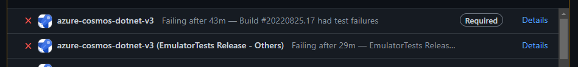
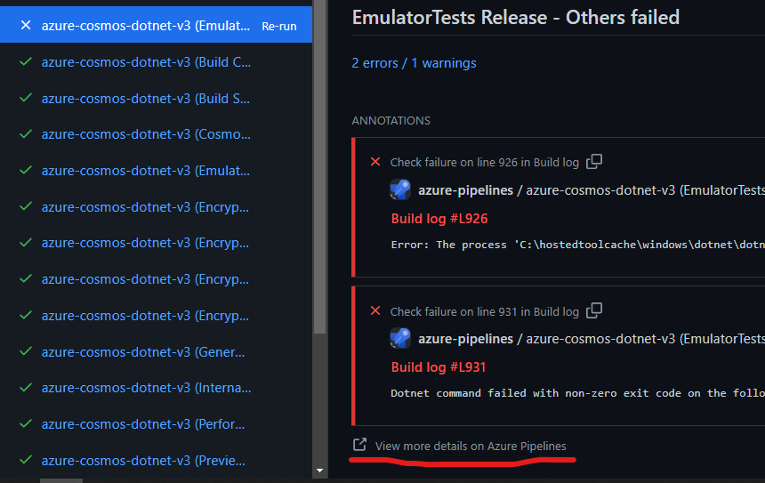
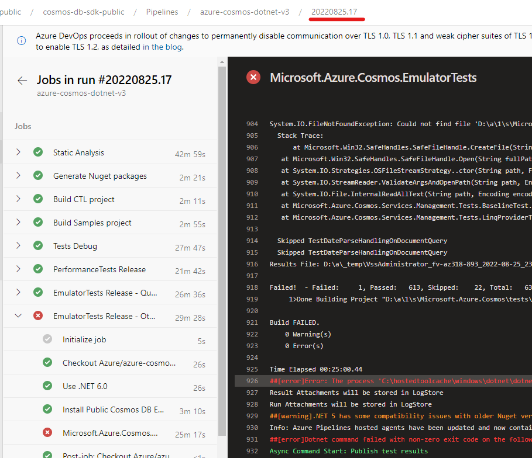
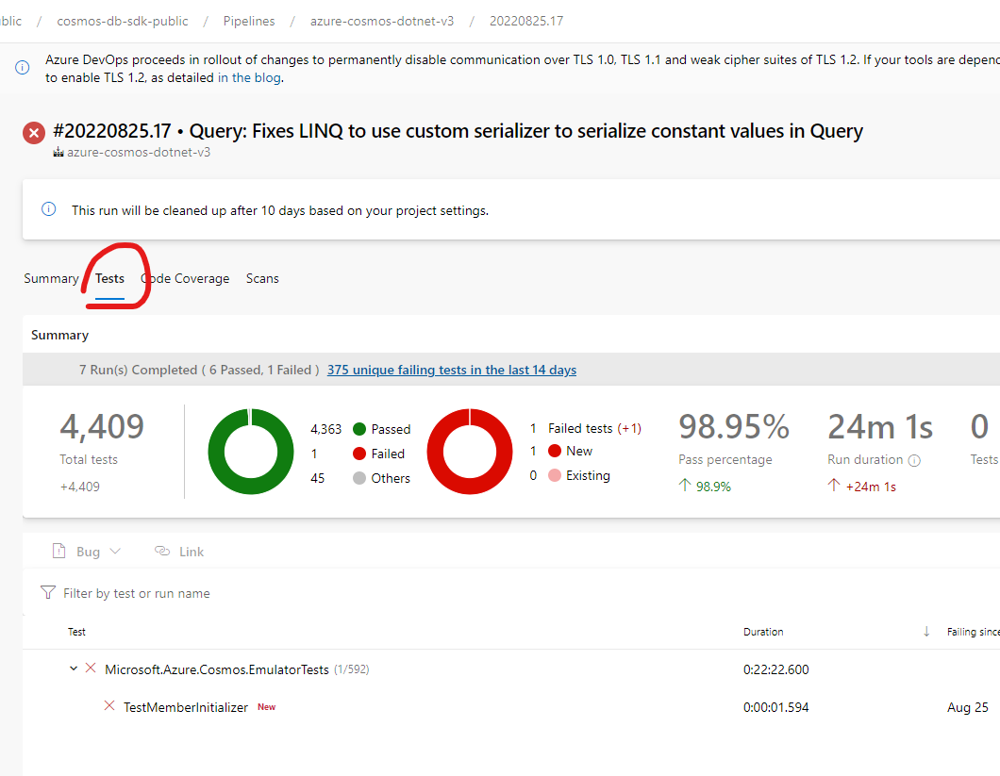
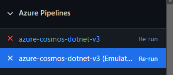
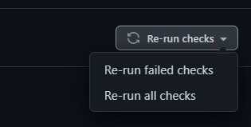

# Contributing

## Prerequisites

- Install **.NET 6.0 SDK** for your specific platform. (or a higher version within the 6.0.*** band)  (https://dotnet.microsoft.com/download/dotnet-core/6.0)
- Install the latest version of git (https://git-scm.com/downloads)
- Install the [Azure Cosmos DB Emulator](https://docs.microsoft.com/azure/cosmos-db/local-emulator#download-the-emulator)

You can choose to use any IDE compatible with .NET development, such as:

- [Visual Studio](https://visualstudio.microsoft.com/downloads/) - any of the versions, including the free Community version.
- [Visual Studio Code](https://code.visualstudio.com/download).

## General guidance

Azure Cosmos DB SDKs are thick constructs that contain several layers:

- Public APIs
- Retry policies
- Processing pipeline
- Transport (HTTP or Direct). More information see the [connectivity modes documentation](https://docs.microsoft.com/azure/cosmos-db/sql/sql-sdk-connection-modes#direct-mode)

Make sure you are familiar with:

- [Azure SDK Guidelines](https://azure.github.io/azure-sdk/dotnet_introduction.html)
- [Best practices for Azure Cosmos DB .NET SDK](https://docs.microsoft.com/azure/cosmos-db/sql/best-practice-dotnet)
- [Designing resilient applications with Azure Cosmos DB SDKs](https://docs.microsoft.com/azure/cosmos-db/sql/conceptual-resilient-sdk-applications)

The following image shows the hierarchy of different entities in an Azure Cosmos account:

### CosmosClient

`CosmosClient` is the client:

- Working with Azure Cosmos databases. They include creating and listing through the `Database` type.
- Obtaining the Azure Cosmos account information.

### Database

A database is the unit of management for a set of Azure Cosmos containers. It maps to the `Database` class and supports:

- Working with Azure Cosmos containers. They include creating, modifying, deleting, and listing through the `Container` type.
- Working with Azure Cosmos users. Users define access scope and permissions. They include creating, modifying, deleting, and listing through the `User` type.

### Containers

An Azure Cosmos container is the unit of scalability both for provisioned throughput and storage. A container is horizontally partitioned and then replicated across multiple regions. It maps to the `Container` class and supports:

- Working with items. Items are the conceptually the user's data. They include creating, modifying, deleting, and listing (including query) items.
- Working with scripts. Scripts are defined as Stored Procedures, User Defined Functions, and Triggers.

For more details visit [here][https://docs.microsoft.com/azure/cosmos-db/databases-containers-items].

## Dependencies

The SDK currently depends on:

- `Microsoft.Azure.Cosmos.Direct` - This package contains the Direct transport protocol and ServiceInterop DLLs.
- `Microsoft.HybridRow` - This package contains the HybridRow protocol used to transmit data for Batch requests.

## Folder structure

- `Microsoft.Azure.Cosmos` contains the SDK and its tests:
  - `Microsoft.Azure.Cosmos/tests/Microsoft.Azure.Cosmos.Tests` contains the **Unit tests** project.
  - `Microsoft.Azure.Cosmos/tests/Microsoft.Azure.Cosmos.EmulatorTests` contains the **Emulator/Integration tests** project.
  - `Microsoft.Azure.Cosmos/tests/Microsoft.Azure.Cosmos.Performance.Tests` contains the **micro benchmark tests** project.
  - `Microsoft.Azure.Cosmos/src` contains the SDK source code and the `Microsoft.Azure.Cosmos.csproj` project.
- `Microsoft.Azure.Cosmos.Samples` contains samples and tools:
  - `Microsoft.Azure.Cosmos.Samples/Usage` contains sample applications for multiple scenarios. Here is where we keep our public samples for users to consume.
  - `Microsoft.Azure.Cosmos.Samples/Tools` contains tools such as the CTL runner and Benchmark runner.
- `Microsoft.Azure.Cosmos.Encryption` and `Microsoft.Azure.Cosmos.Encryption.Custom` are exclusively related to the Encryption libraries that leverage the SDK.

## Building the SDK

If you are working with Visual Studio, opening the [Microsoft.Azure.Cosmos.sln](Microsoft.Azure.Cosmos.sln) file is the quickest way to build and work with the SDK.

Alternatively, you can build from the command line using the .NET tooling with `dotnet build Microsoft.Azure.Cosmos.sln` on the root of this repository or access the `Microsoft.Azure.Cosmos/src/Microsoft.Azure.Cosmos.csproj` project on the [folder structure](#folder-structure) and build just the SDK source code like `dotnet build .\Microsoft.Azure.Cosmos\src\Microsoft.Azure.Cosmos.csproj`.

## Tests

There are two major test projects:

- `Microsoft.Azure.Cosmos/tests/Microsoft.Azure.Cosmos.Tests` contains Unit tests. Any new feature or work should add unit tests covering unless explicitly allowed due to some exceptional circumstance. Unit tests should be isolated and do not depend on any endpoint or Emulator.
- `Microsoft.Azure.Cosmos/tests/Microsoft.Azure.Cosmos.EmulatorTests` contains Emulator tests. This tests will automatically connect to a running Azure Cosmos DB Emulator (see [prerequisites](#prerequisites)). Any new feature or work should have Emulator tests if the feature is interacting with the service.

All test projects can be interacted with through an IDE (some IDEs like Visual Studio have a Test Explorer to easily navigate through tests) but it can also be executed through the [dotnet test](https://docs.microsoft.com/dotnet/core/tools/dotnet-test) command in any of the above folders.

When evaluating adding new tests, please search in the existing test files if there is already a test file for the scenario or feature you are working on.

## Contribution flow

1. Create a branch for your contribution (if you are an external contributor, on your own fork).
1. Make sure your work is adding [tests](#tests) as required (either unit and/or emulator tests depending on the scope of the work).
1. Send a Pull Request to the main branch once your work is ready to be reviewed.
1. The CI pipeline will start any required tests. If you are an external contributor, a team member will start the verification once we confirm the nature of the contribution through a `/azp run` comment in your Pull Request.
1. Look for review comments and attempt to answer/address them to the best of your ability.
1. Check for [test failures](#test-failures) and address them if they are not transient.
1. Review the **Checks** section to confirm there are no pending steps that might be blocking your work from merging.

## Changelog entry

Every pull request that changes shipped behavior must add a changelog
entry. This is the same pattern used by the Cosmos DB SDKs for Java
(`azure-sdk-for-java/sdk/cosmos/azure-cosmos/CHANGELOG.md`) and Python
(`azure-sdk-for-python/sdk/cosmos/azure-cosmos/CHANGELOG.md`).

### Where to add it

`changelog.md` has a `### Unreleased` section at the top of the "Release
notes" block. Underneath are four subsections:

- `#### Features Added` — new functionality customers can opt into.
- `#### Breaking Changes` — anything that could break a customer's
  build, behavior, or expectations on upgrade.
- `#### Bugs Fixed` — defects fixed in shipped behavior.
- `#### Other Changes` — behavioral or performance changes that
  customers should know about but that aren't features or bugs.
  Refactors with observable effects, dependency bumps with
  customer-visible behavior changes, etc.

Add your bullet under the matching subsection.

If your PR touches `Microsoft.Azure.Cosmos/FaultInjection/src/**` instead
of (or in addition to) the main SDK source, add your bullet to
`Microsoft.Azure.Cosmos/FaultInjection/changelog.md` under its own
`### Unreleased` section.

### How to write it

- One line per change.
- Customer-facing language. The audience is the developer running
  `dotnet add package Microsoft.Azure.Cosmos`, not a teammate
  reviewing your PR.
- Reference the PR by number with a link:
  `See [PR 1234](https://github.com/Azure/azure-cosmos-dotnet-v3/pull/1234).`
- The PR title and the changelog entry are **not the same thing**. The
  title is engineering shorthand; the entry is a release-note line.

Example:

| PR title (engineering) | Changelog entry (customer-facing) |
|---|---|
| `DocumentClient: Adds tests for PartitionKeyRangeLocation disposal` | `Fixes per-CosmosClient memory and CPU leak introduced in 3.53.0 by disposing GlobalPartitionEndpointManagerCore. See [PR 5778](https://github.com/Azure/azure-cosmos-dotnet-v3/pull/5778).` |

### Default verb → subsection mapping

When the change has no other obvious classification, use the verb in your
PR title as a starting point:

| PR title verb | Default subsection |
|---|---|
| `Adds` (customer-visible) | Features Added |
| `Adds` (internal refactor, no observable effect) | Other Changes (often omit) |
| `Fixes` (customer-visible defect) | Bugs Fixed |
| `Removes` (public API removal) | Breaking Changes |
| `Removes` (internal/private code) | Other Changes (often omit) |
| `Refactors` | Other Changes (omit if no observable effect) |

The verb regex enforced by `.github/workflows/prlint.yml` still governs
the PR title, but the PR title no longer drives the changelog content.

### When the `[Internal]` prefix is appropriate

`[Internal]` in the PR title is reserved for changes with **no
customer-observable impact**:

- Test-pipeline / CI / build-tooling changes.
- Internal refactors that do not change runtime behavior, allocations,
  memory profile, CPU profile, or surfaced types.
- Documentation-only changes inside the repo (not changelog).

`[Internal]` is **not** appropriate for:

- Any change to `Microsoft.Azure.Cosmos/src/**` that a customer could
  observe by running their workload under different SDK versions, even
  if the change is to an "internal" type. PR #5310 (PPAF dynamic
  enablement, which changed `DocumentClient` reference semantics from
  weak to strong) is the canonical anti-example — the change was
  preview-internal but had load-bearing customer-observable effects.

**Preview-feature carve-out:** if a preview-only change might affect
default-config semantics for any customer in the next two minor
releases, it does not qualify as `[Internal]` — it goes under
`Other Changes` (or `Bugs Fixed` / `Breaking Changes` as appropriate).

### What reviewers verify

When reviewing a PR, check:

1. The "Changelog" section of the PR description is filled in.
2. If an entry was added: it is in the right subsection, the language
   is customer-facing, and the bullet links to the PR.
3. If the author chose "No changelog entry required": the justification
   is genuine (test-only, doc-only, CI-only, or pure internal refactor
   with no customer-observable effect).

### Conflicts in `### Unreleased`

If two PRs add bullets to the same subsection of `### Unreleased` you
may see a merge conflict. Take both bullets — the order is not
significant.

### Test failures

If the Pull Request is experiencing test failures, these will appear as failed checks:

Clicking on `Details` will take you to the **Checks** section. Each failed check will contain a link to `View more details on Azure Pipelines`:

Which takes you to the pipeline run. Clicking on the run number will take you to the run **Overview**:

And you can see which Tests failed during that check and click on the individual test to see the error message:

In some cases, the failures are unrelated to your changes and might result from a transient issue on the test environment. On the **Checks** section, you can decide to **Re-run** the tests individually:

Or all through `Re-run failed checks` on the top right corner:

## Usage of Cosmos DB Emulator for running unit tests

- - The same version of the emulator used in the CI pipelines can be downloaded [here](https://aka.ms/cosmosdb-emulator)
- More information about how ro use the emulator for development is documented [here](https://github.com/Azure/azure-documentdb-dotnet/blob/main/docs/documentdb-nosql-local-emulator.md)
- You can start the emulator with same parameters as the emulator unit tests in the CI pipeline via `.\CosmosDB.Emulator.exe /DisableRateLimiting /PartitionCount=100 /Consistency=Strong /enableRio /EnablePreview /EnableAadAuthentication /EnableSqlComputeEndpoint`

## Troubleshooting

- [General .NET SDK Troubleshooting](https://docs.microsoft.com/azure/cosmos-db/sql/troubleshoot-dot-net-sdk)
- [Timeout troubleshooting](https://docs.microsoft.com/azure/cosmos-db/sql/troubleshoot-dot-net-sdk-request-timeout?tabs=cpu-new)
- [Service unavailable troubleshooting](https://docs.microsoft.com/azure/cosmos-db/sql/troubleshoot-service-unavailable)
