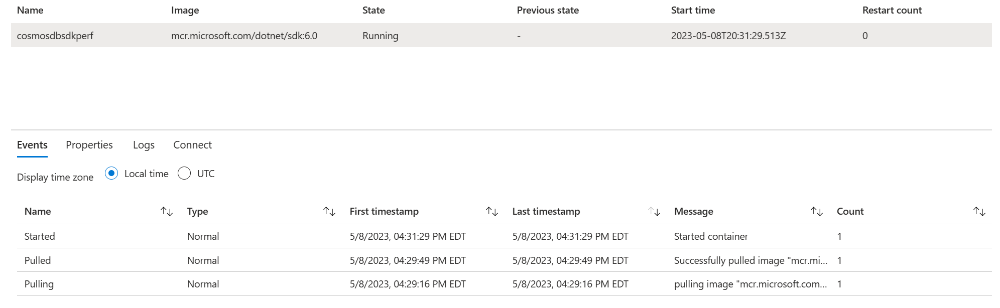
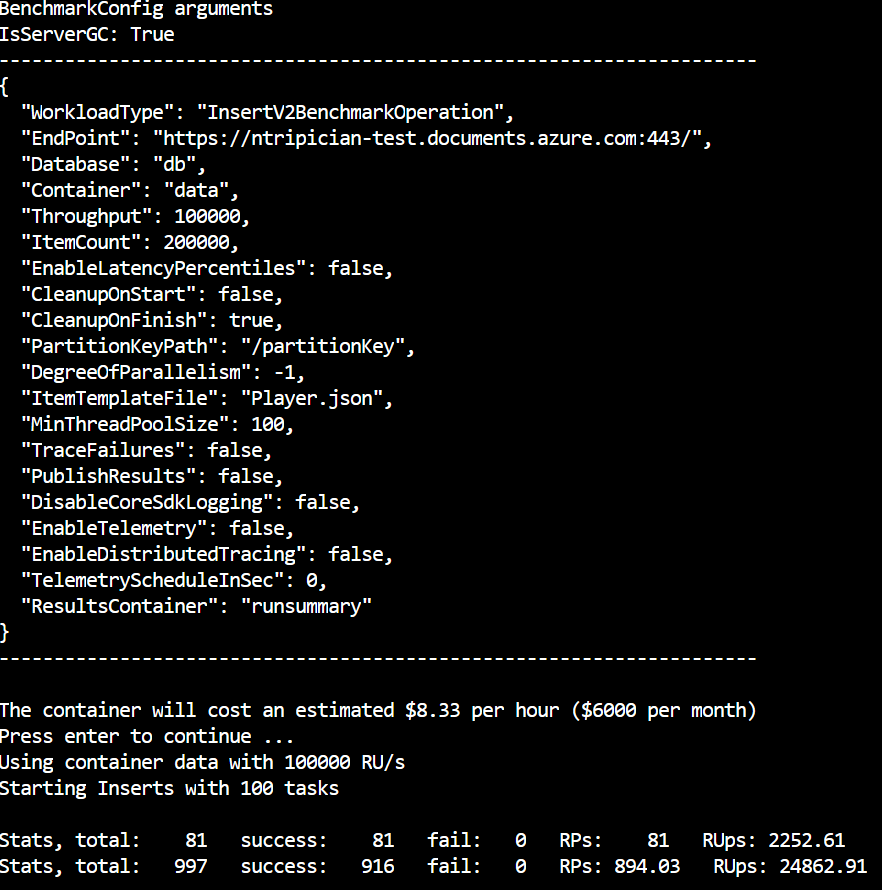
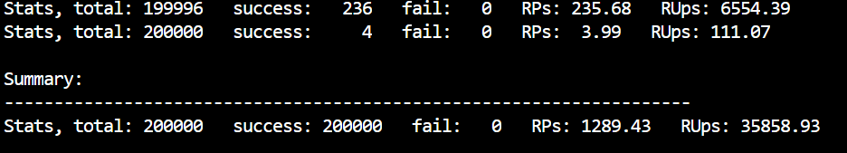

# Running benchmarks on ARM Tempaltes

[ARM Templates](https://learn.microsoft.com/azure/azure-resource-manager/templates/) makes executing the Azure Cosmos DB SDK Benchmark extremely easy, with very few steps involved. Plus, it lets you test and evaluate performance quickly on multiple resource (CPU/RAM) configurations and across multiple Azure regions seamlessly.

For the below steps, you will **need an Azure Subscription**.

## Steps

### Deploy with one click

Just click in the Deploy to **Azure button** and it will guide you into automatically running the benchmarking.

[](https://portal.azure.com/#create/Microsoft.Template/uri/https%3A%2F%2Fraw.githubusercontent.com%2FAzure%2Fazure-cosmos-dotnet-v3%2Fmaster%2FARMBenchmarking%2FMicrosoft.Azure.Cosmos.Samples%2FTools%2FBenchmark%2FARMTemplate%2FbenchmarkTemplate.json)

Please populate the `ENDPOINT` and `KEY` for your Azure Cosmos DB account. You can [obtain these from the Azure Portal or through CLI](https://learn.microsoft.com/azure/cosmos-db/secure-access-to-data?tabs=using-primary-key#primary-keys).

Optionally you can modify the other parameters, such as the `THROUGHPUT` for the container that will get created, the amount of `DOCUMENTS` to insert, the degree of `PARALLELISM`, and if you want the container to be deleted after the benchmark is run (`CLEANUPFINISH` `true/false`).

Additionally, the file lets you customize the size of the instance, which you can make as similar as possible to the instance you will be running in production to simulate results.

### Deploy with Azure CLI

First open the `parameters.json` file and populate the `ENDPOINT` and `KEY` for your Azure Cosmos DB account. You can [obtain these from the Azure Portal or through CLI](https://learn.microsoft.com/azure/cosmos-db/secure-access-to-data?tabs=using-primary-key#primary-keys).

 Next, modify the other parameters, such as the `THROUGHPUT` for the container that will get created, the amount of `DOCUMENTS` to insert, the degree of `PARALLELISM`, and if you want the container to be deleted after the benchmark is run (`CLEANUPFINISH` `true/false`).

 If you're deploying the template to a resource group that does not exist you must create one first. Please note that the name of the resource group can only include alphanumeric characters, periods, underscores, hyphens, and parenthesis. It can be up to 90 characters. The name can't end in a period. To create a resource group use the following command:
 ```bash
 az group create --name $resourceGroupName --location $location
 ```

 To run the benchmark first navigate to the directory the `benchmarkTemplate.json` and `parameters.json` files are stored and use the Azure CLI with the following command:
 ```bash
 az deployment group create --resource-group $resourceGroupName --template-file benchmarkTemplate.json --parameters @parameters.json
 ```

### The Benchmark 

Once you create the benchmark, it will do the following:

1. It will create a Linux container named `cosmosdbsdkperf` and provision an image with NET 6 inside an instance with the configured CPU and RAM.

2. Clone the Azure Cosmos DB SDK repository with the required files
3. Execute the benchmark and provide output logs
4. Stop the instance

While the container instance is running (or after), you can either use the Azure Portal or the Azure CLI to check the benchmark results with:

```bash
az container logs -g $resourceGroupName -n cosmosdbsdkperf
```

Additionally you can check the logs in the Azure Portal by navigating to the container instance and clicking on the **Logs** tab.

The logs will show the information, including the initial parameters:



And the results:



### Clean up

If you want to remove the Benchmark instance, ypu can delete the container from the Azure Portal. You can also do so from the Azure CLI:

```bash
az container delete -g $resourceGroupName -n cosmosdbsdkperf
```

You can also delete the Benchmark instance from the Azure Portal by navigating to the container instance and clicking on the **Delete** button.

**Remember to delete the Database and Container** that were created for the Benchmark in your CosmosDB account if you did not use the `CLEANUPFINISH` parameter as `true`.
