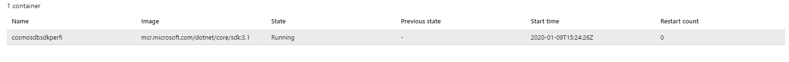
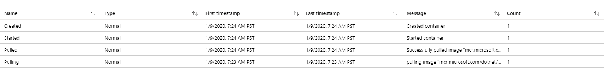
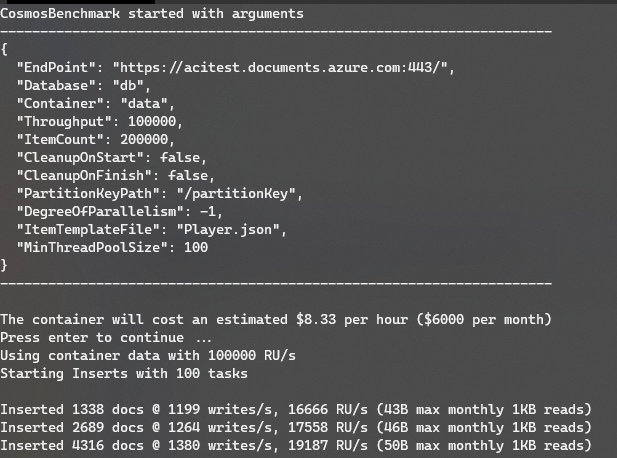
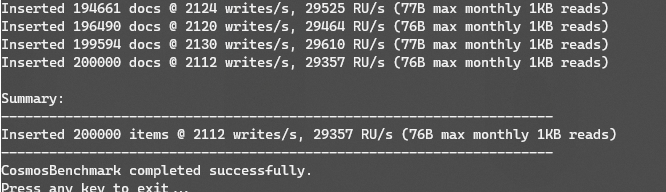

# Running benchmarks on Azure Container Instances

[Azure Container Instances](https://azure.microsoft.com/services/container-instances/) makes executing the Azure Cosmos DB SDK Benchmark extremely easy, with very few steps involved, and it's more cost-effective than using Virtual Machines for burst or single-use scenarios. Plus, it lets you test and evaluate performance quickly on multiple resource (CPU/RAM) configurations and across multiple Azure regions seamlessly.

For the below steps, you will **need an Azure Subscription**.

## Steps

### Step 1 - Download YAML

You **do not need** to clone this repository, just obtain a copy of the [azure-container-instance-run.yml](./azure-container-instance-run.yml) file.

### Step 2 - Customize the YAML file

The YAML file contains a list of configuration options that you need to populate for the Azure Cosmos DB account you want to execute the benchmark tests on.

```json
 environmentVariables:  # Customize your connection information and the provisioned throughput
      - name: ENDPOINT
        value: '<your-account-endpoint>'
      - name: KEY
        value: '<your-account-key>'
      - name: THROUGHPUT
        value: 100000
      - name: DOCUMENTS
        value: 200000
      - name: PARALLELISM
        value: -1
      - name: CLEANUPFINISH
        value: false
```

Please populate the `ENDPOINT` and `KEY` for your Azure Cosmos DB account. You can [obtain these from the Azure Portal or through CLI](https://docs.microsoft.com/azure/cosmos-db/secure-access-to-data#master-keys).

Optionally you can modify the other parameters, such as the `THROUGHPUT` for the container that will get created, the amount of `DOCUMENTS` to insert, the degree of `PARALLELISM`, and if you want the container to be deleted after the benchmark is run (`CLEANUPFINISH` `true/false`).

Another section of the YAML file lets you customize the size of the instance, which you can make as similar as possible to the instance you will be running in production to simulate results.

```json
resources:
    requests: # Customize memory and CPU
        memoryInGB: 8
        cpu: 4
    limits:  # Customize memory and CPU
        memoryInGB: 8
        cpu: 4
```

For a complete reference of options, please visit the [official Azure Container Instances YAML reference](https://docs.microsoft.com/azure/container-instances/container-instances-reference-yaml).

### Step 3 - Obtain Azure CLI

We'll be using [Azure CLI](https://docs.microsoft.com/cli/azure/install-azure-cli?view=azure-cli-latest) to create the Azure Container Instance and execute the YAML file. Azure CLI is cross-platform.

After installing the Azure CLI, you will need to [login](https://docs.microsoft.com/cli/azure/authenticate-azure-cli?view=azure-cli-latest) into the subscription you want to provision and execute the benchmark on.

### Step 4 - Create resources

The goal behind the benchmark is to simulate load. Ideally you want to co-locate the instance that will be executing the benchmark with your Azure Cosmos DB account, so the first step would be to **create a Resource Group** on the same location. For example, if your Azure Cosmos DB account is deployed on East US, we can use `az group create` to create this Resource Group:

```bash
$resourceGroupName = "CosmosDBBenchmark"
az group create --name $resourceGroupName --location eastus
```

For a complete list of options see the [documentation for `az group create`](https://docs.microsoft.com/cli/azure/group?view=azure-cli-latest#az-group-create).

### Step 5 - Execute the benchmark

Once the Resource Group is created in the correct location, we can use the YAML file to provision the Azure Container Instance and execute the benchmark.

Assuming your prompt is on the folder with the customized YAML file:

```bash
az container create -g $resourceGroupName -f azure-container-instance-run.yml
```

This command will start the provisioning:

1. It will create a Linux container named `cosmosdbsdkperf` and provision an image with NET Core inside an instance with the configured CPU and RAM.


2. Clone the Azure Cosmos DB SDK repository with the required files
3. Execute the benchmark and provide output logs
4. Stop the instance

While the container instance is running (or after), you can either use the Azure Portal or the Azure CLI to check the benchmark results with:

```bash
az container logs -g $resourceGroupName -n cosmosdbsdkperf
```

The logs will show the information, including the initial parameters:



And the results:



### Step 6 - Clean up

If you want to remove the Benchmark instance, you can also do so from the Azure CLI:

```bash
az container delete -g $resourceGroupName -n cosmosdbsdkperf
```

**Remember to delete the Database and Container** that were created for the Benchmark in case you did not use the `CLEANUPFINISH` parameter as `true`.
