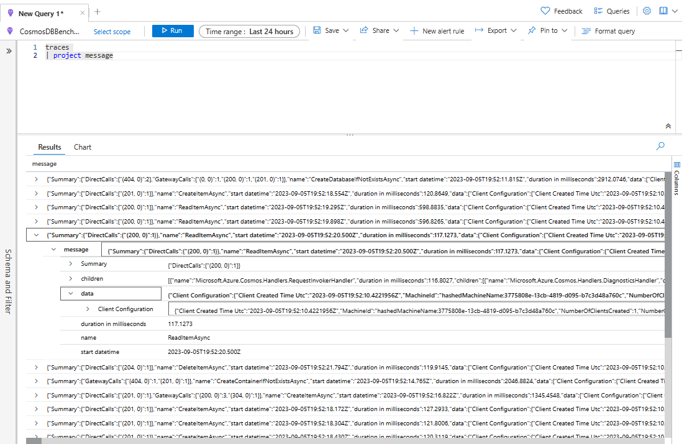

# Integrate ApplicationInsights with Cosmos DB

This project provides a demo showcasing the usage of the integrating ApplicationInsights with Cosmos DB. The goal is to trace requests.

## Prerequisites

- Azure Cosmos DB NoSQL Account
  - Create a DataBase and Container
- Azure ApplicationInsights Account
  - Create a Azure ApplicationInsights account

## Run

Before running the application you need fill out `CosmosDBEndPointUrl`, `CosmosDBAuthorizationKey` and `ApplicationInsightsConnectionString` params in the [AppSettings.json](AppSettings.json)

```PowerShell
dotnet run
```

## Getting Started

### Configure Application Insights Telemetry

```C#
IServiceCollection services = new ServiceCollection();
services.AddApplicationInsightsTelemetryWorkerService((ApplicationInsightsServiceOptions options) => options.ConnectionString = aiConnectionString);

IServiceProvider serviceProvider = services.BuildServiceProvider();
_telemetryClient = serviceProvider.GetRequiredService<TelemetryClient>();
```

### Prepare Client, Database and Container

```C#
using (CosmosClient client = new CosmosClient(endpoint, authKey, options))
{
    Console.WriteLine($"Getting container reference for {containerName}.");

    ContainerProperties properties = new ContainerProperties(containerName, partitionKeyPath: "/id");

    await client.CreateDatabaseIfNotExistsAsync(databaseName);
    Container container = await client.GetDatabase(databaseName).CreateContainerIfNotExistsAsync(properties);

    await Program.RunCrudDemo(container);
}
```

### Flush telemetry data

```C#
_telemetryClient?.Flush();
```

### Check captured telemetry in Application Insights


