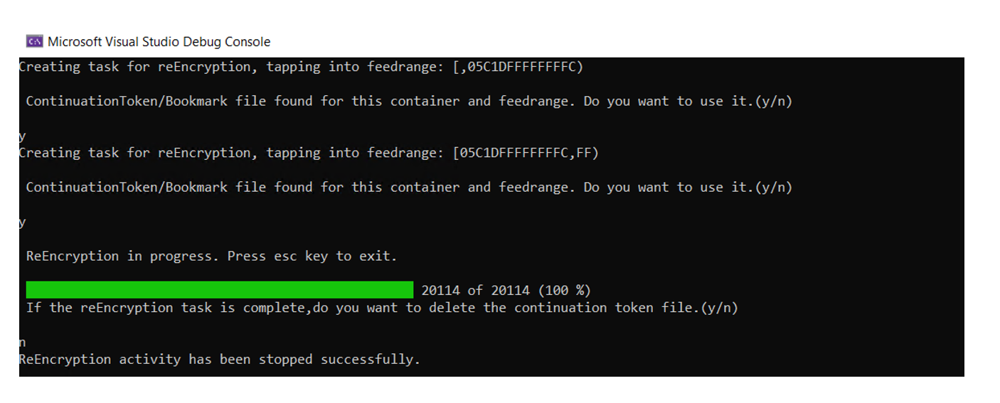

# Microsoft Azure Cosmos DB Reencryption Tool

Microsoft Azure Cosmos DB Reencryption Tool consists of a sample or driver code to demonstrates, how re-encryption of encrypted data in CosmosDB can be carried out using Always Encrypted CosmosDB SDK Client-Side encryption.
This can be used to change/rotate Data Encryption Keys or change the Client Encryption Policy. This can also be used to migrate your data from regular container to an encryption container.
The sample code shows how the APIs which help with re-encryption can be used. The core library for these APIs are located in ReEncryptionSupport folder within the same project.

## IMPORTANT

* The sample code just demonstrates how the exposed APIs can be used to carry out re-encryption of data. This is meant to be used only as tutorial to understand the usage of the below said APIs. It does not cover cases like retries when failures occur
or optimization of re-encryption like parallelization of the individual tasks etc.

* The tool currently does not support reencrytion if the source container is receiving active changes.

* There is no Service Level Agreement for this.


## Getting Started

## How to use the sample 

The sample creates separate re-encryption tasks for each of the feed range and saves the continuation token if the task is interrupted in between or if the user decides to stop the re-encryption and decides to continue it later.
The user gets the option to use an existing continuationToken/bookmark from the last saved checkpoint which was saved earlier in a file. If the re-encryption activity is finished the user can discard the file.





The following fields in the sample code pick up the required details from the application settings file(AppSettings.json).
     
* SrcDatabase - Database containing the containers that needs to be reencrypted with new data encryption key or if a change in encryption policy is required.
    
* SrcContainer - Container Id which requires a re-encryption of data or change in encryption policy(you might want to add additional paths to be encrypted etc.). The can be the regular container which you want to migrate to a encryption container.
    
* DstContainer - Destination container(should be created in advance), with new encryption policy set. This container will now house the reencrypted data.
    
If you wish to change the data encryption key then, you can use the same policy, but you have to change the keys for each of the policy paths. The new keys should be created prior its usage in the policy. The destination container
should be created with the new policy before you use it in this sample/driver code.


### Under the hood and available APIs for re-encryption.

- Uses change feed APIs (pull model) to read data from the source container. As the data is read, Always Encrypted CosmosDB decrypts the data (if the source container has encrypted data) and this data is then
written(Always Encrypted CosmosDB handles the encryption) into the destination container using bulk operation. Hence please make sure bulk execution is enabled on the client.

- The core library exposes an iterator model API which provides you with an iterator which is exposed as an extension method on container.

```csharp
/// <summary>
/// Gets an iterator for reencrypting the data.
/// The source container should have no data changes during reEncryption operation or should have changefeed full fidelity enabled.
/// </summary>
/// <param name="container"> Source container object. </param>
/// <param name="destinationContainerName"> Destination Container configured with new policy or key. </param>
/// <param name="checkIfWritesHaveStoppedCb"> Callback to check if writes have stopped.The called function should return true if writes have stopped.If FullFidelity change feed is not enabled,return true by default. </param>
/// <param name="changeFeedRequestOptions"> (Optional) Request options. </param>
/// <param name="sourceFeedRange"> (Optional) The range to start from. </param>
/// <param name="continuationToken"> (Optional) continuationToken: The continuation to resume from. </param>
/// <param name="cancellationToken"> (Optional) System.Threading.CancellationToken representing request cancellation. </param>
/// <returns> Returns a ReEncryption Iterator. </returns>
public static async Task<ReEncryptionIterator> GetReEncryptionIteratorAsync(
    this Container container,
    string destinationContainerName,
    CosmosClient encryptionCosmosClient,
    Func<bool> checkIfWritesHaveStoppedCb,
    ChangeFeedRequestOptions changeFeedRequestOptions = null,
    FeedRange sourceFeedRange = null,
    string continuationToken = null,
    CancellationToken cancellationToken = default)			
```
		

This API can be used with the source container object and you can pass the destination container name. The method also accepts a callback delegate which gets called by the core library to check if the source container is not receiving 
anymore writes. This is used by the core library to set the required flag (HasMoreResults) in the iterator which will indicate if there are anymore further results/changes that need to re-encrypted.
In addition to these parameters, there are few optional parameters which can help you with parallelization of re-encryption tasks by accepting changes and reencrypting data in a specific feed range using "sourceFeedRange" parameter, there by having
separate tasks for each feedrange that can help in improving the performance. The "continuationToken" can be used as a bookmark and can be passed to the iterator to pick up from where you left off from earlier re-encryption activity.

- The iterator has method EncryptNextAsync on it which is the core function that does the re-encryption, reading from the source container and writing the data to the destination container. The ReEncryptionResponseMessage class
provides you with ReEncryptionBulkOperationResponse which has important information which includes total documents that were successfully re-encrypted, gets you list of all failures and returns the documents,corresponding exception and other important information.

```csharp
/// <summary>
/// EncryptNextAsync.
/// </summary>
/// <param name="cancellationToken"> cancellationTOken. </param>
/// <returns> Response Message. </returns>
public async Task<ReEncryptionResponseMessage> EncryptNextAsync(
    CancellationToken cancellationToken = default)
```


