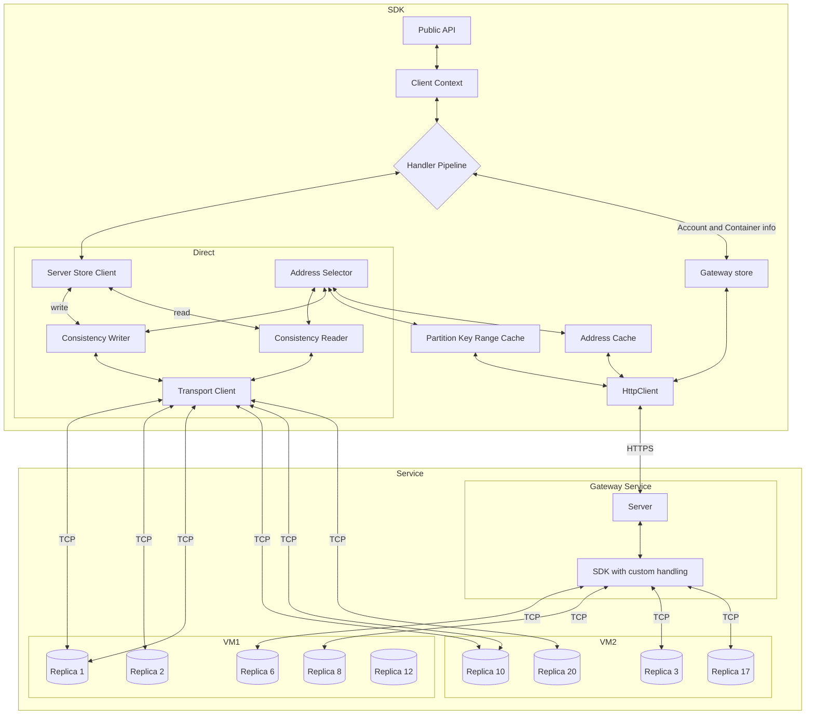

```mermaid
flowchart 
    subgraph Service
        subgraph VM1
            R1[(Replica 1)]
            R2[(Replica 2)]
            R6[(Replica 6)]
            R8[(Replica 8)]
            R12[(Replica 12)]
        end
        subgraph VM2
            R3[(Replica 3)]
            R20[(Replica 20)]
            R10[(Replica 10)]
            R17[(Replica 17)]
            
        end
        subgraph Gateway Service
            Server[Server]
            SDKInternal[SDK with custom handling]
            Server <--> SDKInternal
        end
    end
    subgraph SDK
        subgraph Direct
            ServerStoreModel[Server Store Client]
            ConsistencyWriter[Consistency Writer]
            ConsistencyReader[Consistency Reader]
            TransportClient[Transport Client]
            AddressSelector[Address Selector]
            ServerStoreModel <-- write -->  ConsistencyWriter
            ServerStoreModel <-- read -->  ConsistencyReader
            ConsistencyWriter <--> TransportClient
            ConsistencyReader <--> TransportClient
            AddressSelector <--> ConsistencyReader
            AddressSelector <--> ConsistencyWriter
        end
        PublicApi[Public API]
        PublicApi <--> ClientContext[Client Context]
        ClientContext <--> Pipeline{Handler Pipeline}
        Pipeline <--> ServerStoreModel
        AddressSelector <--> PKRange[Partition Key Range Cache]
        AddressSelector <--> AddressCache[Address Cache] 
        TransportClient <-- TCP --> R1
        TransportClient <-- TCP --> R2
        TransportClient <-- TCP --> R1
        TransportClient <-- TCP --> R10
        TransportClient <-- TCP --> R10
        TransportClient <-- TCP --> R20

        SDKInternal <-- TCP --> R6
        SDKInternal <-- TCP --> R8
        SDKInternal <-- TCP --> R3
        SDKInternal <-- TCP --> R17

        Pipeline <-- Account and Container info --> GatewayStore[Gateway store]

        PKRange <--> HttpClient
        AddressCache <--> HttpClient
        GatewayStore <--> HttpClient[HttpClient]
        HttpClient <-- HTTPS --> Server
    end
```
