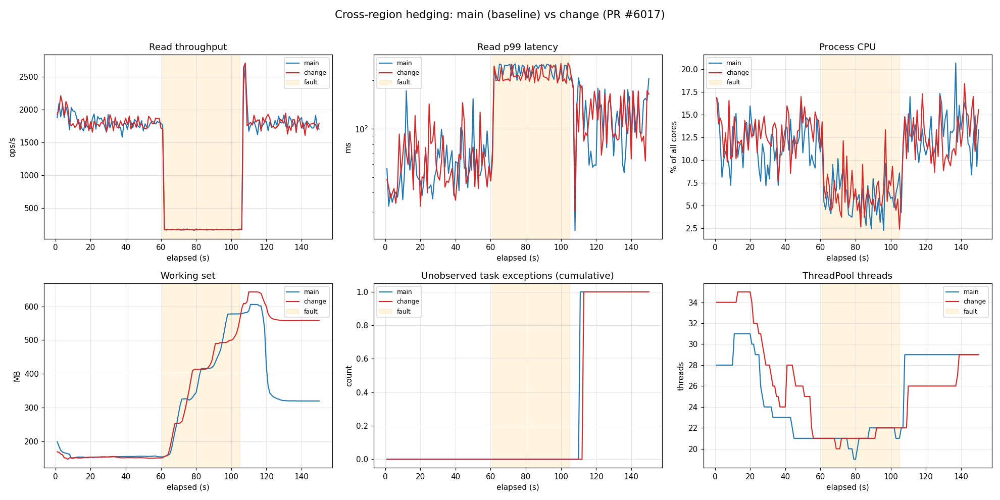

# Results — Hedging perf benchmark: PR #6017 (change) vs main

Run: local sequential A/B (main first, then change) against live multi-region account
`nalu-key-testing` (West US 2 / East US 2 / East US), Direct mode.
Config: concurrency 32, 80/20 read/write, 1000 docs, 10000 RU, hedge threshold 100ms/step 50ms,
fault = 2000ms ResponseDelay on **West US 2 ReadItem**. Phases warmup 15s / steadyA 45s /
fault 45s / recovery 45s.

- main   = `fecf00e07` (origin/main, no fix)
- change = `4eebb1835` (PR #6017 head)

## Headline: no meaningful performance regression
Across throughput, latency, and CPU the two builds are statistically indistinguishable
(all deltas within run-to-run noise). Hedging behaves identically: during the fault phase
read p99 stays **bounded at ~215–230 ms** (hedge threshold + East US 2 RTT) instead of the
injected 2000 ms — i.e. the primary (West US 2) is delayed, the hedge to East US 2 wins, on
both versions equally. `errors = 0` and caller-visible `cancellations = 0` throughout.

| Phase | Metric | main | change | Δ |
|---|---|---:|---:|---:|
| steadyA | read ops/s (mean) | 1778 | 1790 | +0.6% |
| steadyA | read p99 ms (mean) | 62.9 | 66.0 | +4.9% |
| steadyA | CPU % (mean) | 11.7 | 13.0 | +1.3 pp |
| steadyA | WorkingSet MB (mean) | 155 | 152 | −1.6% |
| fault | read ops/s (mean) | 209 | 207 | −0.5% |
| fault | read p99 ms (mean) | 228.9 | 215.6 | **−5.8%** |
| fault | read p99 ms (max) | 253.8 | 257.2 | +1.3% |
| fault | CPU % (mean) | 6.0 | 6.5 | +0.5 pp |
| fault | WorkingSet MB (max) | 578 | 564 | **−2.4%** |
| recovery | read ops/s (mean) | 1784 | 1790 | +0.4% |
| recovery | CPU % (mean) | 12.9 | 12.6 | −2.2% |

The fault-phase read-p99 and peak-memory are actually marginally *better* on `change`, which is
noise, not a real improvement — the point is there is **no regression**. The extra
`ObserveAbandonedHedgeTasks` continuation the fix registers per losing arm (≈7800 fault hits in
this run) produces no measurable CPU or allocation cost.

## Unobserved task exceptions
Both builds record exactly **1** `TaskScheduler.UnobservedTaskException`, appearing at
~111–113 s (early recovery, right after the 2000 ms delay is lifted) on both. It stems from the
**last batch of fault-phase primary reads** whose abandoned server response (delayed 2 s) faults
in the closed-source `Microsoft.Azure.Cosmos.Direct` transport layer — *below* the hedging
strategy's own task tracking, which this PR (and any managed change in this repo) cannot observe.
Because it is identical on both builds, the PR does **not** regress the unobserved-exception count.

Note: this workload never cancels the *application* token (operations use `CancellationToken.None`);
losing arms are cancelled by the internal **hedge** CTS. That path is dominated by the PR's
`RequestSenderAndResultCheckAsync` normalization + `ObserveAbandonedHedgeTasks` (the base PR work).
The specific phase-1 else-branch added in Fix 1 (faulted arm + app token *not* cancelled) is
exercised deterministically by the unit test
`LosingHedgeFaultsAppTokenNotCancelled_NoUnobservedTaskException`, which fails without the fix —
that unit test, not this benchmark, is the authoritative proof the strategy-level leak is closed.
This benchmark's job is the **performance-regression** check, which it answers: none observed.

## Memory footnote
Working set climbs on both during the fault phase (2 s-delayed responses buffer in flight),
peaking ~560–640 MB, then releases. In the tail the `change` process happened to hold ~560 MB
while `main` had already released to ~320 MB — a Server-GC lazy-release timing artifact (Server GC
was enabled to mimic production), not a leak: peak working set during the fault was actually lower
for `change` (564 vs 578 MB), and the harness's end-of-run forced GC reclaims it.

## Reproduce
`./run-local-ab.ps1 -Concurrency 32 -SteadySec 45 -FaultSec 45 -RecoverySec 45`
(VM-isolated variant: `./vm/provision-and-run.ps1`). See `README.md`.
