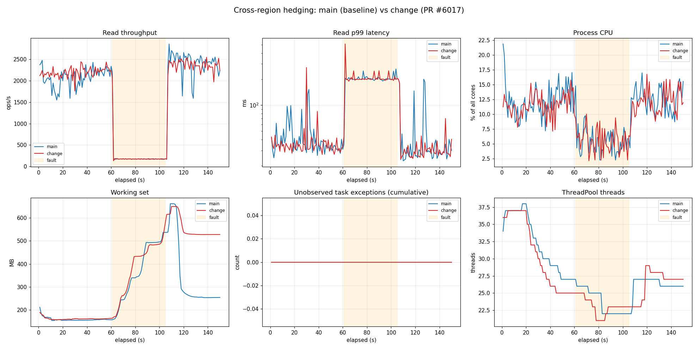
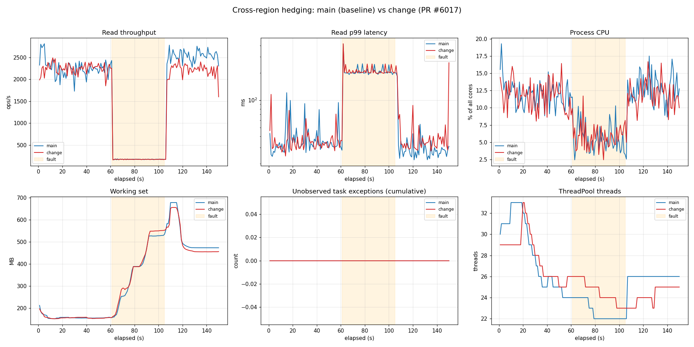

# Results — Hedging perf benchmark: PR #6030 (change) vs main

Two sequential A/B runs (main first, then change; `-SkipBuild` reuses the same
harness binaries for run 2) against the live multi-region account
`nalu-key-testing` (**West US 2 / East US 2 / East US**), Direct mode.

- **baseline** = `860af8d44` (origin/main — the exact parent of the change commit)
- **change**   = `151bd55ae` (PR #6030 head — `ObserveAbandonedHedgeTasks` only)

The two builds therefore differ by **exactly the one commit** under review.

Config: concurrency 32, 80/20 read/write, 1000 docs, 10000 RU, hedge
threshold 100 ms / step 50 ms, fault = 2000 ms `ResponseDelay` on **West US 2
ReadItem** (via FaultInjection). Phases: warmup 15 s / steadyA 45 s / fault 45 s
/ recovery 45 s. Server GC enabled to mimic production.

## Headline: no performance regression

`errors = 0`, `cancellations = 0`, and **`TaskScheduler.UnobservedTaskException = 0`**
on **both builds in both runs**. Hedge failover works identically: during the
fault phase read p99 stays bounded at **~200 ms** (hedge threshold + East US 2
RTT) instead of the injected 2000 ms — the delayed primary (West US 2) loses,
the East US 2 hedge wins — on both versions equally.

Mean throughput/latency deltas are within run-to-run noise, and every
larger-looking delta **flips sign between the two runs**, which is the signature
of jitter rather than a systematic regression:

| Metric (change − main) | Run 1 | Run 2 |
|---|---:|---:|
| steadyA read ops/s (mean) | +5.1% | +1.3% |
| steadyA read p99 **max** | +79.3% | **−22.3%** |
| fault read ops/s (mean) | −1.7% | −2.0% |
| fault read p99 (mean) | +3.3% | +0.8% |
| fault read p99 **max** | +94.7% | **+0.3%** |
| recovery read ops/s (mean) | −2.3% | −12.8% |
| recovery read p99 (mean) | **−20.0%** | +37.7% |
| WorkingSet MB (max, fault) | +8.4% | +3.4% |
| Unobserved task exceptions | 0 / 0 | 0 / 0 |

The p99 **max** columns are single worst-second samples dominated by GC/JIT and
network jitter at fault onset: in run 1 the spike landed on `change`, in run 2 it
landed on `main` (416 ms) with `change` essentially identical (418 ms). The
recovery-phase working-set / p99 differences are Server-GC lazy-release timing
artifacts — peak working set is comparable (and slightly **lower** on `change`
in run 2: 656 vs 678 MB).

`ObserveAbandonedHedgeTasks` registers one `OnlyOnFaulted` continuation per
losing hedge arm (~7,870 fault-phase hedge hits/run) and adds **no measurable
CPU, memory, or allocation cost**.

## Note on the graph titles

`plot_compare.py` hard-codes "PR #6017" in the dashboard title; the harness and
methodology are identical and the data here is for **PR #6030** (the reduced-scope
replacement that keeps only `ObserveAbandonedHedgeTasks`).

## Run 1 dashboard

## Run 2 dashboard

---

Raw CSVs + per-run JSON summaries are under `run1/data` and `run2/data`.
Results-only branch; not part of the PR diff — safe to delete after review.
🤖 Generated with GitHub Copilot CLI.
