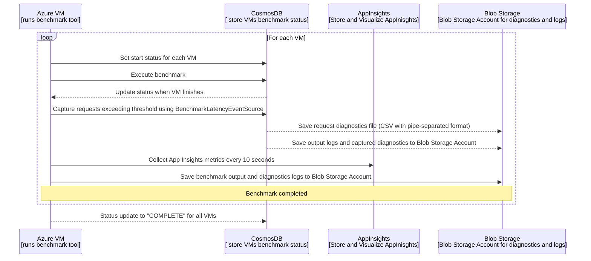
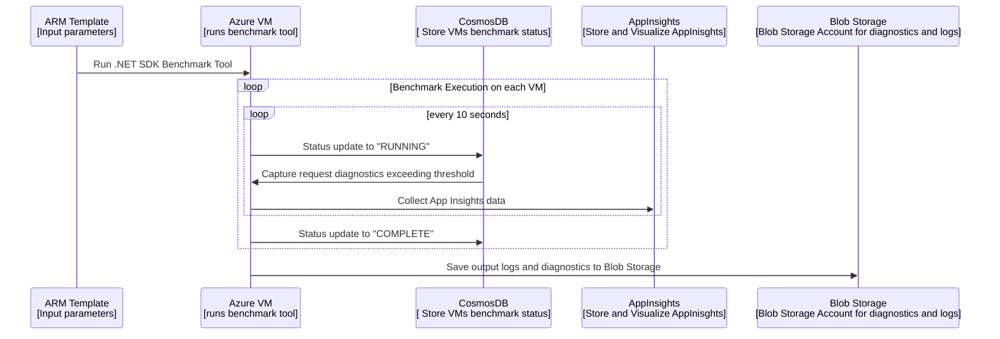
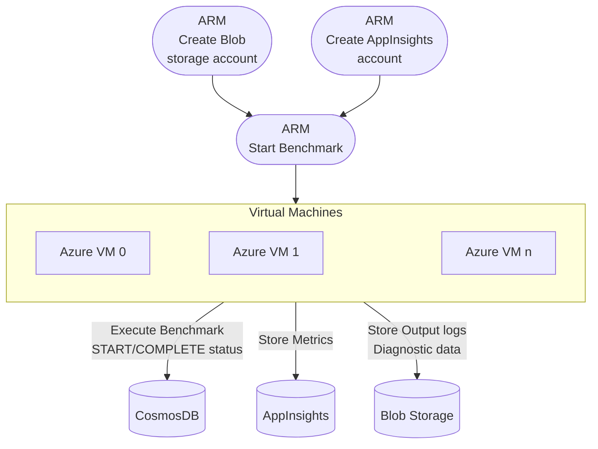

Design aproach to run Benchmark tool on VMs
* [Backgraound.](#backgraound)
* [Proposed Solution.](#proposed-solution)

## Backgraund
The goal of this feature is to make the process of using the CosmosDB benchmarking tools as easy as possible for our customers. Here we are looking to use ARM templates to deploy and run our benchmarking.
 Here we will switch to a VM based model which aims to simplify the process and reduce costs. Here we will also add more features:

- Ability to execute benchmarking on multiple machines with one ARM Template     
- Include more input parameters for testing features such as - ClientTelemetry and DistributedTracing
- Include extensive logs with full diagnostics
- AppInsights: Live metrics (10s)
    - Success rate
    - Error
    - P90, P99, P999, P9999

## Proposed Solution
- .NET SDK Benchmark Tool will run on multiple VMs in parallel
    - To track the state of each benchmark execution, we need to store the start and finish statuses for all running benchmarks. For this, we can use a Result Container in CosmosDB and create items for each VM with the status. After the benchmark is completed, the statuses will be changed to "COMPLETE" state.

- While benchark is running capture each request each exceeds specified by input parameter threshold and collect them in file on disk using [BenchmarkLatencyEventSource](https://github.com/Azure/azure-cosmos-dotnet-v3/blob/master/Microsoft.Azure.Cosmos.Samples/Tools/Benchmark/BenchmarkLatencyEventSource.cs) 
    - Output requests to diagnostics file.
        - Use CSV format with a pipe-separated format. The data to be stored may include latency and diagnostic information in JSON format.
        - Create a background task to check file size and available disk space, and generate alerts if there is insufficient free space.
    - BLob Storage Account.
        - Alternatively, we can send each request's diagnostic log immediately to the Blob Storage Account.  
- During benchmark is running collect App Insights.
    - Collect app insights with 10 seconds granulation.
    - Using [App.Metrics](https://www.app-metrics.io/reporting/reporters/app-insights/) store them in Azure Application Insighs. 
- When benchmark on VM is completed save output logs and captured diagnostics to blob storate.
    - Blob Storage creation
        - Specify instruction of how to create Azure Blob storage
        - Add to ARM template Blob Storage Account creation
    - Develop the feature in .NET SDK Benchmark Tool that saves files in blob storage after benchmark complete

 

