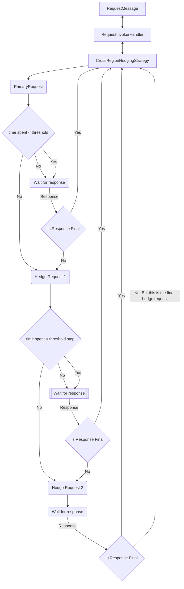

# Cross Region Hedging APIs + Samples

Cross Region Hedging Availability Strategies are a new feature in the Cosmos SDK that allows users to send requests to multiple regions in parallel during high latency periods. This feature is useful for scenarios where the user wants to ensure that the request is served as quickly as possible ensuring high availability for their applications. The SDK will send the first request to the primary region. If there is no response from the backend before the threshold time, then the SDK will begin sending hedged requests to the regions in order of the `ApplicationPreferredRegions` list. After the first hedged request is sent out, the hedged requests will continue to be fired off one by one after waiting for the time specified in the threshold step. Once a response is received from one of the requests, the availability strategy will check to see if the result is considered final. If the result is final, then it is returned. If not, the SDK will skip the remaining threshold/threshold step time and send out the next hedged request. If all hedged requests are sent out and no final response is received, the SDK will return the last response it received. The AvaiabilityStrategy operates on the RequestInvokerHandler level meaning that each hedged request will go through its own [handler pipeline](https://github.com/Azure/azure-cosmos-dotnet-v3/blob/master/docs/SdkDesign.md#handler-pipeline), including the ClientRetryPolicy. This means that the hedged requests will be retried independently of each other. Note that the hedged requests are restricted to the region they are sent out in so no cross region retries will be made, only local retries. The primary request however, will behave as a normal request.

The example below will create a `CosmosClient` instance with AvailabilityStrategy enabled with a 500ms threshold. This means that if a request takes longer than 500ms the SDK will send a new request to the backend in order of the Preferred Regions List. If the `ApplicationRegion` or `ApplicationPreferredRegions` list is not set, then an AvailabilityStrategy will not be able to applied. If still no response comes back from the first hedge or the primary request after the step time, another parallel request will be made to the next region.  The SDK will then return the first *final* response that comes back from the backend. The threshold parameter is a required parameter can be set to any value greater than 0. There is also an option to the `AvailabilityStrategy` at request level and override the client level `AvailabilityStrategy` by setting the `AvailabilityStrategy` on the `RequestOptions` object.

## APIs

### Enable `AvailabilityStrategy` at client level 

When Building a new `CosmosClient` there will be an option to include a Cross Region Hedging Availability Strategy in that client.

```csharp
CosmosClient client = new CosmosClientBuilder("connection string")
    .WithApplicationPreferredRegions(
        new List<string> { "East US", "Central US", "West US" } )
    .WithAvailabilityStrategy(
        AvailabilityStrategy.CrossRegionHedgingStrategy(
        threshold: TimeSpan.FromMilliseconds(500),
        thresholdStep: TimeSpan.FromMilliseconds(100)
     ))
    .Build();
```

or

```csharp
CosmosClientOptions options = new CosmosClientOptions()
{
    AvailabilityStrategy
     = AvailabilityStrategy.CrossRegionHedgingStrategy(
        threshold: TimeSpan.FromMilliseconds(500),
        thresholdStep: TimeSpan.FromMilliseconds(100)
     )
      ApplicationPreferredRegions = new List<string>() { "East US", "West US", "Central US"},
};

CosmosClient client = new CosmosClient(
    accountEndpoint: "account endpoint",
    authKeyOrResourceToken: "auth key or resource token",
    clientOptions: options);
```

> Note: `ApplicationRegion` or `ApplicationPreferredRegions` MUST be set to add an `AvailabilityStrategy`.

### Override client level `AvailabilityStrategy` or add `AvailabilityStrategy` at request level:

```csharp
//Send one request out with a more aggressive threshold
ItemRequestOptions requestOptions = new ItemRequestOptions()
{
    AvailabilityStrategyOptions =AvailabilityStrategy.CrossRegionHedgingStrategy(
        threshold: TimeSpan.FromMilliseconds(100),
        thresholdStep: TimeSpan.FromMilliseconds(50)
     ))
};
```

#### Disable client level `AvailabilityStrategy`:

```csharp
//Send one request out without an AvailabilityStrategy
ItemRequestOptions requestOptions = new ItemRequestOptions()
{
    AvailabilityStrategyOptions =AvailabilityStrategy.DisabledStrategy()
};
```

When enabled at the `CosmosClient` level, the availability strategy applies to all read requests unless explicitly disabled per request: ReadItem, Queries (single and cross partition), ReadMany, and ChangeFeed. It is not enabled for write requests.

## Diagnostics

In the diagnostics data there are two new areas of note `Response Region` and `Hedge Context` that will appear when using this feature. `Response Region` shows the region that the request is ultimately served out of. `Hedge Context` shows all the regions requests were sent to.

### Status Codes SDK Will Consider Final

| Status Code | Description |
| --- | --- |
| 1xx | 1xx Status Codes are considered Final |
| 2xx | 2xx Status Codes are considered Final |
| 3XX | 3xx Status Codes are considered Final |
| 400 | Bad Request |
| 401 | Unauthorized |
| 404/0 | Not Found, 404/0 responses are final results as the document was not yet available after enforcing the consistency model |
| 409 | Conflict |
| 405 | Method Not Allowed |
| 412 | Precondition Failed |
| 413 | Request Entity Too Large |

All other status codes are treated as possible transient errors and will be retried with hedging.

### Example Flow For Cross Region Hedging With 3 Regions


