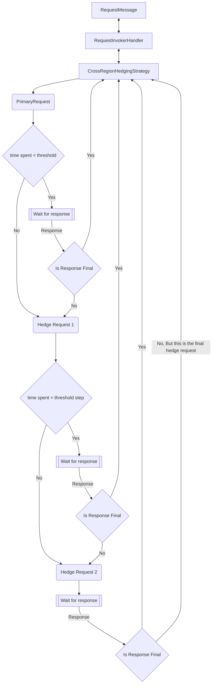

# Cross Region Request Hedging

The Cross Region Hedging Availability Strategy is a feature in the Cosmos SDK that enables the sending of redundant parallel requests to multiple regions during high latency periods. This feature can lower latency and improve availability in scenarios where a particular region is slow or temporarily unavailable, but it may incur more cost in terms of request units when parallel cross-region requests are required.

When the cross region hedging strategy is enabled, the SDK will send the first request to the primary region. If there is no response from the backend before the threshold time, then the SDK will begin sending hedged requests to the regions in order of the preferred regions list. After the first hedged request is sent out, the hedged requests will continue to be fired off one by one after waiting for the time specified in the threshold step. Once a response is received from one of the requests, the availability strategy will check to see if the result is considered final. If the result is final, then it is returned. If not, the SDK will skip the remaining threshold/threshold step time and send out the next hedged request. If all hedged requests are sent out and no final response is received, the SDK will return the last response it received.

The `AvailabilityStrategy` operates on the `RequestInvokerHandler` level meaning that each hedged request will go through its own [handler pipeline](https://github.com/Azure/azure-cosmos-dotnet-v3/blob/main/docs/SdkDesign.md#handler-pipeline), including the `ClientRetryPolicy`. This means that the hedged requests will be retried independently of each other. Note that the hedged requests are restricted to the region they are sent out in so no cross region retries will be made, only local retries. The primary request however, will behave as a normal request.

> **Note:** Hedging requires at least two available regions. If only a single region endpoint is available, the SDK will skip hedging and send the request normally.

## APIs

### Enable `AvailabilityStrategy` at client level

The example below will create a `CosmosClient` instance with `AvailabilityStrategy` enabled with a 1.5 seconds threshold. This means that if a request takes longer than 1.5 seconds the SDK will send a new request to the backend in order of the Preferred Regions List. If the `ApplicationRegion` or `ApplicationPreferredRegions` list is not set, then an `AvailabilityStrategy` will not be able to applied. Parallel requests to the remaining regions will be sent at 1 second intervals defined by the `thresholdStep` parameter until a final response is found or all regions are exhausted. The SDK will then return the first *final* response that comes back from the backend, if there are no final responses, the SDK will return the last result it received. The `threshold` parameter is a required parameter and can be set to any value greater than 0. There is also an option to add the `AvailabilityStrategy` at request level, overriding the client level `AvailabilityStrategy`, by setting an `AvailabilityStrategy` in the `RequestOptions` object.

When Building a new `CosmosClient` there will be an option to include a Cross Region Hedging Availability Strategy in that client.

```csharp
CosmosClient client = new CosmosClientBuilder("connection string")
    .WithApplicationPreferredRegions(
        new List<string> { "East US", "Central US", "West US" } )
    .WithAvailabilityStrategy(
        AvailabilityStrategy.CrossRegionHedgingStrategy(
            threshold: TimeSpan.FromSeconds(1.5),
            thresholdStep: TimeSpan.FromSeconds(1)
     ))
    .Build();
```

or

```csharp
CosmosClientOptions options = new CosmosClientOptions()
{
    AvailabilityStrategy
     = AvailabilityStrategy.CrossRegionHedgingStrategy(
        threshold: TimeSpan.FromSeconds(1.5),
        thresholdStep: TimeSpan.FromSeconds(1)
     ),
      ApplicationPreferredRegions = new List<string>() { "East US", "West US", "Central US"},
};

CosmosClient client = new CosmosClient(
    accountEndpoint: "account endpoint",
    authKeyOrResourceToken: "auth key or resource token",
    clientOptions: options);
```

> Note: `ApplicationRegion` or `ApplicationPreferredRegions` MUST be set to add an `AvailabilityStrategy`.

### Override client level `AvailabilityStrategy` or add `AvailabilityStrategy` at request level:

```csharp
//Send one request out with a more aggressive threshold
ItemRequestOptions requestOptions = new ItemRequestOptions()
{
    AvailabilityStrategy = AvailabilityStrategy.CrossRegionHedgingStrategy(
        threshold: TimeSpan.FromSeconds(1),
        thresholdStep: TimeSpan.FromSeconds(.5)
     )
};
```

#### Disable client level `AvailabilityStrategy`:

```csharp
//Send one request out without an AvailabilityStrategy
ItemRequestOptions requestOptions = new ItemRequestOptions()
{
    AvailabilityStrategy = AvailabilityStrategy.DisabledStrategy()
};
```

When enabled at the `CosmosClient` level, the availability strategy applies to all document-level read requests unless explicitly disabled per request. This includes ReadItem, Queries (single and cross partition), ReadMany, and ChangeFeed. Hedging does not apply to container, database, or other non-document resource operations.

## Hedging for Write Requests

Availability strategies can also be used for write requests. This feature is not enabled by default, but can be enabled by setting the `enableMultiWriteRegionHedge` parameter to `true` when creating the `CrossRegionHedgingStrategy`. This will allow the SDK to send out hedged requests for write requests as well. This feature can only be used for accounts where multi region writes are enabled. Like read requests, the SDK will only hedge for document requests, not container, database, or other write requests. Please note that all conflict resolution must be handled by the client application, and applications should be prepared to handle additional 409 (Conflict) and 412 (Precondition Failed) errors. Applications may also not be able to be deterministic on Create vs Replace in the case of Upsert operations. Write request hedging otherwise performs the same as read request hedging.

```csharp
CosmosClientOptions options = new CosmosClientOptions()
{
    AvailabilityStrategy
     = AvailabilityStrategy.CrossRegionHedgingStrategy(
        threshold: TimeSpan.FromSeconds(1.5),
        thresholdStep: TimeSpan.FromSeconds(1),
        enableMultiWriteRegionHedge: true
     ),
      ApplicationPreferredRegions = new List<string>() { "East US", "West US", "Central US"},
};

CosmosClient client = new CosmosClient(
    accountEndpoint: "account endpoint",
    authKeyOrResourceToken: "auth key or resource token",
    clientOptions: options);
```

## Diagnostics

In the diagnostics data there are three areas of note that will appear when hedging occurs: `Hedge Config`, `Hedge Context`, and `Response Region`. `Hedge Config` shows the configured availability strategy parameters, including the threshold, threshold step, and whether hedging for write requests is enabled. `Hedge Context` lists all the regions that requests were sent to. `Response Region` indicates which region's response was ultimately returned to the caller. A full example of a hedged request can be seen [here](https://github.com/Azure/azure-cosmos-dotnet-v3/tree/main/Microsoft.Azure.Cosmos.Samples/Usage/Hedging/ReadRequestDiagnosticsExample.json).

```json
"Summary": {
        "DirectCalls": {
            "(200, 0)": 1
        },
        "GatewayCalls": {
            "(200, 0)": 1
        }
    },
    "name": "ReadItemAsync",
    "start datetime": "2025-05-09T16:15:21.287Z",
    "duration in milliseconds": 1131.2238,
    "data": {
        "Client Configuration": {
            "Client Created Time Utc": "2025-05-09T16:15:19.8917662Z",
            "MachineId": "hashedMachineName:94d755e6-4bd9-6d68-c9d4-22b4d44d5b96",
            "NumberOfClientsCreated": 1,
            "NumberOfActiveClients": 1,
            "ConnectionMode": "Direct",
            "User Agent": "cosmos-netstandard-sdk/3.49.0|2|X64|Microsoft Windows 10.0.26100|.NET 6.0.36|L|",
            "ConnectionConfig": {
                "gw": "(cps:50, urto:6, p:False, httpf: False)",
                "rntbd": "(cto: 5, icto: -1, mrpc: 30, mcpe: 65535, erd: True, pr: ReuseUnicastPort)",
                "other": "(ed:False, be:False)"
            },
            "ConsistencyConfig": "(consistency: NotSet, prgns:[West US 3, West US], apprgn: )",
            "ProcessorCount": 12
        },
        "Hedge Config": "t:100ms, s:50ms, w:False",
        "Hedge Context": [
            "West US 3",
            "West US"
        ],
        "Response Region": "West US"
    }
```

### Status Codes SDK Will Consider Final

| Status Code | Description |
| --- | --- |
| 1xx | 1xx Status Codes are considered Final |
| 2xx | 2xx Status Codes are considered Final |
| 3XX | 3xx Status Codes are considered Final |
| 400 | Bad Request |
| 401 | Unauthorized |
| 404/0 | Not Found, 404/0 responses are final results as the document was not yet available after enforcing the consistency model |
| 409 | Conflict |
| 405 | Method Not Allowed |
| 412 | Precondition Failed |
| 413 | Request Entity Too Large |

All other status codes are treated as possible transient errors and will be retried with hedging.

### Example Flow For Cross Region Hedging With 3 Regions


```mermaid
graph TD
    A[RequestMessage] <--> B[RequestInvokerHandler]
    B <--> C[CrossRegionHedgingStrategy]
    C --> E(PrimaryRequest)
    E --> F{time spent < threshold}

    F -- No --> I
    F -- Yes --> G[[Wait for response]]
    G -- Response --> H{Is Response Final}
    H -- Yes --> C
    H -- No --> I(Hedge Request 1)
    
    I --> J{time spent < threshold step}

    J -- No --> K(Hedge Request 2) 
    J -- Yes --> M[[Wait for response]]
    M -- Response --> N{Is Response Final}
    N -- Yes --> C
    N -- No --> K

    K --> O[[Wait for response]]
    O -- Response --> P{Is Response Final}
    P -- Yes --> C
    P -- No, But this is the final hedge request --> C
    
```

## SDK Default Hedging with Per-Partition Automatic Failover (PPAF)

When Per-Partition Automatic Failover (PPAF) is enabled on the account and the client does not have an explicitly configured `AvailabilityStrategy`, the SDK will automatically enable a default hedging strategy. This default strategy uses the following thresholds:

- **Threshold**: `min(1000ms, RequestTimeout / 2)`
- **Threshold Step**: `500ms`
- **Write Hedging**: Disabled

If the request timeout is set to 0 (invalid), the SDK falls back to a default threshold of 1000ms.

This SDK-default hedging strategy is only applied when no client-level `AvailabilityStrategy` is explicitly configured. If a user sets their own `AvailabilityStrategy`, it takes precedence over the PPAF default. Similarly, the SDK-default strategy is automatically removed if PPAF is later disabled on the account.

## Availability Strategy Resolution Order

The SDK resolves which `AvailabilityStrategy` to use in the following priority order:

1. **Request-level** `RequestOptions.AvailabilityStrategy` (per-request override, highest priority)
2. **Client-level** `CosmosClientOptions.AvailabilityStrategy` (applies to all requests)
3. **SDK Default** (automatically applied when PPAF is enabled and no explicit strategy is configured)
4. **None** (hedging disabled)
