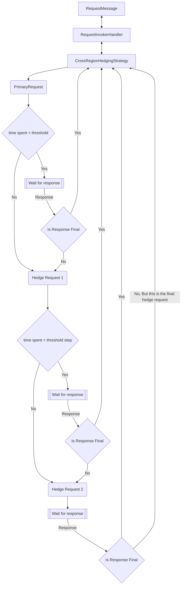

# Cross Region Request Hedging

The Cosmos SDK has two independent cross-region hedging systems. Both send a redundant copy of a slow request to another region and return the first acceptable answer while keeping the primary region authoritative, but they cover different request types and trigger on different signals:

| | Data-plane hedging (`AvailabilityStrategy`) | Metadata hedging |
| --- | --- | --- |
| **Covers** | Document reads (and, opt-in, multi-region writes) | The two metadata cache reads: `Collection` `Read` and `PartitionKeyRange` `ReadFeed` (first page) |
| **Configured by** | `CosmosClientOptions` / `RequestOptions` / `CosmosClientBuilder`, or the PPAF SDK default | SDK-managed; the `AZURE_COSMOS_METADATA_HEDGING_ENABLED` env var and the account PPAF state |
| **Hedges to** | Each remaining preferred region, one at a time | Exactly one other region |
| **Trigger** | The configured latency `threshold` | A fixed `1.5s` latency threshold, or a regional failure returned by the primary |
| **Status codes** | [Data-plane status codes](#status-codes-what-the-sdk-accepts-vs-hedges) | [Metadata status codes](#status-codes-what-triggers-a-metadata-hedge) |

Both systems require at least two available regions; with a single region endpoint the SDK skips hedging and sends the request normally.

## Data-Plane Request Hedging

The Cross Region Hedging Availability Strategy is a feature in the Cosmos SDK that enables the sending of redundant parallel requests to multiple regions during high latency periods. This feature can lower latency and improve availability in scenarios where a particular region is slow or temporarily unavailable, but it may incur more cost in terms of request units when parallel cross-region requests are required.

When the cross region hedging strategy is enabled, the SDK will send the first request to the primary region. If there is no response from the backend before the threshold time, then the SDK will begin sending hedged requests to the regions in order of the preferred regions list. After the first hedged request is sent out, the hedged requests will continue to be fired off one by one after waiting for the time specified in the threshold step. Once a response is received from one of the requests, the availability strategy will check to see if the result is considered final. If the result is final, then it is returned. If not, the SDK will skip the remaining threshold/threshold step time and send out the next hedged request. If all hedged requests are sent out and no final response is received, the SDK will return the last response it received.

The `AvailabilityStrategy` operates on the `RequestInvokerHandler` level meaning that each hedged request will go through its own [handler pipeline](https://github.com/Azure/azure-cosmos-dotnet-v3/blob/main/docs/SdkDesign.md#handler-pipeline), including the `ClientRetryPolicy`. This means that the hedged requests will be retried independently of each other. Note that the hedged requests are restricted to the region they are sent out in so no cross region retries will be made, only local retries. The primary request however, will behave as a normal request.

> **Note:** Hedging requires at least two available regions. If only a single region endpoint is available, the SDK will skip hedging and send the request normally.

## APIs

### Enable `AvailabilityStrategy` at client level

The example below will create a `CosmosClient` instance with `AvailabilityStrategy` enabled with a 1.5 seconds threshold. This means that if a request takes longer than 1.5 seconds the SDK will send a new request to the backend in order of the Preferred Regions List. If the `ApplicationRegion` or `ApplicationPreferredRegions` list is not set, then an `AvailabilityStrategy` will not be able to applied. Parallel requests to the remaining regions will be sent at 1 second intervals defined by the `thresholdStep` parameter until a final response is found or all regions are exhausted. The SDK will then return the first *final* response that comes back from the backend, if there are no final responses, the SDK will return the last result it received. The `threshold` parameter is a required parameter and can be set to any value greater than 0. There is also an option to add the `AvailabilityStrategy` at request level, overriding the client level `AvailabilityStrategy`, by setting an `AvailabilityStrategy` in the `RequestOptions` object.

When Building a new `CosmosClient` there will be an option to include a Cross Region Hedging Availability Strategy in that client.

```csharp
CosmosClient client = new CosmosClientBuilder("connection string")
    .WithApplicationPreferredRegions(
        new List<string> { "East US", "Central US", "West US" } )
    .WithAvailabilityStrategy(
        AvailabilityStrategy.CrossRegionHedgingStrategy(
            threshold: TimeSpan.FromSeconds(1.5),
            thresholdStep: TimeSpan.FromSeconds(1)
     ))
    .Build();
```

or

```csharp
CosmosClientOptions options = new CosmosClientOptions()
{
    AvailabilityStrategy
     = AvailabilityStrategy.CrossRegionHedgingStrategy(
        threshold: TimeSpan.FromSeconds(1.5),
        thresholdStep: TimeSpan.FromSeconds(1)
     ),
      ApplicationPreferredRegions = new List<string>() { "East US", "West US", "Central US"},
};

CosmosClient client = new CosmosClient(
    accountEndpoint: "account endpoint",
    authKeyOrResourceToken: "auth key or resource token",
    clientOptions: options);
```

> Note: `ApplicationRegion` or `ApplicationPreferredRegions` MUST be set to add an `AvailabilityStrategy`.

### Override client level `AvailabilityStrategy` or add `AvailabilityStrategy` at request level:

```csharp
//Send one request out with a more aggressive threshold
ItemRequestOptions requestOptions = new ItemRequestOptions()
{
    AvailabilityStrategy = AvailabilityStrategy.CrossRegionHedgingStrategy(
        threshold: TimeSpan.FromSeconds(1),
        thresholdStep: TimeSpan.FromSeconds(.5)
     )
};
```

#### Disable client level `AvailabilityStrategy`:

```csharp
//Send one request out without an AvailabilityStrategy
ItemRequestOptions requestOptions = new ItemRequestOptions()
{
    AvailabilityStrategy = AvailabilityStrategy.DisabledStrategy()
};
```

When enabled at the `CosmosClient` level, the availability strategy applies to all document-level read requests unless explicitly disabled per request. This includes ReadItem, Queries (single and cross partition), ReadMany, and ChangeFeed. Hedging does not apply to container, database, or other non-document resource operations.

## Hedging for Write Requests

Availability strategies can also be used for write requests. This feature is not enabled by default, but can be enabled by setting the `enableMultiWriteRegionHedge` parameter to `true` when creating the `CrossRegionHedgingStrategy`. This will allow the SDK to send out hedged requests for write requests as well. This feature can only be used for accounts where multi region writes are enabled. Like read requests, the SDK will only hedge for document requests, not container, database, or other write requests. Please note that all conflict resolution must be handled by the client application, and applications should be prepared to handle additional 409 (Conflict) and 412 (Precondition Failed) errors. Applications may also not be able to be deterministic on Create vs Replace in the case of Upsert operations. Write request hedging otherwise performs the same as read request hedging.

```csharp
CosmosClientOptions options = new CosmosClientOptions()
{
    AvailabilityStrategy
     = AvailabilityStrategy.CrossRegionHedgingStrategy(
        threshold: TimeSpan.FromSeconds(1.5),
        thresholdStep: TimeSpan.FromSeconds(1),
        enableMultiWriteRegionHedge: true
     ),
      ApplicationPreferredRegions = new List<string>() { "East US", "West US", "Central US"},
};

CosmosClient client = new CosmosClient(
    accountEndpoint: "account endpoint",
    authKeyOrResourceToken: "auth key or resource token",
    clientOptions: options);
```

## Diagnostics

In the diagnostics data there are three areas of note that will appear when hedging occurs: `Hedge Config`, `Hedge Context`, and `Response Region`. `Hedge Config` shows the configured availability strategy parameters, including the threshold, threshold step, and whether hedging for write requests is enabled. `Hedge Context` lists all the regions that requests were sent to. `Response Region` indicates which region's response was ultimately returned to the caller. A full example of a hedged request can be seen [here](https://github.com/Azure/azure-cosmos-dotnet-v3/tree/main/Microsoft.Azure.Cosmos.Samples/Usage/Hedging/ReadRequestDiagnosticsExample.json).

```json
"Summary": {
        "DirectCalls": {
            "(200, 0)": 1
        },
        "GatewayCalls": {
            "(200, 0)": 1
        }
    },
    "name": "ReadItemAsync",
    "start datetime": "2025-05-09T16:15:21.287Z",
    "duration in milliseconds": 1131.2238,
    "data": {
        "Client Configuration": {
            "Client Created Time Utc": "2025-05-09T16:15:19.8917662Z",
            "MachineId": "hashedMachineName:94d755e6-4bd9-6d68-c9d4-22b4d44d5b96",
            "NumberOfClientsCreated": 1,
            "NumberOfActiveClients": 1,
            "ConnectionMode": "Direct",
            "User Agent": "cosmos-netstandard-sdk/3.49.0|2|X64|Microsoft Windows 10.0.26100|.NET 6.0.36|L|",
            "ConnectionConfig": {
                "gw": "(cps:50, urto:6, p:False, httpf: False)",
                "rntbd": "(cto: 5, icto: -1, mrpc: 30, mcpe: 65535, erd: True, pr: ReuseUnicastPort)",
                "other": "(ed:False, be:False)"
            },
            "ConsistencyConfig": "(consistency: NotSet, prgns:[West US 3, West US], apprgn: )",
            "ProcessorCount": 12
        },
        "Hedge Config": "t:100ms, s:50ms, w:False",
        "Hedge Context": [
            "West US 3",
            "West US"
        ],
        "Response Region": "West US"
    }
```

### Programmatic Hedging Detection

In addition to the JSON fields above, `CosmosDiagnostics` exposes a typed API so callers can observe data-plane hedging on hot paths (logging, metrics, alerting) without parsing the diagnostics string:

- `bool HedgingStarted()` — returns `true` if at least one hedged (cross-region) dispatch was made for the operation.
- `IReadOnlyList<RequestedRegion> GetRequestedRegions()` — every region the SDK dispatched to, in dispatch order, each tagged with a `RequestedRegionReason` (`Initial`, `OperationRetry`, `RegionFailover`, `Hedging`, ...).
- `IReadOnlyList<string> GetRespondedRegions()` — the regions that produced a response, in arrival order.

```csharp
ItemResponse<MyItem> response = await container.ReadItemAsync<MyItem>(id, partitionKey);
CosmosDiagnostics diagnostics = response.Diagnostics;

if (diagnostics.HedgingStarted())
{
    foreach (RequestedRegion region in diagnostics.GetRequestedRegions())
    {
        Console.WriteLine($"Dispatched to {region.RegionName} ({region.Reason})");
    }
}
```

### Status Codes: What the SDK Accepts vs Hedges

Data-plane hedging is triggered by **latency**, not by a status code: the primary request is always sent first, and a hedged request to the next preferred region is only started once the `threshold` (then each `thresholdStep`) elapses without a *final* response.

When a response does come back, the SDK inspects its status code to decide whether it is **final** (accepted and returned to the caller, cancelling any outstanding hedges) or **transient** (the SDK keeps hedging to the next region; if every region is exhausted, the last response received is returned).

**Final status codes — accepted, hedging stops:**

| Status Code | Description |
| --- | --- |
| 1xx | Informational responses are final |
| 2xx | Success responses are final |
| 3xx | Redirect responses are final |
| 400 | Bad Request |
| 401 | Unauthorized |
| 404/0 | Not Found with sub-status `0`; final because the document was genuinely not present after enforcing the consistency model |
| 405 | Method Not Allowed |
| 409 | Conflict |
| 412 | Precondition Failed |
| 413 | Request Entity Too Large |

**Transient status codes — the SDK keeps hedging:**

Every status code **not** in the table above is treated as a possibly-transient, region-scoped failure, so the SDK continues issuing hedged requests to the remaining preferred regions. Representative examples:

| Status Code | Description |
| --- | --- |
| 403 | Forbidden (e.g. write-forbidden / region unavailable) |
| 404 (sub-status ≠ 0) | Not Found with a non-zero sub-status (e.g. read-session-not-available / partition-not-served) |
| 408 | Request Timeout |
| 410 | Gone |
| 429 | Too Many Requests (throttled) |
| 449 | Retry With |
| 500 | Internal Server Error |
| 503 | Service Unavailable |
| Network failure | Connection refused / DNS / TLS errors reaching a region |

> **Note:** These are the codes that cause the SDK to *keep hedging* to other regions. If the last available region also returns a transient code, that response is still returned to the caller as the final result, where it flows into the normal `ClientRetryPolicy`.

### Example Flow For Cross Region Hedging With 3 Regions


```mermaid
graph TD
    A[RequestMessage] <--> B[RequestInvokerHandler]
    B <--> C[CrossRegionHedgingStrategy]
    C --> E(PrimaryRequest)
    E --> F{time spent < threshold}

    F -- No --> I
    F -- Yes --> G[[Wait for response]]
    G -- Response --> H{Is Response Final}
    H -- Yes --> C
    H -- No --> I(Hedge Request 1)
    
    I --> J{time spent < threshold step}

    J -- No --> K(Hedge Request 2) 
    J -- Yes --> M[[Wait for response]]
    M -- Response --> N{Is Response Final}
    N -- Yes --> C
    N -- No --> K

    K --> O[[Wait for response]]
    O -- Response --> P{Is Response Final}
    P -- Yes --> C
    P -- No, But this is the final hedge request --> C
    
```

## SDK Default Hedging with Per-Partition Automatic Failover (PPAF)

When Per-Partition Automatic Failover (PPAF) is enabled on the account and the client does not have an explicitly configured `AvailabilityStrategy`, the SDK will automatically enable a default hedging strategy. This default strategy uses the following thresholds:

- **Threshold**: `min(1000ms, RequestTimeout / 2)`
- **Threshold Step**: `500ms`
- **Write Hedging**: Disabled

If the request timeout is set to 0 (invalid), the SDK falls back to a default threshold of 1000ms.

This SDK-default hedging strategy is only applied when no client-level `AvailabilityStrategy` is explicitly configured. If a user sets their own `AvailabilityStrategy`, it takes precedence over the PPAF default. Similarly, the SDK-default strategy is automatically removed if PPAF is later disabled on the account.

## Availability Strategy Resolution Order

The SDK resolves which `AvailabilityStrategy` to use in the following priority order:

1. **Gateway operator kill-switch** — if the account's Gateway-supplied `disableCrossRegionalHedging` flag is `true`, all hedging is turned off regardless of any other configuration (highest priority). See [Operator kill-switch](#operator-kill-switch).
2. **Request-level** `RequestOptions.AvailabilityStrategy` (per-request override)
3. **Client-level** `CosmosClientOptions.AvailabilityStrategy` (applies to all requests)
4. **SDK Default** (automatically applied when PPAF is enabled and no explicit strategy is configured)
5. **None** (hedging disabled)

### Operator kill-switch

`disableCrossRegionalHedging` is a Gateway account property that lets operators dynamically turn off cross-region hedging — both the PPAF SDK default and any customer-configured `AvailabilityStrategy` — without rolling PPAF back entirely. The SDK re-evaluates the flag on every account-properties refresh, so toggling it takes effect without a client restart: setting it to `true` suppresses hedging, and setting it back to `false` restores the customer-configured strategy (or rebuilds the SDK default). A client that has explicitly set `CosmosClientOptions.DisablePartitionLevelFailover` opts out of this Gateway-driven override entirely. The same flag also suppresses [metadata hedging](#metadata-hedging).

## Metadata Hedging

Metadata hedging is a separate, SDK-managed hedging path for the two **metadata cache reads** that sit on the critical path of nearly every operation. When the primary region is slow (or regionally unhealthy) on one of these reads, a single hedged read is sent to another region so a single slow region cannot stall cache population (cold start) or cache refresh.

Unlike the data-plane `AvailabilityStrategy`, metadata hedging is not configured through `CosmosClientOptions` or `RequestOptions`; it is turned on and off by the SDK based on the environment variable and account state described under [Enablement](#enablement). It is a latency optimization only — it races, it never adds retry attempts, and it never turns a real error into a success. A deep design write-up (algorithm, invariants, testing) lives in [`metadata-hedging-simple-design.md`](./metadata-hedging-simple-design.md).

### Scope

Hedging applies to exactly two metadata reads; everything else takes the normal single-region path unchanged:

| Cache | Operation | Notes |
| --- | --- | --- |
| `ClientCollectionCache` | `Collection` `Read` | Cold-start and refresh |
| `PartitionKeyRangeCache` | `PartitionKeyRange` `ReadFeed` | First page only; later pages are pinned to the winning region only when the hedge actually won |

### Enablement

Metadata hedging is resolved once at client construction and honored per request. The `AZURE_COSMOS_METADATA_HEDGING_ENABLED` environment variable is the master switch:

| Package | env var unset | `AZURE_COSMOS_METADATA_HEDGING_ENABLED=true` | `=false` |
| --- | --- | --- | --- |
| **Preview** | On | On | Off |
| **GA** | Follows the account's PPAF state | On | Off |

Setting the variable to `false` is a hard kill-switch — the strategy is never even constructed. The Gateway `disableCrossRegionalHedging` [operator kill-switch](#operator-kill-switch) also suppresses metadata hedging when set. At least two read regions must be available (after `ExcludeRegions`) for a hedge to be possible.

### Threshold

The threshold is a single fixed value derived at startup as `firstAttemptTimeout + 500ms` (today `~1s + 500ms = 1.5s`) and is **not customer-configurable**. It is intentionally kept strictly between the first (`~1s`) and second (`~5s`) control-plane HTTP attempt timeouts, so the SDK only hedges after the first local attempt has had its chance but before the long second-attempt timeout.

### Primary stays authoritative

The guiding invariant is: **the primary region is authoritative; the hedge can only *win* by being fast and returning a clean success, and it can never change the outcome the primary would have produced.** A hedge is only dispatched when the primary is slow past the threshold *or* the primary returns a regional failure. A definitive answer from the primary (a success, or a non-regional error such as 404 / 409 / 412) is always returned as-is, and a hedge can never override it. If neither branch is good, the primary's outcome (including its exception) is returned so the caller's retry policy sees exactly what it would have without hedging.

### Status Codes: What Triggers a Metadata Hedge

For metadata hedging the status code decides whether an outcome is a **regional failure** (the region — not the request — is at fault, so hedging to another region is worthwhile and a good hedge may win) or **definitive** (an authoritative answer the primary owns; the hedge cannot override it).

**Regional-failure outcomes — hedged, and a clean hedge may win:**

| Status Code | Sub-status | Meaning |
| --- | --- | --- |
| 503 | any | Service Unavailable (control-plane timeouts also surface as 503) |
| 500 | any | Internal Server Error |
| 410 | `LeaseNotFound` | Gone — partition moved |
| 403 | `DatabaseAccountNotFound` | Region unavailable for this account |
| Network failure | — | Bare connection failure reaching the region's gateway (connection refused / DNS / TLS) |

This is the same status / sub-status set used by the metadata retry policy (`MetadataRequestThrottleRetryPolicy`), so hedging and the retry policy agree on what "the region is at fault" means.

**Definitive outcomes — the primary wins, the hedge cannot override:**

| Status Code | Meaning |
| --- | --- |
| < 400 | Success |
| 404 | Not Found |
| 409 | Conflict |
| 412 | Precondition Failed |
| 401 / plain 403 | Auth failure — a misconfigured secondary can never surface a spurious error as the operation result |
| (caller cancellation) | Surfaces as `OperationCanceledException`; no hedge is spawned |

A hedge that returns one of these definitive outcomes (including an auth reject) is treated as a *losing* hedge and discarded; the primary's authoritative answer is returned instead.

### Diagnostics

When a hedge fires, the metadata read's trace carries a single datum keyed `Metadata Hedge`:

```
HedgeFired={true|false}; HedgeWon={true|false}; WinningRegion={region}
```

- `HedgeFired` — a hedge request was dispatched (the threshold elapsed, or the primary hit a regional failure).
- `HedgeWon` — the hedge's response is the one returned (its region differs from the primary). This is also the signal that pins later `PartitionKeyRange` pages to the winning region.
- `WinningRegion` — the region that produced the returned answer.

The datum is emitted only when a hedge actually fired, so the common no-hedge path leaves the trace unchanged.
