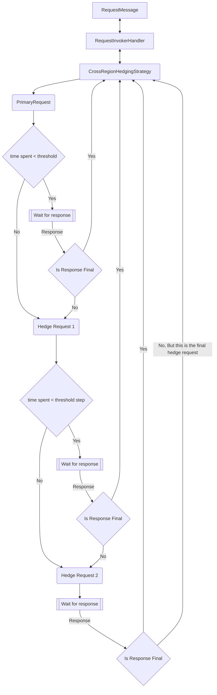

# Reliability achieve low end to end latency for read request with cross region hedging

The ability to specify a Cross Region Hedging Availability Strategy is a new feature in the Cosmos SDK that enables the sending of redundant parallel requests to multiple regions during high latency periods. This feature can lower latency and improve availability in scenarios where a particular region is slow or temporarily unavailable, but it may incur more cost in terms of request units when parallel cross-region requests are required. 

When the cross region hedging strategy is enabled, the SDK will send the first request to the primary region. If there is no response from the backend before the threshold time, then the SDK will begin sending hedged requests to the regions in order of the `ApplicationPreferredRegions` list. After the first hedged request is sent out, the hedged requests will continue to be fired off one by one after waiting for the time specified in the threshold step. Once a response is received from one of the requests, the availability strategy will check to see if the result is considered final. If the result is final, then it is returned. If not, the SDK will skip the remaining threshold/threshold step time and send out the next hedged request. If all hedged requests are sent out and no final response is received, the SDK will return the last response it received. 

The `AvailabilityStrategy` operates on the `RequestInvokerHandler` level meaning that each hedged request will go through its own [handler pipeline](https://github.com/Azure/azure-cosmos-dotnet-v3/blob/master/docs/SdkDesign.md#handler-pipeline), including the `ClientRetryPolicy`. This means that the hedged requests will be retried independently of each other. Note that the hedged requests are restricted to the region they are sent out in so no cross region retries will be made, only local retries. The primary request however, will behave as a normal request.

## APIs

### Enable `AvailabilityStrategy` at client level

The example below will create a `CosmosClient` instance with `AvailabilityStrategy` enabled with a 1.5 seconds threshold. This means that if a request takes longer than 1.5 seconds the SDK will send a new request to the backend in order of the Preferred Regions List. If the `ApplicationRegion` or `ApplicationPreferredRegions` list is not set, then an `AvailabilityStrategy` will not be able to applied. Parallel requests to the remaining regions will be sent at 1 second intervals defined by the `thresholdStep` parameter until a final response is found or all regions are exhausted. The SDK will then return the first *final* response that comes back from the backend, if there are no final responses, the SDK will return the last result it received. The `threshold` parameter is a required parameter and can be set to any value greater than 0. There is also an option to add the `AvailabilityStrategy` at request level, overriding the client level `AvailabilityStrategy`, by setting an `AvailabilityStrategy` in the `RequestOptions` object.

When Building a new `CosmosClient` there will be an option to include a Cross Region Hedging Availability Strategy in that client.

```csharp
CosmosClient client = new CosmosClientBuilder("connection string")
    .WithApplicationPreferredRegions(
        new List<string> { "East US", "Central US", "West US" } )
    .WithAvailabilityStrategy(
        AvailabilityStrategy.CrossRegionHedgingStrategy(
            threshold: TimeSpan.FromSeconds(1.5),
            thresholdStep: TimeSpan.FromSeconds(1)
     ))
    .Build();
```

or

```csharp
CosmosClientOptions options = new CosmosClientOptions()
{
    AvailabilityStrategy
     = AvailabilityStrategy.CrossRegionHedgingStrategy(
        threshold: TimeSpan.FromSeconds(1.5),
        thresholdStep: TimeSpan.FromSeconds(1)
     ),
      ApplicationPreferredRegions = new List<string>() { "East US", "West US", "Central US"},
};

CosmosClient client = new CosmosClient(
    accountEndpoint: "account endpoint",
    authKeyOrResourceToken: "auth key or resource token",
    clientOptions: options);
```

> Note: `ApplicationRegion` or `ApplicationPreferredRegions` MUST be set to add an `AvailabilityStrategy`.

### Override client level `AvailabilityStrategy` or add `AvailabilityStrategy` at request level:

```csharp
//Send one request out with a more aggressive threshold
ItemRequestOptions requestOptions = new ItemRequestOptions()
{
    AvailabilityStrategyOptions = AvailabilityStrategy.CrossRegionHedgingStrategy(
        threshold: TimeSpan.FromSeconds(1),
        thresholdStep: TimeSpan.FromSeconds(.5)
     ))
};
```

#### Disable client level `AvailabilityStrategy`:

```csharp
//Send one request out without an AvailabilityStrategy
ItemRequestOptions requestOptions = new ItemRequestOptions()
{
    AvailabilityStrategyOptions = AvailabilityStrategy.DisabledStrategy()
};
```

When enabled at the `CosmosClient` level, the availability strategy applies to all read requests unless explicitly disabled per request: ReadItem, Queries (single and cross partition), ReadMany, and ChangeFeed. It is not enabled for write requests.

## Diagnostics

In the diagnostics data there are two new areas of note `Response Region` and `Hedge Context` that will appear when using this feature. `Response Region` shows the region that the request is ultimately served out of. `Hedge Context` shows all the regions requests were sent to.

```json
"Summary": {
        "DirectCalls": {
            "(200, 0)": 2
        },
        "GatewayCalls": {
            "(200, 0)": 4,
            "(304, 0)": 1
        }
    },
    "name": "ReadItemAsync",
    "start datetime": "2024-10-09T21:26:22.101Z",
    "duration in milliseconds": 1188.7136,
    "data": {
        "Client Configuration": {
            "Client Created Time Utc": "2024-10-09T21:26:22.0996575Z",
            "MachineId": "hashedMachineName",
            "NumberOfClientsCreated": 1,
            "NumberOfActiveClients": 1,
            "ConnectionMode": "Direct",
            "User Agent": "cosmos-netstandard-sdk/3.44.0|2|X64|Microsoft Windows 10.0.22631|.NET 6.0.35|L|",
            "ConnectionConfig": {
                "gw": "(cps:50, urto:6, p:False, httpf: False)",
                "rntbd": "(cto: 5, icto: -1, mrpc: 30, mcpe: 65535, erd: True, pr: ReuseUnicastPort)",
                "other": "(ed:False, be:False)"
            },
            "ConsistencyConfig": "(consistency: NotSet, prgns:[Central US, North Central US], apprgn: )",
            "ProcessorCount": 12
        },
        "Hedge Context": [
            "Central US",
            "North Central US"
        ],
        "Response Region": "North Central US"
    }
```

### Status Codes SDK Will Consider Final

| Status Code | Description |
| --- | --- |
| 1xx | 1xx Status Codes are considered Final |
| 2xx | 2xx Status Codes are considered Final |
| 3XX | 3xx Status Codes are considered Final |
| 400 | Bad Request |
| 401 | Unauthorized |
| 404/0 | Not Found, 404/0 responses are final results as the document was not yet available after enforcing the consistency model |
| 409 | Conflict |
| 405 | Method Not Allowed |
| 412 | Precondition Failed |
| 413 | Request Entity Too Large |

All other status codes are treated as possible transient errors and will be retried with hedging.

### Example Flow For Cross Region Hedging With 3 Regions


