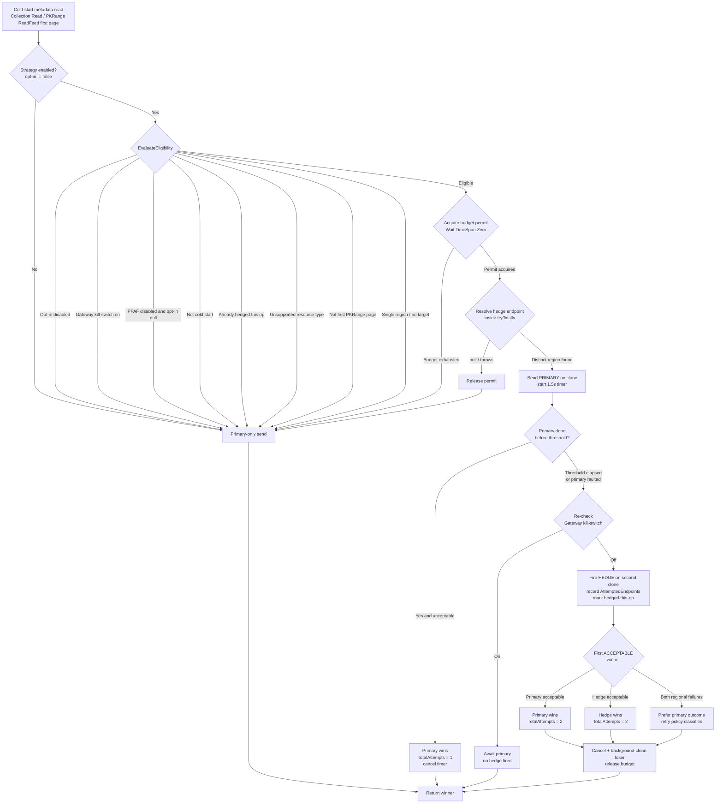
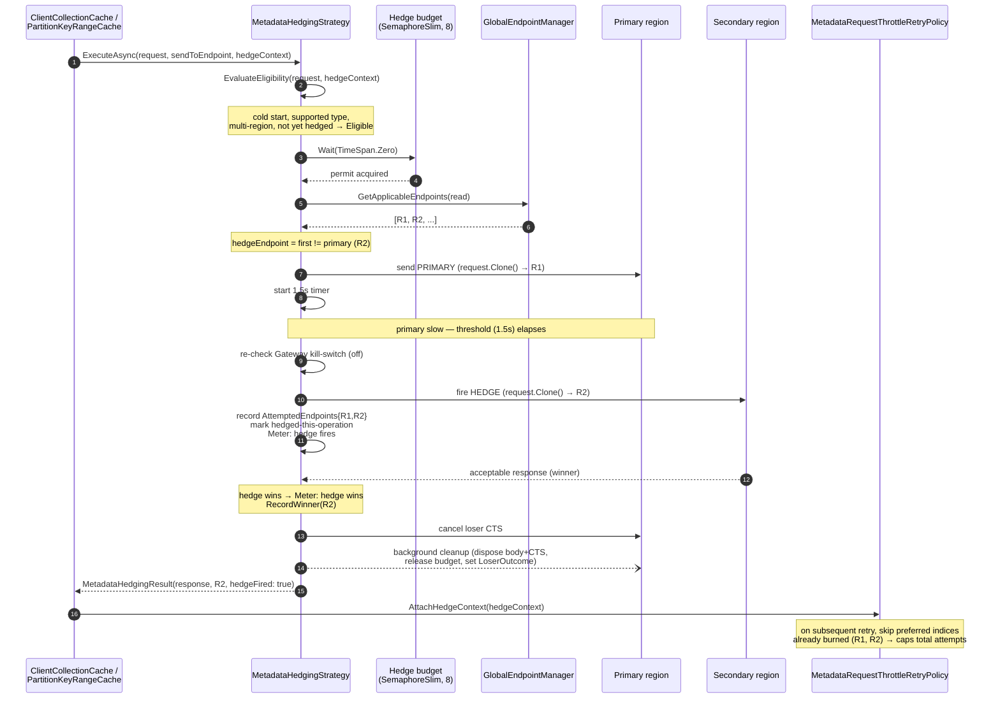
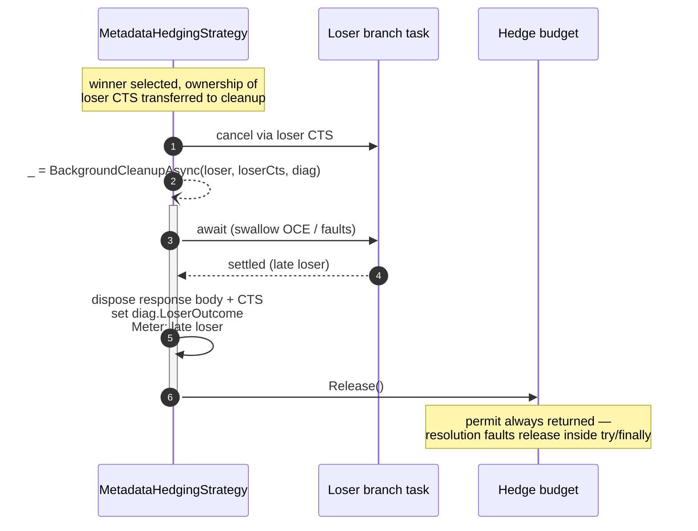

# CrossRegionalHedging: Adds Metadata Hedging Support (PR #5923)

> Corrected and detailed description for PR
> [#5923](https://github.com/Azure/azure-cosmos-dotnet-v3/pull/5923).
> Closes issue [#5917](https://github.com/Azure/azure-cosmos-dotnet-v3/issues/5917).
> Full design: [docs/PPAF_Metadata_Hedging_ColdStart_Design.md](./PPAF_Metadata_Hedging_ColdStart_Design.md).

## Summary

Adds **bounded cross-region hedging** for metadata cache reads so a slow primary
region no longer dominates the latency tail of the `Collection` and
`PartitionKeyRange` metadata cache reads. Hedging applies to **both** the
first-population (cold-start) read **and** steady-state **refresh /
force-refresh** reads of those two caches — it is restricted by **request type**
(`Collection` `Read`, `PartitionKeyRange` `ReadFeed` first page), **not** by
cold start.

> **Scope change vs. earlier revisions of this PR.** Earlier revisions limited
> hedging to the cold-start window only. We decided hedging should also cover
> steady-state refresh reads of the same two caches, because a degraded primary
> inflates the latency tail on refresh reads just as it does on cold start. The
> `IsColdStart` signal is retained for **diagnostics only** (cold vs. warm
> observability) and no longer gates eligibility; the
> `MetadataHedgeSkipReason.NotColdStart` skip reason is retired (never produced).
> Every amplification safeguard is unchanged — see "Not bombarding the Gateway"
> below.

The feature is **internal in Phase 1** — there is no public configuration API and
no public API/contract surface. The effective opt-in follows the account's PPAF
(Per-Partition Automatic Failover) state and can be force-enabled or suppressed
through an environment variable.

## What changed

| Area | Change |
| --- | --- |
| `MetadataHedgingStrategy` (new) | One instance per `CosmosClient`; orchestrates a single bounded cross-region hedge for an eligible metadata read (cold-start **or** refresh). |
| `MetadataRegionalFailureClassifier` (new) | Neutral, shared static (`IsRegionalFailure`) consumed by **both** the strategy and `MetadataRequestThrottleRetryPolicy` — the retry policy no longer depends on the hedging type for its core classification. |
| `ClientCollectionCache` / `PartitionKeyRangeCache` | Wired to consume the strategy for metadata reads (both first-population and refresh). Collection `Read` and `PartitionKeyRange` `ReadFeed` (first page only). |
| `MetadataRequestThrottleRetryPolicy` | Skips preferred-location indices a hedge already burned (cross-region dedup), capping total attempts at the preferred-region count. Receives the hedge context through the narrow `IMetadataHedgeContextReceiver` seam. |
| `ClearingSessionContainerClientRetryPolicy` | Forwards the hedge context to its inner policy via `AttachHedgeContext` so dedup survives policy wrapping. |
| `ConfigurationManager` | `AZURE_COSMOS_METADATA_HEDGING_FOR_COLDSTART_ENABLED` env var + `GetMetadataHedgingForColdStartOptIn()` resolver (env-var only — no public option). |
| Telemetry | New `Azure.Cosmos.Client.MetadataHedging` Meter (`internal MetadataHedgingMetrics`, no public/contract surface), `CosmosDbEventSource` events, and a `Metadata Hedge Context` diagnostics datum. |

## How it works

- A single `MetadataHedgingStrategy` is created per `CosmosClient` and consumed by
  `ClientCollectionCache` (Collection `Read`) and `PartitionKeyRangeCache`
  (`PartitionKeyRange` `ReadFeed`, **first page only**), for both first-population
  and refresh reads.
- On an eligible metadata read the strategy issues the **primary**
  request and starts a timer. If the primary has not produced an *acceptable*
  response within the threshold, it dispatches a **single hedged** request to a
  second preferred region and returns the first acceptable winner. The losing
  branch is cancelled and cleaned up in the background (response body + CTS
  disposed, budget released).
- **Threshold** is SDK-derived and **not customer-configurable**:
  `HttpTimeoutPolicyControlPlaneRetriableHotPath.FirstAttemptTimeout` (1 s) +
  `500 ms` = **1.5 s**.
- **Concurrency** is bounded by a per-client budget (`SemaphoreSlim`, default **8**)
  acquired with a non-blocking `Wait(TimeSpan.Zero)`; when exhausted the request
  transparently falls back to primary-only.
- Each branch operates on an **independent `DocumentServiceRequest.Clone()`**, so
  concurrent `RouteToLocation` calls never corrupt one another's target region.
- **Cross-region dedup**: the hedge records the regions it touched in
  `AttemptedEndpoints`; `MetadataRequestThrottleRetryPolicy` then skips preferred-
  location indices a hedge already burned, capping total attempts at the preferred-
  region count. The context is handed to the retry policy through the narrow
  `IMetadataHedgeContextReceiver` seam (forwarded by
  `ClearingSessionContainerClientRetryPolicy`) rather than a fragile concrete-type
  cast.
- **Shared failure classification**: the regional-failure list (503/500,
  `Gone` + `LeaseNotFound`, `Forbidden` + `DatabaseAccountNotFound`,
  `HttpRequestException`, non-user `OperationCanceledException`) lives in the
  neutral `MetadataRegionalFailureClassifier` used by both the strategy and the
  retry policy. A hedge-branch `401` / plain `403` is **never** accepted as a
  winner, and the cross-region auth-reject signal is captured for **both** returned
  responses and thrown `DocumentClientException`s (the `GatewayStoreModel` path).
- **Budget safety**: hedge-endpoint resolution (`GetApplicableEndpoints` +
  `FirstOrDefault`) runs **inside** the `try`/`finally` so that a throw (concurrent
  location-cache refresh/failover) or a null result still releases the permit — a
  permit can no longer leak for the lifetime of the client.

## Enablement (Phase 1 — internal)

There is **no public configuration surface** in Phase 1. The effective opt-in is
tri-state and resolved as **environment variable → PPAF state**:

| Setting | `null` (unset / invalid) | `true` | `false` |
| --- | --- | --- | --- |
| `AZURE_COSMOS_METADATA_HEDGING_FOR_COLDSTART_ENABLED` | follow PPAF | force-enable (even non-PPAF) | suppress (kill switch) |

When the variable is unset, hedging follows the account's PPAF state — **active for
PPAF-enabled multi-region accounts** and **off by default for non-PPAF accounts**.
The Gateway kill-switch seam (`disableCrossRegionalHedging`) is wired into the
eligibility check and is **hard-wired off in Phase 1**.

Resolution precedence:

1. The `AZURE_COSMOS_METADATA_HEDGING_FOR_COLDSTART_ENABLED` env var (when a valid bool) wins.
2. Otherwise `null` → follow the live PPAF state (`customerOptIn ?? isPpafEnabled`).

## Eligibility gate

A live strategy is only constructed when hedging is not explicitly disabled. The
per-request gate in `EvaluateEligibility` skips (falls back to primary-only) for any
of the following reasons:

- Opt-in disabled / Gateway kill-switch on / PPAF disabled (when opt-in is `null`).
- Already hedged this operation.
- Unsupported resource type (only `Collection` `Read` and `PartitionKeyRange` `ReadFeed`).
- `PartitionKeyRange` read that is not the first read-feed page.
- Single-region account (≤ 1 read endpoint, or excluded regions leave no target).
- Concurrency budget exhausted.

> Cold start is **not** in this list. As of the latest revision, a non-cold-start
> (refresh) read of a supported type is eligible on the same terms as a cold-start
> read; `IsColdStart` is recorded for diagnostics only.

## Not bombarding the Gateway (amplification safeguards)

Broadening to refresh reads does **not** increase steady-state secondary-region
load unboundedly. A hedge is only ever dispatched for a read that is *both*
eligible *and* slow, and the following safeguards (unchanged from the cold-start
design) bound the fan-out:

- **Latency threshold (1.5 s).** A hedge fires only if the primary has not
  produced an acceptable response within `FirstAttemptTimeout + 500 ms`. A healthy
  primary (the overwhelming majority of refreshes) never hedges.
- **One hedge per logical operation.** `HasHedgedThisOperation` latches the first
  dispatch; retries within the same operation never re-hedge.
- **Per-client concurrency budget (default 8).** Acquired with a non-blocking
  `Wait(TimeSpan.Zero)`; when exhausted the read transparently falls back to
  primary-only (`SkipReason=BudgetExhausted`).
- **First page only** for `PartitionKeyRange` ReadFeed; subsequent pages pin to the
  winning region.
- **Cross-region dedup** with `MetadataRequestThrottleRetryPolicy` caps total
  attempts at the preferred-region count.
- **Single-region / excluded-region** reads never hedge.

## Observability

- New `Azure.Cosmos.Client.MetadataHedging` Meter
  (`hedge fires` / `hedge wins` / `budget exhausted` / `late loser` / `auth reject`).
- `CosmosDbEventSource` events for the same lifecycle points.
- A `Metadata Hedge Context` diagnostics datum (eligibility, regions, threshold,
  fired-elapsed, winner/loser outcome).

## Type of change

New feature (non-breaking change which adds functionality). No public API surface
in Phase 1; observable only through diagnostics/telemetry.

---

## Flow diagram

The eligibility + dispatch decision flow for a single cold-start metadata read:

## Sequence diagram

The cold-start path where the primary region is slow and the hedge wins, including
cross-region dedup hand-off to the retry policy:

### Background cleanup & budget lifecycle

