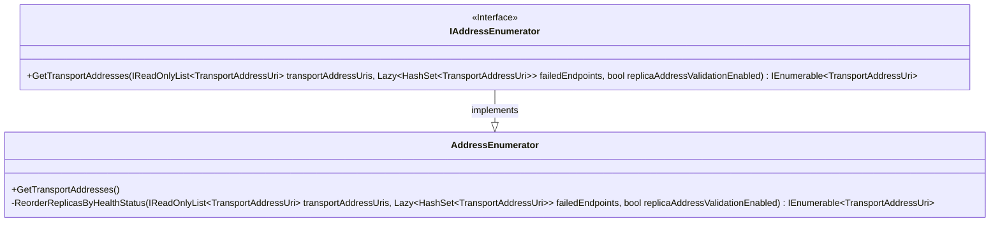

# Design Approach to Validate Backend Replicas During Service Upgrade in Direct Mode

## Table of Contents

* [Backgraound.]()
* [Proposed Solution.]()
* [Design Approach.]()
    * Outline.
    * Updated Sequence Diagram for `CosmosClient` initialization.
    * Sequence Diagram when `StoreReader` invokes the `GatewayAddressCache` to resolve addresses and leverages `AddressEnumerator` to enumerate the transport addresses.
    * State Diagram to Understand the `TransportAddressUri` Health State Transformations.
    * `Azure.Cosmos.Direct` package class diagrams.
    * `Microsoft.Azure.Cosmos` package class diagrams.
* [Pull Request with Sample Code Changes.]()
* [References.]()

## Backgraound

During an upgrade scenario in the backend replica nodes, there has been an observation of increased request latency. One of the primary reason for the latency is that, during an upgrade, a replica which is still undergoing upgrade may still be returned back to SDK, when an address refresh occurres. As of today, the incoming request will have 25% chance to hit the replica that not ready yet, therefore causing the `ConnectionTimeoutException`, which contributes to the increased latency. 

To understand the problem statement better, please take a look at the below sequence diagram which reflects the connection timeouts caused by the replica upgrade.

## Proposed Solution

The .NET SDK will track the replica endpoint health based on client side metrics, and de-prioritize the replica which were marked as - `Unhealthy`. SDK will validate the health of the replica by attempting to open RNTBD connections to the backend. When SDK refresh addresses back from gateway for a partition, **SDK will only validate the replica/s which were in `Unhealthy` status, by opening RNTBD connection requests**. This process will be completed with best effort, which means:

- If the validation can not finish within `1 min` of opening connections, the de-prioritize will stop for certain status.

- The selection of the replica will not be blocked by the validation process. To better understand this - if a request needs to be sent to `N` replicas, and if there is only `N-1` replica in good status, it will still go ahead selecting the `Nth` replica which needs validation.

- It is opt in only for now, by setting the environment variable `AZURE_COSMOS_REPLICA_VALIDATION_ENABLED` to `true`.

## Design Approach

### Outline

The basic idea for this design approach has been divited into *three* parts, which has been mentioned below in detail:

- Maintain `4` new health statuses into the `TransportAddressUri`, which are :

  - **`Connected`** (Indicates that there is already a connection made successfully to the backend replica)
  - **`Unknown`** (Indicates that the connection exists however the status is unknown at the moment)
  - **`Unhealthy Pending`** (Indicates that the connection was unhealthy previously, but an attempt will be made to validate the replica to check the current status)
  - **`Unhealthy`** (Indicates that the connection is unhealthy at the moment)

- Validate the `Unhealthy` replicas returned from the Address Cache, by attempting to open the RNTBD connection. Note that the validation task and the connection opening part has been done as a background task, so that the address resolving doesn't wait on the RNTBD context negotiation to finish.

- Leverage the `AddressEnumerator` to reorder the replicas by their health statuses. For instance, if the replica validation is enabled, the `AddressEnumerator` will reorder the replicas by sorting them in the order of **Connected/ Unknown** > **Unhealthy Pending** > **Unhealthy**. However, if the replica validation is disabled, the replicas will be sorted in the order of **Connected/ Unknown/ Unhealthy Pending** > **Unhealthy**.

Prior discussing the replica validation, it is very important to understand the changes in the flow while opening the RNTBD connections to the backend replica nodes, during the `CosmosClient` initialization. The changes in the flow are mentioned below as an updated sequence diagram.

### Updated Sequence Diagram for `CosmosClient` initialization.

Now that we are well aware of the changes in the RNTBD open connection flow, let's leverage the changes in the replica validation flow. The below sequence diagram describes the request and response flow from `StoreReader` (present in the `Cosmos.Direct` namespace) to the `GatewayAddressCache` (present in the `Microsoft.Azure.Cosmos` namespace), during the read request to backend replica/s.

### Sequence Diagram when `StoreReader` invokes the `GatewayAddressCache` to resolve addresses and leverages `AddressEnumerator` to enumerate the transport addresses.

### State Diagram to Understand the `TransportAddressUri` Health State Transformations.

To better understand the design, it is critical to understand the `TransportAddressUri` health state transformations. The below state diagram depicts the `TransportAddressUri` state transitions in detail.

To accomplish the above changes in the replica validation flow, below are the class diagrams and the proposed code changes in both `Azure.Cosmos.Direct` and `Microsoft.Azure.Cosmos` packages.

### `Azure.Cosmos.Direct` package class diagrams.

Introduce a new `IOpenConnectionsHandler` interface with `OpenRntbdChannelsAsync()` method. Create a new class `RntbdOpenConnectionHandler` that will eventually implement the `IOpenConnectionsHandler` interface and override the `OpenRntbdChannelsAsync()` method to establish Rntbd connections to the transport address uris. Note that, this class will also add the concurrency control logic, so that any burst of connection creation could be avoided. The below class diagram depicts the same behavior.

Extend the `IAddressResolverExtension` interface with `SetOpenConnectionsHandler()` method. The benefits and the utilizations are provided below: 

- The `GlobalAddressResolver` can then implement the `SetOpenConnectionsHandler()` method, which will be invoked by the `StoreClient` constructor to set the `RntbdOpenConnectionHandler`. 

- The `OpenConnectionsAsync()` method present inside `GlobalAddressResolver`,  will be invoked from the `ReplicatedResourceClient` eventually. The `AddressResolver` class can simply implement the method/s and return an empty `Task`. The `GlobalAddressResolver`.`OpenConnectionsAsync()` is responsible for 

    - Resolving the collection by the database name and container link, 
    - Fetching the partition key full ranges and
    - Invoking the `GatewayAddressCache` for the preferred region, with the `RntbdOpenConnectionHandler` instance, passed by the `StoreClient`. 
    
The below class diagram depicts the same behavior.

*[Note: The `IAddressResolverExtension` was introduced to hold the new methods, which could break the existing build, if put directly into `IAddressResolver` interface. The `IAddressResolverExtension` will be removed eventually and the existing methods will be moved into `IAddressResolver` interface.]*

Update the method definition of `GetTransportAddresses()` present in `IAddressEnumerator` to add a new `boolean` argument `replicaAddressValidationEnabled`. This will help to choose the correct set of replica/s when replica validation is enabled or disabled. Additionally, a new private method `ReorderReplicasByHealthStatus()` will be added in `AddressEnumerator` to re-order the transport uri/s by their health status priority. The below class diagram depicts the same changes.

This class will be updated eventually, with critical set of changes required for the replica validation workstream. It will introduce an enum `HealthStatus` with `4` new health statuses - `Connected`, `Unknown`, `UnhealthyPending` and `Unhealthy` to re-order the replicas with their status priorities. The setters will help to capture the correct health state of the `TransportAddressUri` at any given point of time. The below class diagram depicts the same behavior.

### `Microsoft.Azure.Cosmos` package class diagrams.

Extend the `IAddressCache` interface with `SetOpenConnectionsHandler()` method. This method should take an instance of the `RntbdOpenConnectionHandler` (which implements the `IOpenConnectionsHandler`) and sets it to a private field for later usage, to establish the Rntbd connectivity to the backend replica nodes.

Add a new method `Refresh()` into the `AsyncCacheNonBlocking` to force refresh the address cache on demand. Note that `Refresh()` is used to force refresh any `Unhealthy` replica nodes, which has been in `Unhealthy` state for more than `1` minute. That way, any `Unhealthy` replica nodes will be back into the validation pool, which will eventually be useful to avoid any skewed replica selection. 

## Pull Request with Sample Code Changes

Here is the link to a sample PR which provides an overview of the incoming changes.

## References

- [Mermaid Documentation.](https://mermaid-js.github.io/mermaid/#/)
- [Upgrade Resiliency Tasks List.](https://github.com/Azure/azure-cosmos-dotnet-v3/issues/3409)
- [Design Document to Utilize RNTBD Context Negotiation During `CosmosClient` Initialization.](https://github.com/Azure/azure-cosmos-dotnet-v3/issues/3442)