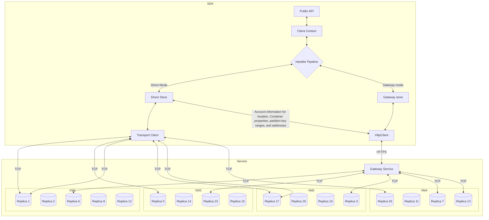

# Introduction and high level SDK concepts

## Important Cosmos DB Concepts

### Cosmos DB scaling:
https://docs.microsoft.com/azure/cosmos-db/partitioning-overview

### Cosmos DB consistency levels:
https://docs.microsoft.com/azure/cosmos-db/consistency-levels

## Try running and walking through the samples:
https://github.com/Azure/azure-cosmos-dotnet-v3/blob/master/Microsoft.Azure.Cosmos.Samples/Usage/ItemManagement/Program.cs

## High level overview of the SDK

## Caches the SDK maintains:

## Direct mode overview:

