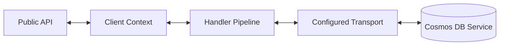
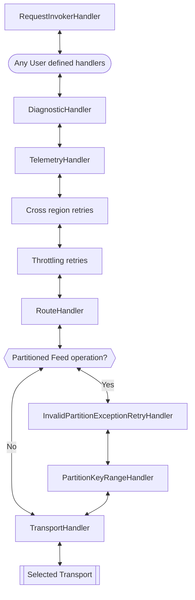
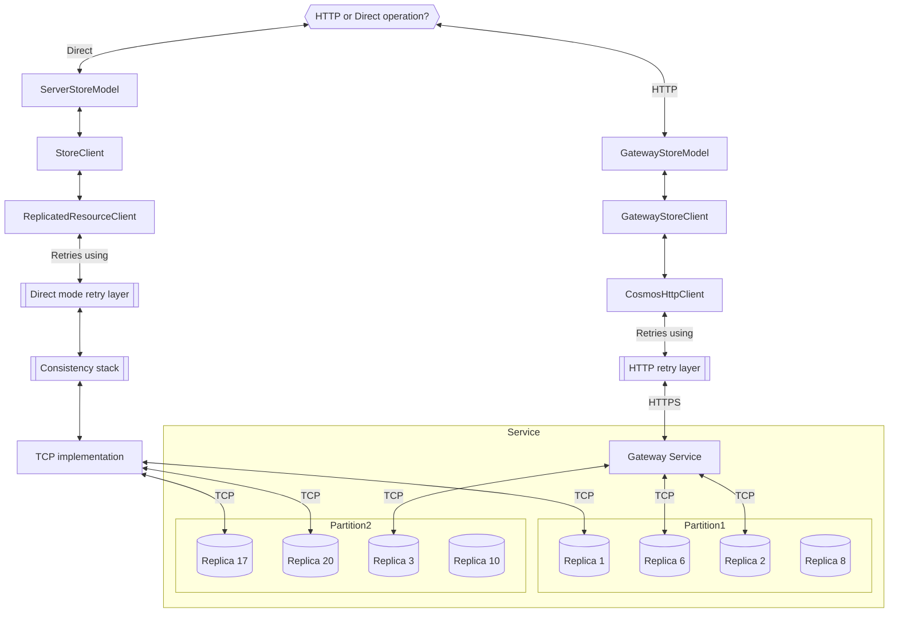
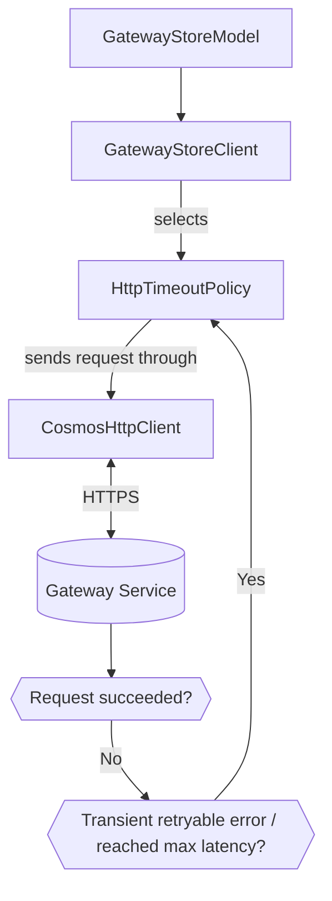
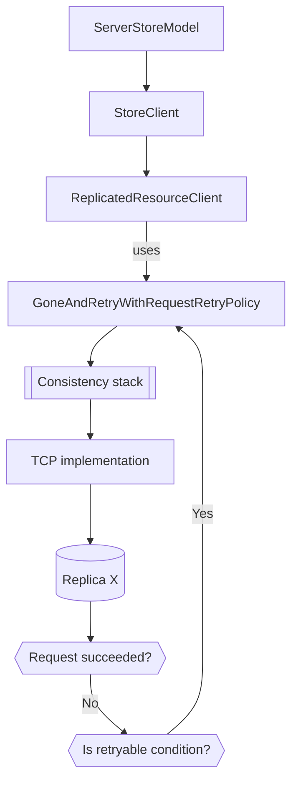
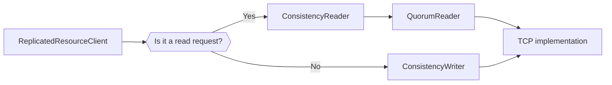
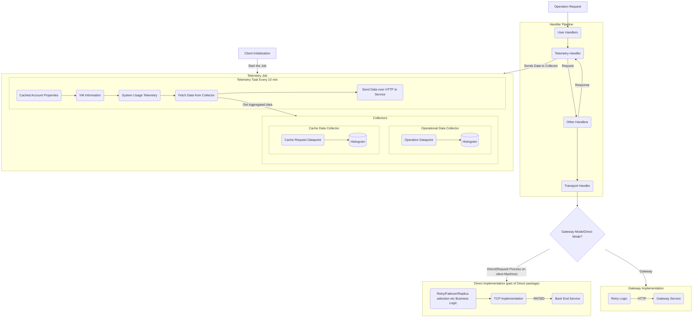
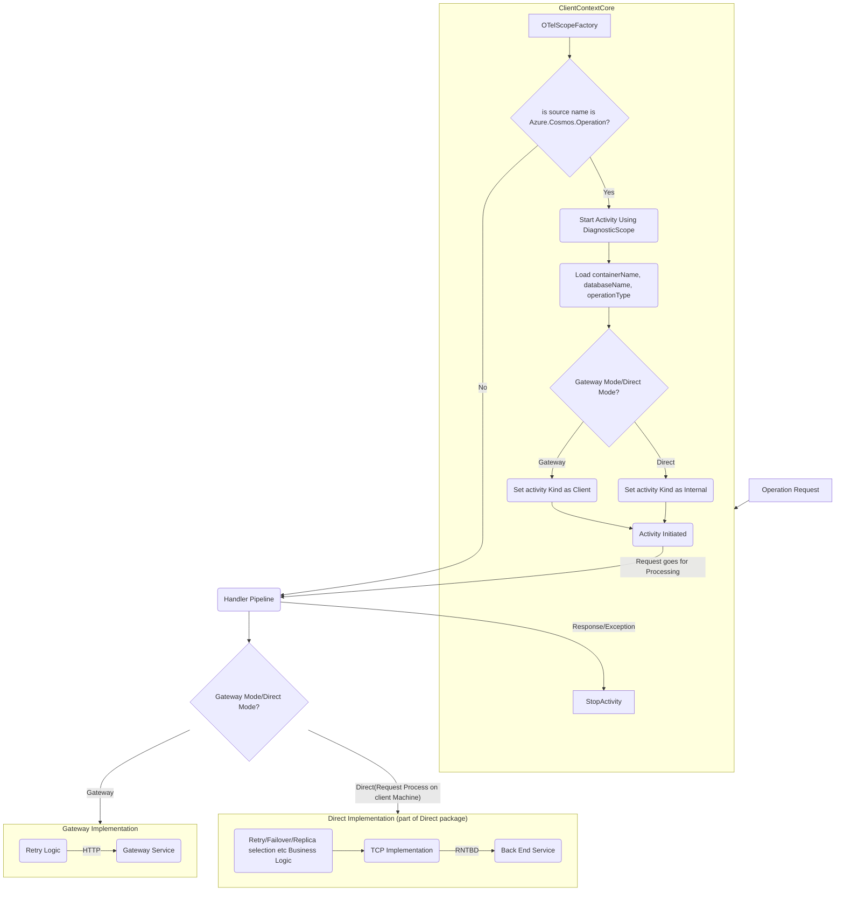

# .NET SDK component graph

## General component schema

Whenever an operation is executed through the .NET SQL SDK, a **public API** is invoked. The API will leverage the [ClientContext](../Microsoft.Azure.Cosmos/src/Resource/ClientContextCore.cs) to create the [Diagnostics](../Microsoft.Azure.Cosmos/src/Diagnostics/CosmosDiagnostics.cs) scope for the operation (and any retries involved) and create the [RequestMessage](../Microsoft.Azure.Cosmos/src/Handler/RequestMessage.cs).

The **handler pipeline** is used to process and handle the RequestMessage and perform actions like handling [retries](../Microsoft.Azure.Cosmos/src/Handler/RetryHandler.cs) including any custom user handler added through `CosmosClientOptions.CustomHandlers`. See [the pipeline section](#handler-pipeline) for more details.

At the end of the pipeline, the request is sent to the **transport layer**, which will process the request depending on the `CosmosClientOptions.ConnectionMode` and use [gateway or direct connectivity mode](https://docs.microsoft.com/azure/cosmos-db/sql/sql-sdk-connection-modes) to reach to the Azure Cosmos DB service.

## Handler pipeline

The handler pipeline processes the RequestMessage and each handler can choose to augment it in different ways, as shown in our [handler samples](../Microsoft.Azure.Cosmos.Samples/Usage/Handlers/) and also handle certain error conditions and retry, like our own [RetryHandler](../Microsoft.Azure.Cosmos/src/Handler/RetryHandler.cs). The RetryHandler will handle any failures from the [Transport layer](#transport) that should be [handled as regional failovers](#cross-region-retries).

The default pipeline structure is:

## Throttling retries

Any HTTP response, with a status code `429` from the service means the current operation is being [rate limited](https://learn.microsoft.com/azure/cosmos-db/sql/troubleshoot-request-rate-too-large) and it's handled by the [RetryHandler](../Microsoft.Azure.Cosmos/src/Handler/RetryHandler.cs) through the [ResourceThrottleRetryPolicy](../Microsoft.Azure.Cosmos/src/ResourceThrottleRetryPolicy.cs).

The policy will retry the operation using the delay indicated in the `x-ms-retryafter` response header up to the maximum configured in `CosmosClientOptions.MaxRetryAttemptsOnRateLimitedRequests` with a default value of 9.

## Cross region retries

Any failure response from the Transport that matches the [conditions for cross-regional communication](https://docs.microsoft.com/azure/cosmos-db/troubleshoot-sdk-availability) are handled by the [RetryHandler](../Microsoft.Azure.Cosmos/src/Handler/RetryHandler.cs) through the [ClientRetryPolicy](../Microsoft.Azure.Cosmos/src/ClientRetryPolicy.cs).

`CancellationToken` passed down as input to the Public API can stop these retries.

* HTTP connection failures or DNS resolution problems (HttpRequestException) - The account information is refreshed, the current region is marked unavailable to be used, and the request is retried on the next available region after account refresh if the account has multiple regions. In case no other regions are available, the SDK keeps retrying by refreshing the account information up to a [maximum of times](../Microsoft.Azure.Cosmos/src/ClientRetryPolicy.cs#L24).
* HTTP 403 with Substatus 3 - The current region is no longer a Write region (write region failover), the account information is refreshed, and the request is retried on the new Write region.
* HTTP 403 with Substatus 1008 - The current region is not available (adding or removing a region). The region is marked as unavailable and the request retried on the next available region.
* HTTP 404 with Substatus 1002 - Session consistency request where the region did not yet receive the requested Session Token, the request is retried on the primary (write) region for accounts with a single write region or on the next preferred region for accounts with multiple write regions.
* HTTP 503 - The request could not succeed on the region due to repeated TCP connectivity issues, the request is retried on the next preferred region.

## Transport

Once a RequestMessage reaches the [TransportHandler](../Microsoft.Azure.Cosmos/src/Handler/TransportHandler.cs) it will be sent through either the [GatewayStoreModel](../Microsoft.Azure.Cosmos/src/GatewayStoreModel.cs) for HTTP requests and Gateway mode clients or through the ServerStoreModel for clients configured with Direct mode.

Even on clients configured on Direct mode, there can be [HTTP requests that get routed to the Gateway](https://docs.microsoft.com/azure/cosmos-db/sql/sql-sdk-connection-modes#direct-mode). The `ConnectionMode` defined in the `CosmosClientOptions` affects data-plane operations (operations related to Items, like CRUD or query over existing Items in a Container) but metadata/control-plane operations (that appear as [MetadataRequests](https://docs.microsoft.com/azure/cosmos-db/monitor-cosmos-db-reference#request-metrics) on Azure Monitor) are sent through HTTP to the Gateway.

The ServerStoreModel contains the Direct connectivity stack, which takes care of discovering, for each operation, which is the [physical partition](https://docs.microsoft.com/azure/cosmos-db/partitioning-overview#physical-partitions) to route to and which replica/s should be contacted. The Direct connectivity stack includes a [retry layer](#direct-mode-retry-layer), a [consistency component](#consistency-direct-mode) and the TCP protocol implementation.

The [GatewayStoreModel](../Microsoft.Azure.Cosmos/src/GatewayStoreModel.cs) connects to the Cosmos DB Gateway and sends HTTP requests through our [CosmosHttpClient](../Microsoft.Azure.Cosmos/src/HttpClient/CosmosHttpClientCore.cs), which just wraps the `HttpClient` through a [retry layer](#http-retry-layer) to handle transient timeouts.

## HTTP retry layer

The `HttpClient` is wrapped around a [CosmosHttpClient](../Microsoft.Azure.Cosmos/src/HttpClient/CosmosHttpClientCore.cs) which employs an [HttpTimeoutPolicy](../Microsoft.Azure.Cosmos/src/HttpClient/HttpTimeoutPolicy.cs) to retry if the request has a transient failure (timeout) or if it takes longer than expected. Requests are canceled if latency is higher than expected to account for transient network delays (retrying would be faster than waiting for the request to fail) and for scenarios where the Cosmos DB Gateway is performing rollout upgrades on their endpoints.

The different HTTP retry policies are:

* [HttpTimeoutPolicyControlPlaneRetriableHotPath](../Microsoft.Azure.Cosmos/src/HttpClient/HttpTimeoutPolicyControlPlaneRetriableHotPath.cs) for control plane (metadata) operations involved in a data plane hot path (like obtaining the Query Plan for a query operation).
* [HttpTimeoutPolicyControlPlaneRead](../Microsoft.Azure.Cosmos/src/HttpClient/HttpTimeoutPolicyControlPlaneRead.cs) for control plane (metadata) reads outside the hot path (like initialization or reading the account information).
* [HttpTimeoutPolicyNoRetry](../Microsoft.Azure.Cosmos/src/HttpClient/HttpTimeoutPolicyNoRetry.cs) currently only used for Client Telemetry.
* [HttpTimeoutPolicyDefault](../Microsoft.Azure.Cosmos/src/HttpClient/HttpTimeoutPolicyDefault.cs) used for data-plane item interactions (like CRUD) when the SDK is configured on Gateway mode.

## Direct mode retry layer

Direct connectivity is obtained from the `Microsoft.Azure.Cosmos.Direct` package reference.

> The below code links are to an example branch in this repository that contains the `Microsoft.Azure.Cosmos.Direct` source code, but that branch might not be updated with the latest source code.

The [ServerStoreModel](https://github.com/Azure/azure-cosmos-dotnet-v3/blob/msdata/direct/Microsoft.Azure.Cosmos/src/direct/ServerStoreModel.cs) uses the [StoreClient](https://github.com/Azure/azure-cosmos-dotnet-v3/blob/msdata/direct/Microsoft.Azure.Cosmos/src/direct/StoreClient.cs) to execute Direct operations. The `StoreClient` is used to capture session token updates (in case of Session consistency) and calls the [ReplicatedResourceClient](https://github.com/Azure/azure-cosmos-dotnet-v3/blob/msdata/direct/Microsoft.Azure.Cosmos/src/direct/ReplicatedResourceClient.cs) which wraps the request into the [GoneAndRetryWithRequestRetryPolicy](https://github.com/Azure/azure-cosmos-dotnet-v3/blob/msdata/direct/Microsoft.Azure.Cosmos/src/direct/GoneAndRetryWithRequestRetryPolicy.cs) which retries for up to 30 seconds (or up to the user CancellationToken). 

`CancellationToken` passed down as input to the Public API can stop these retries.

If the retry period (30 seconds) is exhausted, it returns an HTTP 503 ServiceUnavailable error to the caller. Takes care of handling:

* HTTP 410 Substatus 0 (replica moved) responses from the service or TCP timeouts (connect or send timeouts) -> Refreshes partition addresses and retries.
* HTTP 410 Substatus 1008 (partition is migrating) responses from the service  -> Refreshes partition map (rediscovers partitions) and retries.
* HTTP 410 Substatus 1007 (partition is splitting) responses from the service  -> Refreshes partition map (rediscovers partitions) and retries.
* HTTP 410 Substatus 1000 responses from the service, up to 3 times  -> Refreshes container map (for cases when the container was recreated with the same name) and retries.
* HTTP 449 responses from the service -> Retries using a random salted period.

## Direct mode caches

Per our [connectivity documentation](https://learn.microsoft.com/azure/cosmos-db/nosql/sdk-connection-modes#routing), the SDK will store, in internal caches, critical information to allow for request routing.

For details on the caches, please see the [cache design documentation](caches.md).

## Consistency (direct mode)

When performing operations through Direct mode, the SDK is involved in checking consistency for Bounded Staleness and Strong accounts. Read requests are handled by the [ConsistencyReader](https://github.com/Azure/azure-cosmos-dotnet-v3/blob/msdata/direct/Microsoft.Azure.Cosmos/src/direct/ConsistencyReader.cs) and write requests are handled by the [ConsistencyWriter](https://github.com/Azure/azure-cosmos-dotnet-v3/blob/msdata/direct/Microsoft.Azure.Cosmos/src/direct/ConsistencyWriter.cs). The `ConsistencyReader` uses the [QuorumReader](https://github.com/Azure/azure-cosmos-dotnet-v3/blob/msdata/direct/Microsoft.Azure.Cosmos/src/direct/QuorumReader.cs) when the consistency is Bounded Staleness or Strong to verify quorum after performing two requests and comparing the LSNs. If quorum cannot be achieved, the SDK starts what is defined as "barrier requests" to the container and waits for it to achieve quorum. The `ConsistencyWriter` also performs a similar LSN check after receiving the response from the write, the `GlobalCommittedLSN` and the item `LSN`. If they don't match, barrier requests are also performed.

## Client Telemetry (Private Preview)

## Open Telemetry (Private Preview)

