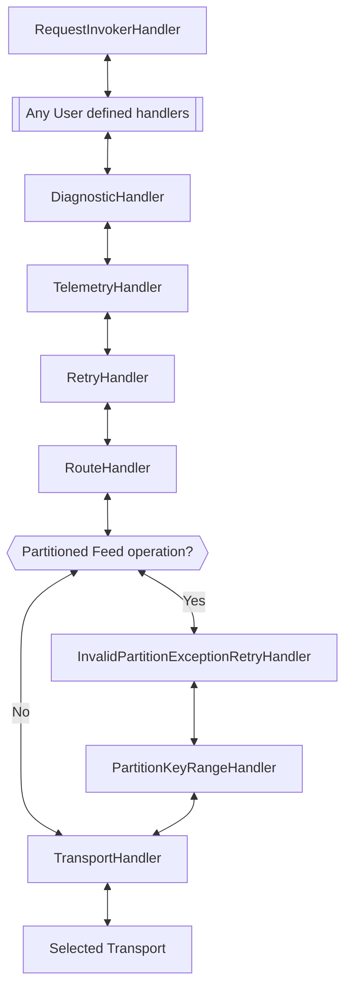
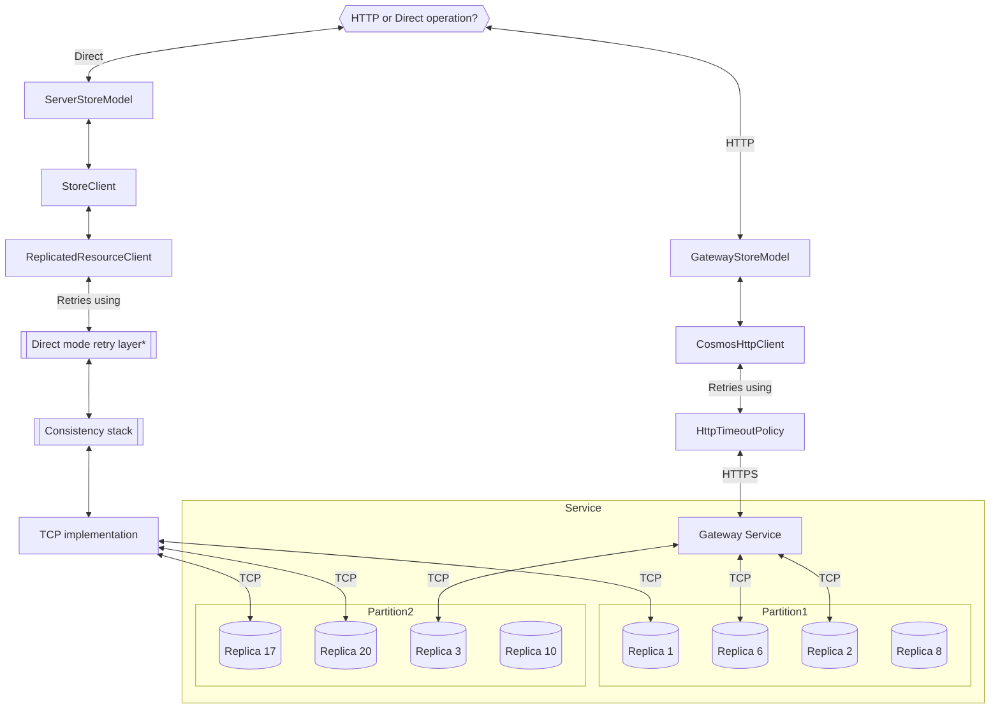

# .NET SDK component graph

## General component schema

Whenever an operation is executed through the .NET SQL SDK, a **public API** is invoked. The API will leverage the [ClientContext](../Microsoft.Azure.Cosmos/src/Resource/ClientContextCore.cs) to create the [Diagnostics](../Microsoft.Azure.Cosmos/src/Diagnostics/CosmosDiagnostics.cs) scope for the operation (and any retries involved) and create the [RequestMessage](../Microsoft.Azure.Cosmos/src/Handler/RequestMessage.cs).

The **handler pipeline** is used to process and handle the RequestMessage and perform actions like handling [retries](../Microsoft.Azure.Cosmos/src/Handler/RetryHandler.cs) including any customer user handler added through `CosmosClientOptions.CustomHandlers`. See [the pipeline section](#handler-pipeline) for more details.

At the end of the pipeline, the request is sent to the **transport layer**, which will process the request depending on the `CosmosClientOptions.ConnectionMode` and use [gateway or direct connectivity mode](https://docs.microsoft.com/azure/cosmos-db/sql/sql-sdk-connection-modes) to reach to the Azure Cosmos DB service.

## Handler pipeline

The handler pipeline processes the RequestMessage and each handler can choose to augment it in different ways, as shown in our [handler samples](../Microsoft.Azure.Cosmos.Samples/Usage/Handlers/) and also handle certain error conditions and retry, like our own [RetryHandler](../Microsoft.Azure.Cosmos/src/Handler/RetryHandler.cs).

The default pipeline structure is:

## Transport

Once a RequestMessage reaches the [TransportHandler](../Microsoft.Azure.Cosmos/src/Handler/TransportHandler.cs) it will be sent through either the [GatewayStoreModel](../Microsoft.Azure.Cosmos/src/GatewayStoreModel.cs) for HTTP requests and Gateway mode clients or through the ServerStoreModel for clients configured with Direct mode.

Even on clients configured on Direct mode, there can be [HTTP requests that get routed to Gateway](https://docs.microsoft.com/azure/cosmos-db/sql/sql-sdk-connection-modes#direct-mode). The `ConnectionMode` defined in the `CosmosClientOptions` affect data-plane operations (operations related to Items, like CRUD or query over existing Items in a Container) but metadata/control-plane operations (that appear as [MetadataRequests](https://docs.microsoft.com/azure/cosmos-db/monitor-cosmos-db-reference#request-metrics) on Azure Monitor) are sent through HTTP to Gateway.

The ServerStoreModel contains the Direct connectivity stack, which takes care of discovering, for each operation, which is the [physical partition](https://docs.microsoft.com/azure/cosmos-db/partitioning-overview#physical-partitions) to route to and which replica/s should be contacted. The Direct connectivity stack includes a [retry layer](#direct-mode-retry-layer), a [consistency component](#consistency-direct-mode) and the TCP protocol implementation.

The GatewayStoreModel connects to the Cosmos DB Gateway and sends HTTP requests through our [CosmosHttpClient](../Microsoft.Azure.Cosmos/src/HttpClient/CosmosHttpClientCore.cs), which just wraps the `HttpClient` through a retry layer to handle transient timeouts.

## Direct mode retry layer

TBD

## Consistency (direct mode)

TBD
