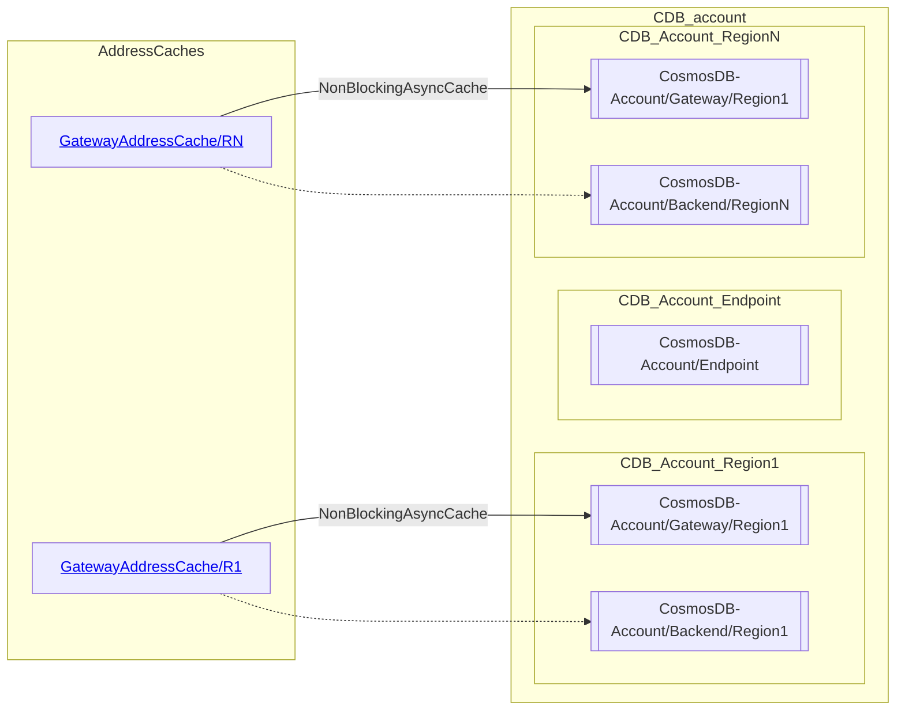
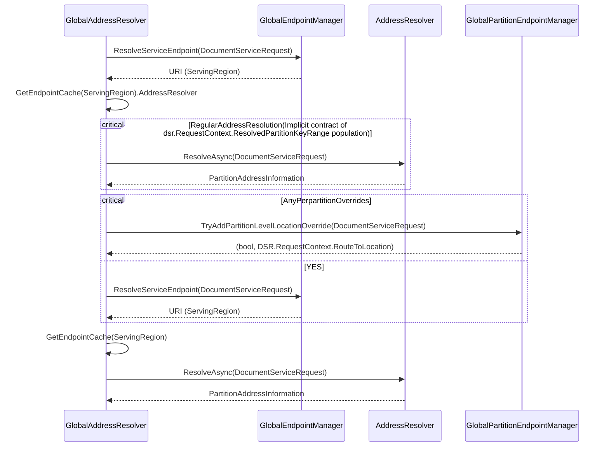

# Caches conceptual model

- CollectionCache: Dictionary<CollectionName/Rid, CollectionProperties>
- CollectionRoutingMap: Single collection PartitionKeyRanges map
- PartitionKeyRangeCache: Dictionary<CollectionName/Rid, CollectionRoutingMap>
- GlobalPartitionEndpointManager: Per partition override state. Every request will flow through
    -   Today GlobalEndpointManager is at region scope only and doesn't look at the partition
    -   Ideal abstraction is to fold it into GlobalEndpointManager --> extra hash computation
        - Posible to refactor direct code and flow HashedValue down stream (more contract work with direct package)
- AddressResolver: It does use IAddressCache (Above diagram missing it)

## Sequence of interaction

