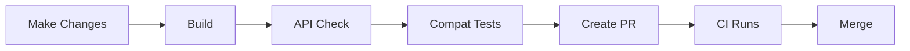

# Agent 5: Documentation & Helper Scripts

## Overview

**Goal**: Create comprehensive documentation and developer tools for easy local testing and maintenance.

**Estimated Time**: 1-2 hours

**Dependencies**: Independent (can start anytime)

**Deliverables**:

1. Developer quick-start guide
2. Local testing scripts
3. Version management utilities
4. Troubleshooting guide
5. Maintenance documentation

---

## Task 1: Developer Quick Start Guide

### File: `docs/compatibility-testing/QUICKSTART.md`

```markdown
# Compatibility Testing Quick Start

## 5-Minute Setup

### Prerequisites

- .NET 8 SDK installed
- PowerShell 7+ (or Windows PowerShell 5.1)
- Access to NuGet.org or internal NuGet feed

### Quick Test

```powershell
# Clone and navigate to repo
cd C:\repos\azure-cosmos-dotnet-v3

# Test against last published version
dotnet test Microsoft.Azure.Cosmos.Encryption.Custom\tests\Microsoft.Azure.Cosmos.Encryption.Custom.CompatibilityTests `
    -p:TargetEncryptionCustomVersion=1.0.0-preview08
```

That's it! ✅

---

## Common Scenarios

### Scenario 1: Test Before Creating PR

```powershell
# Build your changes
dotnet build Microsoft.Azure.Cosmos.Encryption.Custom\src -c Release

# Run compatibility tests against last version
.\Microsoft.Azure.Cosmos.Encryption.Custom\tests\test-compatibility.ps1 -Version 1.0.0-preview08

# If passed, create PR
```

### Scenario 2: Test Against Multiple Versions

```powershell
# Run full matrix locally
.\Microsoft.Azure.Cosmos.Encryption.Custom\tests\test-compatibility.ps1
```

### Scenario 3: Check API Changes Only

```powershell
# Fast API check (no full tests)
.\tools\test-api-compat-local.ps1
```

### Scenario 4: Add New Test

1. Open `Microsoft.Azure.Cosmos.Encryption.Custom.CompatibilityTests`
2. Add test to appropriate file (`CoreApiTests.cs`, `EncryptionDecryptionTests.cs`, etc.)
3. Run tests locally
4. Commit and push

---

## File Locations

| What | Where |
|------|-------|
| Test Project | `Microsoft.Azure.Cosmos.Encryption.Custom/tests/Microsoft.Azure.Cosmos.Encryption.Custom.CompatibilityTests/` |
| Test Scripts | `Microsoft.Azure.Cosmos.Encryption.Custom/tests/test-compatibility.ps1` |
| Pipeline | `azure-pipelines-encryption-custom-compatibility.yml` |
| Version Config | `testconfig.json` in test project |
| API Tools | `tools/apicompat-check.ps1` |
| Documentation | `docs/compatibility-testing/` |

---

## FAQ

### Q: How do I know which version to test against?

**A**: Always test against the last published version (check `testconfig.json` for the baseline version).

### Q: Tests pass locally but fail in CI. Why?

**A**: Common causes:

- Different NuGet feed in CI
- Cache issues (clear with `dotnet nuget locals all --clear`)
- Version resolution differences

### Q: How do I add a new version to test?

**A**: Update `testconfig.json` and the pipeline YAML (see [PIPELINE-GUIDE.md](PIPELINE-GUIDE.md)).

### Q: Can I skip compatibility tests for my PR?

**A**: No. Compatibility tests are required for all PRs that touch the Encryption.Custom library.

---

## Getting Help

- **Pipeline issues**: Check [PIPELINE-GUIDE.md](PIPELINE-GUIDE.md)
- **Test failures**: Check [TESTING-GUIDE.md](../Microsoft.Azure.Cosmos.Encryption.Custom.CompatibilityTests/TESTING-GUIDE.md)
- **API changes**: Check [API-CHANGES.md](API-CHANGES.md)
- **General questions**: Contact Encryption Custom team
```

---

## Task 2: Version Discovery Tool

### File: `tools/discover-published-versions.ps1`

```powershell
<#
.SYNOPSIS
    Discovers all published versions of Microsoft.Azure.Cosmos.Encryption.Custom
.PARAMETER Top
    Number of latest versions to show (default: 10)
#>

param(
    [int]$Top = 10
)

$ErrorActionPreference = "Stop"

Write-Host "🔍 Discovering Published Versions" -ForegroundColor Cyan
Write-Host "Package: Microsoft.Azure.Cosmos.Encryption.Custom" -ForegroundColor Yellow
Write-Host ""

# Query NuGet API
$packageId = "Microsoft.Azure.Cosmos.Encryption.Custom"
$apiUrl = "https://api.nuget.org/v3-flatcontainer/$($packageId.ToLower())/index.json"

try {
    $response = Invoke-RestMethod -Uri $apiUrl -Method Get
    $versions = $response.versions | Sort-Object -Descending
    
    $latestVersions = $versions | Select-Object -First $Top
    
    Write-Host "Latest $Top published versions:" -ForegroundColor Green
    Write-Host ""
    
    $latestVersions | ForEach-Object {
        $version = $_
        $isBaseline = $version -eq "1.0.0-preview08"
        
        if ($isBaseline) {
            Write-Host "  📌 $version (current baseline)" -ForegroundColor Yellow
        } else {
            Write-Host "  •  $version" -ForegroundColor Gray
        }
    }
    
    Write-Host ""
    Write-Host "Total versions published: $($versions.Count)" -ForegroundColor Gray
    Write-Host ""
    
    # Check against testconfig.json
    $testConfigPath = "Microsoft.Azure.Cosmos.Encryption.Custom\tests\Microsoft.Azure.Cosmos.Encryption.Custom.CompatibilityTests\testconfig.json"
    
    if (Test-Path $testConfigPath) {
        $config = Get-Content $testConfigPath | ConvertFrom-Json
        $testedVersions = $config.versionMatrix.versions
        
        Write-Host "Versions in test matrix:" -ForegroundColor Cyan
        $testedVersions | ForEach-Object { Write-Host "  •  $_" -ForegroundColor Gray }
        Write-Host ""
        
        # Find versions not in test matrix
        $notTested = $latestVersions | Where-Object { $testedVersions -notcontains $_ }
        
        if ($notTested) {
            Write-Host "⚠️  Published versions NOT in test matrix:" -ForegroundColor Yellow
            $notTested | ForEach-Object { Write-Host "  •  $_" -ForegroundColor Yellow }
            Write-Host ""
            Write-Host "Consider adding these to testconfig.json" -ForegroundColor Gray
        }
    }
    
} catch {
    Write-Error "Failed to query NuGet API: $_"
}

Write-Host "Done." -ForegroundColor Cyan
```

---

## Task 3: Test Matrix Management Tool

### File: `tools/update-test-matrix.ps1`

```powershell
<#
.SYNOPSIS
    Updates the test matrix with new versions
.PARAMETER Version
    Version to add to the matrix
.PARAMETER SetBaseline
    Set this version as the new baseline
#>

param(
    [Parameter(Mandatory=$true)]
    [string]$Version,
    [switch]$SetBaseline
)

$ErrorActionPreference = "Stop"

Write-Host "🔧 Updating Test Matrix" -ForegroundColor Cyan
Write-Host "Version: $Version" -ForegroundColor Yellow
Write-Host ""

# Validate version exists on NuGet
Write-Host "Validating version exists on NuGet..." -ForegroundColor Gray
$packageId = "Microsoft.Azure.Cosmos.Encryption.Custom"
$apiUrl = "https://api.nuget.org/v3-flatcontainer/$($packageId.ToLower())/index.json"

try {
    $response = Invoke-RestMethod -Uri $apiUrl -Method Get
    $versions = $response.versions
    
    if ($versions -notcontains $Version) {
        Write-Error "Version $Version not found on NuGet.org"
    }
    
    Write-Host "✅ Version exists" -ForegroundColor Green
    Write-Host ""
} catch {
    Write-Error "Failed to validate version: $_"
}

# Update testconfig.json
$testConfigPath = "Microsoft.Azure.Cosmos.Encryption.Custom\tests\Microsoft.Azure.Cosmos.Encryption.Custom.CompatibilityTests\testconfig.json"

if (-not (Test-Path $testConfigPath)) {
    Write-Error "Test config not found: $testConfigPath"
}

Write-Host "Updating $testConfigPath..." -ForegroundColor Gray

$config = Get-Content $testConfigPath | ConvertFrom-Json

# Add version if not already present
if ($config.versionMatrix.versions -notcontains $Version) {
    # Add at the beginning (latest versions first)
    $newVersions = @($Version) + $config.versionMatrix.versions
    $config.versionMatrix.versions = $newVersions
    Write-Host "✅ Added $Version to test matrix" -ForegroundColor Green
} else {
    Write-Host "ℹ️  Version already in matrix" -ForegroundColor Yellow
}

# Update baseline if requested
if ($SetBaseline) {
    $oldBaseline = $config.versionMatrix.baseline
    $config.versionMatrix.baseline = $Version
    Write-Host "✅ Updated baseline: $oldBaseline → $Version" -ForegroundColor Green
}

# Save updated config
$config | ConvertTo-Json -Depth 10 | Set-Content $testConfigPath -Encoding UTF8

Write-Host ""
Write-Host "Current test matrix:" -ForegroundColor Cyan
$config.versionMatrix.versions | ForEach-Object {
    $isBaseline = $_ -eq $config.versionMatrix.baseline
    if ($isBaseline) {
        Write-Host "  📌 $_ (baseline)" -ForegroundColor Yellow
    } else {
        Write-Host "  •  $_" -ForegroundColor Gray
    }
}

Write-Host ""
Write-Host "⚠️  Don't forget to update the pipeline YAML!" -ForegroundColor Yellow
Write-Host "   File: azure-pipelines-encryption-custom-compatibility.yml" -ForegroundColor Gray
Write-Host "   Update BaselineVersion and add job for new version" -ForegroundColor Gray
Write-Host ""
Write-Host "Done." -ForegroundColor Cyan
```

---

## Task 4: Troubleshooting Guide

### File: `docs/compatibility-testing/TROUBLESHOOTING.md`

```markdown
# Compatibility Testing Troubleshooting Guide

## Common Issues

### Issue 1: Package Not Found

**Symptom**:

```
error NU1102: Unable to find package 'Microsoft.Azure.Cosmos.Encryption.Custom' with version (= 1.0.0-preview08)
```

**Causes**:

1. Version doesn't exist on NuGet.org
2. NuGet feed not configured
3. Authentication issue with private feed

**Solutions**:

```powershell
# Check if version exists
nuget list Microsoft.Azure.Cosmos.Encryption.Custom -AllVersions

# Clear NuGet cache
dotnet nuget locals all --clear

# Restore with verbose output
dotnet restore --verbosity detailed
```

---

### Issue 2: Tests Pass Locally But Fail in CI

**Symptom**: All tests green locally, red in Azure Pipelines

**Causes**:

1. Different NuGet feeds (local vs CI)
2. Cached packages
3. Environment differences

**Solutions**:

1. Check `NuGet.config` is committed
2. Verify Azure Artifacts feed permissions
3. Compare package resolution:

```powershell
# Local
dotnet list package --include-transitive | Out-File local-packages.txt

# Compare with CI logs
```

---

### Issue 3: Version Resolution Conflict

**Symptom**:

```
warning NU1608: Detected package version outside of dependency constraint
```

**Causes**:

- Transitive dependency version mismatch
- Package version override issues

**Solutions**:

```xml
<!-- In Directory.Packages.props, pin transitive dependency -->
<PackageVersion Include="Microsoft.Azure.Cosmos" Version="3.40.0" />
```

---

### Issue 4: Tests Hang or Timeout

**Symptom**: Test runner hangs, no output

**Causes**:

1. Deadlock in test code
2. Missing `async`/`await`
3. Resource contention

**Solutions**:

```powershell
# Run with timeout
dotnet test --blame-hang --blame-hang-timeout 2m
```

---

### Issue 5: API Compat Check Fails Unexpectedly

**Symptom**: `dotnet-apicompat` reports breaking changes you didn't make

**Causes**:

1. Transitive dependency changed
2. Compiler optimization differences
3. False positive

**Solutions**:

```powershell
# Check assembly differences
ildasm current.dll /out=current.il
ildasm baseline.dll /out=baseline.il
code --diff current.il baseline.il

# Add suppression if false positive
# Edit ApiCompatSuppressions.txt
```

---

### Issue 6: "Type Not Found" in Reflection Tests

**Symptom**:

```csharp
var type = Type.GetType("Namespace.TypeName, AssemblyName");
// type is null
```

**Causes**:

- Assembly name changed between versions
- Type moved to different namespace
- Type removed (breaking change)

**Solutions**:

```csharp
// More resilient type discovery
var assembly = typeof(KnownType).Assembly;
var type = assembly.GetTypes()
    .FirstOrDefault(t => t.Name == "TypeName");

if (type == null)
{
    LogWarning($"Type 'TypeName' not found - may have been moved or removed");
}
```

---

### Issue 7: Pipeline Doesn't Trigger

**Symptom**: Pipeline doesn't run on PR

**Causes**:

1. Path filters don't match changed files
2. Branch filters don't match
3. Pipeline YAML syntax error

**Solutions**:

```powershell
# Validate YAML
az pipelines validate --yaml-path azure-pipelines-encryption-custom-compatibility.yml

# Check trigger paths in YAML:
pr:
  paths:
    include:
      - Microsoft.Azure.Cosmos.Encryption.Custom/**
```

---

## Debugging Tools

### 1. Verbose Test Output

```powershell
dotnet test --logger "console;verbosity=detailed"
```

### 2. List Resolved Packages

```powershell
dotnet list package --include-transitive
```

### 3. Check NuGet Sources

```powershell
dotnet nuget list source
```

### 4. Blame Hang Dumps

```powershell
dotnet test --blame-hang --blame-hang-dump-type full --blame-hang-timeout 2m
```

### 5. Assembly Version Check

```powershell
# PowerShell
[Reflection.Assembly]::LoadFrom("path\to\assembly.dll").GetName().Version
```

---

## Getting More Help

1. **Check logs**:
   - Local: `TestResults/` directory
   - CI: Azure Pipelines test tab

2. **Enable detailed logging**:

   ```json
   // In testconfig.json
   {
     "testConfig": {
       "enableDetailedLogging": true
     }
   }
   ```

3. **Contact team**: Post in team chat with:
   - Error message
   - Steps to reproduce
   - Logs (if available)
```

---

## Task 5: Maintenance Checklist

### File: `docs/compatibility-testing/MAINTENANCE.md`

```markdown
# Compatibility Testing Maintenance

## When New Version is Published

### Checklist

- [ ] Verify version appears on NuGet.org
- [ ] Run discovery tool: `.\tools\discover-published-versions.ps1`
- [ ] Update test matrix: `.\tools\update-test-matrix.ps1 -Version X.Y.Z -SetBaseline`
- [ ] Update pipeline YAML to add new job
- [ ] Update API baseline snapshot (if needed)
- [ ] Run full matrix test locally
- [ ] Commit and push changes
- [ ] Verify pipeline runs successfully

### Commands

```powershell
# 1. Discover versions
.\tools\discover-published-versions.ps1

# 2. Add new version to matrix
.\tools\update-test-matrix.ps1 -Version 1.0.0-preview09 -SetBaseline

# 3. Test locally
.\Microsoft.Azure.Cosmos.Encryption.Custom\tests\test-compatibility.ps1

# 4. Commit
git add testconfig.json azure-pipelines-encryption-custom-compatibility.yml
git commit -m "chore: update compatibility test matrix for 1.0.0-preview09"
git push
```

---

## Quarterly Maintenance

### Tasks

1. **Review test matrix** - Remove very old versions (keep last 5-6)
2. **Update dependencies** - xUnit, FluentAssertions, etc.
3. **Review suppressions** - Remove obsolete API suppressions
4. **Check for new versions** - Run discovery tool
5. **Performance review** - Ensure pipeline runs in <20 minutes

---

## Annual Maintenance

### Tasks

1. **Documentation review** - Update all docs for accuracy
2. **Tool updates** - Update ApiCompat tool, .NET SDK versions
3. **Archive old baselines** - Move old API snapshots to archive folder
4. **Test infrastructure review** - Consider improvements

---

## Emergency Procedures

### Pipeline is Broken

1. Check Azure DevOps status page
2. Review recent commits
3. Check if NuGet.org is down
4. Consider reverting recent changes
5. Disable pipeline temporarily if needed (update trigger conditions)

### False Positive Breaking All PRs

1. Investigate root cause
2. Add temporary suppression
3. Document in API-CHANGES.md
4. Fix properly in next sprint
5. Remove suppression

### Need to Skip Compat Tests for Emergency Fix

```yaml
# Add to pipeline YAML temporarily
condition: and(succeeded(), not(contains(variables['Build.SourceBranch'], 'hotfix/')))
```

Document why and revert ASAP.
```

---

## Task 6: One-Liner Reference Sheet

### File: `docs/compatibility-testing/CHEATSHEET.md`

```markdown
# Compatibility Testing Cheat Sheet

## Quick Commands

```powershell
# Test against last version
dotnet test Microsoft.Azure.Cosmos.Encryption.Custom\tests\Microsoft.Azure.Cosmos.Encryption.Custom.CompatibilityTests -p:TargetEncryptionCustomVersion=1.0.0-preview08

# Test all versions
.\Microsoft.Azure.Cosmos.Encryption.Custom\tests\test-compatibility.ps1

# Check API only
.\tools\test-api-compat-local.ps1

# Discover versions
.\tools\discover-published-versions.ps1

# Add version to matrix
.\tools\update-test-matrix.ps1 -Version 1.0.0-preview09 -SetBaseline

# Clear NuGet cache
dotnet nuget locals all --clear

# Validate pipeline
az pipelines validate --yaml-path azure-pipelines-encryption-custom-compatibility.yml

# Check package resolution
dotnet list package --include-transitive | Select-String "Encryption"
```

## Key Files

| File | Purpose |
|------|---------|
| `testconfig.json` | Version matrix configuration |
| `Directory.Packages.props` | Central package version management |
| `azure-pipelines-encryption-custom-compatibility.yml` | CI/CD pipeline |
| `ApiCompatSuppressions.txt` | API change suppressions |

## Workflow



## Common Scenarios

**Before PR**: `.\tools\test-api-compat-local.ps1`  
**In PR**: Pipeline runs automatically  
**After release**: Update matrix with new version  
**Troubleshooting**: See TROUBLESHOOTING.md
```

---

## Verification

- [ ] All scripts are executable
- [ ] Documentation is clear and accurate
- [ ] Quick start guide works for new developers
- [ ] Troubleshooting covers common issues
- [ ] Maintenance procedures are documented

---

## Files Created

```
docs/compatibility-testing/
├── QUICKSTART.md
├── TROUBLESHOOTING.md
├── MAINTENANCE.md
└── CHEATSHEET.md
tools/
├── discover-published-versions.ps1
└── update-test-matrix.ps1
```

**Total**: 6 files
