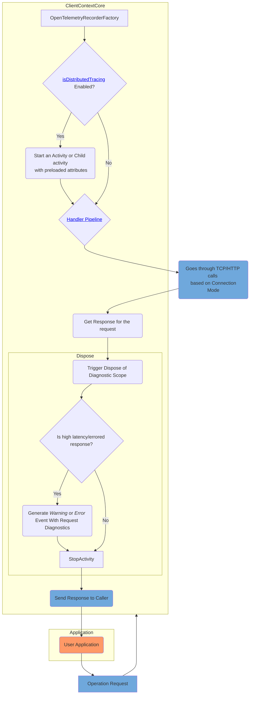
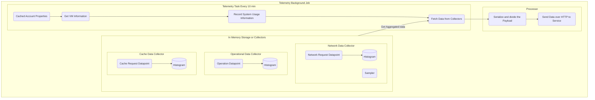

# .NET SDK Observability Feature Design

## Distributed Tracing (Preview)

**Source to capture operation level activities**: _Azure.Cosmos.Operation_\
**Source to capture event with request diagnostics** : _Azure-Cosmos-Operation-Request-Diagnostics_

There are 3 kind of events generated:
1. LatencyOverThrehold: If particular operation latency is more than threshold.
2. FailedRequest: If particular request failed. Status codes not considered as failed, are anything below 300, 404/0, 304/0, 409/0, and 412/0
3. Exception: If any exception occured.

For detail about usage of this feature, please see the [Azure Cosmos DB SDK observability](https://learn.microsoft.com/azure/cosmos-db/nosql/sdk-observability?tabs=dotnet)

## Send telemetry from SDK to service (Private Preview)

### Introduction
When opted-in CosmosDB SDK collects below aggregated telemetry data every 10 minutes to Azure CosmosDB service. 
1. Operation(Point, Stream, Batch and Query APIs) Latencies and Request Units (RUs).
2. Metadata caches (ex: CollectionCache) miss statistics
3. Host Resource Usage: (during an operation) :
    * CPU usage
    * Memory Usage
    * Thread Starvation
    * Network Connections Opened (only TCP Connections)
4. TOP 10 slowest network interactions per endpoint

> Note: We don't collect any PII data as part of this feature.

### Benefits
Enabling this feature provides numerous benefits. The telemetry data collected will allow us to identify and address potential issues. This results in a superior support experience and ensures that some issues can even be resolved before they impact your application. In short, customers with this feature enabled can expect a smoother and more reliable support experience.

### Impact of this feature enabled
* _Latency_: Customer should not see any impact on latency.
* _Total RPS_: It depends on the infrastructure the application using SDK is hosted on among other factors but the impact should not exceed 10%.
* _Any other impact_: Collector needs around 18MB of in-memory storage to hold the data and this storage is always constant (it means it doesn't grow, no matter how much data we have)
* Benchmark Numbers: https://github.com/Azure/azure-cosmos-dotnet-v3/blob/master/Microsoft.Azure.Cosmos/tests/Microsoft.Azure.Cosmos.Performance.Tests/Contracts/BenchmarkResults.json

### Components

**Telemetry Job:** Background task which collects the data and sends it to a Azure CosmosDB service every 10 minutes.

**Collectors:** In-memory storage which keeps the telemetry data collected during an operation. There are 3 types of collectors including:
* _Operational Data Collector_: It keeps operation level latencies and request units.
* _Network Data Collector_: It keeps all the metrics related to network or TCP calls. It has its own Sampler which sample-in only slowest TCP calls for a particular replica.
* _Cache Data Collector_: It keeps all the cache call latencies. Right now, only collection cache is covered.

**Get VM Information**: 

- Azure VM: [Azure Instance Metadata](https://learn.microsoft.com/azure/virtual-machines/instance-metadata-service?tabs=windows) call. 
- Non-Azure VM: We don't collect any other information except VMID which will a Guid or Hashed Machine Name.

**Processor**: Its responsibility is to get all the data and divide it into small chunks (<2MB) and send each chunk to the Azure CosmosDB service.

### Limitations
1. AAD Support is not available.
