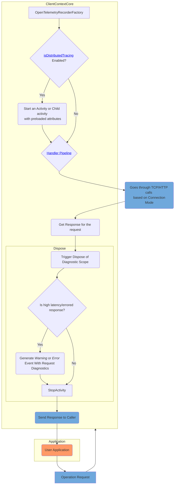

# .NET SDK Observability Feature Design

## Distributed Tracing (Preview)

**Source to capture operation level activities**: _Azure.Cosmos.Operation_\
**Source to capture event with request diagnostics** : _Azure-Cosmos-Operation-Request-Diagnostics_

For detail about usage of this feature, please see the [Azure Cosmos DB SDK observability](https://learn.microsoft.com/azure/cosmos-db/nosql/sdk-observability?tabs=dotnet)

