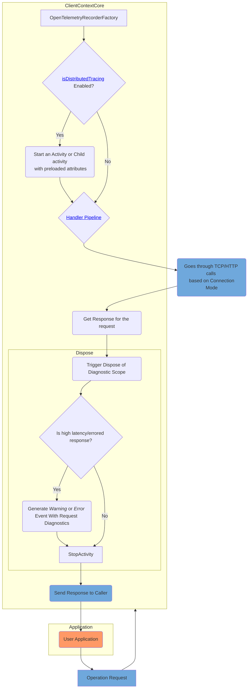

# .NET SDK Observability Feature Design

## Distributed Tracing

**STATUS: __PUBLIC PREVIEW__**

It means this feature is available for testing and feedback, with limited support and potential changes before its general availability release.

### Traces

#### Summary

**Source to capture operation level activities**: _Azure.Cosmos.Operation_\
**Source to capture event with request diagnostics** : _Azure-Cosmos-Operation-Request-Diagnostics_

To know more about operation level activities semantic profile, refer [this](https://opentelemetry.io/docs/specs/semconv/database/cosmosdb/).

There are 3 kind of events generated:

1. LatencyOverThrehold: If particular operation latency is more than threshold.
2. FailedRequest: If particular request failed. Status codes not considered as failed, are anything below 300, 404/0, 304/0, 409/0, and 412/0
3. Exception: If any exception occured.

For detail about usage of this feature, please see the [Azure Cosmos DB SDK observability](https://learn.microsoft.com/azure/cosmos-db/nosql/sdk-observability?tabs=dotnet)



#### How to enable open telemetry traces?

```csharp

// <EnableDistributedTracing>
CosmosClientOptions options = new CosmosClientOptions()
{
      CosmosClientTelemetryOptions = new CosmosClientTelemetryOptions()
      {
         DisableDistributedTracing = false
      },
      ConnectionMode = connMode
};
// </EnableDistributedTracing>

 ResourceBuilder resource = ResourceBuilder.CreateDefault().AddService(
             serviceName: serviceName,
             serviceVersion: "1.0.0");

 // Set up logging to forward logs to chosen exporter
 using ILoggerFactory loggerFactory
     = LoggerFactory.Create(builder => builder
                                         .AddConfiguration(configuration.GetSection("Logging"))
                                         .AddOpenTelemetry(options =>
                                         {
                                             options.IncludeFormattedMessage = true;
                                             options.SetResourceBuilder(resource);
                                             options.AddAzureMonitorLogExporter(o => o.ConnectionString = aiConnectionString); // Set up exporter of your choice
                                         }));
 /*.AddFilter(level => level == LogLevel.Error) // Filter  is irrespective of event type or event name*/

 AzureEventSourceLogForwarder logforwader = new AzureEventSourceLogForwarder(loggerFactory);
 logforwader.Start();

 // Configure OpenTelemetry trace provider
 AppContext.SetSwitch("Azure.Experimental.EnableActivitySource", true);
 _traceProvider = Sdk.CreateTracerProviderBuilder()
     .AddSource("Azure.Cosmos.Operation", // Cosmos DB source for operation level telemetry
                "Sample.Application") 
     .AddAzureMonitorTraceExporter(o => o.ConnectionString = aiConnectionString) // Set up exporter of your choice
     .AddHttpClientInstrumentation() // Added to capture HTTP telemetry
     .SetResourceBuilder(resource)
     .Build();

```

#### Sample

For Sample refer [this](https://github.com/Azure/azure-cosmos-dotnet-v3/tree/master/Microsoft.Azure.Cosmos.Samples/Usage/OpenTelemetry)

### Metrics

**Meter to capture operation level activities**: _Azure.Cosmos.Client.Operation_\
**Meter to capture event with request diagnostics** : _Azure.Cosmos.Client.Request_

To know more about Operation Level Metrics Sematic Conventions ref [this](https://opentelemetry.io/docs/specs/semconv/database/cosmosdb/).

#### Network Level Metrics Semantic Convention

##### Dimensions

| Attribute  | Type | Description  | Examples  | [Requirement Level](https://opentelemetry.io/docs/specs/semconv/general/attribute-requirement-level/) | Stability |
|---|---|---|---|---|---|
| [`db.collection.name`](/docs/attributes-registry/db.md) | string | Cosmos DB container name. [1] | `public.users`; `customers` | `Conditionally Required` If available |  |
| [`db.cosmosdb.consistency_level`](/docs/attributes-registry/db.md) | string | Effective Request [consistency level](https://learn.microsoft.com/azure/cosmos-db/consistency-levels). This represents the applicable consistency level determined based on the hierarchy of settings: request-level, client instance-level, and account-level default consistency levels. | `Eventual`; `ConsistentPrefix`; `BoundedStaleness`; `Strong`; `Session` | `Conditionally Required` If available. |  |
| [`db.cosmosdb.network.response.status_code`](/docs/attributes-registry/db.md) | int | The status code returned in response by the network call, made to Cosmos DB backend services. [2] | `200` | `Conditionally Required` If available |  |
| [`db.cosmosdb.network.response.sub_status_code`](/docs/attributes-registry/db.md) | int | The Azure Cosmos DB sub-status code for a network request, made to Cosmos DB backend services, during an operation. | `1002` | `Conditionally Required` If available |  |
| [`db.cosmosdb.sub_status_code`](/docs/attributes-registry/db.md) | int | The Azure Cosmos DB sub-status code for an operation represents the final sub-status code after multiple network interactions have been completed during the operation. | `1000`; `1002` | `Conditionally Required` when response was received and contained sub-code. |  |
| [`db.namespace`](/docs/attributes-registry/db.md) | string | The name of the database, fully qualified within the server address and port. | `customers`; `test.users` | `Conditionally Required` If available. |  |
| [`db.operation.name`](/docs/attributes-registry/db.md) | string | The name of the operation or command being executed. [3] | `create_item`; `query_items`; `read_item` | `Conditionally Required` [4] |  |
| [`db.response.status_code`](/docs/attributes-registry/db.md) | string | Database response status code. [5] | `200`; `201` | `Conditionally Required` [6] |  |
| [`error.type`](/docs/attributes-registry/error.md) | string | Describes a class of error the operation ended with. [7] | `Microsoft.Azure.Cosmos.CosmosException`; `Microsoft.Azure.Cosmos.CosmosOperationCanceledException` | `Conditionally Required` If and only if the operation failed. |  |
| [`network.peer.address`](/docs/attributes-registry/network.md) | string | Specifies the host address from the Gateway or Backend Service endpoint. | `cdb-east-us.azure.document.com` | `Conditionally Required` If available |  |
| [`network.peer.port`](/docs/attributes-registry/network.md) | int | The port of the Gateway or Backend Service endpoint. | `443` | `Conditionally Required` If available |  |
| [`network.protocol.name`](/docs/attributes-registry/network.md) | string | Network protocol used to send the request. [8] | `https`; `rntbd` | `Conditionally Required` If available |  |
| [`server.port`](/docs/attributes-registry/server.md) | int | Server port number. [9] | `80`; `8080`; `443` | `Conditionally Required` [10] |  |
| [`cloud.region`](/docs/attributes-registry/cloud.md) | string | Region contacted during operation in the order specific region was contacted. [11] | `["North Central US"]` | `Recommended` |  |
| [`server.address`](/docs/attributes-registry/server.md) | string | Name of the database host. [12] | `example.com`; `10.1.2.80`; `/tmp/my.sock` | `Recommended` |  |
| [`db.cosmosdb.network.routing_id`](/docs/attributes-registry/db.md) | string | Identifies the Azure Cosmos DB Partition Key Range ID for a Gateway call, or Partition ID/Replica ID for a Direct call. | `45678765678987/2345678906789s` | `Opt-In` |  |

#### Metric: `db.client.cosmosdb.request.duration`

It captures the end to end Latency of Azure Cosmos DB Backend network call.

this metric SHOULD be specified with
[`ExplicitBucketBoundaries`](https://github.com/open-telemetry/opentelemetry-specification/tree/v1.35.0/specification/metrics/api.md#instrument-advisory-parameters)
of `[ 0.001, 0.005, 0.01, 0.05, 0.1, 0.5, 1, 5, 10 ]`.

| Name     | Instrument Type | Unit (UCUM) | Description    | Stability |
| -------- | --------------- | ----------- | -------------- | --------- |
| `db.client.cosmosdb.request.duration` | Histogram | `s` | End to end latency of a network call made to Azure Cosmos DB backend service. |  |

#### Metric: `db.client.cosmosdb.request.body.size`

It captures the size of request object sent to Azure Cosmos DB backend.

this metric SHOULD be specified with
[`ExplicitBucketBoundaries`](https://github.com/open-telemetry/opentelemetry-specification/tree/v1.35.0/specification/metrics/api.md#instrument-advisory-parameters)
of `[0, 65536, 131072, 262144, 524288, 1048576, 1572864, 2097152, 2621440, 3145728, 4194304, 6291456, 8388608, 10485760]`.

Explaining bucket configuration:

1. 0, 64 KB, 128 KB, 256 KB, 512 KB: Low-Range Buckets, These smaller buckets capture typical, lightweight requests, often associated with quick read or write operations.
2. 1 MB, 1.5 MB: Medium-Range Buckets, These mid-sized buckets help identify requests that are moderately large but still manageable for Cosmos DB.
3. 2 MB: Higher Usage Levels, The 2 MB bucket is critical because it represents the threshold between "normal" and "large" requests.
4. 2.5 MB, 3 MB, 4 MB, 6 MB, 8 MB, 10 MB: High-Range Buckets, These larger buckets track heavy requests that could be problematic, such as those involving batch operations or complex data structures.

| Name     | Instrument Type | Unit (UCUM) | Description    | Stability |
| -------- | --------------- | ----------- | -------------- | --------- |
| `db.client.cosmosdb.request.body.size` | Histogram | `By` | Size of request body sent over wire to Azure Cosmos DB backend service. |  |

#### Metric: `db.client.cosmosdb.response.body.size`

It is the size of response received from Azure Cosmos DB backend.

this metric SHOULD be specified with
[`ExplicitBucketBoundaries`](https://github.com/open-telemetry/opentelemetry-specification/tree/v1.35.0/specification/metrics/api.md#instrument-advisory-parameters)
of `[0, 65536, 131072, 262144, 524288, 1048576, 1572864, 2097152, 2621440, 3145728, 4194304, 6291456, 8388608, 10485760]`.

Explaining bucket configuration:

1. 0, 64 KB, 128 KB, 256 KB, 512 KB: Low-Range Buckets, These capture small responses, which are common for brief reads or simple queries. For example, a small document read or a single record fetch might fit within these sizes. Tracking smaller response sizes is useful because they typically represent low-cost, low-latency operations, which are the backbone of many database transactions. This level of detail helps verify that these requests stay efficient and small.
2. 1 MB, 1.5 MB: Medium-Range Buckets, Responses in this range indicate larger queries, perhaps with more data fields or multiple records.
3. 2 MB: Higher Usage Levels, This bucket marks the threshold for what might be considered a "large" response. Responses at or above 2 MB are usually a sign of heavy queries that could increase database load and network latency.
4. 2.5 MB, 3 MB, 4 MB, 6 MB, 8 MB, 10 MB: High-Range Buckets, These larger buckets track responses that involve heavy data loads, such as large result sets from complex queries or high-throughput batch reads.

| Name     | Instrument Type | Unit (UCUM) | Description    | Stability |
| -------- | --------------- | ----------- | -------------- | --------- |
| `db.client.cosmosdb.response.body.size` | Histogram | `By` | Size of response received from Azure Cosmos DB backend service. |  |

#### Metric: `db.client.cosmosdb.request.service_duration`

It captures the Backend Server Latency, i.e. time taken by Azure Cosmos DB server to process the request. It is only applicable in Direct Mode.

this metric SHOULD be specified with
[`ExplicitBucketBoundaries`](https://github.com/open-telemetry/opentelemetry-specification/tree/v1.35.0/specification/metrics/api.md#instrument-advisory-parameters)
of `[ 0.001, 0.005, 0.01, 0.05, 0.1, 0.5, 1, 5, 10 ]`.

| Name     | Instrument Type | Unit (UCUM) | Description    | Stability |
| -------- | --------------- | ----------- | -------------- | --------- |
| `db.client.cosmosdb.request.service_duration` | Histogram | `s` | Time taken by the Azure Cosmos DB service to process the request. It is only applicable in Direct Mode. [1] |  |

**[1]:** Duration is measured on the backend and does not include network time. It is not reported when response was not received.

#### How to enable open telemetry metrics?

```csharp

CosmosClientOptions cosmosClientOptions = new CosmosClientOptions()
{
   CosmosClientTelemetryOptions = new CosmosClientTelemetryOptions()
   {
         IsClientMetricsEnabled = true
   }
};

Sdk.CreateMeterProviderBuilder()
   .AddMeter(CosmosDbClientMetrics.OperationMetrics.MeterName, CosmosDbClientMetrics.NetworkMetrics.MeterName)
   .AddAzureMonitorMetricExporter(
         o => o.ConnectionString = cmdLineOptions.AzureMonitorConnectionString)  // Set up exporter of your choice
   .AddView(
         instrumentName: CosmosDbClientMetrics.OperationMetrics.Name.RequestCharge,
         metricStreamConfiguration: new ExplicitBucketHistogramConfiguration
         {
            Boundaries = CosmosDbClientMetrics.HistogramBuckets.RequestUnitBuckets
         })  // Set up Histogram Bucket Configuration (Similarly, you can set it up for other metrics)
   .Build();

```

### OpenTelemetry Versioning and Stability Modes (Traces amd Metrics Dimensions)

Our SDK follows the versioning guidelines outlined in the [OpenTelemetry Semantic Conventions documentation](https://opentelemetry.io/docs/specs/semconv/database/).

When configuring the `OTEL_SEMCONV_STABILITY_OPT_IN` environment variable, the following options determine the attributes emitted by the SDK:

1. **`database`**:
   - The SDK emits all attributes as per the OpenTelemetry database semantic conventions outlined [here](https://opentelemetry.io/docs/specs/semconv/database/cosmosdb/).
   - Refer to the [list of OpenTelemetry attributes emitted by the SDK](https://github.com/Azure/azure-cosmos-dotnet-v3/blob/master/Microsoft.Azure.Cosmos/src/Telemetry/OpenTelemetry/OpenTelemetryAttributeKeys.cs).

2. **`database/dup`**:
   - The SDK emits attributes that follow both OpenTelemetry database semantic conventions, available [here](https://opentelemetry.io/docs/specs/semconv/database/cosmosdb/), and additional attributes supported by the Classic Application Insights SDK.
   - For a complete attribute list, refer to the OpenTelemetry attributes [here](https://github.com/Azure/azure-cosmos-dotnet-v3/blob/master/Microsoft.Azure.Cosmos/src/Telemetry/OpenTelemetry/OpenTelemetryAttributeKeys.cs) and Classic Application Insights attributes [here](https://github.com/Azure/azure-cosmos-dotnet-v3/blob/master/Microsoft.Azure.Cosmos/src/Telemetry/OpenTelemetry/AppInsightClassicAttributeKeys.cs).

3. **`default`**:
   - This mode functions similarly to `database`, emitting attributes that adhere to the OpenTelemetry database semantic conventions. 
   - View the full [attribute list emitted by the SDK](https://github.com/Azure/azure-cosmos-dotnet-v3/blob/master/Microsoft.Azure.Cosmos/src/Telemetry/OpenTelemetry/OpenTelemetryAttributeKeys.cs).

4. **`appinsightssdk`**:
   - The SDK emits only those attributes supported by the Classic Application Insights SDK.
   - For a comprehensive list of attributes, refer [here](https://github.com/Azure/azure-cosmos-dotnet-v3/blob/master/Microsoft.Azure.Cosmos/src/Telemetry/OpenTelemetry/AppInsightClassicAttributeKeys.cs).

Choose the appropriate mode to align with your telemetry requirements.

### What would be the perf impact with this feature enabled/disabled?

OpenTelemetry Traces and Metrics use a subscription-based model, meaning their performance impact depends on whether subscribers are present. If enabled at the Cosmos client instance level without any active subscribers, there is no expected performance impact. When subscribers are present, the impact varies based on the efficiency of the configured exporter.

Performance testing with the Azure Monitor Exporter under high-load scenarios, including resource constraints, showed a worst-case impact of approximately 10% on RPS (requests per second). Under normal conditions with sufficient resources, the performance impact is negligible.

### Exception Handling

It is designed in such a way that, If exceptions occur during telemetry collection, they will not disrupt the application's primary operations, ensuring stability and reliability.
