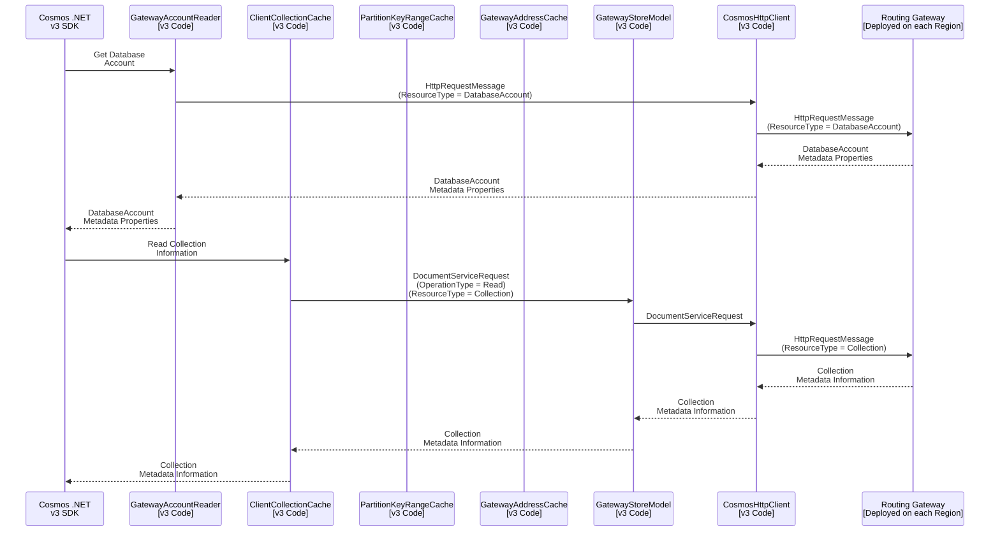
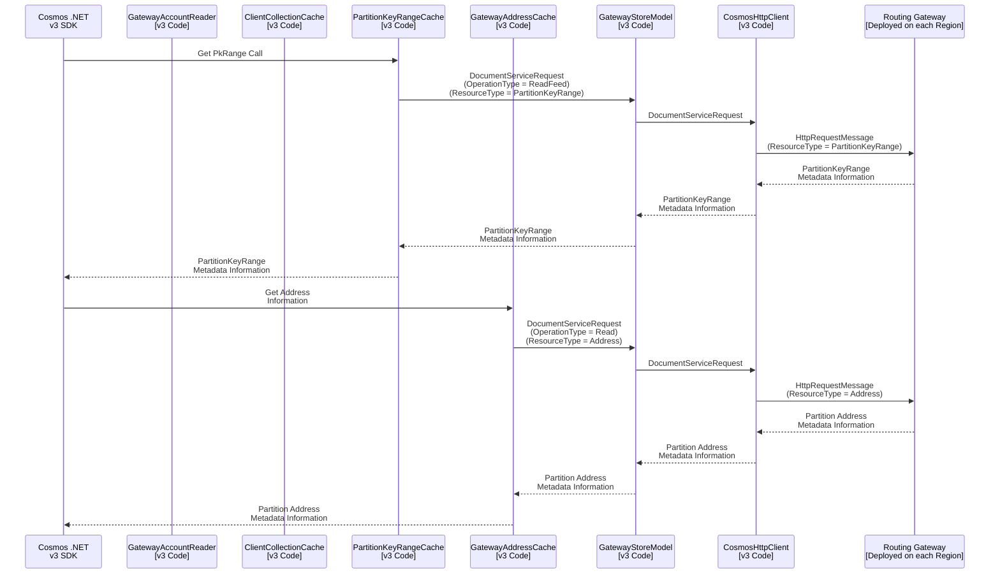

# Sequence Diagram for .NET v3 SDK and Gateway Interactions

## Table of Contents

* [Scope.](#scope)
* [Sequence Diagram to Read Database and Collection Information.](#sequence-diagram-to-read-database-and-collection-information)
    * [Sample Response from Gateway for `Get Accounts` Information.](#sample-response-from-gateway-for-get-accounts-information)
    * [Sample Response from Gateway for `Read Collection` Information.](#sample-response-from-gateway-for-read-collection-information)
* [Sequence Diagram to Read PkRange and Address Information.](#sequence-diagram-to-read-pkRange-and-address-information)
    * [Sample Response from Gateway for `Get PkRange` Information.](#sample-response-from-gateway-for-get-pkrange-information)
    * [Sample Response from Gateway for `Get Addresses` Information.](#sample-response-from-gateway-for-get-addresses-information)

## Scope

The scope of this sequence diagram is to capture the compute/ routing gateway interactions with the `CosmosClient` configured in `Direct` mode.

## Sequence Diagram to Read Database and Collection Information.



### Sample Response from Gateway for `Get Accounts` Information.

```json
{
    "id": "sdk-ppaf-test",
    "_rid": "sdk-ppaf-test.documents-test.windows-int.net",
    "writableLocations": [
        {
            "name": "North Central US",
            "databaseAccountEndpoint": "https://sdk-ppaf-test-northcentralus.documents-test.windows-int.net:443/"
        }
    ],
    "readableLocations": [
        {
            "name": "North Central US",
            "databaseAccountEndpoint": "https://sdk-ppaf-test-northcentralus.documents-test.windows-int.net:443/"
        },
        {
            "name": "East Asia",
            "databaseAccountEndpoint": "https://sdk-ppaf-test-eastasia.documents-test.windows-int.net:443/"
        },
        {
            "name": "West US",
            "databaseAccountEndpoint": "https://sdk-ppaf-test-westus.documents-test.windows-int.net:443/"
        }
    ],
    "userConsistencyPolicy": {
        "defaultConsistencyLevel": "Strong",
        "maxStalenessPrefix": 0,
        "maxIntervalInSeconds": 0
    },
    "addresses": "//addresses/",
    "userReplicationPolicy": {
        "MaxReplicaSetSize": 4,
        "MinReplicaSetSize": 2,
        "AsyncReplication": false
    },
    "systemReplicationPolicy": {
        "MaxReplicaSetSize": 4,
        "MinReplicaSetSize": 3,
        "AsyncReplication": false
    },
    "readPolicy": {
        "primaryReadCoefficient": 1,
        "secondaryReadCoefficient": 1
    },
    "queryEngineConfiguration": "{\"allowNewKeywords\":true,\"maxJoinsPerSqlQuery\":10,\"maxQueryRequestTimeoutFraction\":0.9,\"maxSqlQueryInputLength\":524288,\"maxUdfRefPerSqlQuery\":10,\"queryMaxInMemorySortDocumentCount\":-1000,\"spatialMaxGeometryPointCount\":256,\"sqlAllowNonFiniteNumbers\":false,\"sqlDisableOptimizationFlags\":0,\"clientDisableOptimisticDirectExecution\":false,\"enableSpatialIndexing\":true,\"maxInExpressionItemsCount\":2147483647,\"maxLogicalAndPerSqlQuery\":2147483647,\"maxLogicalOrPerSqlQuery\":2147483647,\"maxSpatialQueryCells\":2147483647,\"sqlAllowAggregateFunctions\":true,\"sqlAllowGroupByClause\":true,\"sqlAllowLike\":true,\"sqlAllowSubQuery\":true,\"sqlAllowScalarSubQuery\":true,\"sqlAllowTop\":true}",
    "enableMultipleWriteLocations": false,
    "_self": "",
    "media": "//media/",
    "_dbs": "//dbs/"
}
```

### Sample Response from Gateway for `Read Collection` Information.

To serve the `Read Collection` calls, the routing gateway will read from all the server partitions, if [some specific set of headers (for e.g. quota information)](https://msdata.visualstudio.com/CosmosDB/_git/CosmosDB?path=/Product/Microsoft.Azure.Documents/Common/FabricServiceManagement/CollectionReadHandler.cs&version=GBmaster&line=171&lineEnd=281&lineStartColumn=1&lineEndColumn=1&lineStyle=plain&_a=contents) are present/ populated in the request headers. If those headers are missing, the routing gateway will read from the tail partition.

For reference, a tail partition is the last partition in the pk ranges. There are multiple server partition in a cosmos db account, under a cosmos db collection, and the last pk range ID in the range, uniquely identifies the tail partition. Tail partitions is scoped to a collection level.

The routing gateway will also read from the master partition for `Read Collection` calls.

```json
{
    "indexingPolicy": {
        "automatic": true,
        "indexingMode": "Consistent",
        "includedPaths": [
            {
                "path": "/*",
                "indexes": []
            }
        ],
        "excludedPaths": [
            {
                "path": "/\"_etag\"/?"
            }
        ],
        "compositeIndexes": [],
        "spatialIndexes": []
    },
    "geospatialConfig": {
        "type": "Geography"
    },
    "conflictResolutionPolicy": {
        "mode": "LastWriterWins",
        "conflictResolutionPath": "/_ts",
        "conflictResolutionProcedure": ""
    },
    "id": "ppaf-test-container",
    "_etag": "\"00000200-0000-0400-0000-65badb2a0000\"",
    "_ts": 1706744618,
    "_self": "dbs/TlcF6g==/colls/TlcF6sFVtrM=/",
    "partitionKey": {
        "paths": [
            "/pk"
        ],
        "kind": "Hash"
    },
    "_rid": "TlcF6sFVtrM=",
    "_docs": "docs/",
    "_sprocs": "sprocs/",
    "_triggers": "triggers/",
    "_udfs": "udfs/",
    "_conflicts": "conflicts/"
}
```

## Sequence Diagram to Read PkRange and Address Information.




### Sample Response from Gateway for `Get PkRange` Information.

The cosmos container (collection) used for the below example, contains `9` server partitions. Therefore, the `Get PkRange` call returns total `9` Pk ranges to uniquely identify each server partition.

```json
{
    "pkRanges": [
        {
            "minInclusive": "",
            "maxExclusive": "05C1BD3971E3C0",
            "ridPrefix": 0,
            "throughputFraction": 0.1111111111111111,
            "status": "online",
            "lsn": 28,
            "parents": [],
            "id": "0",
            "_rid": "TlcF6sFVtrMCAAAAAAAAUA==",
            "_self": "dbs/TlcF6g==/colls/TlcF6sFVtrM=/pkranges/TlcF6sFVtrMCAAAAAAAAUA==/",
            "_ts": 1706744618,
            "_etag": "\"00000400-0000-0400-0000-65badb2a0000\""
        },
        {
            "minInclusive": "05C1BD3971E3C0",
            "maxExclusive": "05C1CD3971E3C0",
            "ridPrefix": 1,
            "throughputFraction": 0.1111111111111111,
            "status": "online",
            "lsn": 28,
            "parents": [],
            "id": "1",
            "_rid": "TlcF6sFVtrMDAAAAAAAAUA==",
            "_self": "dbs/TlcF6g==/colls/TlcF6sFVtrM=/pkranges/TlcF6sFVtrMDAAAAAAAAUA==/",
            "_ts": 1706744618,
            "_etag": "\"00000500-0000-0400-0000-65badb2a0000\""
        },
        {
            "minInclusive": "05C1CD3971E3C0",
            "maxExclusive": "05C1D5AB55AB50",
            "ridPrefix": 2,
            "throughputFraction": 0.1111111111111111,
            "status": "online",
            "lsn": 28,
            "parents": [],
            "id": "2",
            "_rid": "TlcF6sFVtrMEAAAAAAAAUA==",
            "_self": "dbs/TlcF6g==/colls/TlcF6sFVtrM=/pkranges/TlcF6sFVtrMEAAAAAAAAUA==/",
            "_ts": 1706744618,
            "_etag": "\"00000600-0000-0400-0000-65badb2a0000\""
        },
        {
            "minInclusive": "05C1D5AB55AB50",
            "maxExclusive": "05C1DD3971E3C0",
            "ridPrefix": 3,
            "throughputFraction": 0.1111111111111111,
            "status": "online",
            "lsn": 28,
            "parents": [],
            "id": "3",
            "_rid": "TlcF6sFVtrMFAAAAAAAAUA==",
            "_self": "dbs/TlcF6g==/colls/TlcF6sFVtrM=/pkranges/TlcF6sFVtrMFAAAAAAAAUA==/",
            "_ts": 1706744618,
            "_etag": "\"00000700-0000-0400-0000-65badb2a0000\""
        },
        {
            "minInclusive": "05C1DD3971E3C0",
            "maxExclusive": "05C1E1E3C78F18",
            "ridPrefix": 4,
            "throughputFraction": 0.1111111111111111,
            "status": "online",
            "lsn": 28,
            "parents": [],
            "id": "4",
            "_rid": "TlcF6sFVtrMGAAAAAAAAUA==",
            "_self": "dbs/TlcF6g==/colls/TlcF6sFVtrM=/pkranges/TlcF6sFVtrMGAAAAAAAAUA==/",
            "_ts": 1706744618,
            "_etag": "\"00000800-0000-0400-0000-65badb2a0000\""
        },
        {
            "minInclusive": "05C1E1E3C78F18",
            "maxExclusive": "05C1E5AB55AB50",
            "ridPrefix": 5,
            "throughputFraction": 0.1111111111111111,
            "status": "online",
            "lsn": 28,
            "parents": [],
            "id": "5",
            "_rid": "TlcF6sFVtrMHAAAAAAAAUA==",
            "_self": "dbs/TlcF6g==/colls/TlcF6sFVtrM=/pkranges/TlcF6sFVtrMHAAAAAAAAUA==/",
            "_ts": 1706744618,
            "_etag": "\"00000900-0000-0400-0000-65badb2a0000\""
        },
        {
            "minInclusive": "05C1E5AB55AB50",
            "maxExclusive": "05C1E971E3C788",
            "ridPrefix": 6,
            "throughputFraction": 0.1111111111111111,
            "status": "online",
            "lsn": 28,
            "parents": [],
            "id": "6",
            "_rid": "TlcF6sFVtrMIAAAAAAAAUA==",
            "_self": "dbs/TlcF6g==/colls/TlcF6sFVtrM=/pkranges/TlcF6sFVtrMIAAAAAAAAUA==/",
            "_ts": 1706744618,
            "_etag": "\"00000a00-0000-0400-0000-65badb2a0000\""
        },
        {
            "minInclusive": "05C1E971E3C788",
            "maxExclusive": "05C1ED3971E3C0",
            "ridPrefix": 7,
            "throughputFraction": 0.1111111111111111,
            "status": "online",
            "lsn": 28,
            "parents": [],
            "id": "7",
            "_rid": "TlcF6sFVtrMJAAAAAAAAUA==",
            "_self": "dbs/TlcF6g==/colls/TlcF6sFVtrM=/pkranges/TlcF6sFVtrMJAAAAAAAAUA==/",
            "_ts": 1706744618,
            "_etag": "\"00000b00-0000-0400-0000-65badb2a0000\""
        },
        {
            "minInclusive": "05C1ED3971E3C0",
            "maxExclusive": "FF",
            "ridPrefix": 8,
            "throughputFraction": 0.1111111111111111,
            "status": "online",
            "lsn": 28,
            "parents": [],
            "id": "8",
            "_rid": "TlcF6sFVtrMKAAAAAAAAUA==",
            "_self": "dbs/TlcF6g==/colls/TlcF6sFVtrM=/pkranges/TlcF6sFVtrMKAAAAAAAAUA==/",
            "_ts": 1706744618,
            "_etag": "\"00000c00-0000-0400-0000-65badb2a0000\""
        }        
    ]
}
```

### Sample Response from Gateway for `Get Addresses` Information.

```json
{
    "key": {
        "CollectionRid": "TlcF6sFVtrM=",
        "PartitionKeyRangeId": "1"
    },
    "value": {
        "AllAddresses": [
            {
                "IsPublic": true,
                "IsPrimary": true,
                "Protocol": 1,
                "PhysicalUri": "rntbd://cdb-ms-test14-northcentralus1-fd1.documents-test.windows-int.net:14007/apps/cd689600-3fde-4884-80f5-99b8ae4658c6/services/c54dcf72-965b-4e63-8393-9c26df3c561e/partitions/fb652146-249c-41ed-9007-16a1d8e5719b/replicas/133506394588861615p/"
            },
            {
                "IsPublic": true,
                "IsPrimary": false,
                "Protocol": 1,
                "PhysicalUri": "rntbd://cdb-ms-test14-northcentralus1-fd1.documents-test.windows-int.net:14005/apps/cd689600-3fde-4884-80f5-99b8ae4658c6/services/c54dcf72-965b-4e63-8393-9c26df3c561e/partitions/fb652146-249c-41ed-9007-16a1d8e5719b/replicas/133506394588861614s/"
            },
            {
                "IsPublic": true,
                "IsPrimary": false,
                "Protocol": 1,
                "PhysicalUri": "rntbd://cdb-ms-test14-northcentralus1-fd1.documents-test.windows-int.net:14309/apps/cd689600-3fde-4884-80f5-99b8ae4658c6/services/c54dcf72-965b-4e63-8393-9c26df3c561e/partitions/fb652146-249c-41ed-9007-16a1d8e5719b/replicas/133510641263874891s/"
            },
            {
                "IsPublic": true,
                "IsPrimary": false,
                "Protocol": 1,
                "PhysicalUri": "rntbd://cdb-ms-test14-northcentralus1-fd1.documents-test.windows-int.net:14310/apps/cd689600-3fde-4884-80f5-99b8ae4658c6/services/c54dcf72-965b-4e63-8393-9c26df3c561e/partitions/fb652146-249c-41ed-9007-16a1d8e5719b/replicas/133506394588861613s/"
            }
        ],
        "IsLocalRegion": false
    }
}
```