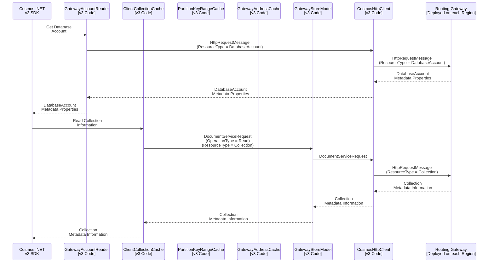
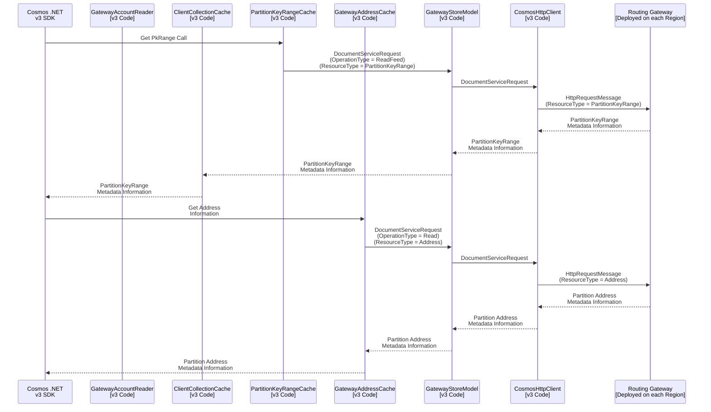

# Sequence Diagram for .NET v3 SDK and Gateway Interactions

## Table of Contents

* [Scope.](#scope)
* [Sequence Diagram to Read Database and Collection Information.](#sequence-diagram-to-read-database-and-collection-information)
* [Sequence Diagram to Read PkRange and Address Information.](#sequence-diagram-to-read-pkRange-and-address-information)

## Scope

The scope of this sequence diagram is to capture the compute/ routing gateway interactions with the `CosmosClient` configured in `Direct` mode.

## Sequence Diagram to Read Database and Collection Information.

## Sequence Diagram to Read PkRange and Address Information.

