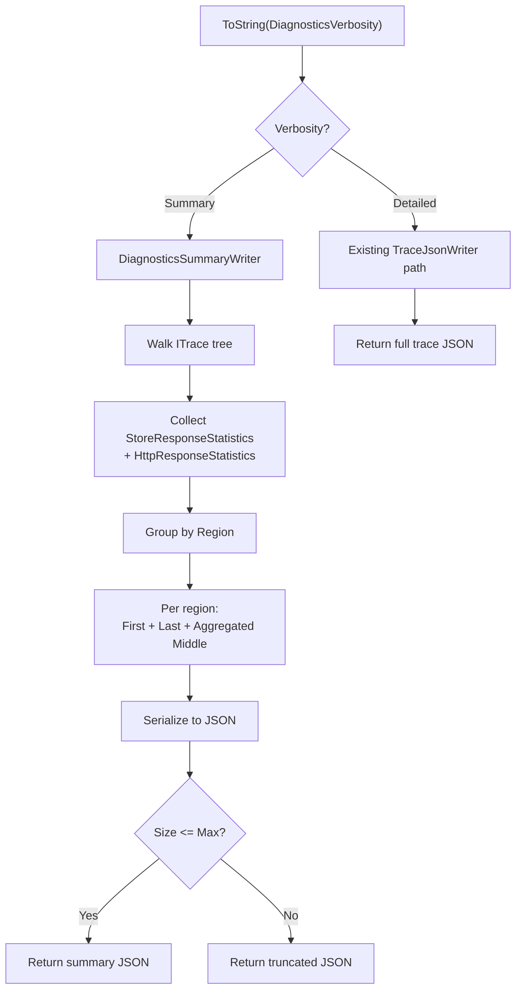

# Diagnostics Compaction — Design

## Summary Compaction Algorithm

### Data Collection

Walk the `ITrace` tree (same traversal as `SummaryDiagnostics.CollectSummaryFromTraceTree()`) to collect all `StoreResponseStatistics` and `HttpResponseStatistics` entries from every `ClientSideRequestStatisticsTraceDatum` in the trace hierarchy.

### Region Grouping

Group collected entries by `Region` (string). Entries with a null/empty region are grouped under `"Unknown"`.

### Per-Region Summary

For each region group (ordered chronologically by request start time):

1. **First**: Full details of the chronologically first request
2. **Last**: Full details of the chronologically last request (omitted if only 1 request)
3. **Middle entries** (all except first and last): Group by `(StatusCode, SubStatusCode)`:
   - **Count**: Number of requests in this group
   - **TotalRequestCharge**: Sum of RU charges
   - **MinDurationMs / MaxDurationMs / P50DurationMs / AvgDurationMs**: Latency statistics

### Size Enforcement

1. Serialize the summary JSON
2. If `serializedBytes <= MaxDiagnosticsSummarySizeBytes` → return as-is
3. If `serializedBytes > MaxDiagnosticsSummarySizeBytes` → return truncated output

### Handling Both Direct and Gateway Requests

Both `StoreResponseStatistics` (direct mode) and `HttpResponseStatistics` (gateway mode) are collected and treated uniformly in the summary. The aggregated groups include entries from both transport paths. An optional `"TransportType"` field (`"Direct"` / `"Gateway"`) can be included in aggregated groups if needed to distinguish.

## Request Flow

## Files to Create

| File | Description |
|------|-------------|
| `Microsoft.Azure.Cosmos/src/Diagnostics/DiagnosticsVerbosity.cs` | `DiagnosticsVerbosity` enum |
| `Microsoft.Azure.Cosmos/src/Diagnostics/DiagnosticsSummaryWriter.cs` | Summary computation and JSON serialization logic |

## Files to Modify

| File | Change |
|------|--------|
| `CosmosClientOptions.cs` | Add `DiagnosticsVerbosity` and `MaxDiagnosticsSummarySizeBytes` properties with validation |
| `CosmosDiagnostics.cs` | Add `ToString(DiagnosticsVerbosity)` abstract overload |
| `CosmosTraceDiagnostics.cs` | Implement `ToString(DiagnosticsVerbosity)` overload; delegate to `DiagnosticsSummaryWriter` when verbosity is `Summary` |
| `TraceWriter.TraceJsonWriter.cs` | Add summary serialization path that delegates to `DiagnosticsSummaryWriter` when verbosity is `Summary` |
| `SummaryDiagnostics.cs` | Extend `CollectSummaryFromTraceTree()` to support region-grouped collection with ordering |
| `ClientSideRequestStatisticsTraceDatum.cs` | Ensure `StoreResponseStatistics` and `HttpResponseStatistics` lists are accessible for summary computation |

## Contract/Baseline Updates

| File | Change |
|------|--------|
| `ContractEnforcementTests.cs` baseline | Update public API contract for new enum and properties |

## Alternatives Considered

### Alternative 1: Emit summary alongside truncated trace tree
Instead of replacing the full trace, emit the summary _alongside_ the first + last children of the trace tree.

**Pros:** Preserves some trace structure for tooling that parses it.
**Cons:** Larger output size; complex to implement; defeats the purpose of compaction.
**Decision:** Rejected — summary replaces the full trace. The `First` and `Last` entries in each region summary provide the detailed bookends.

### Alternative 2: Per-request verbosity via RequestOptions
Add a `DiagnosticsVerbosity` property to `RequestOptions` for per-request control.

**Pros:** More granular control.
**Cons:** Verbosity is a serialization concern, not a request concern. The `ToString(DiagnosticsVerbosity)` overload provides the same flexibility without complicating `RequestOptions`.
**Decision:** Deferred. Can be added later if needed.

### Alternative 3: Transport type distinction in aggregated groups
Include a `TransportType` field (`"Direct"` / `"Gateway"`) in each aggregated group.

**Pros:** Helps distinguish transport-specific issues.
**Cons:** Increases output size; `StatusCode/SubStatusCode` is usually sufficient.
**Decision:** Deferred. Can add later if customer feedback warrants it.

## Key References

- `Microsoft.Azure.Cosmos/src/Diagnostics/CosmosTraceDiagnostics.cs` — concrete diagnostics implementation
- `Microsoft.Azure.Cosmos/src/Tracing/TraceWriter.TraceJsonWriter.cs` — current trace serialization
- `Microsoft.Azure.Cosmos/src/Diagnostics/SummaryDiagnostics.cs` — existing summary aggregation (foundation)
- `Microsoft.Azure.Cosmos/src/Tracing/TraceData/ClientSideRequestStatisticsTraceDatum.cs` — stats data
- `docs/SdkDesign.md` — SDK architecture overview
