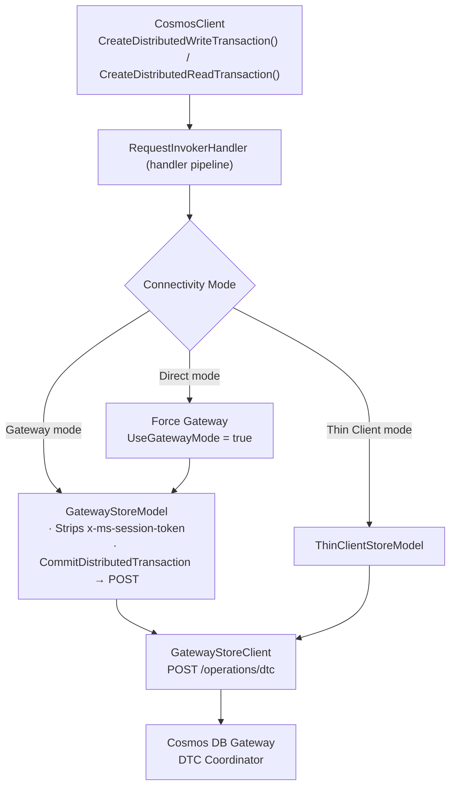

## Context

### Current transaction boundary

`TransactionalBatch` provides ACID atomicity within one logical partition but requires every operation to share the same `PartitionKey`. No SDK today exposes a cross-partition atomicity primitive.

### Current multi-item read path

`ReadManyItemsAsync` fans out parallel point-reads per partition range and collects results with `Task.WhenAll`. There is no snapshot guarantee across partitions — each read resolves independently, leaving the result set open to read skew.

### Server-side capabilities (confirmed with service team)

The Cosmos DB Gateway exposes a single HTTP endpoint for distributed transactions:

`POST /operations/dtc`

Both write and read transactions use this endpoint. The `operationType` field in the JSON request body distinguishes them — `"Write"` for write transactions and `"Read"` for read transactions. The endpoint returns `200` (committed, with per-operation results) or `452` (aborted, with per-operation results). All other outcomes (`408`, `449`, `429`, `500`, `400`) are returned with an empty body.

### SDK routing infrastructure



The SDK dispatches all requests through the `RequestInvokerHandler` handler pipeline. For distributed transactions:

- **Direct mode** clients have `UseGatewayMode = true` applied automatically, redirecting the request to `GatewayStoreModel`.
- **Gateway mode** and **Thin Client mode** reach the coordinator natively.
- `GatewayStoreModel` strips the outbound `x-ms-session-token` header for all DTC requests (session token management must not interfere with the coordinator) and maps `OperationType.CommitDistributedTransaction` → `HttpMethod.Post`.
- The endpoint URL (`/operations/dtc`) is set directly on the `RequestMessage` by the committer, not derived from `OperationType`.

## Goals / Non-Goals

**Goals:**
- Cross-partition, cross-container atomic write transactions within the same database account
- Cross-partition, cross-container consistent snapshot read transactions within the same database account
- Per-item ETag output on both write and read responses
- Session-consistency: session tokens merged into `ISessionContainer` after every `CommitTransactionAsync` call (write and read)
- Idempotent write commits (auto-generated idempotency token per `CommitTransactionAsync` call)
- 429 auto-retry; OpenTelemetry tracing; client-side op-count/size guards
- Cross-language API parity (.NET, Java, Python, JavaScript, Go)

**Non-Goals:**
- Multi-write-region (multi-master) accounts — addressed in a separate spec
- Combined read-write in a single transaction call — use `DistributedReadTransaction` + `DistributedWriteTransaction` with ETag CAS instead
- Cross-account transactions
- Query (non-point-read) operations within a read transaction
- Direct mode connectivity — only Gateway and Thin Client modes are supported
- Analytical store

## Decisions

### 1. Factory on CosmosClient, not Container

**Decision:** `CreateDistributedWriteTransaction()` and `CreateDistributedReadTransaction()` are methods on `CosmosClient`.

**Rationale:** A distributed transaction spans multiple containers within the same database account; there is no single "home" container. The factory on `CosmosClient` matches the scope of the operation. Methods are `virtual` to support mocking.

### 2. No Direct mode — Gateway and Thin Client modes supported

**Decision:** Both `DistributedWriteTransactionCore` and `DistributedReadTransactionCore` force the request away from Direct mode by setting `requestMessage.UseGatewayMode = true` before dispatch. Gateway mode and Thin Client mode are both supported.

**Rationale:** The distributed transaction coordinator lives in the Gateway tier. Direct mode bypasses the Gateway and connects to individual replica nodes, making the coordinator unreachable. Thin Client mode routes through the Gateway tier and is therefore compatible. The override is enforced unconditionally — no per-call option to bypass it.

### 3. Idempotency token per commit (write only)

**Decision:** A new `Guid.NewGuid()` is generated at the start of each `CommitTransactionAsync()` call and sent as `x-ms-idempotency-token`. The token is exposed on the response (`DistributedTransactionResponse.IdempotencyToken`) so callers can replay a commit whose outcome is unknown.

**Rationale:** Distributed writes are not inherently idempotent. A unique token per call lets the server detect and deduplicate replayed commits. Pure reads are inherently idempotent; no token is needed for `CommitTransactionAsync()` on read transactions.

### 4. Session token handling — write transactions

**Decision:** Before dispatch, populate each operation's `sessionToken` field from `ISessionContainer` for its partition. After commit, merge per-operation `sessionToken` values from `operationResponses` into `ISessionContainer`.

**Rationale:** Session consistency requires the client to track the latest LSN seen per partition. Populating inbound tokens ensures the commit does not proceed at a stale LSN. Merging post-commit tokens ensures subsequent reads see the committed writes.

### 5. Session token handling — read transactions

**Decision:** Before `CommitTransactionAsync()` dispatch, populate each operation's `sessionToken` from `ISessionContainer`. After execution, merge response session tokens back.

**Rationale:** For reads, the inbound token ensures the snapshot is at least as fresh as the client's last seen write on each partition. Merging post-read tokens keeps `ISessionContainer` up to date for future operations.

### 6. Single wire endpoint for both write and read transactions

**Decision:** Both write and read transactions use `POST /operations/dtc`, `OperationType.CommitDistributedTransaction`, `ResourceType.DistributedTransactionBatch`. The `operationType` field in the JSON request body (`"Write"` or `"Read"`) is what distinguishes them on the server side.

**Rationale — why one endpoint:** The coordinator executes the same two-phase protocol (Prepare → Commit/Abort) for both transaction types. Separating them into two endpoints would duplicate Gateway routing logic with no behavioral benefit.

**Rationale — why POST for reads:** HTTP GET is semantically *safe* (no server-side state changes) and does not support a request body. Read transactions violate both constraints: (1) the coordinator writes a ledger record during the Prepare phase, and (2) the operation list (item IDs, partition keys, container RIDs, session tokens) is a structured payload that cannot fit in a URL. POST is also consistent with how Cosmos DB handles all other complex read operations — SQL queries, `ReadManyItemsAsync`, and `TransactionalBatch` all use POST.

**Rationale — why reuse `OperationType.CommitDistributedTransaction`:** `OperationType` drives three routing decisions in the SDK — HTTP method, session-token stripping, and URL. All three are already correct for read transactions:
- **HTTP method**: `GatewayStoreClient` and `RequestInvokerHandler` will map `CommitDistributedTransaction` → `HttpMethod.Post`.
- **Session-token stripping**: `GatewayStoreModel` will match `CommitDistributedTransaction` + `DistributedTransactionBatch` — read transactions inherit this suppression automatically.
- **Endpoint URL**: set on the `RequestMessage` by the read committer directly, not derived from `OperationType`.

A dedicated `CommitDistributedReadTransaction` enum value would drive zero new behavior. The distinction is expressed entirely through the request body.

### 7. Single shared response type for both write and read transactions

**Decision:** Both `DistributedWriteTransaction.CommitTransactionAsync()` and `DistributedReadTransaction.CommitTransactionAsync()` return `DistributedTransactionResponse`. `IdempotencyToken` is `Guid?` — set to the auto-generated GUID for write commits, `null` for read commits. `DistributedTransactionOperationResult` is likewise shared.

**Rationale:** The per-operation result shape is identical for reads and writes (`StatusCode`, `ETag`, `SessionToken`, `RequestCharge`, `ResourceStream`). The only top-level difference is `IdempotencyToken`, which does not justify a separate type — it is simply not applicable for reads. This follows the `TransactionalBatch` precedent where `TransactionalBatchResponse` is reused for all operations including `ReadItem`. A single type reduces the public API surface, eliminates duplicated parsing logic, and makes it easier for callers who handle both response types uniformly.

### 8. No combined read-write transaction in v1

**Decision:** `DistributedReadTransaction` is a separate class from `DistributedWriteTransaction`. There is no API to atomically read-then-write in a single call.

**Rationale:** Combined read-write transactions require pessimistic locking or MVCC conflict detection at commit time — both add substantial server complexity. The ETag CAS pattern (read snapshot → compute new state → write with `IfMatchEtag`) achieves optimistic isolation with no new server machinery and handles the common case of low contention efficiently.

### 9. Consistency level for read transactions

**Decision:** `DistributedReadTransactionRequestOptions.ConsistencyLevel` overrides the account default. Strong or BoundedStaleness provides a true cross-partition snapshot; Session provides per-partition monotonic reads but no global snapshot.

**Rationale:** The consistency level maps directly to the request header forwarded to the Gateway. Callers needing read-skew elimination must use Strong or BoundedStaleness; this is documented prominently in the API.

### 10. Single write-region scope

**Decision:** Both transaction types throw `NotSupportedException` if the account has multiple write regions.

**Rationale:** The Gateway coordinator's behavior on multi-write-region accounts is not validated. The guard prevents silent incorrect behavior until multi-master support is specified and tested (separate spec).

### 11. Terminal response shape — 200 (committed) and 452 (aborted)

**Decision:** The SDK maps the two terminal envelope status codes as follows:
- **200** → `DistributedTransactionResponse.IsSuccessStatusCode = true`; `operationResponses` contains per-operation results as returned from the prepare phase (Create → 201, Replace/Upsert → 200, Delete → 204).
- **452** → `DistributedTransactionResponse.IsSuccessStatusCode = false`; `operationResponses` contains: **453 / sub-status 5415** (`DtcOperationRolledBack`) for any operation that voted Yes and was rolled back, and the **original error code** (e.g. 409, 412) for whichever operation(s) voted No and caused the abort.

`207 Multi-Status` is never returned by the Gateway for distributed transactions.

**Rationale:** The coordinator drives each transaction to one of exactly two terminal outcomes before responding to the SDK. The 200/452 split gives callers a single `IsSuccessStatusCode` check for the aggregate result; per-operation `StatusCode` on the 452 body identifies the specific operation(s) that caused the abort and which were collateral rollbacks.

## Wire Contract

Both write and read transactions POST to the same Gateway endpoint. The `operationType` field at the envelope level distinguishes them.

```
POST https://<account>.documents.azure.com/operations/dtc
```

### Request headers

| Header | Required | Notes |
|---|---|---|
| `Content-Type` | Yes | `application/json` |
| `x-ms-idempotency-token` | Write only | `Guid` generated once per `CommitTransactionAsync` call; reused on retries |
| `x-ms-consistency-level` | No | Overrides account default; relevant for read transactions |
| `x-ms-session-token` | **Never sent** | Stripped by `GatewayStoreModel`; per-operation session tokens are embedded in the request body instead |

### Request body

The envelope `operationType` field (`"Write"` or `"Read"`) selects coordinator behavior. Each element of `operations` carries its own `operationType` matching the write verb or `"Read"`.

**Write transaction**

```json
{
  "operationType": "Write",
  "operations": [
    {
      "operationType": "Create" | "Replace" | "Upsert" | "Delete" | "Patch",
      "databaseRid": "<db-rid>",
      "containerRid": "<container-rid>",
      "partitionKey": "<serialized-partition-key>",
      "id": "<item-id>",
      "resourceBody": { },
      "ifMatchEtag": "<etag>",
      "sessionToken": "<token>"
    }
  ]
}
```

| Field | Write ops | Notes |
|---|---|---|
| `operationType` | Required | `"Create"`, `"Replace"`, `"Upsert"`, `"Delete"`, `"Patch"` |
| `databaseRid` | Required | Resolved by SDK via `GetCachedContainerPropertiesAsync` |
| `containerRid` | Required | Resolved by SDK via `GetCachedContainerPropertiesAsync` |
| `partitionKey` | Required | Serialized partition key value |
| `id` | Required | Document id |
| `resourceBody` | Create / Replace / Upsert / Patch | Omitted for Delete |
| `ifMatchEtag` | Optional | Optimistic concurrency precondition; transaction aborts with 412 if mismatch |
| `sessionToken` | Optional | Populated by SDK from `ISessionContainer` for this operation's partition |

**Read transaction**

```json
{
  "operationType": "Read",
  "operations": [
    {
      "operationType": "Read",
      "databaseRid": "<db-rid>",
      "containerRid": "<container-rid>",
      "partitionKey": "<serialized-partition-key>",
      "id": "<item-id>",
      "ifNoneMatchEtag": "<etag>",
      "sessionToken": "<token>"
    }
  ]
}
```

| Field | Read ops | Notes |
|---|---|---|
| `operationType` | Required | Always `"Read"` |
| `databaseRid` | Required | Resolved by SDK |
| `containerRid` | Required | Resolved by SDK |
| `partitionKey` | Required | Serialized partition key value |
| `id` | Required | Document id |
| `ifNoneMatchEtag` | Optional | Returns 304 for that operation if ETag matches; no resource body |
| `sessionToken` | Optional | Populated by SDK from `ISessionContainer` for this operation's partition |

### Response headers

| Header | Present on | Notes |
|---|---|---|
| `x-ms-request-charge` | All responses | Total RU charge aggregated across all coordinator phases |
| `x-ms-activity-id` | All responses | Gateway-assigned correlation id for diagnostics |
| `Retry-After` | 449 only | Backoff in seconds before the SDK should retry |

### Response body — 200 (committed) and 452 (aborted)

Both terminal status codes include a 1:1 `operationResponses` array. Non-terminal responses (408, 449, 429, 400, 500) have an empty body.

```json
{
  "operationResponses": [
    {
      "index": 0,
      "statusCode": 201,
      "subStatusCode": 0,
      "eTag": "\"00000000-0000-0000-0000-000000000000\"",
      "sessionToken": "<token>",
      "requestCharge": 3.5,
      "resourceBody": { }
    }
  ]
}
```

| Field | Notes |
|---|---|
| `index` | Zero-based position matching the request `operations` array |
| `statusCode` | HTTP status for this operation. On 200: per-verb result (Create → 201, Replace/Upsert → 200, Delete → 204, Read → 200). On 452: 453 (`DtcOperationRolledBack`, sub-status 5415) for rolled-back ops; original error code (e.g. 409, 412) for the operation(s) that caused the abort |
| `subStatusCode` | 0 on success; 5415 for rolled-back operations on 452 |
| `eTag` | Server-assigned version of the written or read document; null for Delete and rolled-back ops |
| `sessionToken` | Latest LSN for this operation's partition; merged into `ISessionContainer` by the SDK after commit |
| `requestCharge` | Per-operation RU charge from the prepare phase |
| `resourceBody` | Document body; present for Create/Replace/Upsert/Read; absent for Delete, 304, and error ops |

## Retry Policy

The coordinator exhausts its own internal retries before surfacing an error to the SDK. When the SDK does receive a non-200/non-452 status, it means the coordinator itself could not resolve the situation. The table below defines the SDK-side retry behavior for each possible envelope response.

### Envelope status retry table

| HTTP | Sub-Status | Meaning | SDK retry | Notes |
|---|---|---|---|---|
| **200** | 0 | Committed | No — return to caller | Success terminal state |
| **452** | 0 | Aborted | No — return to caller | App must inspect per-op results; some aborts are fatal (see below) |
| **408** | 0 | Coordinator retries exhausted (stuck) | Yes — automatic | Coordinator could not make progress; SDK retry may succeed on a fresh coordinator |
| **449** | 5352 | Coordinator race conflict | Yes — honor `Retry-After` header | Two coordinators raced on the ledger ETag; SDK retry resolves by re-submitting |
| **429** | 3200 | Ledger throttled, coordinator retries exhausted | Yes — exponential backoff | SDK retry after backoff |
| **500** | 5411 | LedgerFailure | Yes — automatic | Infrastructure transient |
| **500** | 5412 | AccountConfigFailure | Yes — automatic | Infrastructure transient |
| **500** | 5413 | DispatchFailure | Yes — automatic | Infrastructure transient |
| **400** | 5405 | ParseFailure | No | Permanent — malformed request body |
| **400** | 5406 | FeatureDisabled | No | Permanent — account/feature flag |
| **400** | 5407 | MaxOpsExceeded | No | Permanent — reduce operation count |
| **400** | 5408 | MissingIdempotencyToken | No | Permanent — SDK bug if raised |
| **400** | 5409 | InvalidAccountName | No | Permanent |
| **400** | 5410 | InvalidOperation | No | Permanent |

### Retry key: write transactions

When the SDK retries a `CommitTransactionAsync` call on a write transaction it **reuses the same idempotency token** generated at the start of the original call. This allows the coordinator to recognise a replayed commit and return the already-committed result rather than re-executing the transaction. The idempotency token is never regenerated mid-retry loop.

### 452 Aborted — application-dependent handling

452 is not automatically retried because the cause determines whether a retry is safe:

- **Transient abort** (e.g., 409 on a row that has since been updated) — application may choose to re-read and retry with a new `DistributedWriteTransaction`.
- **Fatal abort** (e.g., 400-range semantic conflict, schema violation) — retrying would produce the same result.

The SDK surfaces the full 452 response including per-operation codes so the application can make this determination. The SDK does NOT silently reset to Preparing on a 452.

### Read transactions

Read transactions are inherently idempotent. The SDK retries on 408, 449, 429, and 500 sub-statuses unconditionally, with no idempotency token.

## Risks / Trade-offs

- **[Risk] Server-side read transaction support** — the `operationType: "Read"` path in `POST /operations/dtc` is a new coordinator capability. Service team confirmation of snapshot semantics, wire contract, and delivery timeline is required before SDK implementation begins.
- **[Risk] Abort / rollback for write transactions** — `AbortTransactionAsync` cannot be implemented until the service team confirms and ships a corresponding abort endpoint. Network failures rely on server-side timeout rollback in the interim; callers must be documented that the abort API is not available in v1.
- **[Trade-off] No Direct mode support** — clients in Direct mode are silently upgraded to Gateway mode for DTC requests, adding one Gateway round-trip. Accepted because the coordinator must see all operations atomically; Direct mode bypasses the coordinator. Thin Client mode is unaffected.
- **[Trade-off] ETag CAS instead of combined read-write transaction** — callers make two network calls (read + conditional write). Accepted because combined read-write transactions carry high server complexity relative to the benefit for common workloads.
- **[Risk] Read transaction 304 optimization** — `ifNoneMatchETag` conditional reads returning 304 require server support in the new endpoint; this may not be available at GA and should be treated as a stretch goal.
